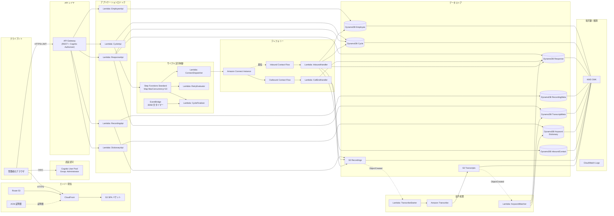
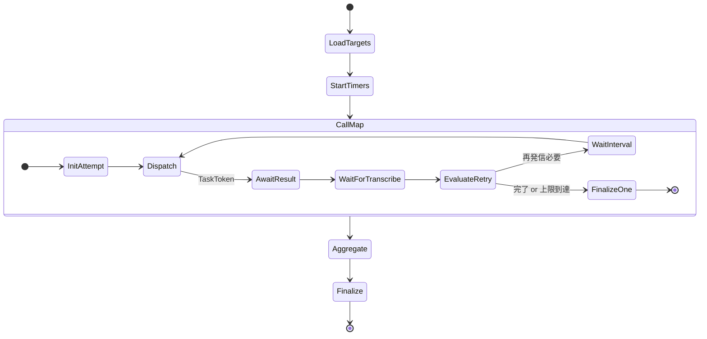
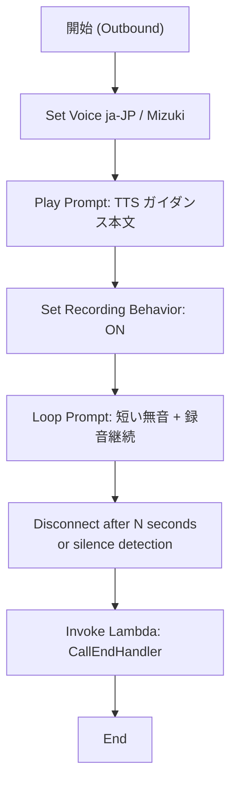
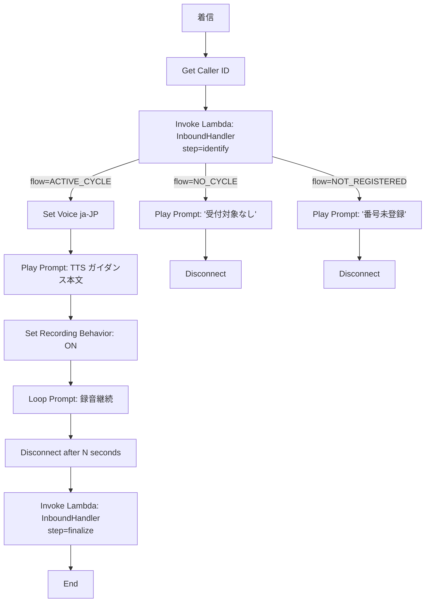

# Design Document

## Overview

本設計は、`requirements.md`（2026-06-12 改訂版）で定義した安否確認システム（対象規模 300 人、東京リージョン ap-northeast-1 固定、AWS マネージドサーバーレス前提）に対する技術設計である。フロントエンドは CloudFront + S3 配信の単一 SPA（管理者専用）、バックエンドは API Gateway + Lambda + DynamoDB によるリソース型 API、安否確認サイクルの実行制御は Step Functions の Map ステートで並列発信、自動架電は Amazon Connect の StartOutboundVoiceContact API、応答取得は Amazon Transcribe による音声認識テキスト化＋キーワードマッチング、認証認可は Cognito ユーザープール（管理者ロールのみ）、折り返し電話（インバウンド）は Amazon Connect の着信用 Contact Flow + Lambda で受け付ける。全コンポーネントは単一の CloudFormation テンプレートでデプロイし、Parameters により dev / stg / prod を切替する。

設計目標を以下のとおり定める。

- Requirements 1〜18、Data Requirements D1〜D8、NFR1〜NFR6 のすべての受け入れ基準に技術構成要素を対応付けること。
- 30 分初回発信完了 / 60 分サイクル全体完了の SLA を、Connect 同時アクティブコール 10 上限のもとで達成可能な並列処理設計とすること。
- 個人情報（電話番号）、通話録音、音声認識テキストの暗号化・アクセス制御・保管期間制御を、KMS CMK と S3 ライフサイクル、IAM 最小権限、Cognito 管理者認可で多層的に実現すること。
- 単一 CloudFormation テンプレートで dev / stg / prod の差分を Parameters / Mappings に閉じ込め、Connect インスタンス ID、アウトバウンド電話番号 ARN、インバウンド代表電話番号 ARN、Outbound / Inbound Contact Flow ID を外部受領可能にすること。
- DTMF（プッシュボタン）入力ロジックは廃止し、応答取得は音声録音 → Transcribe → キーワードマッチングの一本化されたフローとする。

スコープ外として、別アカウント・別リージョンへの展開、SMS / Email / Push 通知およびメール通知起動、DTMF 応答、SSO 連携、自動トリガー起動、高度監査ログ、一般社員ロールおよびセルフサービス画面、端末登録、LLM による意図判定、声紋認証を本設計の対象外とする。

## Architecture

### High-Level Architecture（全体構成）



凡例：実線は同期呼出 / データフロー、点線はイベント駆動。Amazon Connect インスタンス、アウトバウンド電話番号、インバウンド代表電話番号、Outbound / Inbound Contact Flow は CloudFormation 管理外として外部参照する（Requirement 17.5）。

### コンポーネントの責務境界

| コンポーネント     | 担当 AWS リソース                                                                                                       | 責務                                                                                |
| ------------------ | ----------------------------------------------------------------------------------------------------------------------- | ----------------------------------------------------------------------------------- |
| Auth_Service       | Cognito ユーザープール、Cognito Authorizer、Lambda（PreAuth/PostAuth）、IAM                                             | ログイン / トークン発行 / 管理者ロール判定 / アカウントロックアウト                 |
| Cycle_Manager      | API Gateway / Lambda（CycleApi）/ Step Functions / EventBridge / DynamoDB（Cycle, Response）                            | サイクル起動・対象者選定・進捗管理・完了判定・SLA 監視・タイムアウト処理            |
| Connect_Caller     | Lambda（ConnectDispatcher / CallEndHandler）/ Amazon Connect / Outbound Contact Flow                                    | StartOutboundVoiceContact 呼出 / TTS ガイダンス再生 / 音声録音終了処理              |
| Voice_Transcriber  | Lambda（TranscribeStarter）/ Amazon Transcribe / S3 Transcripts                                                         | 録音ファイルの Transcribe ジョブ起動 / Transcript 保管 / 失敗時の再試行             |
| Keyword_Matcher    | Lambda（KeywordMatcher）/ DynamoDB（KeywordDictionary, Response, TranscriptMetadata）                                   | Transcript からの Voice_Status 判定 / Response 更新 / マッチキーワード記録          |
| Inbound_Handler    | Lambda（InboundHandler）/ Amazon Connect / Inbound Contact Flow / DynamoDB（Employee, Cycle, Response, InboundContact） | 着信受付 / 発信者番号一致判定 / Cycle 紐付け / Response 更新 / Inbound_Contact 記録 |
| Recording_Store    | S3 Recordings / S3 Transcripts / Lambda（RecordingApi）/ DynamoDB（RecordingMeta, TranscriptMeta）                      | 録音・Transcript の保管 / メタデータ書込 / 署名付き URL 発行 / 90 日ライフサイクル  |
| Dictionary_Manager | API Gateway / Lambda（DictionaryApi）/ DynamoDB（KeywordDictionary）                                                    | キーワード辞書の CRUD / 辞書バージョン管理 / 監査ログ                               |
| Status_Viewer      | SPA（React 等）/ API Gateway / Lambda（CycleApi, ResponseApi）                                                          | 10 秒ポーリング / 集計値取得 / 個別ステータス一覧 / Transcript 抜粋表示 / 縮退表示  |

### データフロー（End-to-End、アウトバウンド）

1. 管理者が Admin_Console にログインし、サイクル起動画面で「全員」チェックボックス、Retry_Count、Retry_Interval を入力する。
2. ブラウザは Cognito 発行のアクセストークンを Authorization ヘッダに付与し、API Gateway `POST /cycles` を呼ぶ。
3. CycleApi Lambda が入力バリデーションを行い、既存「実行中」サイクルの不在および対象者選定モードに応じた対象者抽出（`ALL` または `UNREACHABLE_ONLY`）を確認した上で、Cycle テーブルにレコードを「実行中」で書込し、Step Functions ステートマシンを `StartExecution` する。Cycle 起動時点の Keyword_Dictionary の辞書バージョンを Cycle レコードにスナップショットとして保存する。
4. ステートマシンは対象者一覧を引き出し、Map ステート（同時 10）で各対象者ごとに「ConnectDispatcher → 結果待ち（TaskToken）→ RetryEvaluator」のサブフローを実行する。
5. ConnectDispatcher は Connect の `StartOutboundVoiceContact` を呼ぶ。Connect は Outbound Contact Flow を起動し、Amazon Polly による TTS ガイダンスを再生 → 音声録音状態へ遷移する。
6. 通話終了時、Outbound Contact Flow から CallEndHandler Lambda が呼ばれ、通話結果コードを Response テーブルへ書込し、SFN `SendTaskSuccess` で TaskToken を返す。Connect は録音ファイルを S3 Recordings バケットにアップロードする。
7. S3 Recordings の PutObject イベント（EventBridge）で TranscribeStarter Lambda が起動し、Amazon Transcribe ジョブを開始する。
8. Transcribe ジョブが完了すると Transcript JSON が S3 Transcripts バケットに格納される。S3 Transcripts の PutObject イベントで KeywordMatcher Lambda が起動する。
9. KeywordMatcher は Cycle のスナップショット辞書バージョンを参照し、テキストから Voice_Status（`SAFE` / `INJURED` / `UNAVAILABLE` / `OTHER`）を判定し、Response テーブルを更新する。
10. RetryEvaluator は Response の最新 Voice_Status を読み、再発信が必要かを判定（`SAFE` / `INJURED` / `UNAVAILABLE` で再発信終了、`OTHER` および通話結果コードが `NO_ANSWER` / `BUSY` / `VOICEMAIL` / `ERROR` / `TRANSCRIBE_FAILED` で再発信継続）し、必要なら Retry_Interval ぶん `Wait` 後に再度 ConnectDispatcher へ分岐する。
11. CycleFinalizer は Map 完了時（または EventBridge による 60 分タイムアウト）に Cycle ステータスを「完了」または「タイムアウト」に更新する。
12. Status_Viewer は 10 秒間隔で `GET /cycles/{id}/status` を呼び、集計値・個別ステータス・Transcript 抜粋を取得して画面表示を更新する。

### データフロー（インバウンド・折り返し電話）

1. 社員が本システムのインバウンド代表電話番号に発信する。
2. Amazon Connect が Inbound Contact Flow を起動し、即座に InboundHandler Lambda を Invoke する。
3. InboundHandler は Caller ID（発信者番号、E.164）を取得し、Employee_Master の `PhoneNumberIndex` GSI で完全一致検索を行う。
4. 一致しない場合：ガイダンス「番号が登録されていないため受付できません」を Polly で再生し、通話を切断。Inbound_Contact レコードに「unrecognized_caller」として記録する。
5. 一致する場合：直近の対象 Cycle を検索する。「実行中」または「完了から 30 日以内」の Cycle を優先順で 1 件選定し、当該 Cycle と社員 ID で Response が存在することを確認する。
6. 対象 Cycle が見つかった場合：Outbound と同等のフローで TTS ガイダンス → 録音 → Transcribe → KeywordMatcher を実行し、当該 Cycle の Response を最新の Voice_Status で更新（累積発信回数は据え置き、通話結果コード一覧に `INBOUND` を追記）する。Inbound_Contact レコードに紐付ける。
7. 対象 Cycle が見つからない（直近完了 Cycle が 30 日超過済み）場合：ガイダンス「現在受付対象のサイクルがありません」を再生して切断。Inbound_Contact レコードに「no_active_cycle」として記録する。
8. 対象 Cycle が「タイムアウト」または「起動失敗」の場合：Response を更新せず、Inbound_Contact レコードに「cycle_terminated」として記録する。

### ネットワーク・セキュリティ境界

- VPC は使用しない。
- 外部通信路は CloudFront / API Gateway / Cognito エンドポイントすべてで TLS 1.2 以上を強制する（Requirement 1.1, NFR3）。
- API Gateway は Cognito User Pool Authorizer を使用し、JWT 内のグループ（`cognito:groups`）で `Administrator` を必須とする。
- Lambda 実行ロールは関数単位で最小権限を付与し、DynamoDB / S3 / Connect / Transcribe / KMS への許可は対象 ARN を限定する。
- 録音バケットおよび Transcript バケットは Block Public Access ON、バケットポリシーで `aws:PrincipalArn` が許可リスト外の場合はすべて Deny する（Requirement 10.6）。
- KMS CMK は単一 CMK を DynamoDB / S3 で共用し、キーポリシーで暗号化対象サービス（`kms:ViaService`）と Lambda 実行ロールのみに `Encrypt` / `Decrypt` を限定する。
- Cognito アカウントロックアウトは PreAuthentication Lambda Trigger と LockoutTable で 5 回失敗 / 30 分の方針を実装する。

### 配置とリージョン

| 項目           | 値                                                      |
| -------------- | ------------------------------------------------------- |
| AWS アカウント | 単一                                                    |
| リージョン     | 東京（ap-northeast-1）固定                              |
| AZ             | AWS マネージドサービスの既定 AZ 構成（2 AZ 以上、NFR2） |
| ネットワーク   | VPC 不使用                                              |

## Components and Interfaces

### Auth_Service

#### 責務

Cognito ユーザープールによる管理者認証、JWT 発行、ロール判定（Administrator のみ）、アカウントロックアウト、認証イベントの監査ログ出力。

#### 構成

- Cognito ユーザープール `safety-confirmation-{env}`、自己サインアップ無効、管理者作成のみ。
- グループ：`Administrator` のみ。
- 属性：`email`（ログイン ID）、`name`（氏名）。本システムでは管理者専用のため `custom:employee_id` などは管理者の場合のみ任意で付与する。
- パスワードポリシー：12 文字以上、大文字 / 小文字 / 数字 / 記号必須。
- トークン有効期限：ID 1h / Access 1h / Refresh 30d。
- Lambda Triggers：PreAuthentication（LockoutTable 参照のロック判定のみ、失敗記録は含まない）、PostAuthentication（**成功時のみ呼ばれる仕様**、`failedAts` クリア + 認証成功監査ログ）、PreSignUp（管理者作成のみ許可）。
- **失敗記録の補助 API**：Cognito User Pool には認証失敗時 Lambda Trigger が存在しないため、`POST /auth/record-failure`（パブリックエンドポイント、Authorizer 不要）を API Gateway で公開し、SPA が `InitiateAuth` 失敗（`NotAuthorizedException` 等）を検知した時点で呼出す。AuthFailureReporter Lambda が LockoutTable に `failedAts` を `list_append` し `expireAt = now + 30min` を更新する。悪意攻撃者が Cognito API を直接叩いた場合は失敗が記録されないため、Cognito の標準レート制限と将来の Advanced Security 導入に委ねる（本システムのスコープでは Advanced Security 未採用）。
- App Client：1 個（SPA 用）、`USER_SRP_AUTH`、Client Secret 無し。

#### インタフェース

- API Gateway 全エンドポイントの Authorization ヘッダ：`Bearer <ID_TOKEN>`。
- ロール判定：Lambda 内で `event.requestContext.authorizer.claims['cognito:groups']` に `Administrator` が含まれていることを検証する。

### Cycle_Manager

#### 責務

サイクルの起動・既存実行中の重複検知・対象者抽出（`ALL` / `UNREACHABLE_ONLY`）・Step Functions 起動・進捗集計・完了判定・タイムアウト処理。

#### 構成

- Lambda `CycleApi`：API Gateway から呼出。バリデーション、対象者抽出、Cycle テーブル書込（辞書バージョンスナップショット含む）、Step Functions `StartExecution`。
- Step Functions ステートマシン `SafetyConfirmationCycle-{env}`（Standard ワークフロー）。
- Lambda `RetryEvaluator`：Response の最新 Voice_Status と通話結果コードを読み、再発信要否を返す。
- Lambda `CycleFinalizer`：Map 完了時または EventBridge 30/60 分ルール起動で Cycle ステータスを更新する。
- EventBridge ルール：Cycle ID 単位で 30 分・60 分の遅延通知をスケジュール。

#### Step Functions ステートマシン構造



- `LoadTargets`：対象者選定モードに応じて対象者を抽出する。
  - `ALL`：論理削除されておらず電話番号が NULL でない全社員。
  - `UNREACHABLE_ONLY`：直近完了 Cycle のうち、Response の Voice_Status が `UNREACHABLE` または `OTHER` の社員のみ。
- `StartTimers`：EventBridge ルール `cycle-30min-{cycleId}` / `cycle-60min-{cycleId}` を CycleFinalizer 宛に作成。
- `CallMap`：Map ステート、`MaxConcurrency = 10`。各イテレーションは 1 社員。
- `InitAttempt`：試行回数 = 0、Response レコード初期書込。
- `Dispatch`：Lambda `ConnectDispatcher` を `.waitForTaskToken` で呼出し、Outbound Contact Flow から CallEndHandler 経由で `SendTaskSuccess` を返してもらう。タイムアウト = 通話最大時間 90 秒。
- `WaitForTranscribe`：CallEndHandler から SendTaskSuccess を受領後、Transcribe → KeywordMatcher による Voice_Status 確定をポーリング待機する状態（最大 60 秒）。
- `EvaluateRetry`：RetryEvaluator が呼び出され、最終 Voice_Status と通話結果コード、累積発信回数 / Retry_Count を比較し、再発信判定を返す。
- `WaitInterval`：`Wait` ステート、`SecondsPath = $.retryWaitSeconds`（=Retry_Interval × 60）。
- `FinalizeOne`：当該社員の Response の最終ステータスを確定する。
- `Aggregate`：Cycle に紐づく全 Response を集計、対象者全員の最終ステータスが確定していることを検証する。
- `Finalize`：Cycle ステータスを「完了」に更新、EventBridge ルール削除。

#### インタフェース

| API                   | メソッド | 認可          | 概要                                    |
| --------------------- | -------- | ------------- | --------------------------------------- |
| `/cycles`             | POST     | Administrator | サイクル起動                            |
| `/cycles`             | GET      | Administrator | サイクル一覧                            |
| `/cycles/{id}`        | GET      | Administrator | サイクル詳細                            |
| `/cycles/{id}/status` | GET      | Administrator | 集計値 + 個別ステータス（ポーリング用） |

POST `/cycles` 主要フィールド：

```json
{
  "mode": "ALL | UNREACHABLE_ONLY",
  "retryCount": 3,
  "retryIntervalMinutes": 5
}
```

レスポンス：

```json
{
  "cycleId": "uuid",
  "status": "RUNNING",
  "startedAt": "ISO8601",
  "targetCount": 300,
  "dictionaryVersion": 42
}
```

GET `/cycles/{id}/status` 主要フィールド：

```json
{
  "cycleId": "uuid",
  "status": "RUNNING | COMPLETED | TIMEOUT | START_FAILED",
  "summary": {
    "targetTotal": 300,
    "dispatched": 250,
    "responded": 200,
    "unreachable": 5,
    "byStatus": {
      "SAFE": 150,
      "INJURED": 30,
      "UNAVAILABLE": 20,
      "OTHER": 0,
      "UNREACHABLE": 5
    }
  },
  "items": [
    {
      "employeeId": "uuid",
      "name": "...",
      "currentStatus": "SAFE | INJURED | UNAVAILABLE | OTHER | UNREACHABLE | PENDING",
      "callAttempts": 1,
      "lastResponseAt": "ISO8601 or null",
      "transcriptExcerpt": "..."
    }
  ],
  "degraded": [{ "component": "Amazon Transcribe", "since": "ISO8601" }]
}
```

### Connect_Caller（アウトバウンド）

#### 責務

StartOutboundVoiceContact による発信、Outbound Contact Flow による Polly TTS ガイダンス再生、音声録音、通話結果コード確定。

#### 構成

- Lambda `ConnectDispatcher`：入力 = `{cycleId, employeeId, phoneNumber, attempt, taskToken}`。Connect の `StartOutboundVoiceContact` を呼び、Contact Flow Attribute として `cycleId` / `employeeId` / `attempt` / `taskToken` を渡す。
- Outbound Contact Flow `SafetyConfirmationOutboundFlow-{env}`：CFn Parameter `OutboundContactFlowId` で受領。
- Lambda `CallEndHandler`：通話終了時に Contact Flow から呼出される。通話結果コードを Response に書込、SFN `SendTaskSuccess`。
- Amazon Polly：TTS ガイダンス再生（言語 `ja-JP`、Voice ID `Mizuki` または `Takumi`）。

#### Outbound Contact Flow 設計



通話結果コード：

| コード              | 意味                            | 判定箇所                  |
| ------------------- | ------------------------------- | ------------------------- |
| `RECORDED`          | 通話接続 + 録音完了             | CallEndHandler            |
| `NO_ANSWER`         | 30 秒呼出無応答                 | Connect Disconnect Reason |
| `BUSY`              | 通話中                          | Connect Disconnect Reason |
| `VOICEMAIL`         | 留守番電話検知                  | Connect Disconnect Reason |
| `ERROR`             | 発信エラー                      | Connect API エラー        |
| `TRANSCRIBE_FAILED` | Transcribe ジョブ最大再試行失敗 | TranscribeStarter         |

#### TTS ガイダンス本文（既定値）

> 「これは安否確認システムからのお電話です。災害発生に伴い、皆様の安否を確認しています。お名前と現在のご状況を、ピーという発信音の後にお話しください。終わりましたら電話を切ってください。」

CFn Parameter `OutboundGuidanceText` で本文をオーバーライド可能。

### Voice_Transcriber

#### 責務

S3 Recordings バケットにアップロードされた録音ファイルを Amazon Transcribe でテキスト化し、結果を S3 Transcripts および TranscriptMetadata に保管する。失敗時の再試行制御も担う。

#### 構成

- Lambda `TranscribeStarter`：S3 Recordings の `ObjectCreated` EventBridge イベントから起動。Transcribe ジョブを `language-code=ja-JP`、`media-format=wav`、`output-bucket=<TranscriptsBucket>`、`output-key={transcripts/.../seq.json}` で起動。
- Amazon Transcribe ジョブ：完了時に S3 Transcripts に Transcribe 形式の JSON を書き出す。
- Lambda `KeywordMatcher`：S3 Transcripts の `ObjectCreated` イベントから起動（後続コンポーネントで詳述）。
- 失敗時：TranscribeStarter は最大 3 回再試行（指数バックオフ）。すべて失敗で `callResultCode=TRANSCRIBE_FAILED` を Response に書込、SFN ステートマシンの `WaitForTranscribe` 状態を解除する。

### Keyword_Matcher

#### 責務

Transcribe 出力テキストに対し Cycle のスナップショット辞書バージョンを適用し、Voice_Status を判定して Response および TranscriptMetadata を更新する。

#### 構成

- Lambda `KeywordMatcher`：S3 Transcripts の `ObjectCreated` イベントから起動。Transcript JSON からテキスト本文と信頼度を抽出する。
- 入力：Transcript の S3 オブジェクトキー → cycleId / employeeId / seq を抽出。
- KeywordDictionary テーブルから Cycle.dictionaryVersion 時点の有効キーワードを取得（履歴テーブルまたはバージョンスナップショット保管）。
- マッチング：テキストの形態素解析は行わず、辞書キーワードの「部分文字列一致」をベースとする（日本語のため）。大文字小文字は区別しない。
- 判定優先順位：`INJURED > UNAVAILABLE > SAFE > OTHER`（複数カテゴリにマッチした場合の優先順）。
- 出力：Response テーブルに `voiceStatus` / `matchedKeywords` / `transcriptExcerpt`（先頭 100 文字）/ `dictionaryVersion` を書込。

#### マッチング判定の擬似コード

```text
text = transcript.text.lower()
matched = { category: [kw for kw in dictionary[category] if kw in text] for category in ['SAFE', 'INJURED', 'UNAVAILABLE'] }

if matched['INJURED']:
    status = 'INJURED'
elif matched['UNAVAILABLE']:
    status = 'UNAVAILABLE'
elif matched['SAFE']:
    status = 'SAFE'
else:
    status = 'OTHER'
```

### Inbound_Handler（インバウンド・折り返し電話）

#### 責務

Inbound Contact Flow から呼ばれ、発信者番号と Employee_Master の照合、Cycle の特定と Response 更新、Inbound_Contact レコードの記録を行う。

#### 構成

- Inbound Contact Flow `SafetyConfirmationInboundFlow-{env}`：CFn Parameter `InboundContactFlowId` で受領。
- Lambda `InboundHandler`：Contact Flow から `Invoke AWS Lambda function` ブロックで呼出される。
- Inbound Contact Flow から InboundHandler を 2 回呼出す構成：
  1. **着信直後**：発信者番号一致判定。一致しない場合はガイダンス再生＋切断。一致した場合は Cycle 検索結果に応じてフロー分岐情報（`ACTIVE_CYCLE` / `NO_CYCLE` / `CYCLE_TERMINATED`）を Contact Flow Attribute に設定。
  2. **通話終了直後**：CallEndHandler と同等の処理（録音 S3 アップロード・Transcribe 起動・Response 更新）を実行。Inbound_Contact レコードを最終確定。

#### Inbound Contact Flow 設計



#### Cycle 選定ロジック（identify ステップ）

1. Cycle テーブル GSI `StatusStartedAtIndex` で `status=RUNNING` を Query。1 件以上あればその最新を採用。
2. なければ `status=COMPLETED` を Query し、`completedAt + 30日 >= now` のうち最新 1 件を採用。
3. なければ `flow=NO_CYCLE` を返す。
4. 採用された Cycle の Response テーブルから当該 employeeId のレコードを取得。存在しなければ Cycle に対応 Response を新規追加（既存 Cycle 完了後の例外的状況、`callAttempts=0` で初期化）。
5. Cycle ステータスが `TIMEOUT` または `START_FAILED` の場合は `flow=CYCLE_TERMINATED`（受付するが Response は更新せず Inbound_Contact のみ記録）。

### Recording_Store

#### 責務

通話録音、Recording_Metadata、Transcript の保管、署名付き URL 発行、90 日ライフサイクル制御、アクセス拒否制御。

#### 構成

- 録音 S3 バケット `safety-confirmation-recordings-{env}-{account}-{region}`：Block Public Access ON、SSE-KMS、ライフサイクル 90 日、EventBridge Notification 有効。
- Transcripts S3 バケット `safety-confirmation-transcripts-{env}-{account}-{region}`：同様の設定。
- Lambda `RecordingMetadataWriter`：S3 Recordings PutObject で起動、RecordingMetadata に書込。最大 3 回再試行。
- Lambda `RecordingApi`：管理者からの再生要求に対し署名付き URL（有効期限 15 分）を発行。Cycle 起動時刻から 90 日経過判定で 410 Gone を返す。

#### S3 オブジェクトキー命名

- アウトバウンド録音：`recordings/{cycleId}/{employeeId}/{seq}.wav`
- インバウンド録音：`inbound/{yyyymm}/{employeeId}/{contactId}.wav`
- アウトバウンド Transcript：`transcripts/{cycleId}/{employeeId}/{seq}.json`
- インバウンド Transcript：`inbound/{yyyymm}/{employeeId}/{contactId}.json`

#### バケットポリシー（要点）

```json
{
  "Statement": [
    {
      "Effect": "Deny",
      "Principal": "*",
      "Action": "s3:*",
      "Resource": "arn:aws:s3:::<bucket>/*",
      "Condition": { "Bool": { "aws:SecureTransport": "false" } }
    },
    {
      "Effect": "Deny",
      "Principal": "*",
      "Action": "s3:GetObject",
      "Resource": "arn:aws:s3:::<bucket>/*",
      "Condition": {
        "StringNotEquals": {
          "aws:PrincipalArn": [
            "<RecordingApiLambdaRoleArn>",
            "<RecordingMetadataWriterRoleArn>",
            "<TranscribeStarterRoleArn>",
            "<KeywordMatcherRoleArn>",
            "<TranscribeServiceRoleArn>",
            "<AdminCognitoRoleArn>"
          ]
        }
      }
    }
  ]
}
```

#### インタフェース

| API                                           | メソッド | 認可          | 概要                                    |
| --------------------------------------------- | -------- | ------------- | --------------------------------------- |
| `/cycles/{id}/recordings/{employeeId}/{seq}`  | GET      | Administrator | アウトバウンド録音署名付き URL（15 分） |
| `/cycles/{id}/transcripts/{employeeId}/{seq}` | GET      | Administrator | アウトバウンド Transcript 全文          |
| `/inbound/{contactId}/recording`              | GET      | Administrator | インバウンド録音署名付き URL（15 分）   |
| `/inbound/{contactId}/transcript`             | GET      | Administrator | インバウンド Transcript 全文            |

### Dictionary_Manager

#### 責務

キーワード辞書の CRUD、辞書バージョン管理、Cycle 起動時のスナップショット参照、監査ログ。

#### 構成

- Lambda `DictionaryApi`：API Gateway から呼出。
- DynamoDB `KeywordDictionary-{env}`：PK = カテゴリ（`SAFE` / `INJURED` / `UNAVAILABLE`）、SK = キーワード文字列。
- DynamoDB `KeywordDictionary-{env}` 内のメタレコード：PK = `META`、SK = `META`、属性に `currentVersion` を保持。書込時は `ConditionExpression` で原子的にバージョンインクリメント。
- 履歴保持：辞書 CRUD 時に `KeywordDictionaryHistory-{env}` テーブル（PK = `version`, SK = キーワード）に snapshot を書込。Cycle 起動時の dictionaryVersion 参照で過去状態を再現可能。

#### インタフェース

| API                                        | メソッド | 認可          | 概要                       |
| ------------------------------------------ | -------- | ------------- | -------------------------- |
| `/keyword-dictionary`                      | GET      | Administrator | 辞書全体取得（カテゴリ別） |
| `/keyword-dictionary`                      | POST     | Administrator | キーワード追加             |
| `/keyword-dictionary/{category}/{keyword}` | DELETE   | Administrator | キーワード削除（無効化）   |
| `/keyword-dictionary/{category}/{keyword}` | PATCH    | Administrator | 有効フラグ更新             |
| `/keyword-dictionary/version`              | GET      | Administrator | 現在の辞書バージョン取得   |

POST `/keyword-dictionary` 主要フィールド：

```json
{
  "category": "SAFE | INJURED | UNAVAILABLE",
  "keyword": "..."
}
```

### Status_Viewer

#### 責務

ポーリング（10 秒間隔 ±1 秒）、画面表示更新（3 秒以内）、縮退状態表示、完了 / タイムアウト時のポーリング停止、Transcript 抜粋表示。

#### 構成

- SPA（React + TypeScript 想定）。`/cycles/{id}/status` を 10 秒間隔で `setInterval` ポーリング。
- 集計値・個別一覧表示、エラー時は直前値保持 + エラーバナー表示。
- 縮退情報：API レスポンスの `degraded[]` をもとに警告バナー表示。
- 一覧の `transcriptExcerpt` はクリックで Transcript 全文画面（`/cycles/{id}/transcripts/...`）へ遷移。

### Lambda 関数一覧

| Lambda 名                 | 責務                                 | 主入力                 | 主出力                              | 想定タイムアウト   |
| ------------------------- | ------------------------------------ | ---------------------- | ----------------------------------- | ------------------ |
| `EmployeeApi`             | 社員 CRUD / CSV インポート           | API Gateway イベント   | DynamoDB 書込                       | 30 秒（CSV 60 秒） |
| `CycleApi`                | サイクル起動 / 状態取得              | API Gateway イベント   | DynamoDB + SFN                      | 15 秒              |
| `ResponseApi`             | 履歴取得                             | API Gateway イベント   | Response 一覧 + Transcript 抜粋     | 10 秒              |
| `RecordingApi`            | 録音 / Transcript 署名付き URL 発行  | API Gateway イベント   | URL                                 | 5 秒               |
| `DictionaryApi`           | キーワード辞書 CRUD                  | API Gateway イベント   | DynamoDB 書込                       | 10 秒              |
| `LoadTargets`             | 対象者抽出（ALL / UNREACHABLE_ONLY） | SFN 入力               | 対象者配列                          | 30 秒              |
| `ConnectDispatcher`       | Connect 発信                         | SFN 入力 + TaskToken   | Contact ID                          | 15 秒              |
| `CallEndHandler`          | 通話終了処理 + SendTaskSuccess       | Contact Flow 入力      | Response 書込                       | 10 秒              |
| `TranscribeStarter`       | Transcribe ジョブ開始                | S3 Event               | Transcribe ジョブ ID                | 15 秒              |
| `KeywordMatcher`          | テキスト → Voice_Status 判定         | S3 Event（Transcript） | Response / TranscriptMeta 更新      | 15 秒              |
| `RetryEvaluator`          | 再発信要否判定                       | Response 最新値        | `{retry, waitSeconds, finalStatus}` | 5 秒               |
| `CycleFinalizer`          | 完了 / タイムアウト処理              | SFN または EventBridge | Cycle 更新                          | 30 秒              |
| `RecordingMetadataWriter` | 録音メタ書込                         | S3 Event               | DynamoDB 書込                       | 15 秒              |
| `InboundHandler`          | 着信受付 / Cycle 紐付け              | Contact Flow 入力      | Inbound_Contact + Response          | 15 秒              |
| `AuthPreAuth`             | 認証前ロック判定                     | Cognito Trigger        | 許可 / 拒否                         | 5 秒               |
| `AuthPostAuth`            | 認証監査ログ                         | Cognito Trigger        | CloudWatch Logs                     | 5 秒               |

すべての Lambda は Node.js 20.x または Python 3.12（Phase 0 で確定）、ARM64、メモリ 512 MB を既定とし、I/O ヘビーな Lambda（CSV インポート等）のみ 1024 MB を割当する。

## Data Models

### D1: Employee_Master（社員マスタ）

| 項目               | 値                                                                               |
| ------------------ | -------------------------------------------------------------------------------- |
| テーブル名         | `Employee-{env}`                                                                 |
| パーティションキー | `employeeId`（String, UUID）                                                     |
| GSI 1              | `PhoneNumberIndex`：PK = `phoneNumber`（Inbound_Handler の発信者番号一致判定用） |
| 暗号化             | SSE-KMS（KMS_Key）                                                               |
| バックアップ       | PITR ON                                                                          |

属性：

| 属性             | 型   | 説明                                                                                                                                   |
| ---------------- | ---- | -------------------------------------------------------------------------------------------------------------------------------------- |
| `employeeId`     | S    | UUID v4                                                                                                                                |
| `name`           | S    | 氏名 1〜128 文字（UI 入力対象）                                                                                                        |
| `phoneNumber`    | S    | E.164 形式（UI 入力対象、暗号化対象、論理削除時は NULL 化）                                                                            |
| `employeeNumber` | S    | 任意、内部運用                                                                                                                         |
| `department`     | S    | 任意、内部運用                                                                                                                         |
| `cognitoSub`     | S    | 管理者ロール時のみ、Cognito `admin_create_user` 成功時に採番される Cognito `sub` の値を格納（UI 入力ではなくバックエンド側で自動採番） |
| `role`           | S    | `admin` / `employee`（新規追加時の UI「管理者権限フラグ」から導出。社員側はログイン不要だがレコード上のロール表示用）                  |
| `deleted`        | BOOL | 論理削除フラグ                                                                                                                         |
| `createdAt`      | S    | ISO 8601                                                                                                                               |
| `updatedAt`      | S    | ISO 8601                                                                                                                               |

新規追加時 UI 入力（Requirement 2.1 改訂）は「管理者権限フラグ（任意、既定 false）」と、フラグが true の場合の「管理者 email（Cognito ログイン ID、DynamoDB には保存せず Cognito 側の `email` 属性としてのみ保存）」を含む。管理者 email は Employee_Master の属性としては保存されず、Cognito 側でのみ保持する（Cognito sub との紐付けは `cognitoSub` 属性経由）。

### D2: Cycle（安否確認サイクル）

| 項目               | 値                                                      |
| ------------------ | ------------------------------------------------------- |
| テーブル名         | `Cycle-{env}`                                           |
| パーティションキー | `cycleId`（String, UUID）                               |
| GSI 1              | `StatusStartedAtIndex`：PK = `status`, SK = `startedAt` |
| 暗号化             | SSE-KMS                                                 |

属性：

| 属性                   | 型   | 説明                                                 |
| ---------------------- | ---- | ---------------------------------------------------- |
| `cycleId`              | S    | UUID v4                                              |
| `startedBy`            | S    | 管理者の Cognito sub                                 |
| `startedAt`            | S    | ISO 8601                                             |
| `mode`                 | S    | `ALL` / `UNREACHABLE_ONLY`                           |
| `referencedCycleId`    | S    | `UNREACHABLE_ONLY` 時の参照元 Cycle ID               |
| `retryCount`           | N    | 0〜5                                                 |
| `retryIntervalMinutes` | N    | 1〜60                                                |
| `targetCount`          | N    | 対象者総数                                           |
| `dictionaryVersion`    | N    | 起動時点のスナップショット辞書バージョン             |
| `status`               | S    | `RUNNING` / `COMPLETED` / `TIMEOUT` / `START_FAILED` |
| `completedAt`          | S    | ISO 8601                                             |
| `executionArn`         | S    | Step Functions 実行 ARN                              |
| `slaWarning30min`      | BOOL | 30 分警告発生フラグ                                  |

### D3: Response（応答結果）

| 項目               | 値               |
| ------------------ | ---------------- |
| テーブル名         | `Response-{env}` |
| パーティションキー | `cycleId`        |
| ソートキー         | `employeeId`     |
| 暗号化             | SSE-KMS          |

属性：

| 属性                | 型   | 説明                                                                                                                    |
| ------------------- | ---- | ----------------------------------------------------------------------------------------------------------------------- |
| `cycleId`           | S    |                                                                                                                         |
| `employeeId`        | S    |                                                                                                                         |
| `voiceStatus`       | S    | `SAFE` / `INJURED` / `UNAVAILABLE` / `OTHER` / `UNREACHABLE` / `PENDING`                                                |
| `callAttempts`      | N    | 累積発信回数（アウトバウンドのみカウント）                                                                              |
| `callResultCodes`   | L<S> | 各通話の結果コード時系列（`RECORDED` / `NO_ANSWER` / `BUSY` / `VOICEMAIL` / `ERROR` / `TRANSCRIBE_FAILED` / `INBOUND`） |
| `lastDispatchAt`    | S    | 最終発信時刻                                                                                                            |
| `lastResponseAt`    | S    | 最終応答時刻                                                                                                            |
| `transcriptExcerpt` | S    | 最新 Transcript の先頭 100 文字                                                                                         |
| `matchedKeywords`   | L<S> | KeywordMatcher の最新マッチ結果                                                                                         |
| `dictionaryVersion` | N    | 当該判定で使用した辞書バージョン                                                                                        |
| `updatedAt`         | S    |                                                                                                                         |

### D4: Recording_Metadata（録音メタデータ）

| 項目               | 値                                                                        |
| ------------------ | ------------------------------------------------------------------------- |
| テーブル名         | `RecordingMetadata-{env}`                                                 |
| パーティションキー | `cycleId`（インバウンドの場合は `INBOUND#{contactId}`）                   |
| ソートキー         | `employeeIdSeq`（`{employeeId}#{seq:03d}` または `{employeeId}#INBOUND`） |
| 暗号化             | SSE-KMS                                                                   |

属性：

| 属性                 | 型  | 説明                                |
| -------------------- | --- | ----------------------------------- |
| `s3Bucket`           | S   |                                     |
| `s3Key`              | S   | 録音 S3 オブジェクトキー            |
| `recordingStartedAt` | S   |                                     |
| `recordingEndedAt`   | S   |                                     |
| `durationSeconds`    | N   |                                     |
| `kmsKeyId`           | S   |                                     |
| `transcriptS3Key`    | S   | 対応 Transcript S3 オブジェクトキー |

### D5: Recording_File（録音ファイル本体）

| 項目                | 値                                                        |
| ------------------- | --------------------------------------------------------- |
| バケット名          | `safety-confirmation-recordings-{env}-{account}-{region}` |
| アウトバウンドキー  | `recordings/{cycleId}/{employeeId}/{seq}.wav`             |
| インバウンドキー    | `inbound/{yyyymm}/{employeeId}/{contactId}.wav`           |
| 暗号化              | SSE-KMS                                                   |
| ライフサイクル      | 90 日経過後に自動削除                                     |
| Versioning          | OFF                                                       |
| Block Public Access | ON                                                        |

### D6: Transcript（音声認識結果テキスト）

| 項目                | 値                                                         |
| ------------------- | ---------------------------------------------------------- |
| バケット名          | `safety-confirmation-transcripts-{env}-{account}-{region}` |
| アウトバウンドキー  | `transcripts/{cycleId}/{employeeId}/{seq}.json`            |
| インバウンドキー    | `inbound/{yyyymm}/{employeeId}/{contactId}.json`           |
| 暗号化              | SSE-KMS                                                    |
| ライフサイクル      | 90 日経過後に自動削除                                      |
| Versioning          | OFF                                                        |
| Block Public Access | ON                                                         |

#### TranscriptMetadata テーブル

| 項目               | 値                                     |
| ------------------ | -------------------------------------- |
| テーブル名         | `TranscriptMetadata-{env}`             |
| パーティションキー | `cycleId` または `INBOUND#{contactId}` |
| ソートキー         | `employeeIdSeq`                        |
| 暗号化             | SSE-KMS                                |

属性：

| 属性                | 型  | 説明                   |
| ------------------- | --- | ---------------------- |
| `transcribeJobId`   | S   | Transcribe ジョブ ID   |
| `transcriptS3Key`   | S   | Transcript S3 キー     |
| `transcriptExcerpt` | S   | 先頭 100 文字          |
| `confidence`        | N   | 平均信頼度（0.0〜1.0） |
| `languageCode`      | S   | `ja-JP`                |
| `recordingS3Key`    | S   | 対応録音 S3 キー       |
| `createdAt`         | S   |                        |

### D7: KeywordDictionary（キーワード辞書）

| 項目               | 値                                                        |
| ------------------ | --------------------------------------------------------- |
| テーブル名         | `KeywordDictionary-{env}`                                 |
| パーティションキー | `category`（`SAFE` / `INJURED` / `UNAVAILABLE` / `META`） |
| ソートキー         | `keyword`（`META` カテゴリの場合は `META`）               |
| 暗号化             | SSE-KMS                                                   |

属性（通常レコード）：

| 属性        | 型   | 説明       |
| ----------- | ---- | ---------- |
| `category`  | S    |            |
| `keyword`   | S    | 1〜64 文字 |
| `enabled`   | BOOL | 有効フラグ |
| `createdAt` | S    |            |
| `createdBy` | S    | 管理者 sub |
| `updatedAt` | S    |            |
| `updatedBy` | S    |            |

属性（META レコード）：

| 属性             | 型  | 説明                                                   |
| ---------------- | --- | ------------------------------------------------------ |
| `currentVersion` | N   | 現在の辞書バージョン（書込時に原子的にインクリメント） |

#### KeywordDictionaryHistory テーブル（バージョンスナップショット保管）

| 項目               | 値                                          |
| ------------------ | ------------------------------------------- |
| テーブル名         | `KeywordDictionaryHistory-{env}`            |
| パーティションキー | `version`（N）                              |
| ソートキー         | `categoryKeyword`（`{category}#{keyword}`） |
| 暗号化             | SSE-KMS                                     |

辞書 CRUD 時に新バージョン全体のスナップショットを書込み、Cycle 起動時の dictionaryVersion で過去状態を完全再現可能にする。

### D8: Inbound_Contact（着信記録）

| 項目               | 値                                                              |
| ------------------ | --------------------------------------------------------------- |
| テーブル名         | `InboundContact-{env}`                                          |
| パーティションキー | `contactId`（UUID）                                             |
| GSI 1              | `EmployeeReceivedAtIndex`：PK = `employeeId`, SK = `receivedAt` |
| 暗号化             | SSE-KMS                                                         |

属性：

| 属性                 | 型  | 説明                                                                |
| -------------------- | --- | ------------------------------------------------------------------- |
| `contactId`          | S   | Connect Contact ID                                                  |
| `receivedAt`         | S   | 着信時刻 ISO 8601                                                   |
| `callerNumber`       | S   | 発信者番号 E.164（KMS 暗号化、IAM 制限で管理者のみ参照）            |
| `callerNumberMasked` | S   | マスキング済み番号（一覧表示用）                                    |
| `cycleId`            | S   | 紐付いた Cycle ID（紐付かない場合は NULL）                          |
| `employeeId`         | S   | 一致した社員 ID（一致しない場合は NULL）                            |
| `flow`               | S   | `ACTIVE_CYCLE` / `NO_CYCLE` / `NOT_REGISTERED` / `CYCLE_TERMINATED` |
| `callResultCode`     | S   | `RECORDED` / `NO_RECORDING`                                         |
| `voiceStatus`        | S   | `SAFE` / `INJURED` / `UNAVAILABLE` / `OTHER`（録音した場合のみ）    |
| `transcriptS3Key`    | S   | 対応 Transcript S3 キー                                             |
| `recordingS3Key`     | S   | 対応録音 S3 キー                                                    |

### SPA 配信用 S3

| 項目                | 値                                                 |
| ------------------- | -------------------------------------------------- |
| バケット名          | `safety-confirmation-spa-{env}-{account}-{region}` |
| 公開                | OAC 経由 CloudFront のみ                           |
| 暗号化              | SSE-S3                                             |
| ライフサイクル      | Versioning ON、古いバージョンの自動削除            |
| Block Public Access | ON                                                 |

### CloudWatch Logs

| ロググループ                           | 用途                                                                                      | 既定保持期間                                        |
| -------------------------------------- | ----------------------------------------------------------------------------------------- | --------------------------------------------------- |
| `/aws/lambda/{functionName}-{env}`     | 各 Lambda 実行ログ                                                                        | Parameter `LogRetentionDays`（既定 90 日、1〜3653） |
| `/aws/states/{stateMachineName}-{env}` | Step Functions 実行履歴（Logging Level=ALL）                                              | 同上                                                |
| `/aws/connect/{instanceAlias}`         | Connect コンタクトフローログ                                                              | 同上                                                |
| `/aws/safety-confirmation/audit-{env}` | 認証 / 社員マスタ更新 / Cycle 起動 / 電話番号更新 / 辞書更新 / Inbound_Contact の監査ログ | 同上                                                |

### Cognito ユーザープール設計

| 項目               | 値                                                               |
| ------------------ | ---------------------------------------------------------------- |
| User Pool 名       | `safety-confirmation-{env}`                                      |
| サインイン属性     | `email`                                                          |
| MFA                | OFF（初期構築）                                                  |
| パスワードポリシー | 12 文字 / 大小英 / 数字 / 記号必須                               |
| アカウント回復     | 管理者経由                                                       |
| グループ           | `Administrator` のみ                                             |
| Identity Provider  | （なし、SSO スコープ外）                                         |
| Lambda Triggers    | PreSignUp / PreAuthentication / PostAuthentication               |
| App Client         | 1 個（SPA 用）、`USER_SRP_AUTH`、Refresh 30d / Access 1h / ID 1h |

### KMS CMK 設計

| 項目                 | 値                                                                                                                                                                                                               |
| -------------------- | ---------------------------------------------------------------------------------------------------------------------------------------------------------------------------------------------------------------- |
| エイリアス           | `alias/{env}-safety-confirmation`                                                                                                                                                                                |
| 種別                 | Customer Managed Key, Symmetric, ENCRYPT_DECRYPT                                                                                                                                                                 |
| キーローテーション   | 自動有効化（年次）                                                                                                                                                                                               |
| 主要キーポリシー要点 | (1) ルート全権、(2) Lambda / SFN 実行ロール / Transcribe サービスロールへ `Encrypt/Decrypt/GenerateDataKey/DescribeKey`、(3) DynamoDB / S3 サービスからの `kms:ViaService` 制限付き使用許可、(4) 上記以外は Deny |

### API Gateway 設計

| 項目                 | 値                                               |
| -------------------- | ------------------------------------------------ |
| API 種別             | REST API                                         |
| エンドポイントタイプ | REGIONAL                                         |
| Authorizer           | Cognito User Pool Authorizer（全エンドポイント） |
| ステージ             | `{env}`                                          |
| スロットリング       | 100 req/sec, 200 burst                           |
| ロギング             | アクセスログ + 実行ログ INFO                     |

API 一覧：

| パス                                          | メソッド | 認可          | 概要                      | 関連要件   |
| --------------------------------------------- | -------- | ------------- | ------------------------- | ---------- |
| `/employees`                                  | POST     | Administrator | 社員追加                  | 2          |
| `/employees`                                  | GET      | Administrator | 社員一覧                  | 2          |
| `/employees/{id}`                             | GET      | Administrator | 社員参照                  | 2          |
| `/employees/{id}`                             | PUT      | Administrator | 社員更新                  | 2          |
| `/employees/{id}`                             | DELETE   | Administrator | 社員論理削除              | 2, 15.3    |
| `/employees/import`                           | POST     | Administrator | CSV 一括インポート        | 3          |
| `/cycles`                                     | POST     | Administrator | サイクル起動              | 4          |
| `/cycles`                                     | GET      | Administrator | サイクル一覧              | 12.1       |
| `/cycles/{id}`                                | GET      | Administrator | サイクル詳細              | 12.1       |
| `/cycles/{id}/status`                         | GET      | Administrator | ポーリング                | 11         |
| `/cycles/{id}/recordings/{employeeId}/{seq}`  | GET      | Administrator | アウトバウンド録音 URL    | 10.7, 12.2 |
| `/cycles/{id}/transcripts/{employeeId}/{seq}` | GET      | Administrator | アウトバウンド Transcript | 11.3, 12.2 |
| `/inbound`                                    | GET      | Administrator | 着信一覧                  | 13         |
| `/inbound/{contactId}`                        | GET      | Administrator | 着信詳細                  | 13         |
| `/inbound/{contactId}/recording`              | GET      | Administrator | インバウンド録音 URL      | 13         |
| `/inbound/{contactId}/transcript`             | GET      | Administrator | インバウンド Transcript   | 13         |
| `/keyword-dictionary`                         | GET      | Administrator | 辞書全体取得              | 8          |
| `/keyword-dictionary`                         | POST     | Administrator | キーワード追加            | 8          |
| `/keyword-dictionary/{category}/{keyword}`    | DELETE   | Administrator | キーワード削除            | 8          |
| `/keyword-dictionary/{category}/{keyword}`    | PATCH    | Administrator | キーワード更新            | 8          |
| `/keyword-dictionary/version`                 | GET      | Administrator | 現在の辞書バージョン      | 8          |

## Correctness Properties

_A property is a characteristic or behavior that should hold true across all valid executions of a system — essentially, a formal statement about what the system should do. Properties serve as the bridge between human-readable specifications and machine-verifiable correctness guarantees._

本システムは IaC・AWS マネージドサービス連携・UI ポーリング・CRUD・音声処理・インバウンド処理が中核を占めるが、純粋ロジックとして抽出可能な以下の関数群について、PBT（プロパティベーステスト）を適用する。それ以外の領域（IaC のスナップショット検査、AWS Connect / Step Functions / Transcribe の動作確認、CloudWatch Logs / KMS / IAM の構成検査）は単体テスト・統合テスト・スモークテストでカバーする（詳細は Testing Strategy 参照）。

本仕様の番号付けは前回設計（DTMF 前提）から維持しつつ、内容を 2026-06-12 改訂仕様に置き換える。

### Property 1: 管理者ロール認可

_For all_ JWT クレーム `claims` および機能 `F` について、`isAuthorized(claims, F)` は `claims['cognito:groups']` に `Administrator` が含まれているとき、かつそのときに限り true を返す。本システムは `Employee` グループおよび一般社員向け機能を提供しないため、`Administrator` 不在のすべてのケースは false である。

**Validates: Requirements 1.3, 1.4, 1.9**

### Property 2: 削除済社員データの参照拒否

_For all_ Employee_Master レコード `e` および任意の API 操作について、`e.deleted = true` または `e.phoneNumber = null` の社員は、対象者抽出関数 `loadTargets(allEmployees, mode)` の結果集合 `T` に含まれず（`e ∉ T`）、かつ Inbound_Handler の発信者番号一致判定 `findEmployeeByPhone(phoneNumber)` の結果としても返却されない。

**Validates: Requirements 13.5, 15.4**

### Property 3: E.164 電話番号バリデータ

_For all_ 文字列 `s` について、`isValidE164(s)` は `s` が「先頭文字 '+' に続いて 1 文字以上 15 文字以下の半角数字のみ」である場合に限り true を返す。空文字列、+ 無し、+ のみ、16 桁以上、+ 以降に非数字を含む文字列はすべて false を返す。

**Validates: Requirements 2.7, 3.4**

### Property 4: 数値範囲 / 列挙値バリデータ

_For all_ 整数 `n` および範囲 `[lo, hi]` について、`inRange(n, lo, hi)` は `lo ≤ n ≤ hi` のときに限り true を返す。同様に _for all_ 文字列 `s` および列挙集合 `E` について、`inEnum(s, E)` は `s ∈ E` のときに限り true を返す。Retry_Count は [0, 5]、Retry_Interval は [1, 60]、環境名は {`dev`, `stg`, `prod`}、対象者選定モードは {`ALL`, `UNREACHABLE_ONLY`}、Voice_Status は {`SAFE`, `INJURED`, `UNAVAILABLE`, `OTHER`, `UNREACHABLE`, `PENDING`} に対しこの不変条件が成立する。

**Validates: Requirements 4.6, 4.7, 4.10, 17.2, 17.4**

### Property 5: 重複電話番号検知

_For all_ 既存電話番号集合 `S`（論理削除済を含む）および新規電話番号 `n` について、`isDuplicatePhone(S, n)` は `n ∈ S` のときに限り true を返す。重複が検出された場合、Employee_Master への書込関数 `addEmployee` は副作用ゼロで失敗を返す。

**Validates: Requirements 2.3, 3.4**

### Property 6: CSV ファイル制約バリデータ

_For all_ バイト列 `b` について、`acceptCsvFile(b)` は以下のすべてを満たすときに限り true を返す：(1) `b` が UTF-8 として有効、(2) ヘッダ行を含む、(3) データ行数が 300 以下、(4) サイズが 1 MiB（1048576 バイト）以下。いずれかが満たされなければ false を返し、Employee_Master への書込は 0 件である。

**Validates: Requirements 3.1, 3.5**

### Property 7: CSV インポートのトランザクション特性

_For all_ CSV データ行リスト `R = [r_1, ..., r_n]` について、`importCsv(R)` は以下を満たす：(a) すべての行が必須項目（氏名・電話番号）を満たし電話番号が E.164 でかつ重複しない ⇔ Employee_Master への書込件数 = `n`、(b) いずれかの行が不正である（必須項目欠落／E.164 違反／CSV 内重複／既存マスタとの重複） ⇔ 書込件数 = 0 かつ 失敗行レポートが返却される。レポートにおける失敗行数は不正行の総数と一致し、`成功件数 + 失敗件数 = 試行件数` が常に成立する。

**Validates: Requirements 3.3, 3.4, 3.6**

### Property 8: アカウントロックアウト判定

_For all_ 認証失敗履歴シーケンス `H = [t_1, ..., t_k]`（各 t_i は失敗時刻）および現在時刻 `now` について、`isLocked(H, now)` は次を満たす：`H` の末尾 5 件すべてが `now - 30分` より新しい ⇔ true。すなわち、最終 5 連続失敗から 30 分が経過するまで true であり、それ以降は false。

**Validates: Requirements 1.6**

### Property 9: 実行中サイクルの単一性（排他）

_For all_ サイクル集合 `C` および新規起動要求について、`canStartCycle(C)` は `|{c ∈ C : c.status = RUNNING}| = 0` のときに限り true を返す。実行中サイクルが 1 件以上存在する状態では新規 Cycle レコードは作成されない。

**Validates: Requirements 4.8**

### Property 10: キーワードマッチング判定優先順位

_For all_ 音声テキスト `text`、辞書 `D = {SAFE: [...], INJURED: [...], UNAVAILABLE: [...]}` について、`classifyVoiceStatus(text, D)` は以下の優先順位で Voice_Status を決定する：

- `D['INJURED']` のいずれかのキーワードが `text` に部分文字列として含まれる ⇒ `INJURED`
- 上記が成立せず、`D['UNAVAILABLE']` のいずれかが含まれる ⇒ `UNAVAILABLE`
- 上記が成立せず、`D['SAFE']` のいずれかが含まれる ⇒ `SAFE`
- いずれも成立しない ⇒ `OTHER`

判定は決定的（同じ入力に対し常に同じ出力）であり、優先順位は `INJURED > UNAVAILABLE > SAFE > OTHER` で固定。

**Validates: Requirements 7.3, 7.4, 7.5, 7.6, 7.8**

### Property 11: Inbound 発信者番号一致判定と Cycle 選定

_For all_ 発信者番号 `caller`、Employee_Master 集合 `E`、Cycle 集合 `C`、現在時刻 `now` について、`identifyInbound(caller, E, C, now)` は以下を満たす：

- `caller` が `E` 中の有効レコード（`deleted = false`、`phoneNumber ≠ null`）と完全一致しない ⇒ `NOT_REGISTERED`
- 一致するが `C` に `status = RUNNING` のレコードが無く、かつ `status = COMPLETED` で `completedAt + 30日 ≥ now` のレコードも無い ⇒ `NO_CYCLE`
- 一致するが該当 Cycle のステータスが `TIMEOUT` または `START_FAILED` ⇒ `CYCLE_TERMINATED`
- 上記いずれにも該当せず一致 Cycle が `RUNNING` または `COMPLETED`（30 日以内） ⇒ `ACTIVE_CYCLE` を返し、選定 Cycle ID と該当社員 ID を返却する

複数の `RUNNING` が存在する場合は最新（startedAt 最大）を採用、複数の `COMPLETED` が 30 日以内に存在する場合も最新を採用する。

**Validates: Requirements 13.2, 13.3, 13.5, 13.6, 13.8**

### Property 12: 再発信判定関数

_For all_ Voice_Status `vs`、最終通話結果コード `cc`、累積発信回数 `a`、上限 `R = Retry_Count` について、`shouldRetry(vs, cc, a, R)` は次を満たす：

- `vs ∈ {SAFE, INJURED, UNAVAILABLE}` ⇒ false（有効応答取得済、再発信不要 — Requirement 9.1）
- `vs = UNREACHABLE` ⇒ false（試行上限到達済の既終端状態 — Requirement 9.5）
- `vs ∈ {OTHER, PENDING}` かつ `a < R` ⇒ true（Requirement 9.3 / 9.4）
- `vs ∈ {OTHER, PENDING}` かつ `a ≥ R` ⇒ false（試行上限到達、後続の `finalizeOne` で `UNREACHABLE` に確定）

判定は `vs / a / R` のみで決定し、`cc` は signature 互換のため受け取るが判定式には寄与しない（`vs` が既に答えを符号化しているため）。有効 Voice_Status 受領後は以降の発信が起きないことが帰結する。

**Validates: Requirements 9.1, 9.3, 9.4, 9.5**

### Property 13: 再発信間隔保証

_For all_ 前回発信終了時刻 `t_prev`、Retry_Interval `I_min`（分）について、計画される次回発信開始時刻 `t_next` は `t_next ≥ t_prev + I_min × 60秒` を満たす。

**Validates: Requirements 9.2**

### Property 14: 通話結果コード分類

_For all_ Connect `DisconnectReason`、Transcribe ジョブステータス、CallEndHandler 入力について、`classifyCallResult(reason, transcribeStatus, recorded)` は以下の truth table に完全に従う：

1. `reason` を `strip().upper().replace("-","_").replace(" ","_")` で正規化し、5 つの互いに素なバケットに分類する（バケット定義は `backend/shared/connect/call_result.py` の `_NO_ANSWER_REASONS` / `_BUSY_REASONS` / `_VOICEMAIL_REASONS` / `_ERROR_REASONS` / `_CONNECTED_REASONS` を真値とする）：
   - 非接続系（4 バケット）: `reason ∈ _NO_ANSWER_REASONS` ⇒ `NO_ANSWER` / `reason ∈ _BUSY_REASONS` ⇒ `BUSY` / `reason ∈ _VOICEMAIL_REASONS` ⇒ `VOICEMAIL` / `reason ∈ _ERROR_REASONS` ⇒ `ERROR`
   - 非接続系では `recorded` / `transcribeStatus` は無視される（録音が存在し得ないため）。
2. 接続系 `reason ∈ _CONNECTED_REASONS` の場合は `recorded` と `transcribeStatus` で分岐：
   - `recorded = False` ⇒ `ERROR`（接続したが録音ファイル未捕捉、operational failure）
   - `recorded = True` かつ `transcribeStatus ∈ {None, QUEUED, IN_PROGRESS, COMPLETED}` ⇒ `RECORDED`
     （`None` は CallEndHandler 起動時点で Transcribe ジョブが未起動の canonical state を表す）
   - `recorded = True` かつ `transcribeStatus = FAILED` ⇒ `TRANSCRIBE_FAILED`（TranscribeStarter が 3 回連続失敗、Requirement 6.6）
3. いずれのバケットにも該当しない未知 `reason` は `ValueError`（silent fallback 禁止、project principle 19(b)）。

各コードと再発信対象の関係は Property 12 と整合する。

**Validates: Requirements 5.5, 6.6**

### Property 15: 集計関数の整合性

_For all_ Response 集合 `Rs` について、`summary = aggregate(Rs)` は次を満たす：

1. `summary.targetTotal = |Rs|`
2. `summary.dispatched = |{r ∈ Rs : r.callAttempts ≥ 1}|`
3. `summary.responded = |{r ∈ Rs : r.voiceStatus ∈ {SAFE, INJURED, UNAVAILABLE}}|`
4. `summary.unreachable = |{r ∈ Rs : r.voiceStatus = UNREACHABLE}|`
5. `Σ summary.byStatus = |Rs|`（PENDING を含む全集計の合計が対象者総数と一致）
6. `summary.byStatus[s] ≥ 0` for all `s ∈ {SAFE, INJURED, UNAVAILABLE, OTHER, UNREACHABLE, PENDING}`。加えて、`voiceStatus` キーが欠落している行は `"PENDING"` として集計され、上記 6 種以外の未知文字列値（例：`"FOO"`）も `byStatus[s]` にそのまま登録される（実装は silent drop しない — Phase 6.6 `compute_summary` docstring の "operators see the anomaly rather than have it silently dropped" を仕様化した形）。総数整合性 `Σ byStatus = |Rs|` は未知値も含めた合計で常に成立する。

**Validates: Requirements 11.2, 11.3**

### Property 16: 完了判定

_For all_ Cycle に紐づく Response 集合 `Rs` について、`isCycleCompleted(Rs)` は `∀r ∈ Rs : r.voiceStatus ∈ {SAFE, INJURED, UNAVAILABLE, UNREACHABLE}` のときに限り true を返す。すなわち全対象者の Voice_Status が「確定済の有効応答（SAFE / INJURED / UNAVAILABLE）」または「試行上限到達後の終端（UNREACHABLE）」のいずれかに到達していることが完了判定の必要十分条件である。`PENDING` および `OTHER` は非終端であり、1 件でも残っていれば false。空集合 `Rs = ∅` は vacuous-true で true。

**Validates: Requirements 11.4**

### Property 17: タイムアウト処理

_For all_ Cycle および Response 集合 `Rs` について、`applyTimeout(Rs)` は以下を満たす：

- 元々確定済の `r.voiceStatus`（`{SAFE, INJURED, UNAVAILABLE, UNREACHABLE}` のいずれか）は変更されない
- `r.voiceStatus ∈ {PENDING, OTHER}` であった全レコードは `r.voiceStatus = UNREACHABLE` に更新される（Requirement 14.4「未確定の対象者を未到達として確定」— OTHER は録音得たが辞書一致しなかった非終端状態であり、PENDING と同じく flip 対象）
- Cycle ステータスは `TIMEOUT` に更新される
- Step Functions 実行は停止指示が発行される
- 進行中の Transcribe ジョブは新規結果による Response 上書きを行わない（タイムアウト後に到着した Transcript は Inbound_Contact と同等に扱う）

**Validates: Requirements 14.4, 14.5**

### Property 18: ポーリング状態機械

_For all_ ステータス取得結果シーケンス `Q = [q_1, q_2, ...]`（各 q_i は `Success(status)` または `Failure`）について、Status_Viewer の表示値 `display(Q)` は次を満たす：

- `display` は `Q` 中の最後の `Success` の値、初期値は空
- いずれかの `q_i = Success(status)` で `status ∈ {COMPLETED, TIMEOUT, START_FAILED}` 以降、ポーリング呼出は発行されない（発行回数の上限が `i` で停止）。`START_FAILED` は SFN StartExecution 失敗時の起動異常状態で、再ポーリングしても回復しないため終端扱いする（frontend `isTerminalStatus` 実装と整合）。
- `q_i = Failure` のとき `display(Q[1..i]) = display(Q[1..i-1])` であり、エラー表示フラグが立つ

**Validates: Requirements 11.1, 11.5, 11.6**

### Property 19: 辞書バージョンスナップショットの不変性

_For all_ Cycle `c` および当該 Cycle 内のすべての Voice_Status 判定について、判定に使用される辞書バージョンは `c.dictionaryVersion` で固定される。Cycle 起動後に管理者が KeywordDictionary を更新しても、`c` 内の判定結果は影響を受けない。すなわち `getDictionarySnapshot(c.dictionaryVersion)` は時刻に依存せず常に同じキーワード集合を返す。

**Validates: Requirements 8.5**

### Property 20: 削除時の電話番号無効化と対象者除外

_For all_ 社員レコード `e` について、`deleteEmployee(e)` 実行後、(a) `e.phoneNumber = null` または `e.deleted = true`、(b) 以降の対象者抽出関数 `loadTargets(allEmployees, mode)` および Inbound 発信者番号一致判定 `findEmployeeByPhone(...)` のいずれもが当該レコードを返さない、(c) 上記更新は要求受信から 5 秒以内に完了する（タイムバジェット制約）。

**Validates: Requirements 15.3, 15.4**

### Property 21: 監査ログ必須フィールド

_For all_ 監査対象イベント `ev`（認証成功 / 失敗 / 社員マスタ更新 / Cycle 起動 / 電話番号更新 / 辞書更新 / Inbound_Contact）について、`auditLogEntry(ev)` の出力レコード `L` は以下の必須 5 フィールドをすべて含む：(1) `event`（イベント種別）、(2) `timestamp`（UTC ISO 8601 形式、末尾 `Z`）、(3) `principal`（実行者識別子。Cognito sub、未認証エンドポイントでは `"<anonymous>"`、Amazon Connect Contact Flow 呼出では `"<connect-service>"`）、(4) `target`（対象識別子。社員 ID / `category#keyword` / Cycle ID / Contact ID 等）、(5) `outcome`（処理結果。デフォルト `"SUCCESS"`、ほかに `"REJECTED"` / `"RECORDED"` / `"FAILED"` 等の短い識別子）。

加えて、(6) 条件付きフィールド `phoneMasked`：電話番号を含むイベントに限り、Property 22 の `maskPhone` 適用後の値のみがこのキーに格納される。`phone` 引数が省略された場合 `phoneMasked` キー自体が出力されない（`null` ではなく不在）。生の電話番号は他のいかなるフィールド（`phoneNumber` 等の top-level キーや `extra` マージ経路を含む）にも露出してはならない。`extra` 引数で上記 6 フィールド名（reserved keys）と衝突するキーが渡された場合は silently 破棄される（必須フィールドが caller-supplied data で上書きされることはない）。

**Validates: Requirements 1.5, 1.8, 2.2, 2.4, 2.5, 8.7, 15.5, 16.3, 16.4**

### Property 22: 電話番号マスキング

_For all_ E.164 形式文字列 `s = "+" + d_1 d_2 ... d_n`（`n ≥ 1`、各 `d_i` は数字）について、`maskPhone(s)` は以下を満たす：(a) 先頭文字は `+`、(b) 末尾 4 文字は `s` の末尾 4 文字と一致（`n ≥ 4` の場合）、`n < 4` の場合は末尾全桁を保持、(c) 中間文字はすべて `*`、(d) 出力長 = 入力長、(e) 出力に数字のうち末尾 4 桁以外は含まれない。

**Validates: Requirements 16.4**

### Property 23: 録音 / Transcript 90 日内署名付き URL 発行

_For all_ Cycle 起動時刻 `t_start` および現在時刻 `now` について、`canIssueRecordingUrl(t_start, now)` は `now - t_start ≤ 90 日` のときに限り true を返す。同様に `canIssueTranscriptUrl(t_start, now)` も同条件。発行された署名付き URL の有効期限 `t_exp` は `t_exp - now ≤ 15 分（900 秒）` を満たす。インバウンド録音 / Transcript については、`receivedAt + 90日 ≥ now` を判定基準とする。

**Validates: Requirements 10.7, 12.2, 12.3**

### Property 24: 録音保存・Transcribe・メタ書込の再試行回数上限

_For all_ 失敗注入回数 `f` について、`uploadRecordingWithRetry(f)`、`startTranscribeWithRetry(f)`、`writeMetadataWithRetry(f)` はそれぞれ以下を満たす：(a) `f ≤ 2` のとき最終的に成功、(b) `f ≥ 3` のとき最終的に失敗を返し、CloudWatch Logs に失敗イベントを記録、(c) いずれの場合も再試行回数は 3 を超えない、(d) 録音保存が失敗のまま確定した場合は Transcribe ジョブも開始されず、Recording_Metadata の書込も実施されない、(e) Transcribe が 3 回失敗した場合は `callResultCode = TRANSCRIBE_FAILED` が Response に書込まれ、再発信判定の対象となる。

**Validates: Requirements 6.6, 10.8, 10.9**

### Property 25: 縮退表示

_For all_ 縮退情報配列 `D = [{component, since}, ...]` について、Status_Viewer の `renderDegraded(D)` の出力には `D` 中のすべての `component` 名が含まれ、`D = []` のときに限り出力にはいかなるコンポーネント名も含まれない。

**Validates: Requirements 18.4**

## Error Handling

### 設計方針

19 原則(b) に従い、フォールバック処理は行わず、エラーはエラーのまま伝播・記録する。下流復旧不能なエラーは Cycle 全体の整合性を最優先とし、当該対象者を `UNREACHABLE` または `OTHER` に確定して全体進行を止めない。Transcribe 失敗は再発信判定に委ねる。

### エラー分類とハンドリング

| 分類                                   | 発生箇所                     | 振る舞い                                                                                                                                                                                                                         |
| -------------------------------------- | ---------------------------- | -------------------------------------------------------------------------------------------------------------------------------------------------------------------------------------------------------------------------------- |
| バリデーションエラー（4xx）            | API Gateway / Lambda 入口    | 即座に HTTP 4xx と要因を返す。DynamoDB / Cognito / SFN への副作用を発生させない（Requirement 2.3, 2.7, 3.4, 4.10 等）。                                                                                                          |
| 認証 / 認可エラー                      | Cognito Authorizer / Lambda  | 401 / 403 を返す。403 のレスポンスボディに対象データを含めない（Requirement 1.4, 15.2）。                                                                                                                                        |
| Cognito ユーザー作成失敗               | EmployeeApi Lambda           | 「Cognito 先 → DynamoDB 後」順序を採用、Cognito 失敗時は DynamoDB を一切書かない（Requirement 2.2 と整合）。                                                                                                                     |
| DynamoDB 書込エラー（CSV 一括）        | EmployeeApi                  | `TransactWriteItems` を使用、25 件超は分割し各バッチ内でトランザクション。途中失敗で当該分割を全件取消、後続バッチも実施せず管理者にロールバック完了とエラー内容を返す（Requirement 3.7）。300 件 → 12 バッチで処理。            |
| Step Functions StartExecution 失敗     | CycleApi                     | Cycle ステータスを `START_FAILED` に更新し HTTP 5xx を返す（Requirement 4.11）。                                                                                                                                                 |
| Connect StartOutboundVoiceContact 失敗 | ConnectDispatcher            | リトライ可能エラー（`ThrottlingException` 等）は SDK の指数バックオフで最大 3 回再試行。それでも失敗で `callResultCode = ERROR` を Response に書込、SFN に `SendTaskSuccess` で `{retry: true}` 相当を返し、再発信判定に委ねる。 |
| Connect 同時 10 上限到達               | ConnectDispatcher            | `LimitExceededException` を捕捉、SFN の Map `MaxConcurrency = 10` で本来到達しないが、念のためバックオフ再試行（指数 + ジッタ、最大 3 回）。                                                                                     |
| CallEndHandler 失敗 / 応答なし         | CallEndHandler               | TaskToken の `WaitForTaskToken` がタイムアウト（90 秒）し、SFN の Catch ブロックで `callResultCode = ERROR` を書込してから次状態へ。SFN 実行自体は継続。                                                                         |
| 録音 S3 保存失敗                       | Connect → S3                 | 最大 3 回再試行（Connect 側設定）。最終失敗で CloudWatch Logs に記録、Recording_Metadata 書込はスキップ（Requirement 10.8）。Cycle 進行はブロックしない。                                                                        |
| Recording_Metadata 書込失敗            | RecordingMetadataWriter      | Lambda 内で最大 3 回再試行（指数バックオフ）、最終失敗でデッドレターキュー（SQS DLQ）へ送る + CloudWatch Logs エラー記録（Requirement 10.9）。                                                                                   |
| Transcribe ジョブ起動失敗              | TranscribeStarter            | `LimitExceededException` 等を 3 回再試行。最終失敗で `callResultCode = TRANSCRIBE_FAILED` を Response に書込、SFN の `WaitForTranscribe` 状態を解除して再発信判定へ（Requirement 6.6）。                                         |
| Transcribe ジョブ完了失敗              | Transcribe → S3 Transcripts  | Transcribe ジョブ自体が `FAILED` ステータスで完了した場合、CloudWatch Events から TranscribeStarter Lambda が再起動を 3 回まで試行。最終失敗で TRANSCRIBE_FAILED 確定。                                                          |
| KeywordMatcher 失敗                    | KeywordMatcher               | Lambda 内で最大 3 回再試行。最終失敗で Response の `voiceStatus` を `OTHER` に確定（Requirement 7.6 の判定優先順位に従い、不明 → OTHER）し、CloudWatch Logs に記録。                                                             |
| Inbound Caller ID 取得失敗             | InboundHandler               | Connect の Contact Attribute から取得できない場合、ガイダンス「番号を取得できませんでした」を再生して切断、Inbound_Contact レコードに `flow=NOT_REGISTERED` で記録。                                                             |
| Inbound Cycle 不在                     | InboundHandler               | `flow=NO_CYCLE` をガイダンスで案内し切断（Requirement 13.6）。                                                                                                                                                                   |
| Cycle 60 分タイムアウト                | EventBridge → CycleFinalizer | `StopExecution` を発行、未確定 Response を `UNREACHABLE` に強制更新、Cycle ステータスを `TIMEOUT`、管理者通知（Requirement 14.4, 14.5）。                                                                                        |
| 30 分 SLA 違反警告                     | EventBridge → CycleFinalizer | 初回発信完了が未達なら `slaWarning30min = true` を Cycle に書込、Status_Viewer に警告バナー、CloudWatch Metric `SafetyConfirmation/SlaWarning30Min` を発行（Requirement 14.6）。                                                 |
| Status_Viewer ポーリング失敗           | SPA                          | エラーバナー表示、直前値保持、次周期で再取得（Requirement 11.6）。                                                                                                                                                               |
| KMS Decrypt 失敗                       | 各 Lambda                    | エラーをそのまま返す（暗号化失敗は重大事象）。CloudWatch Logs に記録、API は 5xx。                                                                                                                                               |
| 辞書 CRUD 楽観ロック失敗               | DictionaryApi                | `ConditionExpression` でバージョン整合チェックに失敗した場合 409 Conflict を返し、最新バージョンの取得をクライアントに促す。                                                                                                     |

### Idempotency

- **CycleApi**：クライアント発行の `Idempotency-Key` ヘッダを受け、同一キーでの重複起動は 200（同一 Cycle ID）を返す。これにより SPA の二重送信や CloudFront リトライによる二重起動を防ぐ。
- **CallEndHandler**：同一 ContactId × 同一 attempt の二重 SendTaskSuccess を抑止するため Response テーブルへの書込を `ConditionExpression: attribute_not_exists(...) OR last_dispatch = :token` で条件付きに行う。
- **TranscribeStarter**：同一録音 S3 オブジェクトキーに対して既に Transcribe ジョブ ID が登録済の場合は再起動しない（TranscriptMetadata の `attribute_exists(transcribeJobId)` で抑止）。
- **InboundHandler**：同一 Connect ContactId に対する identify ステップは 1 回のみ実行（`InboundContact.contactId` の `attribute_not_exists` 条件）。

### CloudWatch アラーム（運用通知）

| アラーム                      | 条件                                                   | 用途                         |
| ----------------------------- | ------------------------------------------------------ | ---------------------------- |
| `SLAWarning30MinAlarm`        | `SafetyConfirmation/SlaWarning30Min ≥ 1`（1 分）       | 30 分初回発信遅延通知        |
| `CycleTimeoutAlarm`           | `SafetyConfirmation/CycleTimeout ≥ 1`                  | 60 分超過通知                |
| `LambdaErrorsAlarm`           | 各 Lambda の `Errors > 0`（5 分）                      | Lambda 異常通知              |
| `RecordingUploadFailureAlarm` | `RecordingMetadataWriterDLQ` メッセージ到着            | 録音保存失敗の運用通知       |
| `TranscribeFailedAlarm`       | `SafetyConfirmation/TranscribeFailed ≥ 5`（10 分）     | Transcribe 連続失敗通知      |
| `InboundUnauthorizedAlarm`    | `SafetyConfirmation/InboundNotRegistered ≥ 10`（5 分） | 未登録番号からの大量着信検知 |

通知先は CloudFormation Parameter `OperatorEmail` を SNS Topic にサブスクライブする。

## Testing Strategy

### 全体方針

- **単体テスト（PBT 中心）**：Property 1〜25 に対応する PBT、加えて example / edge ケースを単体テストで補完。
- **統合テスト**：Connect Outbound / Inbound Contact Flow、SFN ステートマシン、Transcribe ジョブ、KeywordMatcher、API Gateway → Lambda → DynamoDB の連携を、AWS dev 環境上で実行。
- **スモークテスト**：CFn 構成検査（cfn-lint、`validate-template`、リソース設定の単点確認）。
- **受入テスト**：requirements.md の Acceptance Criteria を E2E シナリオとして実行。
- **性能テスト**：300 名ダミーで 60 分以内完了、10 名同時発信維持を計測。

### PBT 設定

- **言語・ライブラリ**：Phase 0 で実装言語を確定する。Lambda が TypeScript の場合は `fast-check`、Python の場合は `Hypothesis` を採用。19 原則(a) DRY に従い、ライブラリは確立されたものを使用しゼロから実装しない。
- **イテレーション数**：各プロパティテストは最低 100 イテレーション（`fast-check.assert(prop, { numRuns: 100 })` または `@given(...).settings(max_examples=100)`）。
- **テスト関数のタグ付け**：各テスト関数の冒頭コメントに以下のタグを付ける：

```
// Feature: safety-confirmation-system, Property N: <property text>
```

- **失敗時の再現**：失敗時の縮約例（shrinking）は CI ログに保存し、再現可能にする。

### PBT 対応関数とテスト境界

| Property | 対象関数 / モジュール                                                                         | モック対象               |
| -------- | --------------------------------------------------------------------------------------------- | ------------------------ |
| P1       | `auth.isAuthorized(claims, requiredGroup)`                                                    | なし（純関数）           |
| P2       | `employee.isVisible(employee)`                                                                | なし                     |
| P3       | `validation.isValidE164(s)`                                                                   | なし                     |
| P4       | `validation.inRange / inEnum`                                                                 | なし                     |
| P5       | `employee.findDuplicatePhone(existingPhones, newPhone)`                                       | なし                     |
| P6       | `csv.acceptCsvFile(buffer)`                                                                   | なし                     |
| P7       | `csv.importCsv(rows)`（DynamoDB クライアントモック）                                          | DynamoDB                 |
| P8       | `auth.isLocked(failureHistory, now)`                                                          | なし                     |
| P9       | `cycle.canStartCycle(cycles)`                                                                 | なし                     |
| P10      | `keyword.classifyVoiceStatus(text, dictionary)`                                               | なし                     |
| P11      | `inbound.identifyInbound(caller, employees, cycles, now)`                                     | なし                     |
| P12      | `retry.shouldRetry(voiceStatus, callResultCode, attempts, retryCount)`                        | なし                     |
| P13      | `retry.computeNextDispatchAt(prevEndAt, intervalMin)`                                         | なし                     |
| P14      | `connect.classifyCallResult(reason, transcribeStatus, recorded)`                              | なし                     |
| P15      | `cycle.aggregate(responses)`                                                                  | なし                     |
| P16      | `cycle.isCycleCompleted(responses)`                                                           | なし                     |
| P17      | `cycle.applyTimeout(cycle, responses)`（SFN クライアントモック）                              | StepFunctions            |
| P18      | `statusViewer.reducer(state, event)`                                                          | なし                     |
| P19      | `dictionary.getSnapshot(version)`                                                             | DynamoDB                 |
| P20      | `employee.deleteEmployee(employee)`（DynamoDB モック）                                        | DynamoDB                 |
| P21      | `audit.formatLogEntry(event)`                                                                 | なし                     |
| P22      | `audit.maskPhone(s)`                                                                          | なし                     |
| P23      | `recording.canIssueRecordingUrl(startedAt, now) / canIssueTranscriptUrl / computeExpiry(now)` | なし                     |
| P24      | `recording.uploadRecordingWithRetry / startTranscribeWithRetry / writeMetadataWithRetry`      | S3, Transcribe, DynamoDB |
| P25      | `statusViewer.renderDegraded(degraded)`                                                       | なし                     |

### 統合テスト

| シナリオ                                                                       | 検証項目                                                                                                 | 関連要件              |
| ------------------------------------------------------------------------------ | -------------------------------------------------------------------------------------------------------- | --------------------- |
| サイクル起動（mode=ALL）→ 発信 → 音声応答 → Transcribe → KeywordMatcher → 完了 | E2E、Connect → CallEndHandler → S3 → Transcribe → KeywordMatcher → Response → SFN 完了 → Cycle COMPLETED | 4, 5, 6, 7, 11.4      |
| サイクル起動（mode=UNREACHABLE_ONLY）                                          | 直前 Cycle の UNREACHABLE 社員のみが対象に含まれる                                                       | 4.4, 4.5              |
| 無応答 → 再発信 → 応答取得                                                     | リトライ判定、Wait、再 Dispatch                                                                          | 5.5, 9.1, 9.2         |
| `OTHER` 判定での再発信                                                         | 音声不明瞭 → OTHER → Retry_Count 未満 → 再発信、3 回 OTHER 連続で UNREACHABLE 確定                       | 9.4, 9.5              |
| 60 分タイムアウト                                                              | EventBridge → StopExecution → UNREACHABLE 確定                                                           | 14.4, 14.5            |
| 録音保存 → S3 → Transcribe → メタ書込 → 署名付き URL 発行                      | 録音 60 秒以内、Transcribe 30 秒以内、メタ 10 秒以内、URL 15 分有効                                      | 6.3, 10.2, 10.5, 10.7 |
| 録音 / Transcript 90 日 LCM                                                    | テスト用に短縮した LCM（1 日）で削除確認                                                                 | 6.5, 10.4             |
| インバウンド：登録番号からの折り返し電話 → ACTIVE_CYCLE → Response 更新        | Caller ID 一致 → Cycle 検索 → Transcribe → Voice_Status 更新                                             | 13.2, 13.4, 13.5      |
| インバウンド：未登録番号からの着信                                             | NOT_REGISTERED ガイダンス + 切断 + Inbound_Contact 記録                                                  | 13.3, 13.7            |
| インバウンド：Cycle 完了 30 日超過                                             | NO_CYCLE ガイダンス + 切断                                                                               | 13.6                  |
| キーワード辞書追加 → 新規 Cycle 起動 → スナップショット辞書バージョン使用      | Cycle 内判定が起動時点の辞書バージョンに固定                                                             | 8.5, 19               |

### スモークテスト

- `aws cloudformation validate-template` 通過（Requirement 17.1）。
- `cfn-lint` の `--include-checks E,W` で警告 0。
- `cfn-nag` で major issue 0。
- `cdk synth` 相当のテンプレート出力を環境別に 3 通り検証（dev/stg/prod の Mappings 切替が正しく反映されること、Requirement 17.3）。
- 各リソース構成検査：
  - DynamoDB テーブル（Employee / Cycle / Response / RecordingMetadata / TranscriptMetadata / KeywordDictionary / KeywordDictionaryHistory / InboundContact / Lockout）の `SSESpecification.SSEEnabled = true` かつ `KMSMasterKeyId` が CMK ARN
  - S3 録音バケット / Transcripts バケットの `BucketEncryption` SSE-KMS、`PublicAccessBlockConfiguration` 全 true、ライフサイクル 90 日
  - CloudWatch Logs 各ロググループの `RetentionInDays` が Parameter 値と一致
  - Connect インスタンス ID / Outbound 電話番号 ARN / Inbound 電話番号 ARN / Outbound Contact Flow ID / Inbound Contact Flow ID が Parameters 経由で外部参照
  - Cognito User Pool に `Administrator` グループのみが存在（Employee グループが存在しない）

### 性能テスト（SLA 検証）

- ダミー Connect インスタンス（または mock contact flow）と Transcribe スタブを使い、300 名ダミー対象者でサイクル起動 → 60 分以内に COMPLETED 到達を計測。
- 同時アクティブコール数を CloudWatch メトリクスで観測し、上限 10 を超えないことを確認。
- 30 分時点で発信完了率 100% を確認（Requirement 14.1）。
- Transcribe ジョブの平均処理時間が録音長に対し概ね 1.5 倍以内であることを確認（音声 30 秒 → Transcribe 45 秒以内）。

### PBT が NOT 適用な領域

| 領域                                                | 理由                                               | 採用テスト                        |
| --------------------------------------------------- | -------------------------------------------------- | --------------------------------- |
| CloudFormation テンプレート                         | 宣言的構成、入出力でなく構成                       | スナップショット + cfn-lint       |
| Amazon Connect Outbound / Inbound Contact Flow 動作 | 外部サービス、入力で挙動が大きく変わらない         | 統合テスト                        |
| Step Functions 実行                                 | 外部サービス、構成検査で十分                       | スナップショット + 統合テスト     |
| Cognito 認証フロー                                  | マネージドサービス標準                             | スモーク + 統合                   |
| DynamoDB / S3 / KMS の暗号化動作                    | マネージドサービス標準                             | スモーク                          |
| Amazon Transcribe ジョブ精度                        | サービス品質に依存、PBT で品質保証する性質ではない | 統合テスト + 受入テストで人手確認 |
| CloudWatch Logs 出力                                | 副作用、構成検査                                   | スモーク + 統合                   |
| 30 分 / 60 分 SLA（実時間）                         | 高コスト、計測テスト                               | 性能テスト                        |

## CloudFormation テンプレート設計

### スタック構成

単一テンプレート方式を採用する。理由：(a) Requirement 17.1 が単一テンプレートを明示、(b) リソース数（Lambda 16、DynamoDB 9、S3 3、KMS 1、Cognito 1、SFN 1、API Gateway 1、CloudFront 1、Logs 約 22、IAM Role 約 18、SNS 1、SQS 1）合計約 75〜95 でネスト分割の必要性が薄い、(c) Connect / 電話番号 / Contact Flow ID を子テンプレに渡す経路が複雑化する。論理 ID で `AppName-{Logical}` 命名を採用する。

ファイル構成：

```
infrastructure/
  template.yaml          # 単一スタック
  parameters/
    dev.json
    stg.json
    prod.json
  scripts/
    validate.sh
    deploy.sh
```

### Parameters

| Parameter                       | 型     | 既定 / AllowedValues                                                                                                                                     | 用途                                                                                                                                                                                                                                                                                                                                                                                 |
| ------------------------------- | ------ | -------------------------------------------------------------------------------------------------------------------------------------------------------- | ------------------------------------------------------------------------------------------------------------------------------------------------------------------------------------------------------------------------------------------------------------------------------------------------------------------------------------------------------------------------------------ |
| `EnvironmentName`               | String | AllowedValues = `[dev, stg, prod]`                                                                                                                       | 環境切替（Requirement 17.2, 17.4）                                                                                                                                                                                                                                                                                                                                                   |
| `ConnectInstanceId`             | String | （なし、必須）                                                                                                                                           | 外部 Connect インスタンス参照                                                                                                                                                                                                                                                                                                                                                        |
| `ConnectInstanceArn`            | String | （なし、必須）                                                                                                                                           | 同上（IAM Resource 限定用）                                                                                                                                                                                                                                                                                                                                                          |
| `ConnectOutboundPhoneNumberArn` | String | （なし、必須）                                                                                                                                           | アウトバウンド発信元電話番号 ARN（Requirement 17.5）                                                                                                                                                                                                                                                                                                                                 |
| `ConnectInboundPhoneNumberArn`  | String | （なし、必須）                                                                                                                                           | インバウンド代表電話番号 ARN（Requirement 13.1, 17.5）                                                                                                                                                                                                                                                                                                                               |
| `OutboundContactFlowId`         | String | （なし、必須）                                                                                                                                           | アウトバウンド Contact Flow ID                                                                                                                                                                                                                                                                                                                                                       |
| `InboundContactFlowId`          | String | （なし、必須）                                                                                                                                           | インバウンド Contact Flow ID                                                                                                                                                                                                                                                                                                                                                         |
| `DefaultRetryCount`             | Number | 既定 3、Min 0、Max 5                                                                                                                                     | Cycle 起動既定 Retry_Count                                                                                                                                                                                                                                                                                                                                                           |
| `DefaultRetryIntervalMinutes`   | Number | 既定 5、Min 1、Max 60                                                                                                                                    | 既定 Retry_Interval                                                                                                                                                                                                                                                                                                                                                                  |
| `OutboundGuidanceText`          | String | 既定値はガイダンス本文（前述 Connect_Caller セクション参照）                                                                                             | TTS ガイダンス本文                                                                                                                                                                                                                                                                                                                                                                   |
| `InboundGuidanceText`           | String | 既定値（インバウンド用）                                                                                                                                 | インバウンド TTS ガイダンス本文                                                                                                                                                                                                                                                                                                                                                      |
| `LogRetentionDays`              | Number | 既定 90、AllowedValues = CloudWatch Logs サポート値（1, 3, 5, 7, 14, 30, 60, 90, 120, 150, 180, 365, 400, 545, 731, 1827, 2192, 2557, 2922, 3288, 3653） | Requirement 16.5                                                                                                                                                                                                                                                                                                                                                                     |
| `OperatorEmail`                 | String | （なし、必須）                                                                                                                                           | SNS 通知先（Requirement 14.5, 14.6）                                                                                                                                                                                                                                                                                                                                                 |
| `RecordingsRetentionDays`       | Number | 既定 90、AllowedValues = `[90]`（Requirement 10.4 を満たす場合のみ）                                                                                     | 録音 LCM 日数                                                                                                                                                                                                                                                                                                                                                                        |
| `TranscriptsRetentionDays`      | Number | 既定 90、AllowedValues = `[90]`                                                                                                                          | Transcript LCM 日数                                                                                                                                                                                                                                                                                                                                                                  |
| `InboundReceptionWindowDays`    | Number | 既定 30、Min 1、Max 90                                                                                                                                   | Cycle 完了から Inbound 受付終了までの日数（Requirement 13.5, 13.6）                                                                                                                                                                                                                                                                                                                  |
| `DomainName`                    | String | （任意）                                                                                                                                                 | カスタムドメイン（空時は CloudFront 既定ドメイン）                                                                                                                                                                                                                                                                                                                                   |
| `AcmCertificateArn`             | String | （任意）                                                                                                                                                 | ACM 証明書 ARN（us-east-1 必要、CloudFront 用）                                                                                                                                                                                                                                                                                                                                      |
| `HostedZoneId`                  | String | 既定 `""`、AllowedPattern = `^(\|Z[A-Z0-9]+)$`（空 = Route 53 RecordSet 未作成）                                                                         | Route 53 ホストゾーン ID。`HasCustomDomainAndHostedZone` Condition（`HasCustomDomain` AND `HasHostedZoneId`）経由で `AWS::Route53::RecordSet`（SPA ALIAS）を gate（Phase 11.3、[ADR-0007](decisions/0007-acm-cert-issuance.md) 参照）                                                                                                                                                |
| `MaxConcurrentCalls`            | Number | 既定 10、Min 1、Max 10                                                                                                                                   | SFN Map MaxConcurrency（Requirement 9.6）                                                                                                                                                                                                                                                                                                                                            |
| `TranscribeLanguageCode`        | String | 既定 `ja-JP`、AllowedValues = `[ja-JP]`                                                                                                                  | Transcribe 言語コード（Requirement 6.2）                                                                                                                                                                                                                                                                                                                                             |
| `ManageConnectStorageConfig`    | String | 既定 `"false"`、AllowedValues = `["true", "false"]`                                                                                                      | CFn から `AWS::Connect::InstanceStorageConfig`（`CALL_RECORDINGS`）を作成するか。`ManageConnectStorageConfigCond` Condition で同リソースを gate。`AWS::Connect::InstanceStorageConfig` は CALL_RECORDINGS につき 1 instance 1 個の制約があるため、外部受領 Connect インスタンスに既存 Storage Config がある場合は `false` 必須（Phase 7.2、ADR-0005 課金合意取得後に `true` 化判断） |
| `ConnectRecordingsPrefix`       | String | 既定 `"connect-raw/"`、AllowedPattern = `^[A-Za-z0-9._/-]+/$`（trailing slash 必須）                                                                     | Connect が録音を書き出す S3 prefix。`ConnectCallRecordingsStorageConfig.S3Config.BucketPrefix` および `RecordingRelocatorFn` の EventBridge `object.key.prefix` フィルタ・環境変数 `CONNECT_RECORDINGS_PREFIX` が共通参照（Phase 7.2、`recordings/` / `inbound/` の design prefix と衝突回避のため `connect-raw/` を初期既定）                                                       |

### Mappings

```yaml
Mappings:
  EnvMap:
    dev:
      LogLevel: INFO
      DynamoBillingMode: PAY_PER_REQUEST
      ApiThrottleRate: 50
      ApiThrottleBurst: 100
    stg:
      LogLevel: INFO
      DynamoBillingMode: PAY_PER_REQUEST
      ApiThrottleRate: 100
      ApiThrottleBurst: 200
    prod:
      LogLevel: WARN
      DynamoBillingMode: PAY_PER_REQUEST
      ApiThrottleRate: 100
      ApiThrottleBurst: 200
```

環境別差分（Cognito ユーザープール名・S3 バケット名・DynamoDB テーブル名・KMS エイリアス）は `!Sub` で `${EnvironmentName}` を埋め込み命名で実現するため、Mappings には載せない。

### Conditions

```yaml
Conditions:
  HasCustomDomain: !Not [!Equals [!Ref DomainName, ""]]
  UseCustomCert: !Not [!Equals [!Ref AcmCertificateArn, ""]]
  # Phase 11.3: Route 53 ALIAS RecordSet gating
  HasHostedZoneId: !Not [!Equals [!Ref HostedZoneId, ""]]
  HasCustomDomainAndHostedZone:
    !And [!Condition HasCustomDomain, !Condition HasHostedZoneId]
  # Phase 7.2: AWS::Connect::InstanceStorageConfig gating
  ManageConnectStorageConfigCond:
    !Equals [!Ref ManageConnectStorageConfig, "true"]
  # Phase 15.26: dev-only test App Client gating
  IsDev: !Equals [!Ref EnvironmentName, dev]
```

`HasCustomDomainAndHostedZone` は `DomainName` と `HostedZoneId` が**両方**指定された場合のみ `SpaRecordSet`（`AWS::Route53::RecordSet`）を作成する gate。`DomainName` のみ指定で `HostedZoneId` が空の場合は CloudFront Aliases によりカスタムドメインを使うが、DNS 経路は本スタック外で管理する（[ADR-0007](decisions/0007-acm-cert-issuance.md) §DNS 切替）。`ManageConnectStorageConfigCond` は `ManageConnectStorageConfig=true` の時のみ `ConnectCallRecordingsStorageConfig` を作成する gate（既定 `false`、ADR-0005 参照）。`IsDev` は Phase 15.26 で追加した dev 環境限定リソース（`CognitoUserPoolClientTest` 等）の gating 用。

> Phase 15.27h (2026-06-28): 以前定義していた `IsProd: !Equals [!Ref EnvironmentName, prod]` は **撤去**。Requirement 17.3 が「環境ごとの差分は Parameters または Mappings で切替する」と明示しているため、Conditions による prod 分岐は要件外。現行 requirements.md / design.md に PITR / DeletionProtection / Backup Policy / 強化版アラーム閾値などの本番限定強化要件は存在せず、Resources / Outputs / 他 Condition からの参照もないため未使用 Condition として削除し、cfn-lint W8001 を解消した。

### Resources（主要）

| 論理 ID                                                                                                                                                                                                                         | 種別                                               | 概要                                                                                                                                                                                                                                                                        |
| ------------------------------------------------------------------------------------------------------------------------------------------------------------------------------------------------------------------------------- | -------------------------------------------------- | --------------------------------------------------------------------------------------------------------------------------------------------------------------------------------------------------------------------------------------------------------------------------- |
| `KmsCmk`                                                                                                                                                                                                                        | `AWS::KMS::Key`                                    | CMK、KeyPolicy                                                                                                                                                                                                                                                              |
| `KmsCmkAlias`                                                                                                                                                                                                                   | `AWS::KMS::Alias`                                  | `alias/${EnvironmentName}-safety-confirmation`                                                                                                                                                                                                                              |
| `EmployeeTable`                                                                                                                                                                                                                 | `AWS::DynamoDB::Table`                             | D1、SSE-KMS、PITR、GSI PhoneNumberIndex                                                                                                                                                                                                                                     |
| `CycleTable`                                                                                                                                                                                                                    | `AWS::DynamoDB::Table`                             | D2、GSI StatusStartedAtIndex                                                                                                                                                                                                                                                |
| `ResponseTable`                                                                                                                                                                                                                 | `AWS::DynamoDB::Table`                             | D3                                                                                                                                                                                                                                                                          |
| `RecordingMetaTable`                                                                                                                                                                                                            | `AWS::DynamoDB::Table`                             | D4                                                                                                                                                                                                                                                                          |
| `TranscriptMetaTable`                                                                                                                                                                                                           | `AWS::DynamoDB::Table`                             | D6                                                                                                                                                                                                                                                                          |
| `KeywordDictionaryTable`                                                                                                                                                                                                        | `AWS::DynamoDB::Table`                             | D7（PK=category, SK=keyword）                                                                                                                                                                                                                                               |
| `KeywordDictionaryHistoryTable`                                                                                                                                                                                                 | `AWS::DynamoDB::Table`                             | D7 履歴（PK=version, SK=categoryKeyword）                                                                                                                                                                                                                                   |
| `InboundContactTable`                                                                                                                                                                                                           | `AWS::DynamoDB::Table`                             | D8、GSI EmployeeReceivedAtIndex                                                                                                                                                                                                                                             |
| `LockoutTable`                                                                                                                                                                                                                  | `AWS::DynamoDB::Table`                             | 認証失敗履歴（Property 8 用、TTL 有効）                                                                                                                                                                                                                                     |
| `RecordingsBucket`                                                                                                                                                                                                              | `AWS::S3::Bucket`                                  | D5、SSE-KMS、LCM 90 日、PublicAccessBlockConfiguration、EventBridge Notification                                                                                                                                                                                            |
| `RecordingsBucketPolicy`                                                                                                                                                                                                        | `AWS::S3::BucketPolicy`                            | Lambda Role 以外 Deny                                                                                                                                                                                                                                                       |
| `TranscriptsBucket`                                                                                                                                                                                                             | `AWS::S3::Bucket`                                  | D6、SSE-KMS、LCM 90 日、PublicAccessBlockConfiguration、EventBridge Notification                                                                                                                                                                                            |
| `TranscriptsBucketPolicy`                                                                                                                                                                                                       | `AWS::S3::BucketPolicy`                            | Lambda Role 以外 Deny                                                                                                                                                                                                                                                       |
| `SpaBucket`                                                                                                                                                                                                                     | `AWS::S3::Bucket`                                  | SPA、SSE-S3、Versioning、PublicAccessBlock                                                                                                                                                                                                                                  |
| `SpaBucketPolicy`                                                                                                                                                                                                               | `AWS::S3::BucketPolicy`                            | OAC 経由 CloudFront のみ                                                                                                                                                                                                                                                    |
| `CloudFrontDistribution`                                                                                                                                                                                                        | `AWS::CloudFront::Distribution`                    | OAC、ACM、Min TLSv1.2、HTTPS リダイレクト                                                                                                                                                                                                                                   |
| `SpaRecordSet`                                                                                                                                                                                                                  | `AWS::Route53::RecordSet`                          | SPA カスタムドメイン用 ALIAS A レコード。`Condition: HasCustomDomainAndHostedZone`（`DomainName` + `HostedZoneId` 両方指定時のみ作成）、`AliasTarget.HostedZoneId=Z2FDTNDATAQYW2`（CloudFront 固定ゾーン ID）、Phase 11.3                                                   |
| `CognitoUserPool`                                                                                                                                                                                                               | `AWS::Cognito::UserPool`                           | パスワードポリシー、Lambda Triggers                                                                                                                                                                                                                                         |
| `CognitoUserPoolClient`                                                                                                                                                                                                         | `AWS::Cognito::UserPoolClient`                     | App Client、TokenValidity                                                                                                                                                                                                                                                   |
| `AdminGroup`                                                                                                                                                                                                                    | `AWS::Cognito::UserPoolGroup`                      | `Administrator`（Employee グループは作成しない）                                                                                                                                                                                                                            |
| `AuthPreAuthFn`                                                                                                                                                                                                                 | `AWS::Lambda::Function`                            | PreAuthentication Trigger                                                                                                                                                                                                                                                   |
| `AuthPostAuthFn`                                                                                                                                                                                                                | `AWS::Lambda::Function`                            | PostAuthentication Trigger                                                                                                                                                                                                                                                  |
| `EmployeeApiFn`                                                                                                                                                                                                                 | `AWS::Lambda::Function`                            | 社員 CRUD / CSV                                                                                                                                                                                                                                                             |
| `CycleApiFn`                                                                                                                                                                                                                    | `AWS::Lambda::Function`                            | サイクル起動                                                                                                                                                                                                                                                                |
| `ResponseApiFn`                                                                                                                                                                                                                 | `AWS::Lambda::Function`                            | 履歴                                                                                                                                                                                                                                                                        |
| `RecordingApiFn`                                                                                                                                                                                                                | `AWS::Lambda::Function`                            | 署名付き URL                                                                                                                                                                                                                                                                |
| `DictionaryApiFn`                                                                                                                                                                                                               | `AWS::Lambda::Function`                            | キーワード辞書 CRUD                                                                                                                                                                                                                                                         |
| `LoadTargetsFn` / `ConnectDispatcherFn` / `CallEndHandlerFn` / `TranscribeStarterFn` / `KeywordMatcherFn` / `RetryEvaluatorFn` / `CycleFinalizerFn` / `RecordingMetadataWriterFn` / `RecordingRelocatorFn` / `InboundHandlerFn` | `AWS::Lambda::Function`                            | SFN / Connect / Transcribe / Recording 再配置 / Inbound 処理（`RecordingRelocatorFn` は `ConnectRecordingsPrefix` 配下の Connect-native key を design layout に rename、Phase 7.2）                                                                                         |
| `StateMachine`                                                                                                                                                                                                                  | `AWS::StepFunctions::StateMachine`                 | Standard、Logging Level ALL                                                                                                                                                                                                                                                 |
| `StateMachineLogGroup`                                                                                                                                                                                                          | `AWS::Logs::LogGroup`                              | `/aws/states/...`、Retention = `LogRetentionDays`                                                                                                                                                                                                                           |
| `RestApi`                                                                                                                                                                                                                       | `AWS::ApiGateway::RestApi`                         | REST API                                                                                                                                                                                                                                                                    |
| `ApiCognitoAuthorizer`                                                                                                                                                                                                          | `AWS::ApiGateway::Authorizer`                      | Cognito User Pool                                                                                                                                                                                                                                                           |
| 各 Method / Resource                                                                                                                                                                                                            | `AWS::ApiGateway::Method` / `Resource`             | API 一覧に対応                                                                                                                                                                                                                                                              |
| `ApiDeployment` / `ApiStage`                                                                                                                                                                                                    | デプロイ + ステージ `${EnvironmentName}`           |                                                                                                                                                                                                                                                                             |
| `OperatorTopic`                                                                                                                                                                                                                 | `AWS::SNS::Topic`                                  | 通知用                                                                                                                                                                                                                                                                      |
| `OperatorSubscription`                                                                                                                                                                                                          | `AWS::SNS::Subscription`                           | `OperatorEmail`                                                                                                                                                                                                                                                             |
| `RecordingMetadataWriterDLQ`                                                                                                                                                                                                    | `AWS::SQS::Queue`                                  | RecordingMetadataWriter DLQ                                                                                                                                                                                                                                                 |
| `ConnectCallRecordingsStorageConfig`                                                                                                                                                                                            | `AWS::Connect::InstanceStorageConfig`              | Connect インスタンスの `CALL_RECORDINGS` Storage Config（`RecordingsBucket` を `ConnectRecordingsPrefix` 配下に指す、KMS 暗号化）。`Condition: ManageConnectStorageConfigCond`（`ManageConnectStorageConfig=true` 時のみ作成、1 instance 1 個の AWS 制約に対応）、Phase 7.2 |
| 各 IAM Role                                                                                                                                                                                                                     | `AWS::IAM::Role`                                   | Lambda 関数 / SFN / API Gateway / Cognito Trigger / Transcribe サービス                                                                                                                                                                                                     |
| 各 LogGroup                                                                                                                                                                                                                     | `AWS::Logs::LogGroup`                              | Lambda ごと、Retention = `LogRetentionDays`                                                                                                                                                                                                                                 |
| `AuditLogGroup`                                                                                                                                                                                                                 | `AWS::Logs::LogGroup`                              | `/aws/safety-confirmation/audit-${EnvironmentName}`                                                                                                                                                                                                                         |
| `Cycle30MinRule` / `Cycle60MinRule`                                                                                                                                                                                             | （動的、Step Functions 内 `PutRule` で実行時生成） | 静的 CFn では作成しない                                                                                                                                                                                                                                                     |

Connect インスタンス本体、アウトバウンド / インバウンド電話番号、Outbound / Inbound Contact Flow は **CFn 管理外**（外部受領、Requirement 17.5）。

### Outputs

| Output                    | 値                              |
| ------------------------- | ------------------------------- |
| `CognitoUserPoolId`       | User Pool ID                    |
| `CognitoUserPoolClientId` | App Client ID                   |
| `CloudFrontDomainName`    | ディストリビューション ドメイン |
| `ApiBaseUrl`              | API Gateway 呼出ベース URL      |
| `RecordingsBucketName`    | 録音バケット名                  |
| `TranscriptsBucketName`   | Transcript バケット名           |
| `KmsCmkArn`               | CMK ARN                         |
| `StateMachineArn`         | SFN ARN                         |
| `OperatorTopicArn`        | SNS Topic ARN                   |

## 要件対応マッピング

requirements.md（2026-06-12 改訂版）の各項目と本設計の対応を以下に示す。

### Requirements

| 要件           | 主担当コンポーネント            | 主要構成要素                                                                                                         | 対応 Property      |
| -------------- | ------------------------------- | -------------------------------------------------------------------------------------------------------------------- | ------------------ |
| 1.1            | Auth_Service                    | CloudFront(Min TLS 1.2)、API Gateway TLS、Cognito                                                                    | -                  |
| 1.2            | Auth_Service                    | Cognito UserPoolClient `IdTokenValidity=1h, AccessTokenValidity=1h, RefreshTokenValidity=30d`                        | -                  |
| 1.3, 1.4       | Auth_Service                    | Cognito Group `Administrator` + API Gateway Authorizer + Lambda 内グループチェック                                   | P1                 |
| 1.5, 1.8, 16.3 | Auth_Service                    | PostAuthentication Lambda + AuditLogGroup                                                                            | P21                |
| 1.6            | Auth_Service                    | LockoutTable + PreAuthentication Lambda                                                                              | P8                 |
| 1.7            | Auth_Service                    | Cognito 標準 Refresh Token フロー                                                                                    | -                  |
| 1.9            | Auth_Service                    | Cognito グループ `Employee` を作成しない、`/me` 系 API を実装しない                                                  | P1                 |
| 2.1〜2.7       | EmployeeApi                     | EmployeeApi Lambda + Cognito + EmployeeTable + AuditLogGroup                                                         | P3, P5, P21        |
| 3.1〜3.7       | EmployeeApi                     | EmployeeApi（CSV インポート分岐）+ DynamoDB TransactWriteItems                                                       | P6, P7             |
| 4.1〜4.11      | Cycle_Manager                   | CycleApi Lambda + CycleTable(GSI Status) + StateMachine + 辞書バージョンスナップショット                             | P4, P9             |
| 5.1〜5.6       | Connect_Caller                  | StateMachine Map + ConnectDispatcher + Outbound Contact Flow + CallEndHandler + Polly                                | P14                |
| 6.1〜6.6       | Voice_Transcriber               | TranscribeStarter Lambda + Transcribe ジョブ + S3 Transcripts                                                        | P14, P24           |
| 7.1〜7.8       | Keyword_Matcher                 | KeywordMatcher Lambda + KeywordDictionary 参照                                                                       | P10                |
| 8.1〜8.7       | Dictionary_Manager              | DictionaryApi + KeywordDictionary + KeywordDictionaryHistory                                                         | P19, P21           |
| 9.1〜9.6       | Cycle_Manager / Connect_Caller  | RetryEvaluator + Wait + Map MaxConcurrency=10                                                                        | P12, P13           |
| 10.1〜10.9     | Recording_Store                 | Connect 録音 + RecordingsBucket(SSE-KMS, LCM90, BucketPolicy) + RecordingMetadataWriter + RecordingApi               | P23, P24           |
| 11.1〜11.6     | Status_Viewer                   | SPA ポーリング + `/cycles/{id}/status` API + Aggregate Lambda + 縮退表示                                             | P15, P16, P18, P25 |
| 12.1〜12.3     | Status_Viewer / Recording_Store | ResponseApi + RecordingApi + 90 日判定 + Transcript 抜粋表示                                                         | P23                |
| 13.1〜13.8     | Inbound_Handler                 | Inbound Contact Flow + InboundHandler Lambda + EmployeeTable PhoneNumberIndex + Cycle 検索 + InboundContact テーブル | P11                |
| 14.1〜14.6     | Cycle_Manager                   | StateMachine Map + EventBridge 30/60 分タイマー + CycleFinalizer + SNS                                               | P17                |
| 15.1〜15.6     | Auth_Service / Recording_Store  | KMS CMK + IAM 最小権限 + EmployeeApi 削除フロー + Transcript 暗号化                                                  | P2, P20            |
| 16.1〜16.6     | Observability                   | 各 LogGroup + AuditLogGroup + maskPhone 関数                                                                         | P21, P22           |
| 17.1〜17.5     | IaC                             | template.yaml + Parameters + Mappings                                                                                | P4                 |
| 18.1〜18.5     | Architecture 全般               | マネージドサービスのみ、VPC 不使用、東京リージョン 2 AZ 享受                                                         | P25                |

### Data Requirements

| データ                | 設計上の対応                                                                                |
| --------------------- | ------------------------------------------------------------------------------------------- |
| D1 Employee_Master    | `EmployeeTable`（DynamoDB）、PK=`employeeId`、GSI=`PhoneNumberIndex`、SSE-KMS               |
| D2 Cycle              | `CycleTable`、PK=`cycleId`、GSI=`StatusStartedAtIndex`、SSE-KMS                             |
| D3 Response           | `ResponseTable`、PK=`cycleId`/SK=`employeeId`、SSE-KMS                                      |
| D4 Recording_Metadata | `RecordingMetaTable`、PK=`cycleId` または `INBOUND#{contactId}`/SK=`employeeIdSeq`、SSE-KMS |
| D5 Recording_File     | `RecordingsBucket`（S3）、SSE-KMS、LCM 90 日                                                |
| D6 Transcript         | `TranscriptsBucket`（S3）+ `TranscriptMetaTable`（DynamoDB）、SSE-KMS、LCM 90 日            |
| D7 KeywordDictionary  | `KeywordDictionaryTable` + `KeywordDictionaryHistoryTable`、SSE-KMS                         |
| D8 Inbound_Contact    | `InboundContactTable`、PK=`contactId`、GSI=`EmployeeReceivedAtIndex`、SSE-KMS               |

### Non-Functional Requirements

| NFR                    | 対応                                                                                                                                                                   |
| ---------------------- | ---------------------------------------------------------------------------------------------------------------------------------------------------------------------- |
| NFR1 SLA               | StateMachine Map 並列度 10 + EventBridge 30/60 分タイマー + CycleFinalizer（Property 17）+ Transcribe ジョブ非同期処理                                                 |
| NFR2 可用性            | マネージドサービス + 東京リージョン 2 AZ                                                                                                                               |
| NFR3 セキュリティ      | KMS CMK + Cognito（Administrator のみ）+ TLS 1.2 + IAM 最小権限                                                                                                        |
| NFR4 ログ              | 各 LogGroup + AuditLogGroup + maskPhone（Property 22）+ LogRetentionDays Parameter                                                                                     |
| NFR5 IaC               | 単一 template.yaml + Parameters + Mappings + Rules                                                                                                                     |
| NFR6 利用 AWS サービス | Route 53, ACM, CloudFront, S3, Cognito, Connect, Transcribe, Step Functions, Lambda, EventBridge, DynamoDB, API Gateway, KMS, CloudWatch Logs を全て構成要素として配置 |

## SLA 達成の根拠

### 前提

- 対象者数：`N = 300` 名（Requirement 14.3）
- 同時アクティブコール上限：`C = 10`（Amazon Connect 東京リージョン既定クォータ、Requirement 9.6）
- 1 通話の最大時間：ガイダンス約 20 秒 + 応答音声録音 30 秒 + ハンドシェイク 10 秒 ≈ 60 秒。安全側で `T_call = 90 秒`。
- 通話無応答時の呼出時間：30 秒（Requirement 5.5）。安全側で `T_no_answer = 35 秒`。
- Transcribe ジョブ処理時間：録音長 30 秒に対し平均 20〜45 秒。安全側で `T_transcribe = 45 秒`（Transcribe は非同期で並列処理されるため、SFN の `WaitForTranscribe` 状態で待機）。
- Retry_Count：`R = 3`（初回 + 再発信最大 2）
- Retry_Interval：`I = 5 分 = 300 秒`

### 30 分初回発信完了 SLA（Requirement 14.1）

初回発信のみで 300 名を捌くスループット計算：

- 並列度 10、1 通話 90 秒で完結する場合：`300 / 10 × 90 秒 = 2700 秒 = 45 分`。これでは 30 分を超過する。
- ただし「無応答 35 秒」「BUSY 即時切断」「短時間応答（30〜40 秒）」の混在を考慮すると、実通話時間の平均は 40〜50 秒程度。平均 45 秒で計算：`300 / 10 × 45 秒 = 1350 秒 = 22.5 分`。30 分以内達成。
- Transcribe は通話と並列に処理されるため、初回発信完了の評価時点では Voice_Status 確定は不要（Requirement 14.1 は「Amazon Connect への発信指示引き渡し完了 + Response レコード生成」を指す）。よって Transcribe 時間は 30 分 SLA に直接影響しない。
- 30 分を超過するリスクシナリオ：全員が長時間通話 + 全員留守電到達。最悪 `300 / 10 × 90 秒 = 45 分`。このため Requirement 14.6 の 30 分警告を組み込む。

### 60 分サイクル全体 SLA（Requirement 14.2）

最終 Voice_Status 確定までを含めた計算：

- 初回発信完了：平均 22.5 分
- 初回 Transcribe 完了：通話完了から 45 秒以内、最後の通話の Transcribe 完了は約 23 分時点
- 再発信対象比率の想定：初回で `OTHER` または無応答となる比率を `r_fail = 30%` と想定 → 90 名が再発信対象。
- 再発信間隔 5 分なので、初回完了から 5 分待機。
- 2 回目発信：`90 / 10 × 45 秒 = 405 秒 ≈ 7 分`、Transcribe 含めて約 8 分
- 2 回目で応答取得できない比率を再度 30% と想定 → 27 名が 3 回目対象
- 5 分待機 + `27 / 10 × 45 秒 = 121 秒 ≈ 2 分`、Transcribe 含めて約 3 分
- 累積：23 分 + 5 分 + 8 分 + 5 分 + 3 分 = 44 分
- マージン 16 分（60 - 44）を以下のリスクに割当：
  - 通話時間が想定より長い
  - SFN Lambda コールドスタート、Connect API 遅延、Transcribe ジョブ遅延
  - DynamoDB / S3 書込遅延

最悪ケース（全員 90 秒・全員 3 回目まで再発信・Transcribe 全件 45 秒）：累積で 60 分を超える。本要件 14.3 が前提とする「想定下」（平均通話時間 45 秒、再発信比率 ≤ 30%）では 60 分達成可能、それを超えるシナリオでは Requirement 14.4 のタイムアウト処理が発動。

### 並列度の設計理由

Amazon Connect の同時アクティブコール 10 が上限である以上、並列度を 10 を超えて設計しても効果がない。SFN Map の `MaxConcurrency = 10` で Connect 側のクォータと合わせる。Transcribe は別サービスのため並列上限の影響を受けないが、Lambda の同時実行数（既定 1000）を超えない範囲で運用する。

## 想定リスクと対策

| リスク                                  | 影響                                              | 対策                                                                                                                                                                                                                                |
| --------------------------------------- | ------------------------------------------------- | ----------------------------------------------------------------------------------------------------------------------------------------------------------------------------------------------------------------------------------- |
| Connect 同時 10 上限到達                | スロット空き待ちで発信遅延                        | SFN Map `MaxConcurrency=10` で発信側を上限と一致させ、上限以上の並列が起きない設計。Connect API `LimitExceededException` 受信時は指数バックオフ + ジッタで最大 3 回再試行。                                                         |
| 録音 S3 アップロード失敗                | Transcribe 起動不可                               | Connect 側設定の自動リトライ（最大 3 回）。最終失敗で CloudWatch Logs 記録、`callResultCode=ERROR` を Response に書込、再発信判定へ。                                                                                               |
| Transcribe ジョブ失敗                   | Voice_Status 不確定                               | TranscribeStarter で 3 回再試行、最終失敗で `callResultCode=TRANSCRIBE_FAILED`。再発信対象とする。Transcribe 連続失敗は CloudWatch アラームで通知。                                                                                 |
| Transcribe 精度不足                     | 安否ステータス誤判定                              | キーワード辞書を管理画面で動的更新可能（Requirement 8）。誤判定時は管理者が辞書を改善、次回 Cycle で改善された辞書バージョンが適用される。                                                                                          |
| Recording_Metadata 書込失敗             | 録音への参照不能                                  | RecordingMetadataWriter Lambda で最大 3 回再試行。最終失敗で SQS DLQ + CloudWatch Logs。運用で復旧可能。                                                                                                                            |
| DynamoDB 書込スロットリング             | サイクル遅延                                      | PAY_PER_REQUEST モード採用で自動スケール。SDK の自動再試行（最大 5 回）。                                                                                                                                                           |
| Step Functions タイムアウト             | 状態回収不能                                      | Cycle ステータス `TIMEOUT` で `StopExecution` + Response 一括強制更新（`UNREACHABLE`）。EventBridge ルール `cycle-60min-{cycleId}` が確実に発火するよう、ルール作成は `LoadTargets` 直後に同期実行（`PutRule` Lambda）。            |
| EventBridge ルール残存                  | コスト + 誤発火                                   | CycleFinalizer 実行時に対応ルールを `DeleteRule` で削除。失敗時は CloudWatch Logs で運用検知 + 24 時間後の自動掃除 Lambda（別途 EventBridge スケジューラ）で除去。                                                                  |
| 認証ロックアウトテーブル肥大            | DynamoDB コスト                                   | LockoutTable に TTL 属性（失敗最終時刻 + 30 分）を設定し自動削除。                                                                                                                                                                  |
| Cognito 失敗時の DynamoDB 不整合        | 不整合（社員レコードのみ存在）                    | 「Cognito 先 → DynamoDB 後」順序を採用。                                                                                                                                                                                            |
| インバウンド発信者番号偽装              | 誤った社員として登録                              | Caller ID 偽装は通信事業者側でのスプーフィング対策に依存。本システムでは「登録番号と完全一致のみ受付」のため、偽装が成功すると当該社員と判定される。NFR3 の制約として明記し、声紋認証等の追加対策はスコープ外（Out of Scope #11）。 |
| インバウンド DDoS（大量未登録番号着信） | コスト増、運用負荷                                | `InboundUnauthorizedAlarm`（5 分で 10 件以上の `NOT_REGISTERED`）で運用検知。Connect 側で発信元のクォータ制限を後付けで適用可能。                                                                                                   |
| キーワード辞書の誤更新                  | 過去 Cycle 判定への影響                           | Cycle 起動時のスナップショット辞書バージョンを Cycle に保存（Property 19）。辞書更新は次回 Cycle から有効、進行中 Cycle の判定は影響を受けない。                                                                                    |
| Cycle 起動の二重送信                    | 二重実行 / 整合性破綻                             | (a) クライアント `Idempotency-Key`、(b) Cycle テーブル GSI `StatusStartedAtIndex` で実行中存在チェック、(c) `ConditionExpression` による作成時排他。                                                                                |
| 録音 / Transcript 90 日経過後の参照要求 | 既削除データ参照                                  | Recording / Transcript API Lambda で `now - cycle.startedAt > 90 日` を判定し HTTP 410 Gone を返す（Property 23）。                                                                                                                 |
| 30 分 SLA 違反検知漏れ                  | 管理者の対応遅延                                  | EventBridge `cycle-30min-{cycleId}` ルールから CycleFinalizer 呼出 → SLA 警告フラグ + SNS 通知 + CloudWatch メトリクス + アラーム。                                                                                                 |
| Lambda コールドスタート遅延             | 30 分 SLA 圧迫                                    | Lambda Provisioned Concurrency を `prod` 環境のみ各 Lambda 1 で確保（Conditions `IsProd`）。dev/stg は通常起動。                                                                                                                    |
| インバウンド受付期間境界の競合          | Cycle 完了 30 日 + α 時点で着信した場合の判定揺れ | InboundHandler は Cycle.completedAt + 30 日（秒精度）で厳密判定。境界時刻の電話は受付/拒否が決定論的に分かれる。                                                                                                                    |
