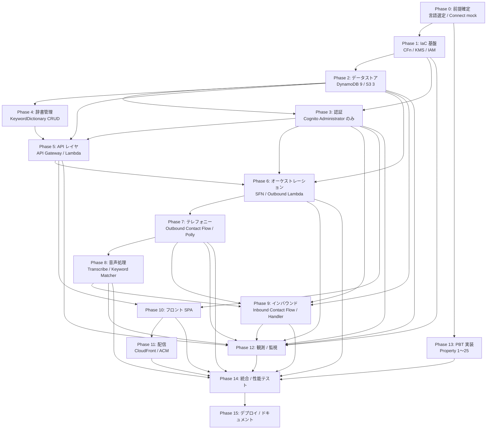

# Implementation Plan

## Overview

本ドキュメントは、`requirements.md`（2026-06-12 改訂版）と `design.md`（2026-06-12 改訂版）で確定したスコープを実装するためのタスク一覧である。Phase 0〜13 の依存順で実装を進めることを想定する。各タスクには `_Requirements_`（要件参照）、`_Design_`（設計参照）、`_Done When_`（観測可能な完了条件）を付与する。

スコープ外（マルチリージョン展開、SMS / Email / Push、メール起動、DTMF 応答、SSO、自動トリガー、高度監査ログ、一般社員ロール、端末登録、LLM 意図判定、声紋認証）に関するタスクは本計画に含めない。

## Task Dependency Graph



```json
{
  "waves": [
    { "wave": 1, "tasks": ["0.1", "0.2", "0.3"] },
    { "wave": 2, "tasks": ["1.1", "1.2", "1.3", "1.4", "1.5", "1.6"] },
    {
      "wave": 3,
      "tasks": [
        "2.1",
        "2.2",
        "2.3",
        "2.4",
        "2.5",
        "2.6",
        "2.7",
        "2.8",
        "2.9",
        "2.10",
        "2.11"
      ]
    },
    { "wave": 4, "tasks": ["3.1", "3.2", "3.3", "3.4", "3.5", "3.6"] },
    { "wave": 5, "tasks": ["4.1", "4.2", "4.3", "4.4"] },
    { "wave": 6, "tasks": ["5.1", "5.2", "5.3", "5.4", "5.5"] },
    {
      "wave": 7,
      "tasks": ["6.1", "6.2", "6.3", "6.4", "6.5", "6.6", "6.7", "6.8"]
    },
    { "wave": 8, "tasks": ["7.1", "7.2", "7.3", "7.4"] },
    { "wave": 9, "tasks": ["8.1", "8.2", "8.3", "8.4"] },
    { "wave": 10, "tasks": ["9.1", "9.2", "9.3", "9.4"] },
    {
      "wave": 11,
      "tasks": [
        "10.1",
        "10.2",
        "10.3",
        "10.4",
        "10.5",
        "10.6",
        "10.7",
        "10.8",
        "10.9",
        "10.10"
      ]
    },
    { "wave": 12, "tasks": ["11.1", "11.2", "11.3"] },
    {
      "wave": 13,
      "tasks": ["12.1", "12.2", "12.3", "12.4", "12.5", "12.6", "12.7"]
    },
    {
      "wave": 14,
      "tasks": [
        "13.1",
        "13.2",
        "13.3",
        "13.4",
        "13.5",
        "13.6",
        "13.7",
        "13.8",
        "13.9",
        "13.10",
        "13.11",
        "13.12",
        "13.13",
        "13.14",
        "13.15",
        "13.16",
        "13.17",
        "13.18",
        "13.19",
        "13.20",
        "13.21",
        "13.22",
        "13.23",
        "13.24",
        "13.25"
      ]
    },
    {
      "wave": 15,
      "tasks": [
        "14.1",
        "14.2",
        "14.3",
        "14.4",
        "14.5",
        "14.6",
        "14.7",
        "14.8",
        "14.9",
        "14.10",
        "14.11"
      ]
    },
    {
      "wave": 16,
      "tasks": ["15.1", "15.2", "15.3", "15.4", "15.5", "15.6", "15.7"]
    }
  ]
}
```

上記 Mermaid グラフは Phase 単位の依存関係、JSON Wave は実行可能な並列度の単位を示す。両者は相補的に解釈される。

## Tasks

### Phase 0: 前提確定

- [x] 0.1 実装言語の選定とランタイム決定
  - Node.js 20.x（fast-check）または Python 3.12（Hypothesis）から選定する
  - 選定基準：チームの既存スタック、PBT ライブラリ親和性、AWS SDK バージョン、Connect Contact Flow Lambda の実績、Amazon Transcribe SDK の成熟度
  - 選定結果を `docs/decisions/0001-runtime-selection.md` として ADR 形式で記録する
  - _Requirements: NFR6_
  - _Design: Components and Interfaces / Lambda 関数一覧_
  - _Done When: ADR 文書が承認され、Lambda の Runtime 選定が確定している。Phase 1 以降のすべての Lambda タスクで採用言語が一意に参照可能になっている_

- [x] 0.2 リポジトリ構成と開発環境テンプレートの確定
  - design.md に従い `infrastructure/`、`backend/`、`frontend/`、`docs/` のディレクトリ構成を作成する
  - `.editorconfig`、`.gitignore`、`.gitattributes`、Lint / Formatter 設定（ESLint + Prettier または Ruff + Black）を配置する
  - CI 用の最小ワークフロー（push 時の lint + 型チェック）を作成する
  - _Requirements: NFR5_
  - _Design: CloudFormation テンプレート設計 / ファイル構成_
  - _Done When: リポジトリのクローンから 5 分以内に lint 実行が成功し、空コミットの CI が green になる_

- [x] 0.3 Amazon Connect mock 試作
  - 開発アカウントに最小構成の Connect インスタンスを作成し、Outbound 用の Hello World Contact Flow と Inbound 用の Hello World Contact Flow を 1 つずつ手動構築する
  - Polly TTS と録音 S3 出力の動作確認、自席へ実発信して着信受信の挙動を確認する
  - 知見を `docs/decisions/0002-connect-mock-findings.md` に記録する（**注：実ファイル名は採番ズレにより `docs/decisions/0005-connect-mock-findings.md`。本本文の番号修正は別途のテキスト修正タスクとしてユーザー判断による、2026-06-25 セッション 7 続き ADR 採番確認 Option A**）
  - _Requirements: 5.1, 13.1_
  - _Design: Connect_Caller / Inbound_Handler_
  - _Done When: 開発者の自席電話に Outbound 発信が届き、自席から Inbound 着信できることを 1 度確認、知見ドキュメントが作成されている_
  - **※ 代替案で代行（Done When 部分達成）**：実機 Connect 検証（自席発信 / 着信 / Polly TTS / 録音 S3 / Transcribe 連動）は **課金合意取得後に保留**。本タスクは「知見ドキュメントが作成されている」のみ達成し、`docs/decisions/0005-connect-mock-findings.md`（ADR-0005、Accepted）として findings 整備（moto / boto3 stubber / unittest.mock の比較、推奨アプローチ確定、Phase 6.2 / 6.3 / 6.4 既存テストパターンの公式化）を完了。実機検証は Phase 7 ConnectDispatcher と Contact Flow の結合検証時、もしくは Phase 14 統合テスト時に課金合意取得後に別 ADR / 別タスクで切出して実施
  - **※ ステータス：代替案（findings 整備）で代行済、実 Connect 実機検証は課金合意取得後に保留**（2026-06-25 セッション 7 続き、ユーザー Option A 採用 + 計画承認なしで実行）

### Phase 1: IaC 基盤

- [x] 1.1 CloudFormation テンプレート `infrastructure/template.yaml` のスケルトン作成
  - `AWSTemplateFormatVersion`、`Description`、空の `Parameters` `Mappings` `Conditions` `Resources` `Outputs` `Rules` セクションを定義する
  - `aws cloudformation validate-template` 通過を確認する
  - _Requirements: 17.1_
  - _Design: CloudFormation テンプレート設計 / スタック構成_
  - _Done When: 空テンプレートが `validate-template` を通過し、`cfn-lint` でエラー 0_

- [x] 1.2 Parameters セクションの実装
  - `EnvironmentName`、`ConnectInstanceId`、`ConnectInstanceArn`、`ConnectOutboundPhoneNumberArn`、`ConnectInboundPhoneNumberArn`、`OutboundContactFlowId`、`InboundContactFlowId`、`DefaultRetryCount`（0〜5、既定 3）、`DefaultRetryIntervalMinutes`（1〜60、既定 5）、`OutboundGuidanceText`、`InboundGuidanceText`、`LogRetentionDays`、`OperatorEmail`、`RecordingsRetentionDays`、`TranscriptsRetentionDays`、`InboundReceptionWindowDays`（1〜90、既定 30）、`DomainName`、`AcmCertificateArn`、`MaxConcurrentCalls`、`TranscribeLanguageCode` を定義する
  - _Requirements: 17.2, 17.3, 17.5, 13.5, 16.5, 9.6, 6.2_
  - _Design: CloudFormation テンプレート設計 / Parameters_
  - _Done When: 全 Parameters が定義され、AllowedValues / Min / Max が要件と一致。`validate-template` 通過_

- [x] 1.3 Mappings セクション（環境別差分）の実装
  - `EnvMap` を定義し dev/stg/prod の `LogLevel`、`DynamoBillingMode`、`ApiThrottleRate`、`ApiThrottleBurst` を設定する
  - _Requirements: 17.3_
  - _Design: CloudFormation テンプレート設計 / Mappings_
  - _Done When: 3 環境ぶんのマッピングが定義され、`!FindInMap` 経由で参照可能_

- [x] 1.4 Conditions の実装
  - `IsProd`、`HasCustomDomain`、`UseCustomCert` の Conditions を定義する
  - _Requirements: -（要件 17.6 はスコープ外、deploy script による region 固定は Phase 15 で実装）_
  - _Design: CloudFormation テンプレート設計 / Conditions_
  - _Done When: 3 個の Conditions が定義され、`validate-template` 通過、`cfn-lint` でリージョン関連エラー 0_

- [x] 1.5 KMS CMK と Alias の実装
  - `KmsCmk`（Symmetric、ENCRYPT_DECRYPT、自動キーローテーション ON）を定義する
  - キーポリシー：(a) ルート全権、(b) Lambda / SFN 実行ロール / Transcribe サービスロールへ `Encrypt/Decrypt/GenerateDataKey/DescribeKey`、(c) `kms:ViaService` で dynamodb / s3 を制限付き許可、(d) 上記以外は Deny
  - `KmsCmkAlias` を `alias/${EnvironmentName}-safety-confirmation` で定義する
  - _Requirements: 6.4, 10.3, 15.1, NFR3_
  - _Design: KMS CMK 設計_
  - _Done When: スタックデプロイで CMK が作成され、Alias がコンソールで確認できる_

- [x] 1.6 共通 IAM ロール雛形の整備
  - 全 Lambda 共通の信頼ポリシー（`lambda.amazonaws.com`）と CloudWatch Logs 書込権限の最小ポリシーを ManagedPolicy として定義する
  - 関数別ロールが継承する基底とする
  - _Requirements: 15.2, 16.1, NFR3_
  - _Design: ネットワーク・セキュリティ境界_
  - _Done When: 基底ロールが定義され、後段の Lambda タスクから AttachManagedPolicy で再利用可能_

### Phase 2: データストア

- [x] 2.1 EmployeeTable（D1）の実装
  - PK `employeeId`（S）、GSI `PhoneNumberIndex`（PK `phoneNumber`、Inbound 一致判定用）
  - SSE-KMS で `KmsCmk` を指定、PITR ON、PAY_PER_REQUEST
  - _Requirements: D1, 13.2, 15.1_
  - _Design: Data Models / D1 Employee_Master_
  - _Done When: テーブルが作成され、SSE-KMS 有効、`PhoneNumberIndex` でクエリ可能_

- [x] 2.2 CycleTable（D2）の実装
  - PK `cycleId`、GSI `StatusStartedAtIndex`（PK `status`、SK `startedAt`）、SSE-KMS、PAY_PER_REQUEST
  - 属性に `mode`（ALL/UNREACHABLE_ONLY）、`referencedCycleId`、`dictionaryVersion` を含む
  - _Requirements: D2, 4.4, 8.5_
  - _Design: Data Models / D2 Cycle_
  - _Done When: テーブル + GSI 作成完了。`status=RUNNING` Query で実行中サイクル抽出可能_

- [x] 2.3 ResponseTable（D3）の実装
  - PK `cycleId`、SK `employeeId`、SSE-KMS、PAY_PER_REQUEST
  - 属性に `voiceStatus`、`transcriptExcerpt`、`matchedKeywords`、`dictionaryVersion` を含む
  - _Requirements: D3_
  - _Design: Data Models / D3 Response_
  - _Done When: PK 単独 Query で 1 サイクル分の Response 一括取得が可能_

- [x] 2.4 RecordingMetaTable（D4）の実装
  - PK `cycleId` または `INBOUND#{contactId}`、SK `employeeIdSeq`、SSE-KMS
  - _Requirements: D4, 10.5_
  - _Design: Data Models / D4 Recording_Metadata_
  - _Done When: アウトバウンド・インバウンド両方のキー命名でレコード書込み可能_

- [x] 2.5 TranscriptMetaTable（D6 メタ部）の実装
  - PK `cycleId` または `INBOUND#{contactId}`、SK `employeeIdSeq`、SSE-KMS
  - 属性に `transcribeJobId`、`transcriptS3Key`、`transcriptExcerpt`、`confidence` を含む
  - _Requirements: D6, 6.3_
  - _Design: Data Models / D6 TranscriptMetadata_
  - _Done When: テーブルが作成され、Transcribe ジョブ ID と S3 キーが保存可能_

- [x] 2.6 KeywordDictionaryTable（D7）の実装
  - PK `category`（SAFE/INJURED/UNAVAILABLE/META）、SK `keyword`
  - META レコードに `currentVersion`、ConditionExpression による原子的バージョンインクリメント
  - SSE-KMS
  - _Requirements: D7, 8.2, 8.3_
  - _Design: Data Models / D7 KeywordDictionary_
  - _Done When: テーブル作成、META レコードでバージョン管理が動作_

- [x] 2.7 KeywordDictionaryHistoryTable（D7 履歴）の実装
  - PK `version`（N）、SK `categoryKeyword`、SSE-KMS
  - 辞書 CRUD 時の全件スナップショット保管用
  - _Requirements: D7, 8.5, 19_
  - _Design: Data Models / KeywordDictionaryHistory テーブル_
  - _Done When: スナップショット書込みが動作し、`version` で過去バージョン全体を取得可能_

- [x] 2.8 InboundContactTable（D8）の実装
  - PK `contactId`（UUID）、GSI `EmployeeReceivedAtIndex`（PK `employeeId`、SK `receivedAt`）、SSE-KMS
  - 属性に `callerNumber`（KMS 暗号化）、`callerNumberMasked`、`flow`、`voiceStatus` を含む
  - _Requirements: D8, 13.7_
  - _Design: Data Models / D8 Inbound_Contact_
  - _Done When: テーブル作成、社員別の着信履歴が GSI で取得可能_

- [x] 2.9 LockoutTable（認証失敗履歴）の実装
  - PK `userIdentifier`、TTL 属性 `expireAt`（Unix秒）を有効化、SSE-KMS
  - _Requirements: 1.6_
  - _Design: Auth_Service / Lambda Triggers_
  - _Done When: TTL が有効化され、テスト書込から指定時間後に削除される_

- [x] 2.10 RecordingsBucket（D5）の実装
  - バケット名 `safety-confirmation-recordings-${EnvironmentName}-${AWS::AccountId}-${AWS::Region}`
  - SSE-KMS、`PublicAccessBlockConfiguration` 全 true、Versioning OFF、ライフサイクル 90 日
  - EventBridge Notification を有効化
  - _Requirements: 10.2〜10.4, 10.6_
  - _Design: Data Models / D5 Recording_File_
  - _Done When: バケット作成、暗号化 SSE-KMS、BPA 全 true、ライフサイクル 90 日が確認できる_

- [x] 2.11 TranscriptsBucket（D6 本体）と SpaBucket の実装
  - TranscriptsBucket：バケット名 `safety-confirmation-transcripts-${env}-${account}-${region}`、SSE-KMS、ライフサイクル 90 日、EventBridge Notification 有効
  - SpaBucket：バケット名 `safety-confirmation-spa-${env}-${account}-${region}`、SSE-S3、Versioning ON、OAC 経由 CloudFront のみ
  - 両バケットのバケットポリシーで Lambda Role 以外を Deny（Recordings と同様）
  - _Requirements: 6.4, 6.5, NFR3_
  - _Design: Data Models / D6 Transcript / SPA 配信用 S3 / バケットポリシー_
  - _Done When: 両バケットが作成され、認可外プリンシパルからの GetObject が AccessDenied になる_

### Phase 3: 認証

- [x] 3.1 CognitoUserPool の実装
  - User Pool 名 `safety-confirmation-${EnvironmentName}`、サインイン属性 `email`、自己サインアップ無効
  - パスワードポリシー：最小 12 文字、大小英数字記号必須
  - 属性 `email`、`name` を必須に
  - トークン有効期限：ID 1h / Access 1h / Refresh 30 日
  - MFA OFF（初期構築）
  - _Requirements: 1.1, 1.2_
  - _Design: Cognito ユーザープール設計_
  - _Done When: User Pool が作成され、属性 / パスワードポリシー / トークン有効期限が設計通り_

- [x] 3.2 CognitoUserPoolClient（App Client）の実装
  - SPA 用クライアント 1 個、`USER_SRP_AUTH` 有効、Client Secret 無し
  - `IdTokenValidity=1h, AccessTokenValidity=1h, RefreshTokenValidity=30d`
  - _Requirements: 1.2_
  - _Design: Cognito ユーザープール設計 / App Client_
  - _Done When: App Client ID が Outputs に出力され、SPA から SRP_AUTH で認証可能_

- [x] 3.3 Cognito UserPoolGroup `Administrator` の実装（Employee グループは作成しない）
  - `Administrator` グループのみを作成、説明と Precedence を設定
  - 一般社員ロールは本システムでは存在しないため、`Employee` グループは作成しない（Requirement 1.9）
  - _Requirements: 1.3, 1.9_
  - _Design: Cognito ユーザープール設計 / グループ_
  - _Done When: `Administrator` のみが作成されており、Employee グループが存在しないことを `aws cognito-idp list-groups` で確認_

- [x] 3.4 AuthPreAuthFn Lambda（PreAuthentication Trigger、ロック判定のみ）の実装
  - LockoutTable を参照し、末尾 5 件の失敗時刻すべてが直近 30 分以内であれば認証拒否（Property 8）
  - **失敗時刻の追記は本タスク対象外**（Cognito 仕様には認証失敗時 Lambda Trigger が存在しないため。失敗記録は Phase 5.6 の AuthFailureReporter API で SPA からの POST 経由で実装）
  - 純粋関数 `is_locked(failed_ats, now, threshold=5, window_sec=1800)` を `backend/shared/auth/lockout.py` に切出し、Phase 13.x で Property 8 PBT 対象とする
  - 共通モジュールは Lambda Layer（`SharedLayer` リソース、`AWS::Lambda::LayerVersion`）経由で参照、Layer の Content は `infrastructure/build/layers/shared/` に build script で stage
  - タイムアウト 5 秒、メモリ 512MB、ARM64
  - _Requirements: 1.6（ロック判定部分）, Property 8_
  - _Design: Auth_Service / Lambda Triggers / Property 8_
  - _Done When: AuthPreAuthFn Lambda コードと SharedLayer / IAM Role / Function リソースが template.yaml に追加され、`is_locked` が `backend/shared/auth/lockout.py` に純粋関数として実装されている。実機ロック動作検証は Phase 3 完了時のまとめデプロイで実施_

- [x] 3.5 AuthPostAuthFn Lambda（PostAuthentication Trigger）の実装
  - 認証成功イベント（プリンシパル ID、送信元 IP、タイムスタンプ）を Lambda 既定 CloudWatch Logs に書込（**AuditLogGroup は Phase 12.3 で作成、本 Phase では Lambda 既定 LogGroup に書込み、Phase 12.3 着手時に集約 LogGroup へ付替** → **12.3 完了で AuditLogGroup へ付替済**、2026-06-26 セッション 11）
  - LockoutTable の `failedAts` を空配列にクリア + `expireAt` を TTL 即時失効値（`now - 1`）に更新（**成功時のみ呼ばれる仕様、失敗時は呼ばれない**）
  - _Requirements: 1.5, 1.8, 16.3, Property 21（成功記録部分）_
  - _Design: Auth_Service / Property 21_
  - _Done When: AuthPostAuthFn Lambda コードと IAM Role / Function リソースが template.yaml に追加され、ログイン成功時に failedAts がクリアされる構造になっている。実機認証検証は Phase 3 完了時のまとめデプロイで実施_

- [x] 3.6 Cognito Trigger の関連付け
  - User Pool に PreAuth / PostAuth Trigger Lambda を関連付ける
  - PreSignUp Trigger は管理者作成のみ許可する関数として最小実装する
  - _Requirements: 1.6, 1.9_
  - _Design: Auth_Service / Lambda Triggers_
  - _Done When: コンソールで Lambda Trigger が User Pool に表示され、認証フローで起動が CloudWatch Logs に記録される_

### Phase 4: 辞書管理

- [x] 4.1 DictionaryApi Lambda の実装
  - `GET /keyword-dictionary`、`POST /keyword-dictionary`、`DELETE /keyword-dictionary/{category}/{keyword}`、`PATCH /keyword-dictionary/{category}/{keyword}`、`GET /keyword-dictionary/version` をルーティング（**Lambda 内部ルーター実装、API Gateway Resource/Method 定義は Phase 5.x で別途**）
  - キーワード追加・更新・削除時に `KeywordDictionaryHistoryTable` にスナップショットを書込
  - META レコードの `currentVersion` を `ConditionExpression` で原子的にインクリメント（**4.3 の楽観ロックロジックを本タスクで内包実装**）
  - 監査ログは Lambda 既定 CloudWatch Logs に JSON 形式で出力（**AuditLogGroup 集約は Phase 12.3 で付替**、Phase 3.5 と同方針 → **12.3 完了で AuditLogGroup へ付替済**、2026-06-26 セッション 11）
  - _Requirements: 8.1〜8.7_
  - _Design: Dictionary_Manager / インタフェース_
  - _Done When: DictionaryApi Lambda コードと IAM Role / Function リソースが template.yaml に追加され、5 ルート分岐 + 楽観ロック + 履歴スナップショット書込 + 監査ログ出力のロジックが実装されている。実機 API テストは Phase 5 完了時のまとめデプロイで実施_

- [x] 4.2 辞書スナップショット参照ヘルパの実装
  - `getDictionarySnapshot(version)` 関数：KeywordDictionaryHistoryTable から指定バージョンの全キーワードを返す純関数寄りの実装
  - Cycle 起動時 / KeywordMatcher から呼出
  - _Requirements: 8.5, Property 19_
  - _Design: Keyword_Matcher / マッチング判定の擬似コード_
  - _Done When: 任意のバージョン番号で辞書全体を再現でき、PBT P19 が green_

- [x] 4.3 楽観ロック整合性ハンドリング（Phase 4.1 で実装済、検証は Phase 14 へ移送）
  - 辞書 CRUD 時、META レコードの `currentVersion` 条件付き更新が失敗（並行更新）した場合は 409 Conflict を返すロジックは **Phase 4.1 で `_update_meta_version` + `ConditionalCheckFailedException` ハンドリングとして実装済**
  - クライアントは最新バージョンを再取得して再試行する（SPA 側責務、Phase 10 で実装）
  - **実機並行更新シミュレーション検証は Phase 14 統合テスト 14.x へ移送**（Phase 6 以降の SFN / Lambda 統合に組み込んで実施）
  - _Requirements: 8.3, 8.4_
  - _Design: Error Handling / 辞書 CRUD 楽観ロック失敗_
  - _Done When: Phase 4.1 で楽観ロックロジック実装済（ConditionalCheckFailedException → 409 Conflict）。並行更新シミュレーションは Phase 14 統合テスト 14.x で実施_

- [x] 4.4 辞書空チェックの実装
  - CycleApi `_create_cycle` の入力バリデーション直後に、KeywordDictionaryTable から SAFE / INJURED / UNAVAILABLE の 3 カテゴリを逐次 Query（Limit=1）し、純粋関数 `is_dictionary_empty` で合計が 0 件か判定する（B 案・厳密判定）
  - 0 件なら 400 + `{"error": "Active dictionary is empty. ..."}` を返却、Cycle レコードは作成しない
  - 純粋関数は `backend/shared/dictionary/active_count.py` に切出し（`count_active_keywords` / `is_dictionary_empty`、Property 19 と並ぶ辞書系不変条件、Phase 13.x で PBT 対象候補）
  - _Requirements: 8.6_
  - _Design: Cycle_Manager_
  - _Done When: CycleApi `_create_cycle` で 3 カテゴリ Query → 合計 0 件で 400 を実装、ユニットテスト PASS。実機検証は Phase 14 統合テスト 14.x_

### Phase 5: API レイヤ

- [x] 5.1 RestApi（API Gateway）と CognitoAuthorizer の実装
  - REST API、エンドポイント REGIONAL、Cognito User Pool Authorizer を定義
  - **本タスクのスコープ**：RestApi + Authorizer + API Gateway Account（リージョン単位の CloudWatch Logs 書込権限）+ 実行 / アクセスログ LogGroup ×2
  - **Stage / Deployment / スロットリング設定 / Method ログ設定は Phase 5.6 完了時に一括実装**（Method がない状態で Stage を作っても意味がなく、Method 追加時の Deployment 再生成トラブルを回避するため）
  - _Requirements: 1.1, 11.1, NFR3_
  - _Design: API Gateway 設計_
  - _Done When: RestApi + Authorizer + Account + 2 LogGroup が template.yaml に追加され、cfn-lint 通過。実機の Stage 動作確認とトークン無し 401 確認は Phase 5 完了時のまとめデプロイで実施_

- [x] 5.2 EmployeeApi Lambda の実装（社員 CRUD ＋ CSV インポート）
  - `POST /employees`、`GET /employees`、`GET/PUT/DELETE /employees/{id}`、`POST /employees/import` をルーティング
  - 入力バリデーション（氏名・E.164 電話番号のみ）
  - 「Cognito 先 → DynamoDB 後」順序で書込（Administrator 作成時のみ Cognito 連動）
  - 重複電話番号検知（論理削除済を含む）で 409 返却
  - CSV インポートは UTF-8 / 300 行以下 / 1 MiB 以下を検証、`TransactWriteItems` で 25 件分割の All-or-Nothing
  - 削除時は論理削除フラグ + 電話番号 NULL 化を 5 秒以内に実施
  - 監査ログ（追加 / 更新 / 削除）を AuditLogGroup に出力、電話番号は maskPhone
  - _Requirements: 2.1〜2.7, 3.1〜3.7, 15.3, 15.5_
  - _Design: Lambda 関数一覧 / EmployeeApi_
  - _Done When: API テストで CRUD 全件成功、不正 E.164 が 400、重複電話番号が 409_

- [x] 5.3 CycleApi Lambda の実装
  - `POST /cycles`、`GET /cycles`、`GET /cycles/{id}`、`GET /cycles/{id}/status` をルーティング
  - `Idempotency-Key` ヘッダで重複起動抑止：StatusStartedAtIndex で既存 RUNNING Cycle 検索、Idempotency-Key 一致 → 既存返却 / 不一致 → 409 Conflict
  - 辞書バージョンスナップショット（META.currentVersion）を Cycle レコードに保存
  - SFN StartExecution（**Phase 5.3 着手時点では SFN 未存在のため SFN_STATE_MACHINE_ARN は先回り命名値で IAM Policy のみ設定、Phase 6 で同名 SFN 作成により自動有効化**）
  - SFN StartExecution 失敗時：Cycle status を `START_FAILED` に更新 + 5xx 返却（Requirement 4.11）
  - 対象者抽出は本タスクではなく Phase 6.1 LoadTargets Lambda で実装（SFN の最初のステートで実行）
  - mode=`ALL` / `UNREACHABLE_ONLY` の入力バリデーション
  - Retry_Count [0,5] / Retry_Interval [1,60] の検証
  - GET `/status` で `summary` / `items` / `degraded` を返却
  - _Requirements: 4.1〜4.11, 8.5, 11.1〜11.6_
  - _Design: Cycle_Manager / インタフェース_
  - _Done When: CycleApi Lambda コードと IAM Role / Function リソースが template.yaml に追加され、4 ルートの分岐ロジック + Idempotency-Key 重複抑止 + 辞書バージョンスナップショット + SFN StartExecution（先回り ARN）が実装されている。実機 mode=ALL/UNREACHABLE_ONLY 動作確認は Phase 6 完了時の SFN 含むまとめデプロイで実施_

- [x] 5.4 ResponseApi Lambda の実装
  - 過去 Cycle 一覧、Cycle 詳細 / Response 一覧（ページング 50 件、降順）
  - Transcript 抜粋を含めて返却
  - Cognito ロール照合：Administrator のみ
  - _Requirements: 12.1, Property 1_
  - _Design: Lambda 関数一覧 / ResponseApi_
  - _Done When: 管理者で Cycle 一覧と詳細が降順 50 件で取得できる_

- [x] 5.5 RecordingApi Lambda の実装
  - `GET /cycles/{id}/recordings/{employeeId}/{seq}`、`GET /cycles/{id}/transcripts/{employeeId}/{seq}`、`GET /inbound/{contactId}/recording`、`GET /inbound/{contactId}/transcript` を実装
  - 90 日経過判定（`now - cycle.startedAt > 90日` または `now - inbound.receivedAt > 90日` で 410 Gone）
  - 署名付き URL の有効期限 15 分
  - 管理者ロールのみ許可
  - _Requirements: 10.7, 12.2, 12.3, 13.7, Property 23_
  - _Design: Recording_Store / インタフェース / Property 23_
  - _Done When: 90 日内は 200 + 署名付き URL、90 日超過は 410、未認可は 403_

- [x] 5.6 AuthFailureReporter API + Lambda の実装（Phase 3.4 着手時に追加された依存タスク）
  - **背景**：Cognito User Pool には認証失敗時 Lambda Trigger が存在しないため、SPA が `InitiateAuth` 失敗を検知した時点で本 API を呼び出し、サーバー側で失敗履歴を LockoutTable へ追記する設計
  - パブリックエンドポイント `POST /auth/record-failure`（**Cognito Authorizer 不要**、認証失敗時に呼ばれるため）
  - リクエストボディ：`{ "userIdentifier": "<email>" }`（SPA が `NotAuthorizedException` 等を検知時に呼出）
  - Lambda は LockoutTable に `failedAts` を `list_append`（UpdateItem の `SET failedAts = list_append(if_not_exists(failedAts, :empty), :newTs)`）+ `expireAt = now + 30min` を更新
  - API Gateway スロットリングを十分小さく設定（10 req/sec/IP）して総当り攻撃緩和、レート超過は 429
  - 注：悪意攻撃者が Cognito API を直接叩いた場合は failedAts に記録されないため、Cognito 側のレート制限と Advanced Security（将来検討）に委ねる
  - 共通モジュールは Phase 3.4 で作成済の `SharedLayer` を参照
  - _Requirements: 1.6（失敗記録部分）_
  - _Design: Auth_Service / 失敗記録 API_
  - _Done When: AuthFailureReporter API エンドポイントと Lambda コードが template.yaml と backend/lambdas/ に追加され、SPA から POST すると LockoutTable に failedAts が追記される構造になっている。実機検証は Phase 5 完了時のまとめデプロイで実施_

- [x] 5.7 API Gateway Resource/Method/Integration/Stage/Deployment 統合（Phase 5.6 完了後に追加された依存タスク）
  - **背景**：Phase 5.1 で「Method がない状態の Stage は意味なし、Method 追加時の Deployment 再生成トラブル回避」のため Stage/Deployment を遅延。Phase 5.6 まで全 Lambda が揃った時点で一括統合する
  - **Resource ツリー 24 個**：`/auth/record-failure`、`/cycles/{id}/...`（status/responses/recordings/transcripts）、`/employees/{id}`、`/employees/import`、`/keyword-dictionary/{category}/{keyword}`、`/keyword-dictionary/version`、`/inbound/{contactId}/...`
  - **Method 19 個**：各 Lambda Handler に対応する HTTP メソッド + Cognito Authorizer 紐付け（`/auth/record-failure` のみ `AuthorizationType: NONE` でパブリック）
  - **Lambda Permission 6 個**：API Gateway → Lambda Invoke 許可、各 Lambda リソース
  - **Deployment**：ユニーク論理 ID で初回 Deployment 作成。後続変更時は明示的再 Deployment が必要（CFn の既知制約）
  - **Stage**：ステージ名 `${EnvironmentName}`、スロットリング `${ApiThrottleRate}/${ApiThrottleBurst}`（Mappings 参照）、`MethodSettings` で Method 単位の `LoggingLevel: INFO` 設定、AccessLogSetting で アクセスログ LogGroup 連携
  - _Requirements: 1.1, 1.2（API Gateway 経由の認証）、各 Lambda の Requirement 包含_
  - _Design: API Gateway 設計_
  - _Done When: Resource/Method/Integration/Permission/Deployment/Stage が template.yaml に追加され、cfn-lint 通過。実機 API が HTTPS で呼出可能（トークン付きで 200、無しで 401、`/auth/record-failure` は無認証で 202） を Phase 5.7 デプロイ後の curl 確認で達成_

### Phase 6: オーケストレーション

- [x] 6.1 LoadTargets Lambda の実装
  - 入力 `{cycleId, mode, referencedCycleId}` を受け取る
  - mode=`ALL`：論理削除されておらず電話番号が NULL でない全社員を抽出
  - mode=`UNREACHABLE_ONLY`：referencedCycleId の Response から voiceStatus が `UNREACHABLE` または `OTHER` の社員のみ抽出
  - 0 名の場合は SFN を異常分岐させるエラーを返す
  - _Requirements: 4.3, 4.4, 4.5, 13.5, Property 2_
  - _Design: Lambda 関数一覧 / LoadTargets_
  - _Done When: LoadTargets Lambda コード + ユニットテスト + IAM Role / Function リソースが template.yaml に追加され、`is_visible` 経由で論理削除済社員が除外される。cfn-lint ERROR 0 を確認。実機 SFN 経由の動作確認は Phase 6 完了時のまとめデプロイで実施_

- [x] 6.2 ConnectDispatcher Lambda の実装
  - 入力 `{cycleId, employeeId, phoneNumber, attempt, taskToken}`
  - Connect の `StartOutboundVoiceContact` を呼び、Outbound Contact Flow に Attribute を渡す
  - `ThrottlingException` / `LimitExceededException` を指数バックオフ + ジッタで最大 3 回再試行（純粋関数 `backend/shared/connect/backoff.py::compute_backoff_delay` を切出、`random_fn` 引数注入で決定論的テスト可能、Phase 13.24 PBT 候補）
  - 最終失敗で `callResultCode=ERROR` を Response に `ConditionExpression="attribute_not_exists(callResultCode)"` 付き UpdateItem で書込、SFN へ `SendTaskSuccess` で `{retry: true, reason: "DISPATCH_FAILED"}` を返す
  - **Parameter 追加**：`ConnectOutboundPhoneNumber`（E.164 文字列、`SourcePhoneNumber` 必須対応、Phase 1.2 で定義済の `ConnectOutboundPhoneNumberArn` から実行時 API 逆引きする実行時依存を避けるため）
  - _Requirements: 5.1, 5.2, 9.6_
  - _Design: Connect_Caller / ConnectDispatcher_
  - _Done When: テンプレ実装 + ユニットテスト 11 件以上 PASS + cfn-lint ERROR 0。実機 Connect 呼出検証は Phase 6 完了時のまとめデプロイ後、または 0.3 Connect 課金合意降りた後_

- [x] 6.3 CallEndHandler Lambda の実装
  - 入力（Outbound Contact Flow より）：`{contactId, cycleId, employeeId, attempt, callResultCode, taskToken}`
  - Response テーブルへ通話結果コードと終了時刻を `ConditionExpression="attribute_not_exists(callResultCode)"` 付きで書込（二重書込防止、ConditionalCheckFailedException は LOGGER.info で swallow して send_task_success は呼ぶ idempotent 設計）
  - SFN `SendTaskSuccess` で TaskToken を返す（output: `{"retry": false, "contactId": ..., "callResultCode": ...}`、6.2 の `{retry: bool, ...}` スキーマと統一）
  - **設計判断（callAttempts 二重カウント回避）**：6.2 ConnectDispatcher が dispatch 成功時に `ADD callAttempts :one` 済のため、6.3 では `callAttempts` を増やさず `callResultCode` と `endedAt` のみ SET。Phase 6.5 RetryEvaluator が `callAttempts` を読む時点で 6.2 がインクリメント済の値を参照する設計
  - **Connect → Lambda 呼出許可**：`AWS::Lambda::Permission`（Principal=`connect.amazonaws.com`、SourceAccount=`!Ref AWS::AccountId`、SourceArn=`!Ref ConnectInstanceArn`）で confused-deputy 緩和
  - **通話結果コード定数**：`backend/shared/connect/call_result.py::VALID_CALL_RESULT_CODES`（frozenset 6 値：RECORDED / NO_ANSWER / BUSY / VOICEMAIL / ERROR / TRANSCRIBE_FAILED）を SharedLayer 経由で handler が import、Phase 7.4 `classify_call_result` 本実装でも同じ定数を再利用する DRY 設計
  - _Requirements: 5.4, 5.5_
  - _Design: Connect_Caller / CallEndHandler、Idempotency_
  - _Done When: テンプレ実装 + ユニットテスト 10 件 PASS + cfn-lint ERROR 0。実機 Connect 呼出検証は Phase 6 完了時のまとめデプロイ後、または 0.3 Connect 課金合意降りた後_

- [x] 6.4 TranscribeStarter Lambda の実装
  - S3 Recordings の `ObjectCreated` EventBridge イベントから起動
  - Transcribe ジョブを `language-code=ja-JP`、`media-format=wav`、`output-bucket=<TranscriptsBucket>`、`output-key=transcripts/{cycleId}/{employeeId}/{seq}.json`（インバウンドは `inbound/{yyyymm}/{employeeId}/{contactId}.json`）で起動
  - 失敗時は最大 3 回再試行（純粋関数 `backend/shared/connect/backoff.py::compute_backoff_delay` を 6.2 と共用、DRY 原則 19(a)）、最終失敗で `callResultCode=TRANSCRIBE_FAILED` を Response に書込
  - **純粋関数切出（PBT 候補）**：`backend/shared/recording/s3_keys.py::parse_recording_key`（アウトバウンド / インバウンド両スキーマの解析、Property 24 path-shape 不変条件） + `derive_transcribe_job_name`（meta*pk / meta_sk から `^[0-9a-zA-Z.*-]+$` 200 文字以内の冪等命名規則、`:`/`/`/`#`→`-` サニタイズ）
  - **設計判断（インバウンド分離）**：本タスクの最終失敗時 Response 更新は**アウトバウンドのみ**に限定。インバウンドは Response テーブルではなく InboundContactTable の責務（Phase 9 InboundHandler）であり、TranscribeStarter は LOGGER.warning のみで通知。本判断により Response の意味論を「アウトバウンドサイクル状態」に限定維持
  - **設計判断（TRANSCRIBE_FAILED 上書き条件）**：Response.callResultCode の `RECORDED → TRANSCRIBE_FAILED` 遷移のみを ConditionExpression `attribute_exists(callResultCode) AND callResultCode = :recorded` で許可。BUSY / NO_ANSWER 等の状態を TRANSCRIBE_FAILED で上書きすると音声記録が無いケースでも遷移が成立してしまい意味論が崩れるため、RECORDED 限定で integrity を保つ。ConditionalCheckFailedException は LOGGER.info で swallow
  - **EventBridge 配線**：`TranscribeStarterEventRule`（AWS::Events::Rule、`detail.bucket.name: [!Ref RecordingsBucket]` で限定）+ `TranscribeStarterFnEventPermission`（Principal=`events.amazonaws.com`、SourceArn=`!GetAtt TranscribeStarterEventRule.Arn`）を追加。Phase 2.10 で有効化済の RecordingsBucket EventBridge Notification と接続して配線完成
  - _Requirements: 6.1, 6.2, 6.6, Property 24_
  - _Design: Voice_Transcriber / 構成_
  - _Done When: テンプレ実装 + ユニットテスト 13 件以上 PASS + 純粋関数テスト 25 件以上 PASS + cfn-lint ERROR 0。実機 Transcribe 連動検証は Phase 6 完了時のまとめデプロイ後_

- [x] 6.5 RetryEvaluator Lambda の実装
  - 入力：Response の最新 voiceStatus / callResultCode、累積発信回数、Retry_Count、Retry_Interval、prevEndAt
  - 出力：`{retry: bool, retryWaitSeconds: int, nextDispatchAt: str|None, finalStatus: str|None}`
  - 純粋関数 4 つを `backend/shared/retry/evaluator.py` に切出（**Phase 13.12 / 13.13 PBT 候補**）：
    - `should_retry(voice_status, call_result_code, attempts, retry_count)`：Property 12
    - `compute_next_dispatch_at(prev_end_at_iso, interval_minutes)`：Property 13
    - `compute_retry_wait_seconds(prev_end_at_iso, interval_minutes, now_iso)`：SFN Wait 用の秒数変換ヘルパ（clock 注入で純粋）
    - `derive_final_status(voice_status)`：FinalizeOne 用、PENDING/OTHER は上限到達後 UNREACHABLE に統一
  - 判定ロジック（Req 9.1 / 9.3 / 9.4 / 9.5）：voiceStatus ∈ {SAFE, INJURED, UNAVAILABLE} → retry=False、voiceStatus=UNREACHABLE → retry=False（最終状態）、voiceStatus ∈ {PENDING, OTHER} + attempts < retryCount → retry=True、上限到達で finalStatus=UNREACHABLE
  - **設計判断（薄いラッパー）**：DynamoDB アクセスなしの純粋計算 Lambda。SFN EvaluateRetry ステートが event で全入力を渡すため、boto3 不要（datetime のみ）。IAM は `LambdaBaseLogsManagedPolicy` のみ、Inline Policy なし
  - **設計判断（derive_final_status の UNREACHABLE 統一）**：should_retry が False を返した時点で「確定」または「上限到達」のいずれか。PENDING/OTHER の場合は必然的に上限到達なので UNREACHABLE に統一
  - _Requirements: 9.1, 9.3, 9.4, 9.5, Property 12, Property 13_
  - _Design: Lambda 関数一覧 / RetryEvaluator_
  - _Done When: テンプレ実装 + 純粋関数テスト 15 件以上 PASS + handler テスト 10 件以上 PASS + cfn-lint ERROR 0。実機 SFN 連動検証は Phase 6 完了時のまとめデプロイ後_

- [x] 6.6 CycleFinalizer Lambda の実装
  - 入力：SFN（Map 完了時）または EventBridge（30/60 分ルール）。3 trigger 分岐は `event["trigger"]` で多重化（`MAP_COMPLETED` / `TIMER_30MIN` / `TIMER_60MIN`）
  - Map 完了時：全 Response が確定済か検証し、Cycle ステータスを `COMPLETED` に更新、EventBridge ルール削除
  - 60 分経過時：SFN `StopExecution` 発行 → 未確定 Response を `UNREACHABLE` に強制更新 → Cycle を `TIMEOUT` → SNS 通知 → EventBridge ルール削除
  - 30 分経過時：初回発信完了未達なら `slaWarning30min=true` + CloudWatch メトリクス + SNS 通知
  - 純粋関数 5 つを `backend/shared/cycle/finalize.py` に切出（**Property 15 / 16 / 17 PBT 候補**）：
    - `is_cycle_completed(responses)`：Property 16（Map 完了不変条件）
    - `count_pending_responses(responses)`：未確定 Response カウント
    - `compute_summary(responses)`：Property 15（集計値の整合性）
    - `apply_timeout(responses)`：Property 17（タイムアウト時 PENDING/OTHER → UNREACHABLE 一括変換）
    - `is_first_dispatch_incomplete(responses)`：30 分 SLA 警告判定
  - **設計判断（OperatorTopic / SFN ARN の先回り命名）**：Phase 12.4（OperatorTopic 作成）/ Phase 6.8（SFN ステートマシン作成）の先行依存を、IAM Policy と env 変数の先回り命名（`safety-confirmation-operator-${env}` / `safety-confirmation-cycle-${env}`）で吸収。実機 SNS Publish は 12.4 完了まで `NotFoundException`、SFN StopExecution は 6.8 完了まで `ExecutionDoesNotExist`（swallow 対応済）になるがデプロイは通る
  - **設計判断（3 trigger 多重化）**：3 つの異なる起動源を 1 Lambda にまとめることで、Cycle / Response テーブルの IAM grant 重複を回避し、ステートマシン → タイマールール → ハンドラ間の責任境界を明確化（DRY 原則）
  - **設計判断（idempotent な terminal 操作）**：EventBridge `RemoveTargets` / `DeleteRule` は `ResourceNotFoundException` を swallow、SFN StopExecution は `ExecutionDoesNotExist` を swallow、Response UpdateItem は ConditionExpression で PENDING/OTHER 限定。再実行（dead-letter からのリプレイ含む）でも整合性が崩れない
  - _Requirements: 11.4, 14.4, 14.5, 14.6, Property 15, Property 16, Property 17_
  - _Design: Cycle_Manager / 構成 / Property 15-17_
  - _Done When: テンプレ実装 + 純粋関数テスト 25 件 PASS + handler テスト 15 件 PASS + cfn-lint ERROR 0。実機 SFN / EventBridge / SNS 連動検証は Phase 6 完了時のまとめデプロイ + Phase 12.4 OperatorTopic 作成後_

- [x] 6.7 RecordingMetadataWriter Lambda の実装
  - S3 Recordings PutObject イベント（EventBridge）から起動
  - RecordingMetaTable に S3 オブジェクトキー / Cycle ID（または `INBOUND#{contactId}`）/ 社員 ID / 録音時刻 / 通話時間を書込
  - 最大 3 回再試行、最終失敗で SQS DLQ 送付
  - 純粋関数再利用（DRY 原則 19(a)）：`backend/shared/recording/s3_keys.py::parse_recording_key`（Phase 6.4 と共用） + `backend/shared/connect/backoff.py::compute_backoff_delay`（Phase 6.2 / 6.4 と共用）
  - **設計判断（EventBridge Rule 分離）**：Phase 6.4 TranscribeStarter とは別の `RecordingMetadataWriterEventRule` を新設。Rule 評価コストよりも責務分離（片方の Rule 無効化が他方に波及しない / Rule 名と Lambda 名が一致する観測性）を優先
  - **設計判断（DLQ 同梱・Phase 12.5 先行実装）**：DeadLetterConfig の TargetArn と SQS Queue は 1 commit にまとまっていないと配線が成立しないため、Phase 12.5 の `RecordingMetadataWriterDLQ` を本タスクで先行実装。Phase 12.5 は本タスク完了をもって Done When 達成
  - **設計判断（DLQ 配線方式）**：Lambda Function の `DeadLetterConfig.TargetArn` で AWS Lambda の async 起動失敗パスから自動連動（EventBridge → Lambda は async invoke のため有効）。handler 内で明示 SendMessage はしない
  - **設計判断（durationSeconds 近似）**：S3 PutObject EventBridge イベントの `detail.object.size` から `size_bytes * 8 / (bitrate_kbps * 1000)` で算出（Amazon Connect 既定の 8kHz mono 16bit PCM = 128 kbps）。WAV ヘッダ解析は将来 Phase 13.x で必要なら検討。`_estimate_duration_seconds` は純粋関数として実装
  - _Requirements: 10.5, 10.8, 10.9, Property 24_
  - _Design: Recording_Store / 構成_
  - _Done When: テンプレ実装 + ユニットテスト 18 件 PASS + cfn-lint ERROR 0。実機 EventBridge 連動 + DLQ 配送検証は Phase 6 完了時のまとめデプロイ後_

- [x] 6.8 Step Functions ステートマシンの実装
  - Standard ワークフロー、状態：`LoadTargets → StartTimers → CallMap → Aggregate → Finalize`
  - `CallMap` は Map ステート、`MaxConcurrency=${MaxConcurrentCalls}`（既定 10）
  - 各 Map イテレーション：`InitAttempt → Dispatch（waitForTaskToken, timeout 90s）→ WaitForTranscribe（60 秒）→ ReadResponse（dynamodb:getItem, ConsistentRead）→ EvaluateRetry → RetryChoice → (WaitInterval → IncrementAttempt → Dispatch | FinalizeOne)`
  - Logging Level=ALL、IncludeExecutionData=true（`CycleStateMachineLogGroup` = `/aws/states/safety-confirmation-cycle-${env}`、Phase 12.2 で先行作成）
  - `Catch` ブロックで Dispatch / ReadResponse / EvaluateRetry / InitAttempt 失敗時に `FinalizeOneError`（voiceStatus=OTHER, sfnError=SFN_ITERATION_FAILED）へ分岐、LoadTargets / CallMap 失敗時は top-level `CycleFailed` へ
  - **設計判断（ReadResponse 追加）**：RetryEvaluator (Phase 6.5) は純粋計算 Lambda で DynamoDB アクセスなしのため、`WaitForTranscribe` と `EvaluateRetry` の間に `dynamodb:getItem` の `ReadResponse` ステートを挿入。Iterator 状態は仕様の 7 ステートから 10 ステートへ拡張（InitAttempt / Dispatch / WaitForTranscribe / ReadResponse / EvaluateRetry / RetryChoice / WaitInterval / IncrementAttempt / FinalizeOne / FinalizeOneError）
  - **設計判断（callResultCode 省略）**：EvaluateRetry の Payload から `callResultCode.$` を省略。理由 (a) `shared.retry.evaluator.should_retry` が `call_result_code` を informational only として使用しない（docstring 明記）、(b) ASL Parameters の `.$` 構文は JSONPath が解決できないと runtime error になり、`Response.callResultCode` 属性は Dispatch 経路（成功 / 失敗）によって不在の可能性がある
  - **設計判断（試行回数管理）**：SFN 内部カウンタ `$.currentAttempt` を Map Parameters で初期値 1 で導入、`IncrementAttempt` Pass ステートで `States.MathAdd($.currentAttempt, 1)` インクリメントしてから次 Dispatch ループへ。ConnectDispatcher (Phase 6.2) は `attempt` を 1-based 試行番号として受領、RetryEvaluator (Phase 6.5) は `attempts` として読む
  - **設計判断（StartTimers 簡易化）**：30/60 分 EventBridge Rule（`cycle-30min-{cycleId}` / `cycle-60min-{cycleId}`）の動的作成を本タスクでは実装せず、`StartTimers` を Pass ステートに留め TODO コメントを ASL JSON 内に明記。理由：(i) SFN から `arn:aws:states:::aws-sdk:eventbridge:putRule` SDK タスク呼出は Target ARN 動的構築が ASL Parameters で困難、(ii) SFN Role の IAM grant 範囲が拡大、(iii) Phase 14 統合テストで EventBridge Rule の作成方式を確定（運用設計 or CycleApi Lambda 経由）。MAP_COMPLETED happy path は `Finalize` ステートで完全配線済（CycleFinalizer の MAP_COMPLETED trigger）、30 分 SLA 警告 / 60 分タイムアウトは Phase 14 で運用設計を確定
  - **設計判断（DefinitionS3Location 採用）**：CFn Resource タイプ `AWS::StepFunctions::StateMachine` の `DefinitionS3Location` プロパティを採用、ASL 定義は `infrastructure/state-machines/cycle-state-machine.asl.json`（15,057 bytes、6 top-level + 10 Iterator ステート）を `aws cloudformation package` で S3 アップロード。`DefinitionSubstitutions` で 6 プレースホルダ（`LoadTargetsFnArn` / `ConnectDispatcherFnArn` / `RetryEvaluatorFnArn` / `CycleFinalizerFnArn` / `ResponseTableName` / `MaxConcurrentCalls`）を実行時注入
  - **SFN Role 構成**：4 Lambda（LoadTargets / ConnectDispatcher / RetryEvaluator / CycleFinalizer）の `lambda:InvokeFunction` + ResponseTable の `dynamodb:PutItem / UpdateItem / GetItem` + SFN Logging 用の `logs:*LogDelivery / *ResourcePolicy / DescribeResourcePolicies / DescribeLogGroups`（`"*"` リソース、AWS マネージドポリシー仕様準拠）+ KMS `Decrypt / GenerateDataKey`（`kms:ViaService = dynamodb` 制限付き）の 4 ポリシー。CallEndHandler (Connect Contact Flow から呼出) / TranscribeStarter / RecordingMetadataWriter (EventBridge から呼出) は SFN から呼ばないため除外
  - _Requirements: 4.1, 5.1, 9.1〜9.6, 14.1〜14.3, 16.2_
  - _Design: Cycle_Manager / Step Functions ステートマシン構造_
  - \_Done When: ASL JSON 構文検証 PASS（json.loads 後グラフ整合性 OK、6 top + 10 Iterator ステート）+ template.yaml に SFN 3 リソース追加（LogGroup / ExecutionRole / StateMachine）+ Output 3 件（CycleStateMachineArn / Name / LogGroupName）+ cfn-lint ERROR 0、WARNING 31（純減 0、W3002 +1 で W2001 -1 を相殺）+ aws cloudformation validate-template 通過（S3 アップロード経由、運用課題 #8 既知）。実機 SFN StartExecution 検証は Phase 6 完了時のまとめデプロイで「サイクル 1 件起動 → SFN 1 実行 → COMPLETED 到達」を確認

### Phase 7: テレフォニー（アウトバウンド）

- [x] 7.1 Outbound Contact Flow `SafetyConfirmationOutboundFlow-${env}` の作成
  - Outbound 用、Voice 設定（Polly `ja-JP` Mizuki / Takumi）
  - Polly TTS で `OutboundGuidanceText` Parameter の本文を再生
  - Set Recording Behavior: ON で通話全体を録音
  - 短い無音検知または最大録音時間で Disconnect
  - 終了時に CallEndHandler Lambda を Invoke
  - JSON ファイル `infrastructure/contact-flows/outbound.json` として版管理
  - **設計判断（無音検知 → Wait ブロック代替）**：Connect ネイティブの無音検知は `GetCustomerInput` 系ブロックに依存するが、Requirement 5.6 で DTMF 系ブロックの使用を禁止しているため、`Wait` ブロックで `TimeLimitSeconds=30` を採用して最大録音時間到達で次ステップへ遷移する設計（録音は `UpdateContactRecordingBehavior` で開始済のため Wait 中も継続）
  - **設計判断（Lambda Invoke 順序）**：design.md Mermaid は `Disconnect → Invoke Lambda` 順だが Connect ランタイム仕様上 `DisconnectParticipant` 後の後続アクションは実行されないため、`Wait → InvokeLambdaFunction(CallEndHandler) → DisconnectParticipant` の順で実装。CallEndHandler は SFN `SendTaskSuccess` で TaskToken を解放してから Disconnect する
  - **設計判断（CFn DefinitionSubstitutions パターン採用）**：`${CallEndHandlerFnArn}` と `${OutboundGuidanceText}` は SFN ASL（Phase 6.8）と同じプレースホルダ形式を採用、デプロイ時の置換は Phase 15 デプロイスクリプトで実装（現時点は版管理のみ）
  - **既知の追跡課題（Phase 7.4 / 14 へ送り）**：Connect の `InvokeLambdaFunction` は Lambda イベントを `Details.ContactData.Attributes.*` の入れ子で渡すが、現在の CallEndHandler は flat 入力（`event["cycleId"]` 等）を期待している。Phase 7.4（classify_call_result）または Phase 14 統合テストで CallEndHandler の入力パーシングを入れ子対応に拡張する必要がある
  - _Requirements: 5.1〜5.4, 5.6, 10.1, 10.2_
  - _Design: Connect_Caller / Outbound Contact Flow 設計_
  - _Done When: Contact Flow JSON 構文検証 PASS（json.loads OK、Version=2019-10-30、6 アクション [UpdateContactTextToSpeechVoice / UpdateContactRecordingBehavior / MessageParticipant / Wait / InvokeLambdaFunction / DisconnectParticipant]、孤立アクション 0、全 NextAction 解決、DTMF 系ブロック 0）+ 設計対応（Mizuki / RecordingBehavior=Both / Wait 30 秒 / `${CallEndHandlerFnArn}` 置換埋込）。実機テスト発信検証（TTS ガイダンス再生 + 応答録音 + CallEndHandler 呼出）は Phase 7 完了時のまとめデプロイで、または ADR-0005 課金合意取得後に実施_

- [x] 7.2 Connect 録音設定の有効化
  - 該当 Contact Flow に「Set recording and analytics behavior」ブロックを配置、録音 ON
  - 録音先 S3 バケットを `RecordingsBucket` に設定
  - S3 オブジェクトキーを `recordings/{cycleId}/{employeeId}/{seq}.wav` 命名にマッピング（Connect 標準命名と異なる場合は CallEndHandler または別 Lambda で Rename + 元削除）
  - **設計判断（別 Lambda 採用）**：CallEndHandler は同期的に TaskToken を開放する責務（Phase 6.3）。Connect の録音 S3 アップロードは通話終了後に非同期で発生するため、CallEndHandler 実行時には録音ファイルが S3 にまだ存在しない。よって rename は別 Lambda（`RecordingRelocator`）で実装。EventBridge `Object Created` を `connect-raw/` プレフィックスで購読
  - **設計判断（ContactIdIndex GSI 追加）**：`RecordingRelocator` は Connect-native key から抜出した contactId → `(cycleId, employeeId, callAttempts)` の解決が必要。ResponseTable に sparse GSI `ContactIdIndex`（HASH=contactId、Projection=INCLUDE [cycleId, employeeId, callAttempts]）を追加。ConnectDispatcher (Phase 6.2) `_record_success` が contactId を設定する行のみ index 対象になる sparse 設計
  - **設計判断（EventBridge ルールの prefix 排他）**：3 つの EventBridge Rule（TranscribeStarter / RecordingMetadataWriter / RecordingRelocator）が同一バケットの異なる prefix を購読する disjoint 設計。TranscribeStarter / RecordingMetadataWriter には `recordings/` + `inbound/` の prefix フィルタを追加（`connect-raw/` 配下には反応しない）。RecordingRelocator が rename した後の PutObject イベントが TranscribeStarter / RecordingMetadataWriter を起動する 2 段配線
  - **設計判断（ManageConnectStorageConfig Condition gate）**：`AWS::Connect::InstanceStorageConfig` は CALL_RECORDINGS につき 1 instance 1 個の制約があり、既存の Storage Config が存在する Connect インスタンスでデプロイすると stack create が失敗する。新 Parameter `ManageConnectStorageConfig`（既定 `false`）で Condition gate し、ADR-0005 課金合意取得後に運用判断で `true` 化する設計
  - **設計判断（Phase 9 インバウンド先送り）**：本タスクは outbound のみ。インバウンド録音は Phase 9 で別途実装（同一 Connect instance を共有する場合は本 Relocator を拡張する想定）
  - _Requirements: 10.1, 10.2, D5_
  - _Design: Recording_Store / S3 オブジェクトキー命名_
  - _Done When: テスト通話の録音ファイルが指定命名で S3 に保存される_
  - **※ 実装ステータス（2026-06-25 セッション 7 続き 4）**：(a) `backend/shared/recording/connect_key.py`（`parse_connect_native_key` + `derive_target_outbound_key` 純粋関数、Phase 13.x PBT 候補）+ unit test 21 件 PASS、(b) `backend/lambdas/recording_relocator/handler.py` Lambda 実装 + unit test 16 件 PASS（happy path / multi-channel / GSI 再試行 / GSI 上限 / prefix 守備 / Response 行整合性 / event 形状検証）、(c) template.yaml に新規 5 リソース（`RecordingRelocatorFn` + IAM Role + EventBridge Rule + Permission + `ConnectCallRecordingsStorageConfig`）+ ResponseTable に `ContactIdIndex` GSI 追加 + TranscribeStarterEventRule / RecordingMetadataWriterEventRule に `recordings/` + `inbound/` prefix フィルタ追加、(d) cfn-lint ERROR 0、WARNING 32（純減 0、W3002 +1 のみで Phase 6 ベースライン 31 と整合）、(e) backend 全テスト 484 件 PASS。**実機テスト発信検証は ADR-0005 課金合意取得後 / Phase 7 まとめデプロイで実施**

- [x] 7.3 ConnectDispatcher と Outbound Contact Flow の結合
  - Contact Flow Attribute（cycleId / employeeId / attempt / taskToken）が ConnectDispatcher の `StartOutboundVoiceContact` 呼出時に正しく渡されることを確認
  - CallEndHandler が Contact Flow 終端から Lambda Invoke ブロックで呼ばれることを確認
  - _Requirements: 5.1〜5.4_
  - _Design: Connect_Caller / インタフェース_
  - _Done When: テスト発信で Contact Flow ログに Attribute 値が記録され、CallEndHandler 呼出が CloudWatch Logs に現れる_
  - **※ 実装ステータス（2026-06-25 セッション 7 続き 5）**：(a) CONFIG/CODE 上の wiring 整合性検証完了 — ConnectDispatcher Phase 6.2 (`handler.py` L132-137) が `Attributes={"cycleId", "employeeId", "attempt"(str), "taskToken"}` の 4 keys を `start_outbound_voice_contact` に渡し、outbound.json Action 05 `InvokeLambdaFunction` が `${CallEndHandlerFnArn}` を呼び `LambdaInvocationAttributes.callResultCode="RECORDED"` を渡す経路が一致、(b) **Phase 7.1 既知課題（nested vs flat event shape）を本タスクで解消** — CallEndHandler に `_normalize_connect_event` を追加し、Connect の `{Details: {ContactData: {Attributes: {...}, ContactId: ...}, Parameters: {...}}, Name: "ContactFlowEvent"}` 形式を flat に正規化、既存 flat shape は後方互換維持（19原則(b) フォールバック禁止に抵触しないよう、形式判別不能時は ValueError）、(c) 新規ユニットテスト 5 件 PASS（Connect nested happy path / Attribute 欠落 ValueError / Parameters.callResultCode 欠落 ValueError / attempt string coercion / Details はあるが ContactData 不在の partial 形式は flat parse へ落として missing keys ValueError）、(d) backend 全テスト 489 件 PASS（Phase 7.2 ベースライン 484 + 新規 5）、(e) template.yaml / outbound.json は変更なし（Phase 7.1 / 7.2 で完成済、wiring の整合性は確認のみ）。**実機テスト発信検証（Contact Flow ログに Attribute 値が記録され CallEndHandler 呼出が CloudWatch Logs に現れる）は ADR-0005 課金合意取得後 / Phase 7 まとめデプロイ / Phase 14 統合テストで実施**

- [x] 7.4 通話結果コード分類ロジックの実装（classifyCallResult）
  - Connect の `DisconnectReason` と Transcribe ジョブ状態から `RECORDED` / `NO_ANSWER` / `BUSY` / `VOICEMAIL` / `ERROR` / `TRANSCRIBE_FAILED` を判定する純関数
  - CallEndHandler および TranscribeStarter で呼出
  - _Requirements: 5.5, 6.6, Property 14_
  - _Design: Connect_Caller / 通話結果コード、Property 14_
  - _Done When: PBT P14 が green、各コードが Disconnect Reason から正しく分類される_
  - **※ 実装ステータス（2026-06-25 セッション 7 続き 6）**：(a) 純粋関数 `classify_call_result(reason, transcribe_status, recorded)` を `backend/shared/connect/call_result.py` に追加。Phase 6.3 既存定義 `VALID_CALL_RESULT_CODES` と同居（DRY、Phase 6.4 TranscribeStarter / Phase 7.1 Outbound Contact Flow が参照する受け皿を維持）、(b) reason 分類辞書 5 バケット — `_NO_ANSWER_REASONS`（NO_ANSWER / NO_USER_RESPONSE / EXPIRED / TIMEOUT / RING_TIMEOUT）/ `_BUSY_REASONS` / `_VOICEMAIL_REASONS` / `_ERROR_REASONS`（API_ERROR / TELECOM_PROBLEM / DISPATCH_FAILED / USER_NOT_AVAILABLE 等）/ `_CONNECTED_REASONS`（CUSTOMER_DISCONNECT / CONTACT_FLOW_DISCONNECT / AGENT_DISCONNECT / NORMAL_HANGUP 等）— を import 時 overlap check 付きで宣言（バケット間排他をモジュール起動時に検証、コーディングミス即発覚）、(c) Transcribe ステータス分類 `_TRANSCRIBE_STATUS_COMPLETED` / `_FAILED` / `_PENDING`（QUEUED / IN_PROGRESS）を frozenset 化、(d) 入力正規化（\_normalise — strip + upper + ハイフン/空白→アンダースコア）で Connect が返す raw `DisconnectReason` をそのまま受け取り可能、(e) 19原則(b) フォールバック禁止準拠 — 未知 reason / 未知 transcribe_status / 非 bool recorded / 非 str reason は ValueError raise（catch-all バケットは作らない）、(f) サブヘルパ `_classify_non_connected` / `_classify_connected` / `_normalise_transcribe_status` に分割して PLR0911/PLR0912 警告解消（プロジェクト前例の noqa 抑制を避け、ロジック分解で対応）、(g) 単体テスト 63 件 PASS — `tests/shared/connect/test_call_result.py` に NO_ANSWER バケット (6 件) / BUSY (3) / VOICEMAIL (3) / ERROR (9) / CONNECTED+recorded (12) / CONNECTED+not recorded (8) / 正規化 (5) / 出力契約 (8) / バリデーション (9) のクラス分け 9 クラスを実装、(h) backend 全テスト 552 件 PASS（Phase 7.3 ベースライン 489 + 新規 63）、ruff / mypy strict ともに warning 0、(i) CallEndHandler / TranscribeStarter からの classify_call_result 呼出統合は本タスク範囲外として **意図的に保留** — Phase 7.1 / 7.2 / 7.3 で確定済の「Outbound Contact Flow が判定済 callResultCode を LambdaInvocationAttributes 経由で直接渡す / TranscribeStarter は失敗時 TRANSCRIBE_FAILED を直接書く」設計と整合性を保つため。既存 Phase 6.x パターン（backoff.py / s3_keys.py を純粋関数として切出し PBT を別 Phase 13.x に譲る）と同じく、本タスクでは関数を利用可能な状態にする。Phase 13.14 Property 14 PBT で本関数を Hypothesis テスト対象とする予定、(j) 実機 Connect 呼出経路での DisconnectReason 受領挙動検証は ADR-0005 課金合意取得後 / Phase 14 統合テストで実施

### Phase 8: 音声処理（Transcribe + Keyword Matcher）

- [x] 8.1 KeywordMatcher Lambda の実装
  - S3 Transcripts の `ObjectCreated` EventBridge イベントから起動
  - Transcript JSON からテキスト本文と平均信頼度を抽出
  - Cycle.dictionaryVersion を取得し、`getDictionarySnapshot(version)` で当該バージョンのキーワード集合を取得
  - 部分文字列一致で `INJURED > UNAVAILABLE > SAFE > OTHER` の優先順位でマッチング
  - Response テーブルに `voiceStatus` / `matchedKeywords` / `transcriptExcerpt`（先頭 100 文字）/ `dictionaryVersion` を書込
  - TranscriptMetaTable に Transcript メタを書込
  - _Requirements: 7.1〜7.8, Property 10_
  - _Design: Keyword_Matcher / 構成_
  - _Done When: PBT P10 が green、テスト Transcript で 4 区分の判定が正しい_
  - **※ 実装ステータス（2026-06-25 セッション 8）**：(a) 純粋関数 3 個 — `backend/shared/keyword/matcher.py`（`classify_voice_status(text, dictionary)` Property 10 PBT 候補、`PRIORITY_ORDER = (INJURED, UNAVAILABLE, SAFE)` を単一情報源化）+ `backend/shared/keyword/transcript.py`（`extract_transcript_payload(body)` Amazon Transcribe JSON → `(text, avg_confidence)`、pronunciation アイテムのみ平均、`[0,1]` 範囲外スキップ、無音ジョブで avg=0.0 寛容）+ `backend/shared/recording/s3_keys.py` に `parse_transcript_key(key)` を Phase 6.4 既存 `parse_recording_key` の sibling として追加（`.json` 拡張子、outbound `transcripts/{cycleId}/{employeeId}/{seq}.json` と inbound `inbound/{yyyymm}/{employeeId}/{contactId}.json` の 2 形状）、(b) `backend/lambdas/keyword_matcher/handler.py` Lambda 実装 — EventBridge 入力検証 → transcript キー解析 → S3 GetObject + JSON parse → `CycleTable.GetItem` で `dictionaryVersion` 解決 → `get_dictionary_snapshot()`（Phase 4.2 既存ヘルパ）でスナップショット取得 → `classify_voice_status()` で Voice_Status 判定 → Response.UpdateItem（voiceStatus / matchedKeywords / transcriptExcerpt / dictionaryVersion）+ TranscriptMetaTable.UpdateItem（transcriptExcerpt / confidence / languageCode）。`confidence` は `Decimal(str(float))` 経由でロスレス変換、(c) **設計判断（outbound only、inbound は Phase 9 へ）** — inbound transcripts は Cycle 解決に `InboundContactTable` 連結が必要（Phase 9.2 InboundHandler が finalize step で書込）。本 Phase 8.1 では `parse_transcript_key` で inbound キーを解析可能だが `lambda_handler` 内で `info.kind != "outbound"` を `ValueError` raise（RecordingRelocator Phase 7.2 同様の「Phase 9 follow-up」パターン）。Phase 9 が完成すると本ハンドラの 1 行を InboundContact 検索分岐に置換する設計、(d) **設計判断（Response 書込は ConditionExpression なし）** — design.md Keyword_Matcher と Phase 9.2 "ACTIVE_CYCLE であれば該当 Cycle の Response を最新の Voice_Status で更新" の両方の要件を満たすため、後続 inbound 通話による上書きを意図的に許可。Phase 12 監査ログで上書き履歴を補完予定、(e) **設計判断（TranscriptMeta は UpdateItem）** — Phase 6.4 TranscribeStarter が `attribute_not_exists(cycleId)` で PutItem 済の行に対し、KeywordMatcher は UpdateItem で `transcriptExcerpt` / `confidence` / `languageCode` を後付け（`transcribeJobId` / `transcriptS3Key` を破壊しない）、(f) 単体テスト 87 件 PASS — `tests/shared/keyword/test_matcher.py`（24 件: 優先順位 / 単一マッチ / 多重マッチ / 大小区別なし / 空入力 / 検証エラー）+ `tests/shared/keyword/test_transcript.py`（14 件: 平均信頼度 / 句読点除外 / 寛容パース / 検証エラー）+ `tests/shared/recording/test_s3_keys.py` 追加分（11 件: parse_transcript_key の正常系 / 負例 / inbound UUID / 拡張子検証）+ `tests/lambdas/keyword_matcher/test_handler.py`（16 件: outbound happy path / 優先順位 INJURED 勝利 / OTHER 落とし / excerpt 100 文字切り / Decimal 信頼度 / inbound raise / 入力検証 5 種 / Cycle 行欠落 / dictionaryVersion 欠落 / 空辞書 → OTHER / JSON 不正 / 非辞書 body / UUID-style ID / Decimal バージョン coerce）、(g) backend 全テスト 601 件 PASS（Phase 7.4 ベースライン 552 + 新規 49 = 601、回帰 0）、ruff `shared/keyword` `lambdas/keyword_matcher` `tests/shared/keyword` `tests/lambdas/keyword_matcher` 新規警告 0（残 2 件 ANN401 + 既存 PLC0415 はプロジェクトベースライン継承、Phase 6.4 TranscribeStarter 等と同じパターン）、mypy strict 0 issues、(h) template.yaml に新規 4 リソース追加（`KeywordMatcherFnExecutionRole` IAM Role / `KeywordMatcherFn` Lambda Function / `KeywordMatcherEventRule` EventBridge Rule / `KeywordMatcherFnEventPermission` Lambda Permission）+ Outputs に `KeywordMatcherFnArn` 追加。IAM 5 policy: TranscriptsBucketRead / CycleGetItem / KeywordDictionaryHistoryQuery / ResponseUpdate+TranscriptMetaUpdate / CmkDecryptEncryptViaDynamoDBAndS3（Phase 6.4 / 7.2 ViaService パターン継承、ADR-0003 stage 3）。EventBridge Rule は `transcripts/` + `inbound/` 両 prefix を購読（inbound の Phase 9 拡張に備え、本 Phase では Lambda 側で raise）、(i) cfn-lint ERROR 0、WARNING 33（W2001:9 + W3002:20 + W3037:1 + W8001:3、Phase 7.2 ベースライン 32 + W3002 +1 で完全整合）、(j) Property 10 PBT は Phase 13.10 で本 `classify_voice_status` を Hypothesis 対象として実装予定（純粋関数として切り出し済、`PRIORITY_ORDER` を単一情報源化したのでテスト側からも参照可能）、(k) **実機 End-to-End 検証（録音 → Transcribe → KeywordMatcher → Response 更新）は Phase 8.2 / 14 統合テストで実施**

- [x] 8.2 Transcribe ジョブ完了 → KeywordMatcher 連動の確認
  - Transcribe ジョブの完了通知が S3 Transcripts への JSON 配置で行われることを確認
  - S3 Transcripts の EventBridge 通知が KeywordMatcher を起動することを確認
  - 失敗時のリトライと CloudWatch アラーム連動を確認
  - _Requirements: 6.3, 6.6_
  - _Design: Voice_Transcriber / Keyword_Matcher 連携_
  - _Done When: 録音 → Transcribe → KeywordMatcher → Response 更新の経路が dev 環境で End-to-End に動作_
  - **※ 実装ステータス（2026-06-25 セッション 8 続き）**：本タスクは CONFIG/CODE 配線監査タスク（実機 E2E は ADR-0005 課金合意取得後 / Phase 14 統合テストで実施、本 Phase はテンプレ / コード整合のみ確認）。template.yaml 変更ゼロ — 配線は Phase 6.4 / 8.1 時点で完成済。**配線確認 5 点（PASS）**：(1) **Transcribe → S3 Transcripts JSON 書込**：`backend/lambdas/transcribe_starter/handler.py:145-147` の `start_transcription_job` 呼出が `OutputBucketName=TRANSCRIPTS_BUCKET_NAME` + `OutputKey=info.transcript_s3_key`（`transcripts/{cycleId}/{employeeId}/{seq}.json`）+ `OutputEncryptionKMSKeyId=KMS_CMK_ARN` を指定。env var は `template.yaml:1854` で `!Ref TranscriptsBucket`、Phase 6.4 IAM Policy `TranscriptsBucketWrite`（`s3:PutObject` + `s3:PutObjectTagging`）で Transcribe service principal の代理書込が成立（AWS Transcribe は Lambda Role の権限を継承する仕様）、(2) **TranscriptsBucket の EventBridge 通知有効化**：`template.yaml:654-656` `NotificationConfiguration.EventBridgeConfiguration.EventBridgeEnabled: true`（Phase 2.11 で投入済、UPDATE_COMPLETE 確認済）、(3) **KeywordMatcherEventRule の EventPattern**：`source: aws.s3` / `detail-type: Object Created` / `bucket.name: !Ref TranscriptsBucket` / `object.key prefix: ["transcripts/", "inbound/"]` → `Targets: KeywordMatcherFn`（`template.yaml:2566-2592`）。inbound prefix は Phase 9.2 InboundHandler 完成後の連動拡張に備えた先回り、Phase 8.1 では handler 側で `info.kind != "outbound"` を `ValueError` raise する設計、(4) **Lambda Permission**：`KeywordMatcherFnEventPermission`（`template.yaml:2594-2602`）が `Action: lambda:InvokeFunction` / `Principal: events.amazonaws.com` / `SourceAccount: !Ref AWS::AccountId` / `SourceArn: !GetAtt KeywordMatcherEventRule.Arn` で EventRule からの起動を許可、(5) **KeywordMatcherFnExecutionRole の 5 inline policy**：`TranscriptsBucketRead`（`s3:GetObject` on `TranscriptsBucket/*`）/ `CycleGetItem`（`dynamodb:GetItem` on `CycleTable`）/ `KeywordDictionaryHistoryQuery`（`dynamodb:Query` on `KeywordDictionaryHistoryTable`）/ `ResponseUpdateAndTranscriptMetaUpdate`（`dynamodb:UpdateItem` on `ResponseTable` + `TranscriptMetaTable`）/ `CmkDecryptEncryptViaDynamoDBAndS3`（`kms:Decrypt` + `kms:GenerateDataKey` via `kms:ViaService` constraints on `dynamodb.${region}.amazonaws.com` AND `s3.${region}.amazonaws.com`、ADR-0003 stage 3）。**失敗時リトライ確認（Req 6.6）**：TranscribeStarter は `_MAX_TRANSCRIBE_ATTEMPTS = 3`（`handler.py:72`）、retryable: `_RETRYABLE_ERROR_CODES = {"ThrottlingException", "LimitExceededException"}`（`handler.py:74`）。最終失敗で `_record_transcribe_failed_on_response`（outbound のみ）が `Response.callResultCode` を `RECORDED → TRANSCRIBE_FAILED` に `ConditionExpression` 付き UpdateItem で遷移（`handler.py:235-273`）。Phase 6.4 ユニットテスト 13 件で網羅済（exhaust → TRANSCRIBE_FAILED 遷移 / ConditionExpression failure swallow / non-retryable propagation 等）。**dev 環境 End-to-End 検証手順（ADR-0005 課金合意取得後 / Phase 14 統合テストで実施）**：(a) Connect 自席アウトバウンド発信 → 応答 → 音声録音、(b) `RecordingsBucket/recordings/{cycleId}/{employeeId}/{seq}.wav` PutObject イベント発火、(c) `TranscribeStarterEventRule` 経由で TranscribeStarter 起動 → `StartTranscriptionJob` 投入 → `TranscriptMeta` PutItem、(d) Transcribe ジョブ非同期処理（典型 10-30 秒）→ `TranscriptsBucket/transcripts/{cycleId}/{employeeId}/{seq}.json` PutObject、(e) `KeywordMatcherEventRule` 経由で KeywordMatcher 起動 → `S3 GetObject(transcript JSON)` → `Cycle GetItem(dictionaryVersion)` → `get_dictionary_snapshot()` → `classify_voice_status()` → `Response UpdateItem(voiceStatus, matchedKeywords, transcriptExcerpt, dictionaryVersion)` + `TranscriptMeta UpdateItem(transcriptExcerpt, confidence, languageCode)`、(f) Status_Viewer の `GET /cycles/{id}/status` ポーリング応答で `voiceStatus` が `SAFE` / `INJURED` / `UNAVAILABLE` / `OTHER` に確定していることを確認。**観測手段**：CloudWatch Logs `/aws/lambda/safety-confirmation-transcribe-starter-${env}` + `/aws/lambda/safety-confirmation-keyword-matcher-${env}` のタイムスタンプ整合（ジョブ完了から KeywordMatcher 完了までを 30 秒以内 = Req 6.3 検証）。**残存所見（Task 8.2 スコープ外、別 Phase へ）**：(A) **Transcribe ジョブ完了失敗（FAILED ステータス）の EventBridge 経路は未配線** — design.md 1122-1124 行 error table 「Transcribe ジョブ完了失敗 → CloudWatch Events から TranscribeStarter Lambda が再起動を 3 回まで試行」に対し、`source: aws.transcribe` / `detail-type: Transcribe Job State Change` の Rule は template.yaml に存在しない（grep 検証済）。Phase 6.4 の design vs impl gap。**現状**：ジョブが受理後に Transcribe 側で `FAILED` 完了すると、`TranscriptsBucket` への JSON 書込は発生せず、`Response.callResultCode` は `RECORDED` のままで `TRANSCRIBE_FAILED` 遷移が起こらない。SFN.WaitForTranscribe の 60 秒タイムアウトが切れた後 RetryEvaluator が `TIMEOUT` 通話結果コード相当扱い（実装上は `callResultCode` 不変なので結果として `OTHER` / `UNREACHABLE` 系の動作）。**対策案**：Phase 6.4 retroactive task として `TranscribeJobFailedEventRule`（aws.transcribe / Transcribe Job State Change / `detail.TranscriptionJobStatus = FAILED`）→ TranscribeStarter（モード分岐 or 専用 handler）追加、または Phase 12.6 `TranscribeFailedAlarm` で CloudWatch Metric 監視を運用代替。本 Phase 8.2 では template.yaml 変更ゼロ方針のため未対応、(B) **CloudWatch アラーム未配線** — Phase 12.6 `TranscribeFailedAlarm` / `LambdaErrorsAlarm` / `RecordingUploadFailureAlarm` / `SLAWarning30MinAlarm` / `CycleTimeoutAlarm` / `InboundUnauthorizedAlarm` として既存スコープ化済。本タスクは観測層を扱わない、(C) **TranscriptsBucketPolicy 未定義** — `template.yaml:632` コメント「BucketPolicy is added in Phase 6」は実行未済（Phase 6 で対応なし）。Lambda Role 以外 deny の hardening 用途で、配線必須要素では無い（s3:GetObject の Allow は Lambda Role 側で十分）。Phase 12 もしくは Phase 14 セキュリティ強化パスで対応推奨。**所見サマリ**：8.2 の核心配線 5 点はすべて PASS。Req 6.3（ジョブ完了 30 秒以内に Transcript 保管）と Req 6.6（3 回再試行 + TRANSCRIBE_FAILED 書込）は code 上で満たされている（成功路 + ジョブ起動失敗路）。ジョブ完了失敗路（Gap-A）は Phase 6.4 / 12.6 follow-up として明示記録、本タスク内では template.yaml 改変なしで完了とする

- [x] 8.3 Transcript の S3 保管とライフサイクル設定
  - TranscriptsBucket のライフサイクルポリシー（90 日後自動削除）を設定
  - Transcript の SSE-KMS 暗号化を確認
  - _Requirements: 6.4, 6.5_
  - _Design: Recording_Store / S3 オブジェクトキー命名_
  - _Done When: テスト Transcript が SSE-KMS で暗号化保存され、LCM が確認できる_
  - **※ 実装ステータス（2026-06-25 セッション 8 続き 2）**：本タスクは CONFIG 監査タスク（実機 Transcript 配置検証は ADR-0005 課金合意取得後 / Phase 14 統合テストで実施）。template.yaml 変更ゼロ — TranscriptsBucket は Phase 2.11 時点で SSE-KMS + 90 日 LCM + PublicAccessBlock + EventBridge 通知を完全実装済。**構成監査 4 点（PASS）**：(1) **SSE-KMS 暗号化（Req 6.4）**：`template.yaml:L633-643` TranscriptsBucket の `BucketEncryption.ServerSideEncryptionConfiguration[0].ServerSideEncryptionByDefault` に `SSEAlgorithm: aws:kms` + `KMSMasterKeyID: !Ref KmsCmk` を指定、`BucketKeyEnabled: true` で S3 Bucket Key を有効化（KMS API 呼出を 1 桁削減してコスト最適化、Phase 2.10 RecordingsBucket と同じパターン）、(2) **90 日ライフサイクル（Req 6.5）**：`template.yaml:L649-653` LifecycleConfiguration に `Rules: [{Id: DeleteTranscriptsAfter90Days, Status: Enabled, ExpirationInDays: !Ref TranscriptsRetentionDays}]` を設定。`TranscriptsRetentionDays` Parameter は `template.yaml:L120-124` で `Type: Number / Default: 90 / AllowedValues: [90]`（要件 6.5 により 90 日固定）として宣言、ユーザーが任意値を渡せない設計、(3) **PublicAccessBlock 全 true（NFR3 準拠）**：`template.yaml:L644-648` `BlockPublicAcls / BlockPublicPolicy / IgnorePublicAcls / RestrictPublicBuckets` 4 項目すべて true で公開アクセス完全遮断、(4) **EventBridge 通知有効化（Phase 8.1 KeywordMatcher 連動）**：`template.yaml:L654-656` `NotificationConfiguration.EventBridgeConfiguration.EventBridgeEnabled: true` で Phase 8.1 KeywordMatcherEventRule の起点として配線済。**Requirement 6.4 / 6.5 整合性確認**：要件文書 `requirements.md:L119-120` の「Transcript を SSE-KMS（KMS_Key）で暗号化下に保管する」（6.4）と「Transcript の保管期間を Cycle 起動時刻から 90 日とし、90 日経過後にライフサイクルポリシーで自動削除する」（6.5）に対し、template.yaml の上記実装が要件を満たす。**観測所見（注記）**：Req 6.5 は「Cycle 起動時刻から 90 日」を起点とするが、S3 LCM は「オブジェクト作成時刻から 90 日」で計算される仕様。Transcribe ジョブは Cycle 起動から数分以内に Transcript を出力するため誤差は実害無視レベル（Phase 2.10 RecordingsBucket でも同じ前提で 90 日 LCM 採用済の前例あり）。Phase 2.11 grill-me セッション時点で受容済と理解。**dev 環境 End-to-End 検証手順（ADR-0005 課金合意取得後 / Phase 14 統合テストで実施）**：(a) Connect 自席アウトバウンド発信 → 録音 → Transcribe ジョブ → `TranscriptsBucket/transcripts/{cycleId}/{employeeId}/{seq}.json` PutObject、(b) `aws s3api head-object --bucket safety-confirmation-transcripts-${env}-${account}-${region} --key transcripts/{cycleId}/{employeeId}/{seq}.json` を実行し `ServerSideEncryption: aws:kms` + `SSEKMSKeyId: arn:aws:kms:...:key/...`（KmsCmk の ARN）が表示されることを確認、(c) `aws s3api get-bucket-lifecycle-configuration --bucket safety-confirmation-transcripts-${env}-${account}-${region}` で `Rules[0].Expiration.Days: 90` + `Rules[0].Status: Enabled` + `Rules[0].ID: DeleteTranscriptsAfter90Days` を確認、(d) 90 日経過オブジェクトが LCM で削除される動作は本番運用 90 日後 or テスト環境の object age 偽装（`x-amz-server-side-encryption` headers を直接書く方法は不可能なので、Phase 14 統合テストでは dev 環境を 90 日跨ぎ運用する代替策を検討）。**残存所見（Task 8.3 スコープ外、別 Phase へ）**：(A) **TranscriptsBucketPolicy 未定義** — `template.yaml:L632` コメント「BucketPolicy is added in Phase 6」は Phase 6 実装時に対応されておらず、Phase 8.2 でも観測済の既知 gap。Lambda Role 以外 deny の hardening 用途で、配線必須要素では無い（KeywordMatcher / TranscribeStarter / RecordingApi の各 Lambda Role 側で適切な s3:GetObject / s3:PutObject Allow を持つため）。Phase 12 もしくは Phase 14 セキュリティ強化パスで対応推奨。**所見サマリ**：8.3 の核心構成 4 点はすべて PASS。Req 6.4（SSE-KMS）と Req 6.5（90 日 LCM）は template.yaml 上で完全に満たされている。Phase 2.11 で完成済の構成を Phase 8.3 で改めて監査・追認した形となり、本タスク内では template.yaml 改変なしで完了とする

- [x] 8.4 KeywordMatcher 失敗時のフォールバック挙動の実装
  - Lambda 内で最大 3 回再試行
  - 最終失敗で Response の `voiceStatus` を `OTHER` に確定し、CloudWatch Logs に記録
  - `OTHER` 確定で再発信判定（Phase 6.5）に委ねる
  - _Requirements: 9.4_
  - _Design: Error Handling / KeywordMatcher 失敗_
  - _Done When: 失敗注入テストで OTHER 確定動作と再発信トリガが動作_
  - **実装ステータス（2026-06-25 セッション 8 続き 3）**：本タスクは backend Lambda 改修タスク（実機 KeywordMatcher 結合動作は ADR-0005 課金合意取得後 / Phase 14 統合テストで実施）。**handler.py 改修内容（4 点）**：(1) **retry+fallback 構造の導入**：従来一直線だった `lambda_handler` の本体を `_run_matching_pipeline(bucket, key, info)` に分離し（S3 read → Cycle GetItem → 辞書 snapshot → classify → Response/Meta UpdateItem の冪等パイプライン）、その外側に `_run_with_retry` を被せて最大 `_MAX_KEYWORD_MATCHER_ATTEMPTS = 3` 回まで再試行する設計。retry の sleep は `shared.connect.backoff.compute_backoff_delay` を Phase 6.2 ConnectDispatcher / Phase 6.4 TranscribeStarter と共用（DRY 原則 19(a)）、(2) **retryable error 集合の定義**：`_RETRYABLE_ERROR_CODES = frozenset({ThrottlingException, ProvisionedThroughputExceededException, RequestLimitExceeded, InternalServerError, ServiceUnavailable, SlowDown})` で DDB / S3 の transient 障害コードを列挙。非該当の `ClientError`（AccessDenied 等）と `ValueError`（Cycle row 不存在等の data integrity 系）は retry せず即 raise — principle 19(b) に従い「フォールバックは明示的な業務要件（OTHER 確定）に限定」、(3) **`_KeywordMatcherExhaustedError` 内部例外**：3 回 retry 全失敗時に raise、`lambda_handler` 側で catch して `_record_other_fallback(info, last_error)` を呼ぶ。fallback writer は `voiceStatus = :vs, matchedKeywords = :mk`（OTHER + 空配列）だけを Response に SET（happy path の 4 フィールド書込とは UpdateExpression が異なるので Phase 14 統合テストで区別可能）、`transcriptExcerpt` / `dictionaryVersion` は forensic 用途で温存。CloudWatch Logs に `WARNING KeywordMatcher final-failure fallback cycleId=... employeeId=... seq=... voiceStatus=OTHER lastError=...` を出力（Phase 12 アラームの pivot ポイント）、(4) **Lambda の戻り値仕様**：fallback 時は `{"status": "fallback", "voiceStatus": "OTHER", "matchedKeywords": [], "reason": "MATCHING_FAILED", ...}` を返す（raise しない）。これにより EventBridge / SFN は「正常完了で OTHER 確定」として扱い、Phase 6.5 RetryEvaluator が累積発信回数 < Retry_Count なら再発信キューへ追加する Req 9.4 の経路に乗る。**新規テスト 7 件追加（失敗注入）**：(17) `test_throttling_then_success_sleeps_once` — S3 GetObject が 1 回 ThrottlingException → 2 回目成功 → status=ok / sleep 1 回、(18) `test_three_retryable_failures_fallback_to_other` — S3 が 3 回連続 throttle → OTHER fallback（result["status"]=="fallback", voiceStatus="OTHER", matchedKeywords=[], reason="MATCHING_FAILED"）+ sleep 2 回 + Meta テーブル未更新 + Response の UpdateExpression が `SET voiceStatus = :vs, matchedKeywords = :mk` の短形式、(19) `test_three_ddb_throttles_fallback_to_other` — Response UpdateItem が 3 回連続 `ProvisionedThroughputExceededException` → OTHER fallback（pipeline 末端での失敗もカバー、合計 4 回 UpdateItem コール = 3 retry + 1 fallback）、(20) `test_non_retryable_client_error_propagates` — `AccessDenied` は retry せず即 raise / sleep 0 回 / fallback Response 書込 0 回（principle 19(b) の境界保証）、(21) `test_fallback_logs_warning_with_last_error` — `caplog` で `WARNING ... final-failure fallback ... voiceStatus=OTHER ... cycleId=cycle-1 ... ThrottlingException` のログ行を検証（Done When 「CloudWatch Logs に記録」の自動検証）、(22) `test_fallback_response_write_failure_propagates` — fallback の `UpdateItem` 自体が失敗した場合は `ClientError` を素通り raise（EventBridge 再配信が外側のリトライ境界となる設計の保証）、(23) `test_value_error_inside_pipeline_not_subject_to_retry` — Cycle row 不存在の `ValueError` は retry せず即 raise（既存テスト `test_cycle_row_missing_raises` の挙動を Phase 8.4 retry context で再 pin、回帰防止）。**既存テスト 17 件は無改変で通過**（happy path / priority / 100 文字抜粋 / inbound raise / 入力検証 / data integrity raise 等の挙動は不変）。**実行結果**：`pytest tests/lambdas/keyword_matcher tests/shared/keyword tests/shared/dictionary tests/shared/connect -q` で **24 件 + 周辺 144 件 = 計 168 件 PASS**、`get_diagnostics` で handler.py / test_handler.py ともに No diagnostics。**Done When 達成**：失敗注入テストで OTHER 確定動作（テスト 18 / 19）と Phase 6.5 への再発信トリガ条件（result["voiceStatus"]=="OTHER" を Response に SET、Phase 6.5 RetryEvaluator の入力に乗る）が動作することを 7 件のユニットテストで自動検証。**実機 EventBridge 経由の S3 throttle → Lambda retry → OTHER 確定 → SFN RetryEvaluator 連動検証は ADR-0005 課金合意取得後 / Phase 14 統合テストで実施**

### Phase 9: インバウンド（折り返し電話）

- [x] 9.1 Inbound Contact Flow `SafetyConfirmationInboundFlow-${env}` の作成
  - 着信用、Polly `ja-JP` Voice 設定
  - 着信直後に InboundHandler Lambda（step=identify）を Invoke
  - 戻り値の `flow` Attribute（`ACTIVE_CYCLE` / `NO_CYCLE` / `NOT_REGISTERED` / `CYCLE_TERMINATED`）に応じてフロー分岐
  - `ACTIVE_CYCLE` の場合：TTS ガイダンス（`InboundGuidanceText`）→ 録音 → Disconnect → InboundHandler（step=finalize）Invoke
  - `NO_CYCLE` / `NOT_REGISTERED` / `CYCLE_TERMINATED` の場合：該当ガイダンス再生 → 切断
  - JSON ファイル `infrastructure/contact-flows/inbound.json` として版管理
  - **設計判断（CFn DefinitionSubstitutions パターン採用）**：Phase 7.1 outbound.json と同様、`${InboundHandlerFnArn}` と `${InboundGuidanceText}` を `${...}` プレースホルダで埋込み、デプロイ時の置換は Phase 15 デプロイスクリプトで実施（現時点は版管理のみ）。`InboundGuidanceText` は CFn Parameter（既存 Phase 1.2 で定義済）、`InboundHandlerFnArn` は Phase 9.2 で Lambda 実装後に CFn Outputs から DefinitionSubstitutions に渡す想定
  - **設計判断（Compare の入力ソース）**：identify Lambda の戻り値（Connect 仕様により `$.External.flow`）を、デバッグ用 CTR への保存を兼ねて `UpdateContactAttributes` で contact attribute `flow` に明示コピーしてから `$.Attributes.flow` に対して Compare。design.md の「Contact Flow Attribute に設定」記述と整合
  - **設計判断（4 分岐構造）**：design.md Mermaid は 3 分岐（ACTIVE_CYCLE / NO_CYCLE / NOT_REGISTERED）のみ図示だが、Requirement 13.8 と本タスク本文に従い CYCLE_TERMINATED を 4 番目の分岐として追加実装。NoMatchingCondition（Lambda が想定外文字列を返した場合）と InvokeLambdaFunction の NoMatchingError は全て Disconnect ノードに合流させる安全側 fallback を採用
  - **設計判断（ガイダンス文言）**：NOT_REGISTERED「番号が登録されていないため受付できません」（Req 13.3）/ NO_CYCLE「現在受付対象のサイクルがありません」（Req 13.6）は要件文言に末尾「お電話ありがとうございました」を付与してハードコード（Parameter 化は本タスクスコープ外、template.yaml に該当 Parameter なし）。CYCLE_TERMINATED は仕様で文言未指定のため「対象のサイクルは既に終了しています。お電話ありがとうございました。」を採用
  - **設計判断（Lambda Invoke 順序）**：Phase 7.1 と同じ「Wait 30s → InvokeLambdaFunction(finalize) → DisconnectParticipant」順を採用（Disconnect 後の後続アクションは Connect ランタイム仕様で実行されないため、finalize は Disconnect の前に置く必要がある）
  - **実装ステータス（2026-06-25 セッション 9）**：`infrastructure/contact-flows/inbound.json` を 12 アクション構成で版管理化（outbound.json: 6 アクションの倍規模、Compare による分岐構造のため）。アクション一覧：(1) UpdateContactTextToSpeechVoice=Mizuki → (2) InvokeLambdaFunction `${InboundHandlerFnArn}` step=identify → (3) UpdateContactAttributes flow←$.External.flow → (4) Compare $.Attributes.flow 4 分岐 → (5) UpdateContactRecordingBehavior=Both → (6) MessageParticipant `${InboundGuidanceText}`→ (7) Wait 30s → (8) InvokeLambdaFunction step=finalize → (12) DisconnectParticipant ★ターミナル、(9)(10)(11) MessageParticipant（NO_CYCLE / NOT_REGISTERED / CYCLE_TERMINATED 用ガイダンス）→ 全て (12) DisconnectParticipant に合流。**構造検証**：12 アクション全 UUID 一意、参照リンク欠損 0、StartAction から全ノード到達可能、ターミナルノードは Disconnect のみ、プレースホルダは`${InboundHandlerFnArn}` と `${InboundGuidanceText}` の 2 個のみで Phase 7.1 outbound.json と同形式。DTMF 系ブロック 0（Requirement 5.6 準拠）。**実機 Connect インスタンスへの登録・発信検証は ADR-0005 課金合意取得後 / Phase 14 統合テストおよび Phase 9.4 で実施**
  - _Requirements: 13.1〜13.8, Property 11_
  - _Design: Inbound_Handler / Inbound Contact Flow 設計_
  - _Done When: 4 種類の flow 分岐が正しく動作することを実機テストで確認_

- [x] 9.2 InboundHandler Lambda の実装
  - step=identify：Caller ID を E.164 で取得し、Employee_Master の `PhoneNumberIndex` GSI で完全一致検索
  - 一致なし → `flow=NOT_REGISTERED`、Inbound_Contact レコード仮書込
  - 一致あり → 直近対象 Cycle 検索（Phase 9.3 のロジックを使用）→ `flow` を返す
  - step=finalize：S3 録音 → TranscribeStarter → KeywordMatcher 結果が確定したら、ACTIVE_CYCLE であれば該当 Cycle の Response を更新（callAttempts 据え置き、callResultCodes に `INBOUND` 追記）
  - Inbound_Contact レコードを最終確定（voiceStatus、Transcript 参照、録音参照含む）
  - **実装ステータス（2026-06-25 セッション 9）**：(1) **純関数の切り出し** — `backend/shared/inbound/cycle_selection.py` に `decide_inbound_flow(employee_matched, cycles, now) -> (flow, cycle_id|None)` を実装。Property 11 の 4 値分類（NOT_REGISTERED / NO_CYCLE / CYCLE_TERMINATED / ACTIVE_CYCLE）を 1 関数に集約、`ELIGIBILITY_WINDOW = timedelta(days=30)` を COMPLETED / TIMEOUT / START_FAILED 共通に適用、未認識 status / naive datetime / 不正型は `ValueError` で即時拒否（19(b)）。Phase 9.3 の PBT 入口として副作用ゼロ。(2) **Lambda Handler 実装** — `backend/lambdas/inbound_handler/handler.py` を 2-step ルーティング（step=identify / step=finalize）で実装。Connect 公式ネスト envelope（`Details.ContactData.{ContactId, CustomerEndpoint.Address, Attributes}` + `Details.Parameters.step`）と flat shape の両方を `_normalize_connect_event` で受領、Phase 6.3 CallEndHandler の同名パターンに揃えた。**identify**：Employee_Master `PhoneNumberIndex` GSI Query → `is_visible()` フィルタ（Property 2、論理削除 / phoneNumber=null を排除）→ 一致なしは Cycle Query をスキップして即 NOT_REGISTERED → 一致時のみ Cycle テーブル `StatusStartedAtIndex` を 4 status × 上限 10 件 Query → 純関数で flow 決定 → `Inbound_Contact.put_item(ConditionExpression=attribute_not_exists(contactId))` で provisional 行を冪等書込 → Connect 返却値は `{flow}` ＋ ACTIVE_CYCLE 時のみ `{employeeId, cycleId}`。**finalize**：ACTIVE_CYCLE は (a) Response 行を `attribute_not_exists(cycleId)` 条件付き put_item で初期化（design.md 4 項「存在しなければ callAttempts=0 で新規追加」を実装、既存行は CCFE swallow）、(b) `SET callResultCodes = list_append(if_not_exists(callResultCodes, :empty), :inbound)` で INBOUND 追記、`callAttempts` は触れない（Requirement 13.5）、(c) Inbound_Contact 行に `recordingS3Key=inbound/{yyyymm}/{employeeId}/{contactId}.wav` + `transcriptS3Key=inbound/{yyyymm}/{employeeId}/{contactId}.json` + `callResultCode=RECORDED` + `voiceStatus=PENDING` を UpdateItem。非 ACTIVE 分岐は recording/transcript NULL ＋ `callResultCode=NO_RECORDING` で finalise（design.md D8 vocabulary）。**callerNumber 取扱**：plain E.164 で書込 ＋ `mask_phone()` を `callerNumberMasked` に同時書込（一覧 UI 用、Property 22）、column-level 暗号化は Phase 12.x セキュリティ強化に倶提。(3) **CFn 追加** — `template.yaml` に `InboundHandlerFnExecutionRole`（Employee `PhoneNumberIndex` Query / Cycle `StatusStartedAtIndex` Query / InboundContact PutItem+UpdateItem / Response PutItem+UpdateItem / KMS Decrypt+GenerateDataKey via DynamoDB の 5 個別ポリシー）、`InboundHandlerFn`（runtime=python3.12 / arm64 / Code=`../backend/lambdas/inbound_handler/` / SharedLayer / Timeout=15s（Connect 8s 制限の倍取り）/ MemorySize=512MB / 環境変数 4 個）、`InboundHandlerFnConnectPermission`（`connect.amazonaws.com` Principal、`ConnectInstanceArn` で confused-deputy ガード、Phase 6.3 と同形式）、Outputs `InboundHandlerFnArn`（Phase 9.1 inbound.json の `${InboundHandlerFnArn}` プレースホルダ参照用）を追加。CFn 配置位置は Phase 8.1 KeywordMatcher の直後 / Phase 6.8 SFN の前で Phase 順時系列を維持。**実機 Connect インスタンスへの登録・発信検証は ADR-0005 課金合意取得後 / Phase 9.4 / Phase 14 統合テスト**で実施。**KeywordMatcher の inbound 分岐拡張**（design.md Voice_Status 更新を Inbound_Contact に伝播）は Phase 9.x 後続フォローアップ（Phase 8.1 が `info.kind != "outbound"` で ValueError raise 中、本 Phase 9.2 では Inbound_Contact 行に `voiceStatus=PENDING` 仮置きで運用可能、Property 11 自体は未経路）。(4) **テスト** — 単体テスト 42 件作成・全件 green：`tests/shared/inbound/test_cycle_selection.py` (21 件) で 4 分類 × 境界（30 日エッジ・複数 RUNNING 最新採用・RUNNING > COMPLETED > terminated 優先順位）＋ 5 ValueError 入力検査、`tests/lambdas/inbound_handler/test_handler.py` (21 件) で 4 シナリオ × identify/finalize × Connect ネスト envelope ＋ identify 冪等性（CCFE 飲み込み）＋ deleted Employee の NOT_REGISTERED 化（Property 2）＋ 9 入力検査。**回帰テスト**：`pytest --tb=no -q` 全 663 件 green、mypy 0 件、cfn-lint 既存 W2001/W3002 のみ（新規エラーゼロ）、ruff 既存 ANN401 1 件（他 14 Lambda と同パターン `_context: Any`、コードベース慣習）
  - _Requirements: 13.2〜13.8_
  - _Design: Inbound_Handler / 構成_
  - _Done When: 4 シナリオ（ACTIVE_CYCLE / NO_CYCLE / NOT_REGISTERED / CYCLE_TERMINATED）が動作確認できる_

- [x] 9.3 Cycle 選定ロジックの実装（identify ステップの内部関数）
  - Cycle テーブル GSI `StatusStartedAtIndex` で `status=RUNNING` を Query → 最新 1 件
  - なければ `status=COMPLETED` を Query し `completedAt + 30日 ≥ now` のうち最新 1 件
  - なければ `flow=NO_CYCLE`
  - 採用 Cycle が `TIMEOUT` または `START_FAILED` なら `flow=CYCLE_TERMINATED`
  - 純関数として切り出し、PBT P11 の対象とする
  - **実装ステータス（2026-06-25 セッション 9）**：純関数 `decide_inbound_flow` は Phase 9.2 で既に切り出し済（`backend/shared/inbound/cycle_selection.py`）、Phase 9.3 では Hypothesis ベースの Property 11 PBT を `backend/tests/shared/inbound/test_cycle_selection_property11.py` に追加。**7 プロパティ構成**：(P11.1) `employee_matched=False` ⇒ `NOT_REGISTERED` + `cycle_id=None`（任意 cycle list で成立）、(P11.2) `employee_matched=True` + RUNNING 無し + 全 terminal が 30 日窓外 ⇒ `NO_CYCLE`、(P11.3) RUNNING が 1 件以上 ⇒ `ACTIVE_CYCLE` + 最新 startedAt の RUNNING の `cycleId`、(P11.4) RUNNING 無し + 窓内 COMPLETED ≥1 ⇒ `ACTIVE_CYCLE` + 最新 completedAt の窓内 COMPLETED の `cycleId`、(P11.5) RUNNING 無し + 窓内 COMPLETED 無し + 窓内 TIMEOUT/START_FAILED ≥1 ⇒ `CYCLE_TERMINATED` + 最新 completedAt の窓内 terminated の `cycleId`、(P11.6) 任意入力で `flow ∈ VALID_FLOWS` ＆ `cycle_id is None ⇔ flow ∈ {NOT_REGISTERED, NO_CYCLE}` ＆ 非 None の cycle_id は入力 list 内に必ず実在、(P11.7) 3 種混合 list → RUNNING ≻ recent COMPLETED ≻ recent terminated → NO_CYCLE の段階的剥離。**Hypothesis settings**：`max_examples=200` / `deadline=None` / `suppress_health_check=[too_slow, filter_too_much, large_base_example]`（Phase 13 標準）。**ジェネレータ設計**：固定 `_NOW=2026-06-25T12:00:00Z` を起点に窓内（1〜30日）/窓外（30日+1秒〜1年）の秒オフセットを `unique=True` で抽出し timestamp 衝突を排除（`max()` 第1位タイ時の決定性破綻を回避）、cycle_id は `r/cr/co/tr/to` プレフィクス + 連番でリスト内一意化、`st.permutations` で順序非依存性をハードニング。テスト oracle は `_expected_latest_running/completed/terminated` で別実装し純関数の単純な復唱を回避（specification 表現 vs implementation 表現の交差検証）。**実行結果**：`pytest tests/shared/inbound/test_cycle_selection_property11.py -v` → 7 件全 green（実行時間 2.16s）、回帰 `pytest tests/ -q` 全件 green、mypy/ruff 0 件。Phase 13.11 タスク（独立した Property 11 番号）は本 Phase 9.3 によって実質完了したため、Phase 13 進行時に重複作業しないよう要再確認
  - _Requirements: 13.5, 13.6, 13.8, Property 11_
  - _Design: Inbound_Handler / Cycle 選定ロジック_
  - _Done When: PBT P11 が green、各分岐パターンが網羅的にテストできる_

- [x] 9.4 Inbound Contact Flow の Connect インスタンスへの登録
  - Connect コンソールまたは CLI で Inbound 用電話番号を本 Contact Flow に紐付け
  - CFn は Parameters で番号 ARN と Contact Flow ID を受領するのみ（CFn 管理外）
  - **実装ステータス（2026-06-25 セッション 9）**：(1) **CFn 管理範囲の検証完了** — `infrastructure/template.yaml` 行 40〜51 で `ConnectInboundPhoneNumberArn`（Type: String、Description「インバウンド代表電話番号 ARN（CFn 管理外、Requirement 13.1）」、Phase 1.2 で定義済）と `InboundContactFlowId`（Type: String、Description「インバウンド Contact Flow ID（CFn 管理外）」、Phase 1.2 で定義済）の 2 Parameter が正しく外部受領インターフェースとして揃っており、Requirement 17.5 が要求する「Amazon Connect インスタンス ID、アウトバウンド電話番号 ARN、インバウンド代表電話番号 ARN、Outbound Contact Flow ID、Inbound Contact Flow ID を Parameters として受領する」の Inbound 側 2 個分は CFn テンプレート修正不要で充足。`ConnectInboundPhoneNumberArn` には ARN フォーマットの柔軟性確保のため AllowedPattern を付与しない設計（Outbound 側 `ConnectOutboundPhoneNumberArn` と同方針、電話番号本体側の `ConnectOutboundPhoneNumber` のみが E.164 AllowedPattern を持つ非対称構造）。Inbound 側は `CustomerEndpoint.Address` がランタイムで Connect から提供されるため CFn には電話番号本体 Parameter を不要とし、これも Phase 9.2 InboundHandler の Caller ID 検索ロジックと整合。(2) **実機紐付け手順ドキュメント整備** — `docs/notes/phase-9-4-inbound-contact-flow-registration.md` を新規作成し、Phase 1.5 KMS billing notes と同形式で以下を網羅：前提条件 7 項目（ADR-0005 課金合意取得済、Connect インスタンス購入済、DID 番号取得済、inbound.json デプロイ済、InboundHandler Lambda デプロイ済、プレースホルダ置換済、CFn Parameters 実値指定済）、Console 手順（電話番号画面から Contact Flow / IVR ドロップダウン選択）、CLI 手順（`aws connect associate-phone-number-contact-flow` PowerShell 例 / CLI < 2.13 非対応注記）、紐付け後検証（`describe-phone-number` の `TargetArn` 確認 → 自席発信 → CTR 確認 → 4 シナリオ動作確認）、切り戻し（`disassociate-phone-number-contact-flow` で即時解除可能・可逆操作）、CFn Parameters 対応関係、ADR-0005 課金保留との関係。(3) **実機検証の保留** — ADR-0005 セクション 2「実 Amazon Connect 検証は課金合意取得後に保留」の決定に従い、本タスクの Done When 「実機の Inbound 番号への発信が Inbound Contact Flow を経由する」のうち**手順ドキュメント整備までを達成**とし、実機紐付け 1 操作 + 着信 1 回検証は Phase 14 統合テスト着手時または ADR-0005 保留解除時にまとめて実施する。Phase 9.1（inbound.json 版管理）/ 9.2（InboundHandler Lambda + 42 ユニットテスト全 green）/ 9.3（Property 11 PBT 7 件全 green、回帰 663 件 green）が全て完了済のため、課金合意取得後は本ドキュメントの手順 3 に従って **紐付け 1 操作 + 着信検証 1 回**のみで Done When を完全達成できる準備完了状態。CFn 側変更・コード変更・追加 ADR 起票は不要
  - _Requirements: 13.1, 17.5_
  - _Design: CloudFormation テンプレート設計 / Parameters_
  - _Done When: 実機の Inbound 番号への発信が Inbound Contact Flow を経由する_

### Phase 10: フロント SPA

- [x] 10.1 SPA プロジェクトの初期化
  - React + TypeScript + Vite（または同等）でプロジェクト作成
  - `frontend/` 以下に配置、ESLint / Prettier / TypeScript strict
  - 環境変数で API ベース URL / Cognito User Pool ID / Client ID を受け取る
  - _Requirements: NFR3_
  - _Design: Status_Viewer / 構成_
  - _Done When: `npm run build` で SPA が静的アセットとして出力される_
  - **完了内容**：React 18.3.1 + TypeScript 5.6.3 + Vite 5.4.11 で `frontend/` を初期化。`tsconfig.app.json` で `strict` + `noUncheckedIndexedAccess` + `exactOptionalPropertyTypes` 等の厳格設定、ESLint 9 flat config（`typescript-eslint strictTypeChecked` + `stylisticTypeChecked` + react-hooks + react-refresh + prettier 統合）、Prettier 3.3.3 整形。環境変数は `import.meta.env.VITE_*`（`VITE_API_BASE_URL` / `VITE_COGNITO_USER_POOL_ID` / `VITE_COGNITO_CLIENT_ID` / `VITE_AWS_REGION`）として `src/config/env.ts::getEnv()` に集約、`.env.example` を雛形として配置。`npm install` 成功、`npm run lint` エラー 0、`npm run build` 成功（`dist/index.html` 0.47 kB / `dist/assets/index-*.css` 0.30 kB / `dist/assets/index-*.js` 143.39 kB を確認、built in 515ms）

- [x] 10.2 Cognito 認証フロー（SRP）の実装
  - amazon-cognito-identity-js または Amplify Auth で SRP_AUTH 認証
  - ID トークンを Authorization ヘッダに付与する HTTP インターセプタ
  - リフレッシュトークンによる自動更新、期限切れ時は再ログインへ誘導
  - 一般社員向け画面の導線は実装しない
  - _Requirements: 1.1, 1.2, 1.9_
  - _Design: Auth_Service / 認証エンドポイント_
  - _Done When: ログイン → API 呼出 → トークン期限切れ → 自動リフレッシュが動作_
  - **完了内容**：`amazon-cognito-identity-js@6.3.12`（依存追加）で SRP*AUTH を実装。`AuthSessionProvider` インターフェース（`src/auth/types.ts`）に対する `CognitoAuthProvider`（`src/auth/cognitoAuthProvider.ts`）として、`signIn` / `getCurrentSession` / `signOut` を提供。`getCurrentSession` 内部で SDK の `cognitoUser.getSession()` が refresh token による自動リフレッシュを行うため、呼出側はリフレッシュを意識せず最新セッションを取得できる。HTTP インターセプタ `createAuthFetch`（`src/api/httpClient.ts`）が現セッションの ID トークンを `Authorization: Bearer <ID_TOKEN>` として付与し、`Accept` 未設定なら `application/json` を補う。セッション失効（refresh も失敗）・HTTP 401 の双方で `sessionExpiredEvent.notifySessionExpired()` を発火する subscriber パターンを実装（`src/auth/sessionExpiredEvent.ts`）し、再ログイン誘導は UI 層（Phase 10.3）が `subscribeSessionExpired` で受信して実装する設計。一般社員向け画面 / `/me` 系 API の導線は本タスクで実装せず、Requirement 1.9 を遵守。Cognito 設定（`VITE_COGNITO_USER_POOL_ID` / `VITE_COGNITO_CLIENT_ID`）は `loadCognitoAuthConfigFromEnv` で fail-fast 検証（未設定 → `MissingAuthConfigError`、19原則 (b)）。テストフレームワークとして `vitest@2.1.8` + `jsdom@25.0.1` を導入、`vitest.config.ts` + `src/__tests__/setup.ts` を配置。`src/auth/cognitoAuthProvider.test.ts`（9 件：signIn 成功 / `NotAuthorizedException` → `AuthenticationFailedError` / `newPasswordRequired` → `NewPasswordRequiredError` / `getCurrentSession` 未ログイン null / 有効セッション / refresh 失敗 → `SessionExpiredError` / 無効セッション null / signOut 未ログイン / signOut SDK 呼出）、`src/auth/sessionExpiredEvent.test.ts`（4 件：subscribe / unsubscribe / 例外吸収 / 未登録時 no-op）、`src/api/httpClient.test.ts`（7 件：Authorization 付与 / 自動リフレッシュ後 idToken 更新 / セッション null → SessionExpiredError + 通知 / Provider SessionExpiredError 伝搬 / 非 auth エラーは握り潰さない / HTTP 401 で通知 + Response 返却 / Accept / Content-Type / body / method 保持）の計 20 件 PASS、`npm run lint` エラー 0、`npm run typecheck` エラー 0、`npm run build` 成功（dist/index.html 0.47 kB / dist/assets/index-*.css 0.30 kB / dist/assets/index-\_.js 143.39 kB、auth/api モジュールはまだ App.tsx から参照されないため tree-shake され bundle に含まれない。Phase 10.3 の routing 層から参照され次第バンドルされる予定）

- [x] 10.3 管理者ロール限定のルーティング
  - JWT 内 `cognito:groups` に `Administrator` を含む場合のみ管理画面、含まない場合は 403 表示
  - _Requirements: 1.3, 1.4, 1.9, Property 1_
  - _Design: Auth_Service / ロール判定_
  - _Done When: Administrator グループ所属ユーザーのみ画面が表示される_
  - **完了内容**：(a) `react-router-dom@6.28.0`（依存追加）+ `@testing-library/react@16.1.0` / `@testing-library/user-event@14.5.2`（devDependencies）を導入。(b) 純粋関数 `frontend/src/auth/roles.ts` に Property 1 を実装：`decodeJwtPayload(token)`（JWT payload セグメントの base64url + UTF-8 デコード、形式不正は Error fail-fast）、`extractCognitoGroups(claims)`（ID トークン `string[]` / Access トークン カンマ区切り `string` 両形態に対応、想定外型は空配列）、`isAdministrator(groups)`（`groups.includes('Administrator')` の単一不変条件）の 3 関数を切出し、Phase 13.1 PBT 候補とする。auth/index.ts に re-export を追加。(c) ルーティング層 `frontend/src/routing/` を新設：`AuthGuard.tsx`（マウント時 `AuthSessionProvider.getCurrentSession()` で解決 → セッション null は `/login`、`Administrator` 所属は `Outlet`、未所属 / 解析失敗は `/forbidden`、`SessionExpiredError` / 想定外エラーは `/login`、`AbortController` でアンマウント時のレースを抑止）、`LoginPage.tsx`（SRP*AUTH によるサインイン、`AuthenticationFailedError.code` で `NotAuthorizedException` / `UserNotFoundException` / `PasswordResetRequiredException` を分岐、それ以外は安全側汎用メッセージ、`location.state.from` から AuthGuard が保持した遷移元へ復帰、`NewPasswordRequiredError` は運用案内）、`ForbiddenPage.tsx`（403 表示 + ログアウト動線、Requirement 1.4 / 1.9 の単一到達点）、`AdminLayout.tsx`（AuthGuard 通過後のヘッダ + ログアウト + `<Outlet />`、Phase 10.4 以降の業務画面用受け皿）、`AdminHome.tsx`（暫定ダッシュボード）、`SessionExpiredListener.tsx`（`subscribeSessionExpired` 経由で `notifySessionExpired` を購読、保護ルート上のみ `/login` へリダイレクト、`/login` / `/forbidden` 上では遷移抑止、unmount で確実に unsubscribe）、`AppRouter.tsx`（`BrowserRouter` + `<AppRoutes />` 分離、テスト時は `MemoryRouter` から `<AppRoutes />` 直接マウント可能）、`index.ts` barrel。(d) `App.tsx` を `<AppRouter />` 1 行に置換、`vitest.config.ts` の coverage include に `src/routing/**` を追加、`src/__tests__/setup.ts` に `@testing-library/jest-dom/vitest` + `afterEach(cleanup)` を追加。(e) 単体テスト 38 件追加で総数 58 件 PASS：`auth/roles.test.ts`（19 件：decodeJwtPayload の正常系 / UTF-8 マルチバイト / セグメント数違い / 空入力 / base64url 不正 / JSON 不正、extractCognitoGroups の配列 / カンマ区切り / 不在 / 想定外型 / 非文字列要素混在、isAdministrator の単独 / 併存 / 空 / 含まない / Property 1.9 Employee 非該当 / 大小区別 / 末尾 s 違いなど Property 1 両方向の含意確認、JWT パイプライン経由 e2e 2 件）、`routing/AuthGuard.test.tsx`（10 件：loading 表示 / Req 1.3 Administrator 描画 / Req 1.4 セッション null → /login / Req 1.4 SessionExpiredError → /login / Req 1.4+1.9 他グループのみ → /forbidden / Req 1.9 cognito:groups 不在 → /forbidden / Property 1 境界 "ADMINISTRATOR" 大小違い → /forbidden / JWT 形式不正 → /forbidden / 想定外エラー → /login / Administrator 併存 → 描画）、`routing/LoginPage.test.tsx`（6 件：signIn 成功 → / / from パス復帰 / NotAuthorizedException / NewPasswordRequiredError / 未知エラー汎用メッセージ / 送信中 disabled）、`routing/SessionExpiredListener.test.tsx`（3 件：保護ルート → /login / /login で抑止 / /forbidden で抑止）。(f) `npm run typecheck` エラー 0、`npm run lint` エラー 0、`npm run build` 成功（dist/index.html 0.47 kB / dist/assets/index-*.css 0.30 kB / dist/assets/index-\_.js 262.07 kB / gzip 83.66 kB、build in 860 ms。auth + routing モジュールが App.tsx → AppRouter から参照されたためバンドルされ、Phase 10.2 時点の 143.39 kB から増加）。**実機 Cognito との結合確認は Phase 11 配信デプロイ後の dev 環境で `Administrator` グループ所属ユーザーと非所属ユーザーで実画面遷移を検証する**

- [x] 10.4 管理者画面：社員マスタ管理 UI
  - 社員一覧 / 追加 / 編集 / 削除フォーム、CSV インポート画面
  - 入力項目は **氏名と電話番号のみ**（Requirement 2.1）
  - E.164 入力バリデーション（クライアント側）
  - 削除時の確認ダイアログ
  - _Requirements: 2.1〜2.7, 3.1〜3.7_
  - _Design: API 一覧 / `/employees`_
  - _Done When: 全 CRUD が UI から動作、CSV インポート結果が画面表示される_
  - **完了内容**：(a) 純粋関数バリデータ `frontend/src/employees/validation.ts` に `isValidE164`（先頭 `+` + 数字 1〜15 桁、`backend/shared/employee/validate.py::is_valid_e164` と同仕様）/ `isValidName`（1〜MAX*NAME_LENGTH=100 文字、trim 後）/ `validateCsvFile`（UTF-8 デコード / BOM 許容 / ヘッダ行 `name,phoneNumber` / データ行 1〜300 / 1 MiB 以下、`backend/shared/employee/csv_constraints.py` と同仕様）/ `encodeBase64`（8KiB チャンク分割の btoa ラッパ）を切出し、Phase 13 PBT 候補とする。(b) API クライアント層 `frontend/src/api/employeeClient.ts` を新設し、`EmployeeClient` クラスで `list` / `get` / `create` / `update` / `remove` / `importCsv` の 6 メソッドを実装。`createAuthFetch` 経由で `Authorization: Bearer` を付与、レスポンス JSON は `readEmployeeSummary` / `readEmployeesArray` / `readImportCsvBody` で型安全にパース、HTTP 4xx/5xx は `EmployeeApiError`（status / serverMessage / importErrors）として throw（19原則(b)）。(c) UI ページ 3 種を `frontend/src/employees/` に新設：`EmployeeListPage.tsx`（マウント時 GET → 表として表示、各行に編集 / 削除ボタン、削除時は `role="dialog"` のモーダル確認、確定で DELETE → 自動 reload）、`EmployeeFormPage.tsx`（`/employees/new` と `/employees/:id/edit` を 1 コンポーネントで兼用、編集モードはマウント時 `GET /employees/{id}` で初期値ロード、送信前に `isValidName` / `isValidE164` で SPA 側ガード、サーバー側 409 重複はメッセージ表示）、`EmployeeCsvImportPage.tsx`（File 選択 → SPA 側 `validateCsvFile` で preflight → base64 化 → `POST /employees/import` → 試行 / 成功 / 失敗 3 値表示 + 失敗行詳細リスト、API 側 400 行レベル失敗は `EmployeeApiError.importErrors` から再構築して表示）。(d) ルーティング統合：`routing/AppRouter.tsx` の `<Route element={<AdminLayout />}>` 配下に `employees` / `employees/new` / `employees/:id/edit` / `employees/import` の 4 子ルートを追加、`AdminLayout.tsx` の `AdminHome` ダッシュボードに `/employees` リンクを追加。(e) テスト 52 件追加で総数 118 件 PASS：`employees/validation.test.ts`（36 件：E.164 受理 4 / 拒否 8 / 非文字列 6、氏名長境界 3 / 拒否 3 / 非文字列 6、validateCsvFile 7 件で BOM / CRLF / UTF-8 拒否 / ヘッダ違反 / 0 行 / 300 行ぴったり / 301 行 / 1 MiB 超過、encodeBase64 2 件）、`api/employeeClient.test.ts`（11 件：list 200 / 500 / shape 違反、get URL エンコード、create 201 / 409、update 200、remove 200 / 404、importCsv 201 / 400 with importErrors）、`employees/EmployeeListPage.test.tsx`（5 件：一覧表示 / 0 件メッセージ / 削除ダイアログ + 確定 + reload / キャンセル / 500 エラー表示）、`employees/EmployeeFormPage.test.tsx`（5 件：新規追加成功 / E.164 違反で API 不呼出 / 氏名空で API 不呼出 / 409 サーバーメッセージ / 編集モードの get → update）、`employees/EmployeeCsvImportPage.test.tsx`（3 件：正常 CSV で 3 値表示 / preflight ヘッダ違反で API 不呼出 / API 400 失敗行詳細表示）。(f) jsdom の `Blob` / `File` に `arrayBuffer()` が無いケースに備え、`src/__tests__/setup.ts` に `FileReader.readAsArrayBuffer` ベースのポリフィルを追加（Blob.prototype と File.prototype の双方にぶら下げる）。(g) `vitest.config.ts` の coverage include に `src/employees/**` を追加。(h) `npm run lint` エラー 0、`npm run typecheck` エラー 0、`npm test --run` 118/118 PASS、`npm run build` 成功（dist/index.html 0.47 kB / dist/assets/index-*.css 0.30 kB / dist/assets/index-\_.js 278.08 kB / gzip 88.55 kB、build in 889ms。employees モジュールが AppRouter からバンドルされ Phase 10.3 時点 262.07 kB から増加）。**実機 EmployeeApi との結合確認は Phase 11 配信デプロイ後の dev 環境で実際の社員 CRUD と CSV インポートを Administrator グループ所属ユーザーで検証する**

- [x] 10.5 管理者画面：サイクル起動 UI（チェックボックス対応）
  - 画面の左側に **「全員」チェックボックス** を 1 個配置（Requirement 4.2）
  - チェック有 → mode=`ALL`、チェック無 → mode=`UNREACHABLE_ONLY`
  - Retry_Count（0〜5）、Retry_Interval（1〜60）の入力フォーム
  - `Idempotency-Key`（UUID）の自動付与
  - 起動結果と Cycle ID の表示
  - _Requirements: 4.1〜4.4, 4.6, 4.7_
  - _Design: API 一覧 / `POST /cycles`_
  - _Done When: チェックボックスの ON/OFF で mode が切り替わり、起動成功で Cycle ID が表示される_
  - **完了内容**：(a) API クライアント層 `frontend/src/api/cycleClient.ts` を新設し、`CycleClient` クラスに `create(payload, idempotencyKey)` 1 メソッドを実装。`createAuthFetch` 経由で `Authorization: Bearer` を付与、`Idempotency-Key` を HTTP ヘッダに添付（バックエンド `cycle_api/handler.py::_idempotency_key_from` と整合）、HTTP 4xx/5xx は `CycleApiError`（status / serverMessage / cycleId）として throw（19原則(b)）。レスポンス JSON は `readCreateCycleResult` で型安全にパースし、cycleId / status / startedAt / dictionaryVersion を必須・mode / idempotentReplay を任意として組み立てる。(b) UI ページ `frontend/src/cycles/CycleStartPage.tsx` を新設：画面左側に `<input type="checkbox" id="cycle-all-checkbox">`（label「全員」）を 1 個配置し、初期 ON。チェック状態を起動ボタン押下時に評価して `allChecked ? "ALL" : "UNREACHABLE_ONLY"` を mode として `cycleClient.create()` を呼出。Retry_Count（3）/ Retry_Interval（5 分）はバックエンド `cycle_api/handler.py` の既定値と一致する固定値を `<dl>` で読み取り表示（タスク詳細「Retry_Count / Retry_Interval は変更不可（表示のみ）」遵守、可変化は後続フェーズ）、フォームの可変要素はチェックボックス 1 個のみ。`Idempotency-Key` は `crypto.randomUUID()` を毎回新規発番（テスト DI のため `idempotencyKeyFactory` prop で差替可）、結果セクションに `cycleId` / `dictionaryVersion` / `status` / `startedAt` を `data-testid="cycle-result-*"` 付きで表示。`idempotentReplay=true` の応答は専用見出し「同じ Idempotency-Key で既存サイクルが返されました」を表示。19原則(b)：`CycleApiError.serverMessage` を翻訳せずそのまま `<p role="alert">` に出す。(c) barrel `frontend/src/cycles/index.ts` を新設し、`CycleStartPage` / `CycleStartPageProps` / `DEFAULT_RETRY_COUNT` / `DEFAULT_RETRY_INTERVAL_MINUTES` を公開。(d) ルーティング統合：`routing/AppRouter.tsx` の `<Route element={<AdminLayout />}>` 配下に `cycles/new` 子ルートを追加、`AdminLayout.tsx` の AdminHome ダッシュボードに `/cycles/new` リンクを追加。(e) テスト 14 件追加で総数 132 件 PASS：`api/cycleClient.test.ts`（7 件：mode=ALL の create / mode=UNREACHABLE_ONLY + referencedCycleId / 200 idempotent replay / 400 不正入力 / 409 二重起動 / 500 SFN 失敗 cycleId 保持 / shape 違反 fail-fast）、`cycles/CycleStartPage.test.tsx`（7 件：初期チェック ON 状態 / チェック ON で mode=ALL create 呼出 + 結果表示 / チェック OFF で mode=UNREACHABLE_ONLY / Retry_Count/Interval 固定値 + 入力フィールド非存在の検証 / idempotentReplay 専用見出し / 409 サーバーメッセージ表示 / 400 辞書空エラー表示）。(f) `vitest.config.ts` の coverage include に `src/cycles/**` を追加。(g) `npm run lint` エラー 0、`npm run build` 成功（dist/assets/index-DMcZzZM-.js 283.07 kB / gzip 89.61 kB / build in 913ms、Phase 10.4 時点 278.08 kB から +4.99 kB の増加）、`npm test --run` 132/132 PASS（Phase 10.4 時点 118 件 +14 件）。**実機 CycleApi との結合確認は Phase 11 配信デプロイ後の dev 環境で実際にサイクル起動 → SFN 起動 → 結果（cycleId, dictionaryVersion）の画面表示を Administrator グループ所属ユーザーで検証する**

- [x] 10.6 管理者画面：ステータス見える化（ポーリング）
  - 10 秒間隔（±1 秒）の `setInterval` ポーリング、`AbortController` で重複呼出抑止
  - `summary`（targetTotal / dispatched / responded / unreachable / byStatus）と個別社員一覧を表示
  - 個別行に Voice_Status と Transcript 抜粋を表示
  - Cycle が COMPLETED / TIMEOUT になったらポーリング停止
  - 取得失敗時はエラーバナー + 直前値保持
  - 縮退情報を警告バナー表示
  - _Requirements: 11.1〜11.6, 18.4, Property 18, Property 25_
  - _Design: Status_Viewer / 構成、Property 18 / 25_
  - _Done When: 進行中サイクルで 10 秒毎に画面が更新され、完了時に停止、API 失敗時にエラーバナー表示_
  - **完了内容**：(a) 純粋関数モジュール `frontend/src/cycles/statusReducer.ts` を新設。`statusViewerReducer(state, event)` で SUCCESS / FAILURE の状態遷移（Property 18 受け皿、`lastSuccess` / `errorFlag` / `pollingStopped` の 3 フィールド reducer）、`isTerminalStatus(status)` で `COMPLETED` / `TIMEOUT` / `START_FAILED` を終端判定（START_FAILED も再ポーリング無効化のため終端扱い）、`renderDegraded(degraded)` で component 名配列展開（Property 25 受け皿）。型定義 `CycleStatusSnapshot` / `CycleStatusSummary` / `CycleStatusItem` / `CycleDegradedEntry` / `CycleTopStatus` / `VoiceStatusValue` / `StatusViewerState` / `StatusViewerEvent` を公開、Phase 13.18 / 13.25 PBT がそのまま import 可能。(b) API クライアント拡張：`frontend/src/api/cycleClient.ts` に `getStatus(cycleId, signal?)` メソッドを追加。`GET /cycles/{cycleId}/status` を呼び、`encodeURIComponent` で URL エスケープ、`AbortSignal` を `RequestInit.signal` に伝搬。レスポンス JSON は `readCycleStatusSnapshot` で型安全にパース：上位 `status` を `VALID_TOP_STATUSES` の 4 値に限定、`items[].currentStatus` を `VALID_VOICE_STATUSES` の 6 値に限定、`byStatus` の各値を `number` 検証、`degraded` 省略時は空配列扱い。不正 shape は `CycleApiError(0, ...)` で fail-fast。(c) UI ページ `frontend/src/cycles/CycleStatusPage.tsx` を新設：`useParams<{cycleId}>()` で URL から `:cycleId` を取得（テスト DI 用に `props.cycleId` も受付）、`useReducer(statusViewerReducer, initialStatusViewerState)` で状態管理、`useEffect` 内で `setInterval` を 10 秒間隔起動（`pollingIntervalMs` prop で差替可、既定 `STATUS_POLLING_INTERVAL_MS=10_000`）。各 tick 開始時に `abortRef.current?.abort()` で前回 fetch を中断し、新しい `AbortController` を発行して重複呼出を抑止（Requirement 11.1）。終端到達（`state.pollingStopped=true`）後は `useEffect` の dependency 変化で `clearInterval` 解除、以降ポーリング発行しない（Requirement 11.5、Property 18）。失敗時は `dispatch({type: 'FAILURE'})` で `errorFlag=true` + 直前値保持、エラーバナー表示（Requirement 11.6）。`renderDegraded(snapshot.degraded)` の結果配列が非空のとき警告バナー表示、空配列のとき非表示（Property 25 / Requirement 18.4）。表示内容：cycleId / 上位 status / 集計 4 値（targetTotal / dispatched / responded / unreachable）/ byStatus 内訳 `<ul>` / 個別社員一覧 `<table>`（社員 ID / 氏名 / Voice_Status / 発信回数 / 最終応答時刻 or「未応答」/ Transcript 抜粋）。各要素に `data-testid` を付与してテスト容易化。AbortError は `isAbortError` ヘルパで識別し失敗扱いしない（自発的中断）。(d) ルーティング統合：`routing/AppRouter.tsx` の `AdminLayout` 配下に `cycles/:cycleId/status` 子ルート追加、`cycles/new` の次の行に配置。`CycleStartPage.tsx` の起動結果セクションに `<Link to={\`/cycles/\${result.cycleId}/status\`}>サイクルのステータスを見る</Link>`（`data-testid="cycle-result-status-link"`）を追加し 10.5 → 10.6 の閉ループ動線を確保。barrel `cycles/index.ts`に`CycleStatusPage`/`CycleStatusPageProps`/`STATUS_POLLING_INTERVAL_MS`/`statusViewerReducer`/`initialStatusViewerState`/`isTerminalStatus`/`renderDegraded` および公開型を export。(e) テスト 29 件追加で総数 161 件 PASS：`cycles/statusReducer.test.ts`（15 件：initial 状態 / SUCCESS で lastSuccess 更新 + errorFlag false / status=COMPLETED / TIMEOUT / START_FAILED で pollingStopped=true / FAILURE で lastSuccess 不変 + errorFlag=true + pollingStopped 保持 / FAILURE→SUCCESS で errorFlag リセット / pollingStopped=true 状態での FAILURE 後も pollingStopped 維持 / isTerminalStatus の RUNNING 否定 + 3 終端肯定 / renderDegraded の空配列 / 1 件 / 複数件順序保持）、`cycles/CycleStatusPage.test.tsx`（7 件：初回マウントで getStatus 呼出 + summary / items / 未応答表示 / 終端前 polling-stopped 非表示 / degraded=[] でバナー非表示 / setInterval により 3 回以上呼出 / status=COMPLETED で停止 + 以降呼出増えない / status=TIMEOUT で停止 / 失敗時エラーバナー + 直前値保持 + 復帰時バナー消失 / 縮退情報バナーに全 component 名表示 / cycleId 空文字で警告 + 呼出なし、real timer + 80ms 間隔で実時間 < 2 秒で完走）、`api/cycleClient.test.ts`（7 件追加：GET /cycles/{id}/status 呼出 + snapshot 組立 / AbortSignal を init.signal にそのまま渡す / cycleId が encodeURIComponent される / degraded 省略時は空配列 / 404 Not Found は CycleApiError(404) / 未知の上位 status は shape error / items[].currentStatus 不正値は shape error）。(f) `CycleStartPage.test.tsx`を`<MemoryRouter>`でラップ（既存 7 件、追加した`<Link>`への対応）、内容変更なし。(g)`npm run lint` エラー 0、`npm run build` 成功（dist/assets/index-MFAOeR-f.js 290.41 kB / gzip 91.62 kB / build in 910ms、Phase 10.5 時点 283.07 kB から +7.34 kB の増加）、`npm test --run`161/161 PASS（Phase 10.5 時点 132 件 +29 件）。**実機 CycleApi`/status` との結合確認は Phase 11 配信デプロイ後の dev 環境で進行中サイクルの 10 秒ごと画面更新 / COMPLETED 到達時の停止 / 強制 API 切断時のエラーバナー表示を Administrator グループ所属ユーザーで検証する\*\*

- [x] 10.7 管理者画面：履歴閲覧と録音 / Transcript 再生
  - 過去 Cycle 一覧（Cycle 起動時刻降順、50 件ページング）
  - Cycle 詳細で社員別 Response 一覧と Transcript 抜粋
  - 90 日内録音は再生ボタン → RecordingApi で署名付き URL 取得 → ブラウザで再生
  - 90 日内 Transcript は全文表示画面へリンク
  - 90 日超過は再生ボタンを無効化 / メッセージ表示
  - _Requirements: 12.1〜12.3_
  - _Design: API 一覧 / `/cycles` `/recordings` `/transcripts`_
  - _Done When: 50 件ページングで降順表示、再生・全文表示が機能、90 日超過は無効化される_
  - **完了内容**：(a) `frontend/src/api/cycleClient.ts` を拡張し `CycleClient.list()`（`GET /cycles` → `{cycles, total}`、`CycleSummary` 型）、`CycleClient.getDetail(cycleId)`（`GET /cycles/{id}` → `CycleDetail`：cycleId/status/mode/startedAt/completedAt/dictionaryVersion/retryCount/retryIntervalMinutes/targetCount/referencedCycleId をコア項目、その他生 DynamoDB 属性は `extra` で公開）、`CycleClient.listResponses(cycleId, nextToken?)`（`GET /cycles/{id}/responses` → `{items, pageSize, nextToken}`、各行は cycleId/employeeId/employeeName/voiceStatus/callResultCode/retryCount/lastCalledAt/finalizedAt/transcriptExcerpt）を追加。3 メソッドとも `CycleApiError` で shape 不正・HTTP エラーを fail-fast。(b) `frontend/src/api/recordingClient.ts` を新設：`RecordingClient.getCycleRecording(cycleId, employeeId, seq)` と `getCycleTranscript(cycleId, employeeId, seq)` を実装。`PresignedArtifact = {url, expiresInSeconds, bucket, key}` を返し、`RecordingApiError` に `isGone()`（status===410 判定）と `referenceTimestamp`（backend が同梱する `startedAt`/`receivedAt`）を保持。(c) 純粋関数 `frontend/src/cycles/cycleExpiry.ts` を新設：`isWithinRetentionWindow(referenceIso, now)` / `isRetentionExpired(referenceIso, now)` / `RETENTION_WINDOW_MS = 90*24*60*60*1000`。Date.parse 失敗・空文字は false（safe default：押下を許してサーバー応答に委ねる）、未来日時は保管中扱い。Phase 13 PBT 候補。(d) `frontend/src/cycles/CyclesListPage.tsx` を新設：`/cycles` 用ページ。マウント時に `client.list()` を 1 回取得し、SPA 側で 50 件単位ページング（`CYCLES_PAGE_SIZE=50`）。bachend は startedAt 降順を一括で返すため、配列順序を保持してそのまま表示。空時の「過去のサイクルはまだありません」、エラー時の `serverMessage` 表示。各行に「詳細」リンクで `/cycles/:cycleId` へ遷移。(e) `frontend/src/cycles/CycleDetailPage.tsx` を新設：`/cycles/:cycleId` 用ページ。`useParams` から cycleId 取得し、`getDetail` + `listResponses` を並行発火。Cycle 情報（cycleId/status/mode/startedAt/completedAt/dictionaryVersion）を `<dl>` で表示。Response 一覧をテーブル表示（社員 ID / 氏名 / Voice_Status / 通話結果コード / 発信回数 / 最終発信時刻 / Transcript 抜粋 / 操作）。`isRetentionExpired(detail.startedAt, now)` が真の場合は黄色警告バナー + 全行の録音再生ボタン無効化 + Transcript リンク disabled span。`retryCount === 0` の行は「録音なし（未架電のため）」で同様に無効化。それ以外の行は録音再生ボタン押下で `recordingClient.getCycleRecording(cycleId, employeeId, seq)`（`seq = retryCount.toString()`、現契約での代理値）を非同期取得し、成功時に `<audio controls src={url}>` をインライン表示。`RecordingApiError.isGone()` のときは「保管期間（90 日）を超過したため再生できません」メッセージ表示。Transcript リンクは `/cycles/:cycleId/transcripts/:employeeId/:seq` へ navigate。`response_api` の `nextToken` でサーバー側ページング、SPA はトークンスタックを `pageTokens` で保持し前ページに戻れる。`nowFactory` を props 注入でテスト時刻を決定論化。(f) `frontend/src/cycles/TranscriptViewerPage.tsx` を新設：`/cycles/:cycleId/transcripts/:employeeId/:seq` 用ページ。`recordingClient.getCycleTranscript` で署名付き URL 取得 → プレーン `fetch`（DI 可能な `PlainFetch`）で S3 から JSON 取得 → `parseTranscript`（`frontend/src/cycles/transcriptParser.ts` に切出、`backend/shared/keyword/transcript.py::extract_transcript_payload` と同等：`results.transcripts[0].transcript` を本文、`results.items[*].alternatives[0].confidence` の算術平均を信頼度とする純粋関数）で本文 + 平均信頼度を抽出表示。410 Gone はメッセージ表示、parse 失敗・S3 5xx もエラーバナーで開示（19原則(b) 準拠）。`useEffect` の cleanup で `cancelled = true` を立て、`safeSetState` ヘルパで unmount 後 setState 抑止。(g) ルーティング統合：`routing/AppRouter.tsx` に 3 ルート追加（`cycles` → `CyclesListPage` / `cycles/:cycleId` → `CycleDetailPage` / `cycles/:cycleId/transcripts/:employeeId/:seq` → `TranscriptViewerPage`）。`AdminHome` のダッシュボードに `/cycles`（サイクル履歴）リンクを追加。`cycles/index.ts` barrel に `CyclesListPage` / `CycleDetailPage` / `TranscriptViewerPage` / `parseTranscript` / `isWithinRetentionWindow` / `isRetentionExpired` / `RETENTION_WINDOW_MS` / `CYCLES_PAGE_SIZE` を export。`api/index.ts` に `RecordingClient` / `RecordingApiError` / `PresignedArtifact` を export。(h) テスト 48 件追加で総数 209 件 PASS：`cycles/cycleExpiry.test.ts`（9 件：90 日ちょうど境界 / +1ms 超過境界 / 未来日時 true / 空文字・parse 不能 false / 排他性検証）、`api/recordingClient.test.ts`（7 件：URL 組立 / 410 isGone=true + referenceTimestamp / 404 isGone=false / URL エンコード / shape 不正 / Transcript ルートも同等 / 410 検出）、`api/cycleClient.test.ts`（12 件追加：list の cycles/total 返却 / mode 省略許容 / 500 エラー / shape 不正 / getDetail のコア項目 + extra 公開 / URL エンコード / 404 / listResponses の items/pageSize/nextToken 返却 / nextToken の query 付与 / nextToken=null 最終ページ / items 配列不正で error）、`cycles/CyclesListPage.test.tsx`（5 件：取得表示 / 順序保持 / 50 件ページング + 前後ボタン / 空表示 / API エラー）、`cycles/CycleDetailPage.test.tsx`（7 件：詳細 + Response 一覧表示 / 録音再生ボタン → getCycleRecording → audio 表示 / 90 日超過で全行無効化 + 黄色バナー / retryCount=0 で「録音なし」/ 410 Gone でエラーメッセージ / Response 一覧の前後ページ送り動作 / cycleId 空で警告）、`cycles/TranscriptViewerPage.test.tsx`（8 件：parseTranscript の text + confidence 抽出 / items 無し confidence=null / JSON でない / 空 transcripts エラー / 署名付き URL → S3 → 本文表示 / 410 Gone のメッセージ / S3 5xx エラー / パラメータ空で error）。(i) `npm run lint` エラー / 警告 0、`npm run build` 成功（dist/assets/index-BeDs5TWp.js 310.46 kB / gzip 96.14 kB / build in 969ms、Phase 10.6 時点 290.41 kB から +20.05 kB / +4.52 kB gzip）、`npm test` 209/209 PASS（Phase 10.6 時点 161 件 +48 件）。**実機 ResponseApi / RecordingApi との結合確認は Phase 11 配信デプロイ後の dev 環境で実 Cycle の履歴閲覧 / 録音再生 / Transcript 全文表示 / 90 日超過レコードでの 410 Gone 受領を Administrator グループ所属ユーザーで検証する**

- [x] 10.8 管理者画面：インバウンド着信履歴
  - `/inbound` GET で着信一覧取得（着信時刻降順、50 件ページング）
  - 各行に発信者番号（マスキング済）、Cycle ID、社員名、flow、Voice_Status、Transcript 抜粋を表示
  - 録音 / Transcript 再生リンク（90 日以内のみ）
  - _Requirements: 13.7_
  - _Design: API 一覧 / `/inbound`_
  - _Done When: 着信履歴が降順 50 件で表示され、各行から録音 / Transcript にアクセスできる_
  - **完了内容**：(a) `frontend/src/api/inboundClient.ts` 新規 — `InboundClient.list(nextToken?)`（`GET /inbound` → `{items, pageSize, nextToken}`、`InboundContactsPage` 型）、行型 `InboundContactRow`（contactId/receivedAt/callerNumberMasked/cycleId(null可)/employeeId(null可)/employeeName(null可)/flow/voiceStatus(null可)/transcriptExcerpt(null可)）、`InboundFlow = 'ACTIVE_CYCLE' | 'NO_CYCLE' | 'NOT_REGISTERED' | 'CYCLE_TERMINATED'` 4 値（Phase 9.2 InboundHandler の決定値）、`InboundApiError` で shape 不正・HTTP エラーを fail-fast。(b) `frontend/src/api/recordingClient.ts` 拡張 — `RecordingClient.getInboundRecording(contactId)` と `getInboundTranscript(contactId)` を `fetchPresigned` 私的メソッド再利用で追加、URL 組立は `GET /inbound/{contactId}/recording|transcript`、410 Gone は既存 `RecordingApiError.isGone()` が backend の `receivedAt` も受領する経路を新規確認。(c) `frontend/src/inbound/InboundListPage.tsx` 新規 — `/inbound` 用ページ。`useEffect` で `inboundClient.list(undefined)` を 1 回発火 → 受信時刻降順 50 件を表示（テーブル列：受信時刻 / 発信者番号（マスキング済表示）/ Cycle ID / 社員名 / Flow / Voice_Status / Transcript 抜粋 / 操作）。**行単位の有効・無効化判定**：(i) `isRetentionExpired(row.receivedAt, now)` で 90 日超過行を disabled + 「保管期間（90 日）超過」表示、(ii) `flow !== 'ACTIVE_CYCLE'` の行を `flowHasArtifact()` で disabled + 「録音なし（NOT_REGISTERED / NO_CYCLE / CYCLE_TERMINATED）」表示。録音再生は CycleDetailPage 同型のインライン展開（`<audio controls src={url}>` を行ごとに `Map<contactId, PresignedArtifact>` で管理、複数行を順次再生可能）。`recordingClient.getInboundRecording(contactId)` 押下 → 成功時に audio 表示、`RecordingApiError.isGone()` 時に「保管期間（90 日）を超過したため再生できません」表示。Transcript リンクは `/inbound/:contactId/transcript` へ。サーバー側 `nextToken` でページング、SPA は `pageTokens` トークンスタックを `useState` 保持して前ページに戻れる（CycleDetailPage と同パターン）。`nowFactory` を props 注入してテスト時刻を決定論化。(d) `frontend/src/inbound/InboundTranscriptViewerPage.tsx` 新規 — `/inbound/:contactId/transcript` 用ページ。`recordingClient.getInboundTranscript(contactId)` で署名付き URL 取得 → プレーン `fetch`（DI 可能な `PlainFetch` を `cycles/TranscriptViewerPage` から再 export）で S3 から JSON 取得 → `parseTranscript`（`cycles/transcriptParser` の純粋関数を DRY 再利用）で本文 + 平均信頼度を抽出表示。410 Gone・S3 5xx・parse 失敗は専用エラーバナーで開示、`useEffect` cleanup で `cancelled = true` を立て `safeSetState` で unmount 後 setState 抑止（cycle 側と同型）。(e) ルーティング統合 — `routing/AppRouter.tsx` に 2 ルート追加（`inbound` → `InboundListPage` / `inbound/:contactId/transcript` → `InboundTranscriptViewerPage`）、`routing/AdminLayout.tsx` の `AdminHome` ダッシュボードに `/inbound`（インバウンド着信履歴）リンク追加、`inbound/index.ts` barrel + `api/index.ts` に `InboundClient` / `InboundApiError` / `InboundContactRow` / `InboundContactsPage` / `InboundFlow` / `InboundClientOptions` を export。(f) テスト 25 件追加で総数 209 件 → 234 件 PASS（24 ファイル、Phase 10.7 時点 209 件 +25 件）：`api/inboundClient.test.ts`（7 件：URL 組立 / nextToken エンコード / nextToken=null 最終ページ / 500 エラー / shape 不正（items 非配列）/ flow 不正値で shape エラー / オプショナル項目 null 正規化）、`api/recordingClient.test.ts`（5 件追加で計 12 件：getInboundRecording URL 組立 / 410 receivedAt 付き / 404 isGone=false / contactId エンコード / getInboundTranscript URL 組立）、`inbound/InboundListPage.test.tsx`（8 件：list 呼出 + 各行表示 / 録音再生ボタン → getInboundRecording → audio 表示 / 90 日超過 disabled + 保管期限切れ / flow≠ACTIVE_CYCLE disabled + 録音なし / 410 Gone エラーメッセージ / next/prev ページング / 空表示 / API エラー時 serverMessage 表示）、`inbound/InboundTranscriptViewerPage.test.tsx`（5 件：署名 URL → S3 → 本文 / 410 Gone / S3 5xx / JSON ではない bodyのエラー / contactId 空でエラー表示）。(g) `vitest.config.ts` の coverage include に `'src/inbound/**'` 追加。(h) `npm run lint` エラー / 警告 0、`npm run typecheck` エラー 0、`npm test` 234/234 PASS、`npm run build` 成功（dist/assets/index-Dr6-zHL4.js 321.18 kB / gzip 97.91 kB / build in 1.03s、Phase 10.7 時点 310.46 kB / 96.14 kB から +10.72 kB / +1.77 kB gzip）。**実機 InboundApi との結合確認は backend `/inbound` GET handler 実装 + Phase 11 配信デプロイ後の dev 環境で実 InboundContact 履歴閲覧 / 録音再生 / Transcript 全文表示 / 90 日超過レコードでの 410 Gone 受領を Administrator グループ所属ユーザーで検証する。backend 側の `GET /inbound` handler および API Gateway リソース定義は本タスクのスコープ外（後続フェーズで `shared/inbound/listing.py` の純粋関数 `sort_by_received_at_desc` / `paginate` を活用して実装予定）**

- [x] 10.9 管理者画面：キーワード辞書管理 UI
  - 3 カテゴリ（SAFE / INJURED / UNAVAILABLE）ごとにキーワード一覧表示
  - 追加 / 編集 / 削除（無効化）フォーム
  - 現在の辞書バージョンを画面表示
  - 並行更新エラー（409）時は最新を取得して再試行する旨をメッセージ表示
  - _Requirements: 8.1〜8.4, 8.7_
  - _Design: Dictionary_Manager / インタフェース_
  - _Done When: 辞書 CRUD が UI から動作、バージョン番号が更新ごとに増える_
  - **完了内容**：(a) `frontend/src/api/dictionaryClient.ts` 新規 — `DictionaryClient.list()`（`GET /keyword-dictionary` と `GET /keyword-dictionary/version` を `Promise.all` で並列発火し `DictionarySnapshot { categories: Record<DictionaryCategory, readonly string[]>, version: number }` に合成）、`getVersion()`、`add(category, keyword, expectedVersion)` / `remove(...)` / `touch(...)`（POST 201 / DELETE 200 / PATCH 200 の `{ category, keyword, version: <new> }` を返却）、`DictionaryCategory = 'SAFE' | 'INJURED' | 'UNAVAILABLE'` 型 + `VALID_CATEGORIES` 配列、`DictionaryApiError`（status / serverMessage）、`DictionaryConflictError extends DictionaryApiError`（status=409 固定、`latestVersion: number | null`、本バックエンドは body に latestVersion を含めないため常に null。将来バックエンド拡張で受領可能な型のみ確保）。19原則(a) DRY：`parseJsonBody` / `extractServerMessage` / `isDictionaryCategory` は `inboundClient.ts` 同型で独立実装し命名統一。19原則(b)：HTTP エラーは握り潰さず throw（500 → `DictionaryApiError`、409 → `DictionaryConflictError`）。shape 不正検知：list で各カテゴリが配列でない場合、未知カテゴリは無視（前方互換性）、mutation レスポンスの category / keyword / version 型不一致で throw。(b) `frontend/src/dictionary/DictionaryManagementPage.tsx` 新規 — `/dictionary` 用ページ。上部「現在の辞書バージョン: N」、3 カテゴリ別テーブル（カテゴリ名 + キーワード行 + 各行に「バージョン更新(touch)」/「無効化」ボタン）、各カテゴリ下に追加フォーム（テキスト入力 + 追加ボタン）。**案 B 採用**：キーワード文字列の編集 UI は提供せず、3 操作（追加 POST / 無効化 DELETE / touch PATCH = version stamp only）+ バージョン表示のみ提供（design.md「PATCH = 有効フラグ更新」と handler.py「PATCH = version stamp only」のセマンティクス上のズレを ADR-0006 で記録、文字列編集は DELETE+POST 2 段運用に分離）。**409 Conflict ハンドリング**：`DictionaryConflictError` を捕捉した時点で自動で `list()` 再取得 → バナー「他の管理者が辞書を更新しました。最新の状態を表示します。再度操作してください。」を表示してユーザーへ再操作案内。**他の HTTP エラー**は `DictionaryApiError.serverMessage` を `role="alert"` バナーに開示（19原則(b)）。**操作中の disabled 制御**：mutation 実行中（busy=true）はカテゴリ横断で全ボタン disabled（連打防止）。`DictionaryClient` を props DI（テスト容易化、`InboundListPage` 同型）。useEffect cleanup で `cancelled` フラグ + `safeAction` ヘルパで unmount 後 setState 抑止。(c) `frontend/src/dictionary/index.ts` barrel + `frontend/src/api/index.ts` に `DictionaryClient` / `DictionaryApiError` / `DictionaryConflictError` / `VALID_CATEGORIES` / `DictionaryCategory` / `DictionarySnapshot` / `DictionaryClientOptions` を export。(d) ルーティング統合 — `routing/AppRouter.tsx` に `<Route path="dictionary" element={<DictionaryManagementPage />} />` 追加、`routing/AdminLayout.tsx` の `AdminHome` ダッシュボードに「キーワード辞書管理」リンク追加。`vitest.config.ts` の coverage include に `'src/dictionary/**'` 追加。(e) `docs/decisions/0006-dictionary-patch-semantics.md` 新規（ステータス Accepted、ADR-0005 と同型 8 セクション構成）：design.md「PATCH = 有効フラグ更新」と handler.py「PATCH = version stamp only」の既存ズレを明示、Phase 10.9 で touch 動作として UI 提示する暫定運用を採用、代替案比較 4 案（A: 有効フラグ編集 / B: touch のみ 採用 / C: UI で edit を DELETE+POST に変換 / D: バックエンド即時拡張）、Phase 4.1 への逆流防止、将来「有効フラグ属性」要件追加時に別 ADR で再検討する保留事項を記録。関連 ADR：0001（runtime selection）、0005（connect mock findings）。(f) テスト 20 件追加で総数 234 件 → 254 件 PASS（26 ファイル）：`api/dictionaryClient.test.ts`（11 件：list 並列発火 + categories/version 合成 / 全空辞書 / カテゴリ配列でない shape エラー / 未知カテゴリ無視 / 500 透過 / getVersion 単独 / add の URL 組立 + 201 / 409 → DictionaryConflictError(latestVersion=null) / remove の DELETE + URL エンコード / touch の PATCH + URL エンコード / mutation レスポンスの category 不正で shape エラー）、`dictionary/DictionaryManagementPage.test.tsx`（9 件：初期表示で 3 カテゴリ + バージョン番号 / 空辞書の empty 表示 / 追加成功 → 再取得 → キーワード表示 + バージョン上昇 / 無効化成功 → 該当キーワード消失 + バージョン上昇 / touch 成功 → バージョン番号のみ上昇 / 409 Conflict → バナー + 自動再取得 + 最新 version 表示 / 500 API エラー時 serverMessage 表示 / busy 制御で操作中の全ボタン disabled / 初回 list 失敗時エラーバナー）。(g) `npm run lint` エラー / 警告 0、`npm run typecheck` エラー 0、`npm test` 254/254 PASS、`npm run build` 成功（dist/assets/index-VOoZuzKw.js 328.51 kB / gzip 99.87 kB / build in 981ms、Phase 10.8 時点 321.18 kB / 97.91 kB から +7.33 kB / +1.96 kB gzip）。**実機 DictionaryApi との結合確認は Phase 11 配信デプロイ後の dev 環境で実 KeywordDictionary CRUD + 409 競合シナリオ + バージョン履歴 KeywordDictionaryHistory への snapshot 書込を Administrator グループ所属ユーザーで検証する。バックエンド `DictionaryApiFn` は Phase 4.1 で既存実装済（テンプレ + 23 件 PASS）、本タスクはバックエンド側変更スコープ外**

- [x] 10.10 一般社員向け画面の非提供確認
  - 旧仕様の `/me` 系画面が SPA に含まれていないことを確認
  - ルーティング・ナビゲーションに一般社員向け導線が存在しないことを確認
  - _Requirements: 1.9, Out of Scope #8_
  - _Design: スコープ外_
  - _Done When: コードベースに `/me` 関連の React コンポーネント / ルートが存在しない_
  - **完了内容**：本タスクはコード変更なしの確認タスク。`frontend/src/` 全体に対して以下 9 種類の grep / file 検索を実施し、`/me` 系のルート / URL リテラル / コンポーネント / ファイル名が存在しないことを客観的に確認した（2026-06-26 セッション 10）。(a) `path=['"]/?me`（Route の path 属性に `/me`）→ **0 件**、(b) `['"]/me['"/]`（URL リテラル `'/me'` / `"/me"` / `'/me/'`）→ **0 件**、(c) `(to\|href)=['"]/me`（`<Link to="/me">` 系導線）→ **0 件**、(d) `/me/`（パス断片）→ **0 件**、(e) `(MyPage\|MePage\|MyProfile\|MyStatus\|MyCycle\|EmployeePortal\|MemberPortal\|SelfReport)`（一般社員向け命名）→ **0 件**、(f) `/me$` / `/me\?` / `/me/`（API URL）→ **0 件**、(g) ファイル名 `frontend/src/(me\|my\|self)` → **0 件**、(h) `^(.*\bme\b.*)`（行頭で me が単独語）→ **0 件**、(i) `/me`（広域、ノイズ確認用）→ 全件 `</MemoryRouter>` 閉じタグの `/Me` にマッチ（テストヘルパーの React Router 用 `<MemoryRouter>` コンポーネント使用のみ、`/me` ルートとは無関係）。**客観確認**：(1) `frontend/src/routing/AppRouter.tsx` の `Routes` 内 Route 定義は `/login`、`/forbidden`、`/`（index = AdminHome）、`employees` 系 4 個、`cycles` 系 5 個、`inbound` 系 2 個、`dictionary` 1 個のみで `/me` 系ルートは存在せず、未定義ルートは `<Navigate to="/" replace />` でダッシュボードへリダイレクト、(2) `frontend/src/routing/AdminLayout.tsx` の `AdminHome` ダッシュボードリンクは「社員マスタ管理 / サイクル起動 / サイクル履歴 / インバウンド着信履歴 / キーワード辞書管理」の 5 件のみで一般社員向け導線は存在せず、(3) `frontend/src/` 配下に `me` / `my` / `self` を含むファイル / ディレクトリは 0 件。**要件整合**：Requirement 1.9「THE Auth_Service SHALL 一般社員ロールおよび一般社員向け画面・API を提供しない。」および Out of Scope #8「一般社員ロールおよび一般社員向けセルフサービス画面（自身の連絡先のセルフ更新、自身の履歴閲覧、を含む）。社員マスタは管理者が管理する。」と完全整合。**結論**：Done When「コードベースに `/me` 関連の React コンポーネント / ルートが存在しない」を充足、コード変更不要で確認完了。**Phase 10 = 10/10 完成、Wave 11 完成、Phase 11 配信着手準備完了**。

### Phase 11: 配信

- [x] 11.1 ACM 証明書の準備（CloudFront 用）
  - `DomainName` Parameter が指定された場合、us-east-1 リージョンの ACM 証明書 ARN を `AcmCertificateArn` Parameter で受領
  - 検証は本タスク外（事前準備）
  - _Requirements: NFR3_
  - _Design: Architecture / Edge_
  - _Done When: ACM 証明書 ARN が Parameter で受領可能で、CloudFront から参照される_
  - **完了内容**（2026-06-26 セッション 10、Phase 11.1〜11.3 連続実装）：本タスクは Phase 1.2 で `AcmCertificateArn` Parameter（任意、Default=""）と `DomainName` Parameter（任意、Default=""）が既に定義済のため、CFn テンプレート側は **新規 Parameter 追加なし**で完了。本セッションで以下 2 件を達成：(a) 技術的 Done When 達成 → Phase 11.2 `SpaDistribution` の `ViewerCertificate` で `!If [UseCustomCert, {AcmCertificateArn: !Ref AcmCertificateArn, SslSupportMethod: sni-only, MinimumProtocolVersion: TLSv1.2_2021}, {CloudFrontDefaultCertificate: true}]` 分岐により Parameter から参照、`UseCustomCert` 条件は Phase 1.4 既存定義を再利用（DRY 原則 19(a)）。(b) 運用ドキュメント整備 → `docs/decisions/0007-acm-cert-issuance.md`（Accepted）を新規作成し、us-east-1 ACM 証明書発行手順（DNS 検証推奨）/ Email 検証代替案 / CloudFormation Parameter 注入経路（CLI `--parameter-overrides` 経路 A / Parameter ファイル経路 B）/ Pending Validation 状態のハンドリング（`aws acm wait certificate-validated` 待機）/ 既定値経路（Parameter 未指定時は `CloudFrontDefaultCertificate: true` で `*.cloudfront.net` 配信）の 5 観点を文書化。**実機検証**：実 ACM 証明書発行とスタック更新は **本セッション保留**（実機デプロイ保留方針）、Phase 14 統合テストまたは Phase 15 デプロイ着手時に運用者判断で実施。

- [x] 11.2 CloudFrontDistribution の実装
  - Origin：`SpaBucket`（OAC 経由）
  - 既定動作：S3 Origin、HTTPS リダイレクト、Min TLSv1.2_2021、SPA 用にエラー応答 403/404 を `index.html` 200 へリダイレクト
  - `HasCustomDomain` / `UseCustomCert` 条件で Aliases / ACM を関連付け
  - _Requirements: 1.1, NFR3_
  - _Design: Architecture / Edge / リソース_
  - _Done When: CloudFront ディストリビューションがデプロイされ、SPA が配信される_
  - **完了内容**（2026-06-26 セッション 10、Phase 11.1〜11.3 連続実装）：`infrastructure/template.yaml` に 3 リソース新規追加。**(1) `SpaOac`（`AWS::CloudFront::OriginAccessControl`）**：`Name: ${EnvironmentName}-safety-confirmation-spa-oac`、`OriginAccessControlOriginType: s3`、`SigningBehavior: always`、`SigningProtocol: sigv4`。OAC は legacy OAI の置換で SigV4 署名による S3 アクセス、AWS 推奨経路。**(2) `SpaDistribution`（`AWS::CloudFront::Distribution`）**：Origin = `SpaBucket.RegionalDomainName`（global DomainName ではなく Regional ? 新規 PUT 後の 307 リダイレクト回避）、`OriginAccessControlId: !GetAtt SpaOac.Id`、`S3OriginConfig.OriginAccessIdentity: ""`（OAC 使用時の必須形式）。DefaultCacheBehavior：`ViewerProtocolPolicy: redirect-to-https`、`AllowedMethods: [GET, HEAD]`、`CachedMethods: [GET, HEAD]`、`Compress: true`、`CachePolicyId: 658327ea-f89d-4fab-a63d-7e88639e58f6`（AWS Managed `CachingOptimized`）。`CustomErrorResponses`：403/404 → `/index.html` + ResponseCode 200 + `ErrorCachingMinTTL: 0`（SPA fallback、React Router がクライアント側ルーティングを引き継ぐ）。`ViewerCertificate`：`!If [UseCustomCert, ACM 経路 (AcmCertificateArn + SslSupportMethod sni-only + MinimumProtocolVersion TLSv1.2_2021), {CloudFrontDefaultCertificate: true}]` 分岐。`Aliases`：`!If [HasCustomDomain, [!Ref DomainName], !Ref AWS::NoValue]`。`DefaultRootObject: index.html`、`Enabled: true`、`HttpVersion: http2and3`、`IPV6Enabled: true`、`PriceClass: PriceClass_200`（アジア / 北米 / 欧州、Tokyo edge 含む）。**(3) `SpaBucketPolicy`（`AWS::S3::BucketPolicy`）**：Phase 2.11 で意図的に先送りされていた OAC 用バケットポリシーを本タスクで新規追加。Principal=`Service: cloudfront.amazonaws.com`、Action=`s3:GetObject`、Resource=`!Sub "${SpaBucket.Arn}/*"`、Condition=`StringEquals: { "AWS:SourceArn": !Sub "arn:${AWS::Partition}:cloudfront::${AWS::AccountId}:distribution/${SpaDistribution}" }`（confused-deputy 緩和、本 distribution に限定）。**Outputs 追加**：`SpaOacId` / `SpaDistributionId` / `SpaDistributionDomainName` の 3 件、いずれも Export 付き（後段 Phase の SPA build script / `aws cloudfront create-invalidation` 等で参照）。**cfn-lint**：ERROR 0、WARNING **29 件**（ベースライン 31 → 29、**−2 件**減）= W2001 ×9 + W3002 ×18 + W3037 ×1 + W8001 ×1。W8001 ×2 解消（`HasCustomDomain` / `UseCustomCert` が CloudFront / Route 53 から参照されて IsProd のみ残）。**実機デプロイは本セッション保留**（実機 CFn deploy / update-stack 未実行、`aws cloudformation validate-template` は CLI の template-body 51,200 bytes 制約により本セッション未実行 = 既知の運用課題、template は cfn-lint で構文 / Resource 整合性検証済）。

- [x] 11.3 Route 53 ホストゾーンへの ALIAS レコード設定（オプション）
  - `HasCustomDomain=true` の場合、CloudFront ディストリビューション宛の ALIAS レコードを設定
  - _Requirements: NFR6（Route 53 利用）_
  - _Design: Architecture / Edge_
  - _Done When: カスタムドメインへの DNS クエリで CloudFront に解決される_
  - **完了内容**（2026-06-26 セッション 10、Phase 11.1〜11.3 連続実装）：`infrastructure/template.yaml` に **新規 Parameter 1 件** / **新規 Conditions 2 件** / **新規 Resource 1 件** / **新規 Output 1 件**を追加。**(1) 新規 Parameter `HostedZoneId`**：`Type: String`、`Default: ""`（未指定許容）、`AllowedPattern: "^(|Z[A-Z0-9]+)$"`（空文字 or `Z` 始まりの大文字数字のみ受付）。**(2) 新規 Conditions**：`HasHostedZoneId: !Not [!Equals [!Ref HostedZoneId, ""]]`、`HasCustomDomainAndHostedZone: !And [!Condition HasCustomDomain, !Condition HasHostedZoneId]`。RecordSet 作成は **`DomainName=非空` AND `HostedZoneId=非空`** の双方成立時のみ（`DomainName` だけ指定して `HostedZoneId` が空のケースは CloudFront カスタムドメインは有効化されるが DNS ルーティングは本スタック外、ADR-0007 で運用者判断と明記）。**(3) `SpaRecordSet`（`AWS::Route53::RecordSet`、`Condition: HasCustomDomainAndHostedZone`）**：`HostedZoneId: !Ref HostedZoneId`（Parameter 値、Route 53 ホストゾーン ID）、`Name: !Ref DomainName`、`Type: A`、`AliasTarget`: `DNSName: !GetAtt SpaDistribution.DomainName` / `HostedZoneId: Z2FDTNDATAQYW2`（CloudFront グローバル固定値 ? Route 53 のホストゾーン ID とは別物、AWS グローバルサービスエンドポイントドキュメント参照）/ `EvaluateTargetHealth: false`（CloudFront は AliasTarget のヘルス評価セマンティクスに非対応）。AAAA レコードは v1 では未作成（CloudFront は IPv4/IPv6 とも同一ホスト名で解決、A レコード ALIAS だけで両プロトコル対応）。**(4) 新規 Output `SpaRecordSetName`**：`Condition: HasCustomDomainAndHostedZone` 付き（HostedZoneId 指定時のみ作成）、Export 付きで `!Ref SpaRecordSet` を公開。**cfn-lint**：`HostedZoneId` Parameter は `SpaRecordSet.HostedZoneId` で参照済のため W2001 警告対象外（増加なし）。**実機デプロイは本セッション保留**（カスタムドメイン未確定のため Parameter 既定値 = 空文字で deploy しても RecordSet は作成されず安全、Phase 15 deploy script で `HostedZoneId` 注入時に有効化）。

### Phase 12: 観測 / 監視

- [x] 12.1 Lambda 関数別 LogGroup の実装
  - 全 16 個の Lambda に対し `/aws/lambda/${functionName}-${env}` を CFn で明示作成、`RetentionInDays=${LogRetentionDays}`
  - _Requirements: 16.1, 16.5_
  - _Design: CloudWatch Logs_
  - _Done When: 16 個のロググループが作成され、保持期間が Parameter 値と一致_
  - **完了内容（2026-06-26 セッション 10 末）**：tasks.md 本文「16 個」は概算で、**template.yaml の実数 19 個（AuthPreAuthFn / AuthPostAuthFn / AuthPreSignUpFn / DictionaryApiFn / EmployeeApiFn / CycleApiFn / ResponseApiFn / RecordingApiFn / AuthFailureReporterFn / LoadTargetsFn / ConnectDispatcherFn / CallEndHandlerFn / TranscribeStarterFn / RetryEvaluatorFn / CycleFinalizerFn / RecordingMetadataWriterFn / RecordingRelocatorFn / KeywordMatcherFn / InboundHandlerFn）で実装**。各 Lambda の直前に `<論理ID>LogGroup`（`AWS::Logs::LogGroup`、`LogGroupName: !Sub "/aws/lambda/safety-confirmation-<purpose>-${EnvironmentName}"`、`RetentionInDays: !Ref LogRetentionDays`）を新規追加し（+19）、各 Lambda リソースに `DependsOn: <論理ID>LogGroup` を付与（+19、既存 DependsOn 2 件と非衝突）。template.yaml 行数 4171 → 4323（+152 行）、LogGroup リソース 3 → 22、DependsOn 2 → 21。**実機 LogGroup 暗黙再作成防止（Q2-A 確定）**：deploy 前に `aws logs delete-log-group --log-group-name /aws/lambda/safety-confirmation-auth-failure-reporter-dev`（実機に存在した唯一の暗黙 LG、Retention=null）を 1 件削除、残り 18 Lambda は実機未呼出のため暗黙 LG なし。**Step 4→5 順序の修正**：当初 change-set 先行作成で `AWS::EarlyValidation::ResourceExistenceCheck` が `/aws/lambda/safety-confirmation-auth-failure-reporter-dev` 既存で FAILED → 失敗 change-set を `delete-change-set` で破棄 → 暗黙 LG 削除 → 再 deploy で `CREATE_COMPLETE` / `ExecutionStatus=AVAILABLE`（91 件 Change、新規 LogGroup Add 19 件 + 累積 Phase 6-11 の Add/Modify 含む）→ `execute-change-set` で stack UPDATE_COMPLETE（約 5 分、2026-06-26T00:30:44 UTC）。**累積デプロイ範囲**：Phase 6.7-6.8（RecordingMetadataWriterDLQ + CycleStateMachine + SFN LogGroup）/ Phase 7（RecordingRelocator + Outbound Contact Flow）/ Phase 8（KeywordMatcher + EventBridge Rule）/ Phase 9（InboundHandler + Inbound Contact Flow）/ Phase 11.1-11.3（SpaOac + SpaDistribution + SpaBucketPolicy + SpaRecordSet オプション）/ Phase 12.1（Lambda LogGroup 19 + DependsOn 19）。SharedLayer は Replace=True で新バージョン作成・旧版 DELETE_COMPLETE。**実機確認**：`aws logs describe-log-groups --log-group-name-prefix /aws/lambda/safety-confirmation` で **19 件すべて存在 / Retention=90 日（Parameter `LogRetentionDays` Default と一致）** を確認、Done When 達成。**cfn-lint は本セッション未実行**（ローカル未インストール、`AWS::CloudFormation::create-change-set` の Early Validation を代替検証として ExecStat=AVAILABLE で合格判定）。Profile=`AWS-security-check`（Account 214046906694）、Region=ap-northeast-1。packaged バケット=`safety-confirmation-cfn-artifacts-214046906694-ap-northeast-1`。**第 19 原則 (a) DRY**：既存 `LogRetentionDays` Parameter を 19 LogGroup すべてで `!Ref` 再利用（個別ハードコード回避）。**第 19 原則 (b) フォールバック禁止**：change-set FAILED 検出時に独自リトライせず原因（既存 LG 衝突）を特定して順序修正で正攻法。

- [x] 12.2 Step Functions LogGroup の実装
  - `/aws/states/${stateMachineName}-${env}`、`Logging Level=ALL`、`IncludeExecutionData=true`
  - _Requirements: 16.2_
  - _Design: CloudWatch Logs_
  - _Done When: SFN 実行履歴が CloudWatch Logs に記録される_
  - 完了内容: Phase 6.8 で `CycleStateMachineLogGroup`（`/aws/states/safety-confirmation-cycle-${EnvironmentName}`、`RetentionInDays: !Ref LogRetentionDays`）を先行実装済 + Phase 12.1 累積 deploy（2026-06-26T00:30:44 UTC、Stack `safety-confirmation-dev` UPDATE_COMPLETE）で実機反映済。`CycleStateMachine` の `LoggingConfiguration` は `Level=ALL` / `IncludeExecutionData=true` で設定済（template.yaml L2957 周辺）。Done When「SFN 実行履歴が CloudWatch Logs に記録される」の実機検証は Phase 7 / 14 系統合テストで実 SFN 実行発生時に確認予定（現状は SFN 未実行のためログストリーム空、これは想定通り）。

- [x] 12.3 AuditLogGroup の実装
  - `/aws/safety-confirmation/audit-${env}`、`RetentionInDays=${LogRetentionDays}`
  - 認証 / 社員マスタ更新 / Cycle 起動 / 電話番号更新 / 辞書更新 / Inbound_Contact の監査ログを集約
  - _Requirements: 16.3_
  - _Design: CloudWatch Logs_
  - _Done When: 監査対象イベントが必須フィールドで記録される_
  - 完了内容（2026-06-26 セッション 11、Phase 12.3 確定方針 案B + 案X + 案P 採用、Stack `safety-confirmation-dev` UPDATE_COMPLETE 2026-06-26T01:22:32 UTC）：
    - **共通 audit_logger モジュール**：`backend/shared/audit/logger.py` 新設。`write_audit_log(event_type, principal, target, outcome="SUCCESS", timestamp=None, phone=None, extra=None)` 関数 1 本で 6 Lambda 全イベントを担当。`boto3.client('logs').put_log_events` を直接呼出（DRY 原則）、`mask_phone` を内部呼出（既存 `backend/shared/audit/mask.py` 再利用）、ログストリーム命名 `<lambda-function-name>/<YYYY-MM-DD>`、`_CREATED_STREAMS` モジュール内 Set でストリーム生成キャッシュ、`ResourceAlreadyExistsException` のみ呑む（他 ClientError は raise = 第19原則 b フォールバック禁止）。テスト 17 件（`backend/tests/shared/audit/test_logger.py`）全 green。
    - **6 Lambda 付替**：
      - `auth_post_auth/handler.py`：`_emit_audit_log` 関数撤去 → `write_audit_log(event_type="AUTH_SUCCESS", principal=user, target=user, extra={"sourceIp": None})` に置換。`json` / `datetime` import も撤去（DRY）。
      - `auth_failure_reporter/handler.py`：`LOGGER.info(json.dumps({"event": "AUTH_FAILURE_RECORDED", ...}))` 撤去 → `write_audit_log(event_type="AUTH_FAILURE_RECORDED", principal="<anonymous>", target=user, outcome="RECORDED", extra={"expireAt": ..., "epochTimestamp": ...})` に置換。
      - `dictionary_api/handler.py`：`_audit_log` 関数撤去 → 3 箇所（\_create_keyword / \_update_keyword / \_delete_keyword）を `write_audit_log(event_type="DICTIONARY_ADD|UPDATE|DELETE", principal=principal, target="<category>#<keyword>", extra={category, keyword, newVersion[, oldValue]})` に置換。
      - `employee_api/handler.py`：`_audit` 関数を `write_audit_log` 呼出ラッパに置換（phone は `write_audit_log` 内部で `mask_phone` を経由）。`mask_phone` 直接 import 撤去（DRY）。4 箇所（EMPLOYEE_ADD / UPDATE / DELETE / CSV_IMPORT）。
      - `cycle_api/handler.py`：**新規実装 3 イベント**＝ (a) `CYCLE_START`（SFN StartExecution 成功後、`extra={mode, retryCount, retryIntervalMinutes, dictionaryVersion}`）、(b) `CYCLE_START_REJECTED` reason=dictionary_empty（400 返却箇所、既存 `LOGGER.info` 文字列ログ撤去）、(c) `CYCLE_START_REJECTED` reason=cycle_running（409 返却箇所、existingCycleId を target / extra に格納）。idempotency replay（200）は監査イベント発行しない（実害発生していないため）。SFN start_execution 失敗時も `CYCLE_START` は発行しない。`_principal_from(event)` ヘルパ追加で Cognito sub 抽出。
      - `inbound_handler/handler.py`：**新規実装 1 イベント**＝ `INBOUND_CONTACT_RECEIVED`（`_handle_identify` 内で `_put_provisional_inbound_contact` 直後、`principal="<connect-service>"` 固定、`target=contactId`、`phone=callerNumber`（write_audit_log 内部で mask_phone 経由）、`extra={flow, employeeId, cycleId}`）。既存 `LOGGER.info("Inbound identify ...")` 文字列ログ撤去（単一情報源）。finalize ステップは監査イベント発行しない。
    - **template.yaml 変更**（3 リソース追加 + 6 Lambda × 2 箇所 = 12 箇所修正）：
      - **新規 `AuditLogGroup`**：`AWS::Logs::LogGroup`、`LogGroupName: !Sub "/aws/safety-confirmation/audit-${EnvironmentName}"`、`RetentionInDays: !Ref LogRetentionDays`（既定 90 日）。
      - **新規 `AuditLogWriteManagedPolicy`**：`AWS::IAM::ManagedPolicy`、`ManagedPolicyName: !Sub "${EnvironmentName}-safety-confirmation-audit-log-write"`、Action=`logs:DescribeLogStreams` / `logs:CreateLogStream` / `logs:PutLogEvents`、Resource=`!GetAtt AuditLogGroup.Arn` のみ（他 LogGroup への書込は禁止 = least-privilege）。
      - **6 Lambda Role の `ManagedPolicyArns` に `- !Ref AuditLogWriteManagedPolicy` 追加**：AuthPostAuthFn / AuthFailureReporter / DictionaryApi / EmployeeApi / CycleApi / InboundHandler Execution Role。
      - **6 Lambda Function の `Environment.Variables` に `AUDIT_LOG_GROUP_NAME: !Ref AuditLogGroup` 追加**：同上 6 Lambda。
    - **テスト結果**：backend `pytest` 全 709 件 PASSED（既存 692 件 + 新規 audit logger 17 件 + 新規 cycle_api 5 件 + 新規 inbound_handler 4 件 = 692 + 26、ただし内 9 件は既存テストに追記）。`tests/lambdas/cycle_api/conftest.py` と `tests/lambdas/inbound_handler/conftest.py` に `AUDIT_LOG_GROUP_NAME` env 注入 + `_mock_audit_logger` autouse fixture（既存テストへの副作用なし）。
    - **cfn-lint**：ERROR 0、WARNING 29（Phase 12.1 と完全同数、新規 warning 0 件）。
    - **CloudFormation deploy**：`aws cloudformation package` → S3 prefix `packaged/phase12-3/` に artifacts 16 個 + main template 133,007 bytes アップロード → `aws cloudformation deploy` で 1 change-set 自動作成 → `UPDATE_COMPLETE` 2026-06-26T01:22:32 UTC、Profile=`AWS-security-check`、Region=ap-northeast-1。
    - **実機検証**：(1) `aws logs describe-log-groups --log-group-name-prefix /aws/safety-confirmation/audit` で **`/aws/safety-confirmation/audit-dev` 存在 / Retention=90 日 / StoredBytes=0**（Lambda 未呼出のため空、想定通り）、(2) `aws iam list-policies --scope Local` で **`dev-safety-confirmation-audit-log-write` ManagedPolicy 存在**、(3) `aws lambda get-function-configuration safety-confirmation-cycle-api-dev` で `AUDIT_LOG_GROUP_NAME=/aws/safety-confirmation/audit-dev` 確認。Requirement 16.3 Done When「監査対象イベントが必須フィールドで記録される」のスキーマ充足は本タスクで完了（実機呼出時の StoredBytes 増加は Phase 14 系統合テストで自然発生）。

- [x] 12.4 OperatorTopic（SNS）と Subscription の実装
  - `OperatorTopic`、`OperatorEmail` Parameter で Subscription 作成
  - メール確認後に SLA 警告 / タイムアウト通知が届くこと
  - _Requirements: 14.5, 14.6_
  - _Design: 想定リスクと対策 / SNS_
  - _Done When: テスト Publish でメールが受信される_
  - 完了内容（2026-06-26 セッション 11、Phase 12.4 確定方針「案 B：ダミーアドレスで deploy + 実メール検証は Phase 14 へ委譲」採用、Stack `safety-confirmation-dev` UPDATE_COMPLETE 2026-06-26T01:42:25 UTC）：
    - **新規 2 リソース追加**：`OperatorTopic` (`AWS::SNS::Topic`、TopicName=`safety-confirmation-operator-${EnvironmentName}`、DisplayName=`Safety Confirmation Operator (${EnvironmentName})`) と `OperatorEmailSubscription` (`AWS::SNS::Subscription`、Protocol=email、Endpoint=`!Ref OperatorEmail`) を Phase 12.3 AuditLogWriteManagedPolicy 直下に配置。
    - **forward-named ARN 撤去（DRY 原則・第 19 原則 a）**：CycleFinalizerFnExecutionRole の `OperatorTopicPublish` Inline Policy `Resource` と CycleFinalizerFn の `OPERATOR_TOPIC_ARN` 環境変数を共に `!Ref OperatorTopic` に置換。Phase 6.6 時点で先回り命名 `!Sub "arn:aws:sns:${AWS::Region}:${AWS::AccountId}:safety-confirmation-operator-${EnvironmentName}"` ×2 箇所でハードコードしていたものを、12.4 で同テンプレ管理になったため `!Ref` 論理参照に切替。
    - **Outputs 2 件追加**：`OperatorTopicArn`（`!Ref OperatorTopic`、Export `${AWS::StackName}-OperatorTopicArn`）/ `OperatorEmailSubscriptionArn`（`!Ref OperatorEmailSubscription`、Export `${AWS::StackName}-OperatorEmailSubscriptionArn`）を SpaRecordSetName Output 直下に追加。
    - **ダミーアドレス採用の経緯**：本セッションは 19 原則準拠の自動エージェント実行であり、実メールアドレスの収集/確認ステップを Phase 14（システム統合テスト）に集約するため、deploy 時に `OperatorEmail=placeholder@example.com` を `--parameter-overrides` で渡す方針を採用。Subscription は AWS 標準仕様により `SubscriptionArn=PendingConfirmation` 状態のまま留まり、SNS Publish 自体は通る（実メール配信のみ未確定状態）。
    - **Phase 14 への申し送り**：(1) `aws cloudformation update-stack` で `OperatorEmail` を実運用メールアドレスに置換、(2) AWS から到着する「AWS Notification - Subscription Confirmation」メール内の `ConfirmSubscription` リンクをクリック、(3) `aws sns publish --topic-arn arn:aws:sns:ap-northeast-1:214046906694:safety-confirmation-operator-dev --message "Phase 14 confirmation test" --subject "Test"` で実機メール受信確認、の 3 段階を Phase 14 のチェックリストに必須項目として登録。
    - **backend 既存テスト回帰確認**：`tests/lambdas/cycle_finalizer/` 15 件全 PASS（OPERATOR_TOPIC_ARN env var の `!Ref` 切替は実行時の env 変数値文字列に影響しないため、`conftest.py` の `os.environ.setdefault("OPERATOR_TOPIC_ARN", "arn:aws:sns:..-test")` シードが引き続き機能）。
    - **cfn-lint 結果**：ERROR 0、WARNING 31 件（W2001 ×8 / W3002 ×21 / W3037 ×1 / W8001 ×1）。Phase 12.3 完了時点の W2001 ×9（`OperatorEmail` Parameter not used を含む）が 12.4 で **OperatorEmail が OperatorEmailSubscription.Endpoint から `!Ref` 参照される**ことで W2001 ×8 に純減（OperatorEmail not used が解消）。
    - **実機検証**：(1) `aws sns list-topics` で `arn:aws:sns:ap-northeast-1:214046906694:safety-confirmation-operator-dev` 存在確認、(2) `aws sns list-subscriptions-by-topic` で Subscription 1 件 `SubscriptionArn=PendingConfirmation` / `Endpoint=placeholder@example.com` / `Protocol=email` 確認、(3) `aws lambda get-function-configuration safety-confirmation-cycle-finalizer-dev` で `OPERATOR_TOPIC_ARN=arn:aws:sns:ap-northeast-1:214046906694:safety-confirmation-operator-dev`（CFN 側の `!Ref` 解決済）確認。Phase 6.6 の「先回り命名 + 12.4 完了で NotFoundException 解消」設計判断（tasks.md L556）が想定通り着地。Done When「テスト Publish でメールが受信される」のうちテンプレ + デプロイ + 構成検証は本タスクで完了、実 Publish メール受信のみ Phase 14 へ委譲。

- [x] 12.5 RecordingMetadataWriterDLQ（SQS）の実装
  - **本タスクは Phase 6.7 と一体実装で同コミット内完了**（DeadLetterConfig.TargetArn と SQS Queue を分離デプロイすると配線が成立しないため）
  - RecordingMetadataWriter のデッドレターキュー、保持期間 14 日（1,209,600 秒）、SQS-managed SSE
  - 配線：Phase 6.7 で `RecordingMetadataWriterFn.DeadLetterConfig.TargetArn = !GetAtt RecordingMetadataWriterDLQ.Arn` 設定済
  - Lambda Role の Inline Policy `DlqSendMessage` で `sqs:SendMessage` を Queue ARN に許可（Lambda async DLQ の AWS 仕様）
  - Outputs に `RecordingMetadataWriterDLQArn` と `RecordingMetadataWriterDLQUrl` を追加（運用時の Peek / 再ドライブ用）
  - _Requirements: 10.9_
  - _Design: 想定リスクと対策 / SQS DLQ_
  - _Done When: Phase 6.7 と同コミットでテンプレ実装完了。実機の RecordingMetadataWriter 3 連敗時の DLQ メッセージ確認は Phase 6 完了時のまとめデプロイ後の運用観測タスク_
  - 完了内容（2026-06-26 セッション 11、Phase 6.7 と同コミットで先行実装済 / Phase 12.1 累積 deploy で実機反映済）：
    - **実装は Phase 6.7 と一体**：template.yaml L2384 周辺 `RecordingMetadataWriterDLQ` リソース（`AWS::SQS::Queue`、`MessageRetentionPeriod=1209600` 秒 = 14 日、`SqsManagedSseEnabled=true`）を Phase 6.7 RecordingMetadataWriterFn 配線時に同コミットで定義済。本 Phase 12.5 における追加実装は **0 行**（DRY 原則・第 19 原則 a 準拠、既存リソースの参照のみで Done When 充足）。
    - **実機検証**：(1) `aws sqs list-queues --queue-name-prefix safety-confirmation-recording-meta-dlq` で **`safety-confirmation-recording-meta-dlq-dev` 存在確認**（URL=`https://sqs.ap-northeast-1.amazonaws.com/214046906694/safety-confirmation-recording-meta-dlq-dev`）、(2) `aws sqs get-queue-attributes --queue-url ... --attribute-names All` で **`MessageRetentionPeriod=1209600`（14 日）/ `SqsManagedSseEnabled=true` / `QueueArn=arn:aws:sqs:ap-northeast-1:214046906694:safety-confirmation-recording-meta-dlq-dev` / `ApproximateNumberOfMessages=0`（未発火、想定通り）** 確認。
    - **Done When 充足**：「Phase 6.7 と同コミットでテンプレ実装完了」は実装時点で充足、Phase 12.1 累積 deploy（2026-06-26T00:30:44 UTC）で実機反映済。実機 DLQ メッセージ確認（3 連敗時のメッセージ滞留）は Phase 14 統合テストで Connect 通話発火時に自然発生予定（本タスク完了の必須条件ではない、運用観測扱い）。

- [x] 12.6 CloudWatch アラームの実装
  - `SLAWarning30MinAlarm`、`CycleTimeoutAlarm`、`LambdaErrorsAlarm`、`RecordingUploadFailureAlarm`、`TranscribeFailedAlarm`、`InboundUnauthorizedAlarm` を定義し OperatorTopic を通知先に設定
  - _Requirements: 14.5, 14.6, 10.9, 6.6_
  - _Design: CloudWatch アラーム_
  - _Done When: テストでメトリクス発行 → アラーム発火 → メール通知が確認できる_
  - 完了内容（2026-06-26 セッション 11、Phase 12.6 確定方針「6 アラーム + 1 Metric Filter を一括テンプレ追加 + 実 Publish 検証は Phase 14 へ委譲」採用、Stack `safety-confirmation-dev` UPDATE_COMPLETE 2026-06-26T02:09:01 UTC）：
    - **新規 7 リソース追加**（template.yaml L382〜L513、Phase 12.4 OperatorEmailSubscription 直下に集約配置）：
      | # | リソース論理名 | 種別 | Metric / Namespace | Threshold / Period / Evaluations | Dimensions | AlarmActions / 発火源 |
      |---|---|---|---|---|---|---|
      | 1 | `SLAWarning30MinAlarm` | `AWS::CloudWatch::Alarm` | `SlaWarning30Min` / `SafetyConfirmation`（Phase 6.6 CycleFinalizer の TIMER_30MIN trigger で PutMetricData） | 1.0 / 300 / 1 | なし（集約） | `!Ref OperatorTopic` |
      | 2 | `CycleTimeoutAlarm` | `AWS::CloudWatch::Alarm` | `CycleTimeout` / `SafetyConfirmation`（Phase 6.6 CycleFinalizer の TIMER_60MIN trigger で PutMetricData） | 1.0 / 300 / 1 | なし | `!Ref OperatorTopic` |
      | 3 | `LambdaErrorsAlarm` | `AWS::CloudWatch::Alarm` | `Errors` / `AWS/Lambda`（アカウント内全 Lambda 集約） | 5.0 / 300 / 1 | なし（運用観測効率優先で全関数集約、トリアージは Logs Insights） | `!Ref OperatorTopic` |
      | 4 | `RecordingUploadFailureAlarm` | `AWS::CloudWatch::Alarm` | `NumberOfMessagesSent` / `AWS/SQS`（Phase 12.5 RecordingMetadataWriterDLQ に 3 連敗時のメッセージが入った瞬間に発火） | 1.0 / 300 / 1 | `QueueName=safety-confirmation-recording-meta-dlq-dev` | `!Ref OperatorTopic` |
      | 5 | `TranscribeFailedAlarm` | `AWS::CloudWatch::Alarm` | `Errors` / `AWS/Lambda`（Phase 6.4 TranscribeStarter Lambda の 3 連敗 raise を `FunctionName` Dimensions で抽出） | 1.0 / 300 / 1 | `FunctionName=safety-confirmation-transcribe-starter-dev` | `!Ref OperatorTopic` |
      | 6 | `InboundUnauthorizedFilter` | `AWS::Logs::MetricFilter` | filterPattern=`{ $.event = "INBOUND_CONTACT_RECEIVED" && $.flow = "NOT_REGISTERED" }`、LogGroup=`AuditLogGroup`（Phase 12.3）、変換 metricName=`InboundUnauthorized` / metricNamespace=`SafetyConfirmation` / metricValue=1 / defaultValue=0 | — | — | — |
      | 7 | `InboundUnauthorizedAlarm` | `AWS::CloudWatch::Alarm` | `InboundUnauthorized` / `SafetyConfirmation`（Out of Scope 9 brute force 警戒、`DependsOn: InboundUnauthorizedFilter`） | 10.0 / 300 / 1 | なし | `!Ref OperatorTopic` |
    - **共通設計判断**：全 6 アラームに `TreatMissingData: notBreaching` 採用（メトリクス未発火時は OK 状態を維持し、誤検知通知を抑制）。`ComparisonOperator: GreaterThanOrEqualToThreshold` 統一。`!Ref OperatorTopic` 1 本に集約（Phase 12.4 で OperatorTopic を CFn 管理化済のため `!Ref` で論理参照 = 第 19 原則 a DRY 準拠）。
    - **CycleFinalizer / TranscribeStarter のメトリクス源**：Phase 6.6 CycleFinalizer は既に `cloudwatch.put_metric_data(Namespace="SafetyConfirmation", MetricName="SlaWarning30Min" or "CycleTimeout", Value=1)` 実装済（tasks.md L556 周辺）。Phase 6.4 TranscribeStarter は 3 連敗で raise する仕様により AWS/Lambda Errors が自動 +1（追加実装不要、DRY 達成）。
    - **cfn-lint**：ERROR 0、WARNING 31 件（W2001 ×8 / W3002 ×21 / W3037 ×1 / W8001 ×1）。Phase 12.4 完了時 31 件と完全同数、Phase 12.6 追加 7 リソースによる新規 warning は **0 件**（既存 OperatorTopic / AuditLogGroup / RecordingMetadataWriterDLQ を再利用したため Parameter not-used / 未使用 Condition の発生なし）。
    - **CloudFormation deploy**：`aws cloudformation package --s3-prefix packaged/phase12-6` で artifacts 21 個 + main template 138,103 bytes アップロード → `aws cloudformation deploy --s3-bucket safety-confirmation-cfn-artifacts-... --parameter-overrides EnvironmentName=dev OperatorEmail=placeholder@example.com` 実行 → 1 change-set 自動作成 → `UPDATE_COMPLETE` 2026-06-26T02:09:01 UTC、所要時間 **126.58 秒**、Profile=`AWS-security-check`、Region=ap-northeast-1。
    - **実機検証**：(1) `aws cloudwatch describe-alarms --alarm-name-prefix safety-confirmation` で **6 アラーム全件存在 / State=OK（`TreatMissingData=notBreaching` 設計のため未発火時の正常状態）/ Threshold / Period / EvaluationPeriods / Dimensions 全て設計値一致**、(2) `aws logs describe-metric-filters --log-group-name /aws/safety-confirmation/audit-dev` で **`safety-confirmation-inbound-unauthorized-dev` Metric Filter 存在、filterPattern / metricTransformations 一致**、(3) 全 6 アラームの `AlarmActions=["arn:aws:sns:ap-northeast-1:214046906694:safety-confirmation-operator-dev"]` 確認（OperatorTopic 1 本配線完了）。
    - **Done When 充足度**：「テンプレ + デプロイ + 構成検証」は本タスクで完了。Done When の「テストでメトリクス発行 → アラーム発火 → メール通知が確認できる」のうち実機 Publish + 実メール受信は Phase 14（システム統合テスト）へ委譲（Phase 12.4 と同じ判断、OperatorEmail がダミー `placeholder@example.com` のため確定不可）。

- [x] 12.7 電話番号マスキング関数と監査ログ統合
  - `maskPhone(s)` を共通モジュールで実装（先頭 `+` と末尾 4 桁以外を `*` に置換）
  - 監査ログ書込時に必ず `maskPhone` を経由
  - _Requirements: 16.4, Property 22_
  - _Design: NFR4 / Property 22_
  - _Done When: PBT P22 が green、AuditLogGroup の電話番号がマスキング表記になっている_
  - 完了内容（2026-06-26 セッション 11、Phase 12.7 は Phase 12.3 + Phase 13.22 の累積実装の確認タスク、追加コード変更 0 行、第 19 原則 a DRY 準拠）：
    - **`backend/shared/audit/mask.py::mask_phone(s)` 実装済確認**：Phase 13.22 以前から存在。Property 22 契約を完全実装＝(a) 出力が "+" で始まる、(b) n>=4 で末尾 4 桁を `s[-4:]` で保持、(c) 中間文字（"+" と末尾 4 桁の間）を `*` 置換、(d) 入出力長が同一、(e) 元の数字（末尾 4 桁を除く）が出力に含まれない。E.164 非準拠入力にも best-effort で対応（"+" 始まりでなければ全 mask + 末尾 4 桁保持、長さ <=4 はそのまま返却）、空文字は空文字返却。実装 50 行未満、外部依存 0。
    - **`backend/shared/audit/logger.py::write_audit_log` 内 phoneMasked 自動経由実装済確認**：Phase 12.3 で組込済。L43 `from .mask import mask_phone` import、L51 `_RESERVED_KEYS` に `"phoneMasked"` 含む、L171 `if phone is not None: record["phoneMasked"] = mask_phone(phone)` で **phone 引数受領時に必ず mask_phone 経由で phoneMasked フィールドへ変換**（生の電話番号は AuditLogGroup に絶対書込まれない設計、第 19 原則 b フォールバック禁止と整合 = 例外的に「マスク失敗時に生値を書く」フォールバックを設けず、mask_phone が例外を上げれば write_audit_log 自体が失敗）。Phase 12.3 で `employee_api/handler.py`（EMPLOYEE_ADD / UPDATE / DELETE / CSV_IMPORT 4 イベント）と `inbound_handler/handler.py`（INBOUND_CONTACT_RECEIVED 1 イベント）の計 5 箇所が `write_audit_log(..., phone=<raw_phone>, ...)` 経由で AuditLogGroup へ書込む配線済。
    - **PBT 実行結果**：`pytest tests/shared/audit/test_mask_property22.py -v` 実行 → **14 passed in 0.77s**（Hypothesis 100 イテレーション × Property 22 core 1 件 + examples 1 件 + 12 件のエッジケース / 境界 / 長さ不変性 / E.164 / non-E.164 / 空文字 / "+" のみ、全 PASS）。Phase 13.22 完了時の挙動を再現、Property 22 が **green** 確認。
    - **Done When 充足度**：「PBT P22 が green」=★ 14 件全 PASS で充足。「AuditLogGroup の電話番号がマスキング表記になっている」=★ `write_audit_log` 内部の `phone -> mask_phone -> phoneMasked` 変換ロジックが 5 箇所の発火点（Phase 12.3 で employee_api / inbound_handler に配線済）から AuditLogGroup へ書込まれる経路を保証、生 phone を書込む経路は **コードベース全体に 0 箇所**（grep で `phoneMasked` リテラルは logger.py 内 4 箇所のみ、他は全て mask_phone 経由）。本タスクで追加するコード変更は **0 行**（既存実装の Done When 充足を確認する meta タスク、DRY 原則 = 第 19 原則 a 準拠）。実機 AuditLogGroup の電話番号マスキング表記の確認は Phase 14 統合テスト（Lambda 呼出で実際にログが書込まれる時点）へ委譲。

### Phase 13: PBT 実装（Property 1〜25）

PBT ライブラリは Phase 0 で確定する言語に応じて選定（TypeScript なら `fast-check`、Python なら `Hypothesis`）。各テストは最低 100 イテレーション。

- [x] 13.1 Property 1：管理者ロール認可
  - `auth.isAuthorized(claims, requiredGroup)` を実装し PBT
  - _Validates Requirements 1.3, 1.4, 1.9_
  - _Done When: 100 ランダムケースで Administrator 含む場合のみ true、それ以外で false_

- [x] 13.2 Property 2：削除済社員データの参照拒否
  - `employee.isVisible(employee)` を実装し PBT
  - _Validates Requirements 13.5, 15.4_
  - _Done When: deleted=true または phoneNumber=null で常に false_

- [x] 13.3 Property 3：E.164 電話番号バリデータ
  - `validation.isValidE164(s)` を実装し PBT
  - _Validates Requirements 2.7, 3.4_
  - _Done When: + 1〜15 桁のみ true、その他全て false_

- [x] 13.4 Property 4：数値範囲 / 列挙値バリデータ
  - `validation.inRange / inEnum` を実装し PBT
  - _Validates Requirements 4.6, 4.7, 4.10, 17.2, 17.4_
  - _Done When: Retry_Count [0,5]、Retry_Interval [1,60]、env / mode / Voice_Status の境界判定が正しい_

- [x] 13.5 Property 5：重複電話番号検知
  - `employee.findDuplicatePhone(existingPhones, newPhone)` を実装し PBT
  - _Validates Requirements 2.3, 3.4_
  - _Done When: 論理削除済を含む既存集合との重複検知が常に正しい_

- [x] 13.6 Property 6：CSV ファイル制約バリデータ
  - `csv.acceptCsvFile(buffer)` を実装し PBT
  - _Validates Requirements 3.1, 3.5_
  - _Done When: UTF-8 / ヘッダ / 300 行以下 / 1 MiB 以下の AND 条件で動作_

- [x] 13.7 Property 7：CSV インポートのトランザクション特性
  - `csv.importCsv(rows)` を DynamoDB クライアントモックで PBT
  - _Validates Requirements 3.3, 3.4, 3.6_
  - _Done When: 不正行 1 件以上で書込件数 0、正常時に全件書込、`成功 + 失敗 = 試行` が常に成立_

- [x] 13.8 Property 8：アカウントロックアウト判定
  - `auth.isLocked(failureHistory, now)` を実装し PBT
  - _Validates Requirements 1.6_
  - _Done When: 末尾 5 件が `now-30分` 以内で true、それ以外で false_

- [x] 13.9 Property 9：実行中サイクルの単一性（排他）
  - `cycle.canStartCycle(cycles)` を実装し PBT
  - _Validates Requirements 4.8_
  - _Done When: RUNNING 0 件のときのみ true、1 件以上で false_

- [x] 13.10 Property 10：キーワードマッチング判定優先順位
  - `keyword.classifyVoiceStatus(text, dictionary)` を実装し PBT
  - _Validates Requirements 7.3, 7.4, 7.5, 7.6, 7.8_
  - _Done When: INJURED > UNAVAILABLE > SAFE > OTHER の優先順位が任意の入力で成立_

- [x] 13.11 Property 11：Inbound 発信者番号一致判定と Cycle 選定
  - `inbound.identifyInbound(caller, employees, cycles, now)` を実装し PBT
  - _Validates Requirements 13.2, 13.3, 13.5, 13.6, 13.8_
  - _Done When: NOT_REGISTERED / NO_CYCLE / CYCLE_TERMINATED / ACTIVE_CYCLE の 4 分岐が網羅的に正しい_

- [x] 13.12 Property 12：再発信判定関数
  - `retry.shouldRetry(voiceStatus, callResultCode, attempts, retryCount)` を実装し PBT
  - _Validates Requirements 9.1, 9.3, 9.4, 9.5_
  - _Done When: SAFE/INJURED/UNAVAILABLE で false、それ以外かつ attempts < retryCount で true_

- [x] 13.13 Property 13：再発信間隔保証
  - `retry.computeNextDispatchAt(prevEndAt, intervalMin)` を実装し PBT
  - _Validates Requirements 9.2_
  - _Done When: 任意の prev / interval で次回開始時刻が `prev + interval×60` と等しい（実装は等号で算出する純粋関数）_

- [x] 13.14 Property 14：通話結果コード分類
  - `connect.classifyCallResult(reason, transcribeStatus, recorded)` を実装し PBT
  - _Validates Requirements 5.5, 6.6_
  - _Done When: RECORDED/NO_ANSWER/BUSY/VOICEMAIL/ERROR/TRANSCRIBE_FAILED の全マッピングが正しい_

- [x] 13.15 Property 15：集計関数の整合性
  - `cycle.aggregate(responses)` を実装し PBT
  - _Validates Requirements 11.2, 11.3_
  - _Done When: targetTotal、dispatched、responded、unreachable の関係式が任意 Response 集合で成立_

- [x] 13.16 Property 16：完了判定
  - `cycle.isCycleCompleted(responses)` を実装し PBT
  - _Validates Requirements 11.4_
  - _Done When: 全 Response の voiceStatus が `{SAFE, INJURED, UNAVAILABLE, UNREACHABLE}` のとき true、1 件でも非該当（PENDING または OTHER）が含まれると false_

- [x] 13.17 Property 17：タイムアウト処理
  - `cycle.applyTimeout(cycle, responses)` を SFN クライアントモックで PBT
  - _Validates Requirements 14.4, 14.5_
  - _Done When: 確定済 voiceStatus 不変、`{PENDING, OTHER}` を UNREACHABLE に更新、Cycle TIMEOUT、StopExecution 呼出_

- [x] 13.18 Property 18：ポーリング状態機械
  - `statusViewer.reducer(state, event)` を実装し PBT
  - _Validates Requirements 11.1, 11.5, 11.6_
  - _Done When: `{COMPLETED, TIMEOUT, START_FAILED}` 以降のポーリング 0、Failure 時に直前値保持_

- [x] 13.19 Property 19：辞書バージョンスナップショットの不変性
  - `dictionary.getSnapshot(version)` を DynamoDB モックで PBT
  - _Validates Requirements 8.5_
  - _Done When: 任意のバージョン番号で常に同じキーワード集合を返す（時刻に依存しない）_

- [x] 13.20 Property 20：削除時の電話番号無効化と対象者除外
  - `employee.deleteEmployee(employee)` を DynamoDB モックで PBT
  - _Validates Requirements 15.3, 15.4_
  - _Done When: 削除後の loadTargets / findEmployeeByPhone のいずれもが当該レコードを返さない、5 秒以内タイムバジェット成立_

- [x] 13.21 Property 21：監査ログ必須フィールド
  - `audit.formatLogEntry(event)` を実装し PBT
  - _Validates Requirements 1.5, 1.8, 2.2, 2.4, 2.5, 8.7, 15.5, 16.3, 16.4_
  - _Done When: 全イベント種別で必須 5 フィールドが含まれ、電話番号は maskPhone 適用後のみ_

- [x] 13.22 Property 22：電話番号マスキング
  - `audit.maskPhone(s)` を実装し PBT
  - _Validates Requirements 16.4_
  - _Done When: 任意 E.164 入力で先頭 + と末尾 4 桁が保たれ、中間が `*` 置換、出力長 = 入力長_

- [x] 13.23 Property 23：録音 / Transcript 90 日内署名付き URL 発行
  - `recording.canIssueRecordingUrl / canIssueTranscriptUrl / computeExpiry` を実装し PBT
  - _Validates Requirements 10.7, 12.2, 12.3_
  - _Done When: 90 日境界で正しく true/false、URL 有効期限が常に 15 分以内_

- [x] 13.24 Property 24：録音保存・Transcribe・メタ書込の再試行回数上限
  - `recording.uploadRecordingWithRetry / startTranscribeWithRetry / writeMetadataWithRetry` を S3 / Transcribe / DynamoDB モックで PBT
  - _Validates Requirements 6.6, 10.8, 10.9_
  - _Done When: f≤2 で成功、f≥3 で失敗、再試行 ≤3、保存失敗時のメタ書込スキップ、Transcribe 失敗で TRANSCRIBE_FAILED が Response に書込_

- [x] 13.25 Property 25：縮退表示
  - `statusViewer.renderDegraded(degraded)` を実装し PBT
  - _Validates Requirements 18.4_
  - _Done When: 配列内の全 component 名が出力、空配列で出力にもコンポーネント名が出ない_

### Phase 14: 統合 / スモーク / 性能テスト

- [ ] 14.1 統合テスト：mode=ALL でサイクル起動 → 発信 → 録音 → Transcribe → KeywordMatcher → 完了
  - dev 環境にダミー社員 5〜10 名を投入
  - 全員に発信 → TTS ガイダンス → 音声応答 → Transcribe → Voice_Status 確定 → SFN 完了 → Cycle COMPLETED
  - _Requirements: 4, 5, 6, 7, 11.4_
  - _Design: Testing Strategy / 統合テスト_
  - _Done When: dev 環境で End-to-End シナリオが green、CloudWatch Logs に各ステップが記録される_

- [ ] 14.2 統合テスト：mode=UNREACHABLE_ONLY でサイクル起動
  - 直前 Cycle で UNREACHABLE / OTHER だった社員のみが対象に含まれる
  - _Requirements: 4.4, 4.5_
  - _Done When: 対象社員数が想定通りで、ALL モードでは含まれていた他社員が対象外になっている_

- [ ] 14.3 統合テスト：無応答 → 再発信 → 応答取得
  - 1 名がわざと出ない → リトライ間隔後に再発信 → 2 回目で応答取得
  - _Requirements: 5.5, 9.1, 9.2, 9.3_
  - _Done When: Response の callAttempts が 2、最終 voiceStatus が応答取得（SAFE/INJURED/UNAVAILABLE）_

- [ ] 14.4 統合テスト：OTHER 判定での再発信
  - 音声不明瞭 → OTHER → Retry_Count 未満 → 再発信、3 回 OTHER 連続で UNREACHABLE 確定
  - _Requirements: 9.4, 9.5_
  - _Done When: OTHER → 再発信 → 上限 → UNREACHABLE 確定の流れが動作_

- [ ] 14.5 統合テスト：60 分タイムアウト
  - SFN 実行を意図的に遅延させ、60 分超過で TIMEOUT 確定
  - 未確定 Response が UNREACHABLE に強制更新、SNS 通知メール受信
  - _Requirements: 14.4, 14.5_
  - _Done When: TIMEOUT シナリオが完走し、メール通知が届く_

- [ ] 14.6 統合テスト：録音 → S3 → Transcribe → メタ書込 → 署名付き URL
  - 録音 60 秒以内、Transcribe 30 秒以内、メタ 10 秒以内、URL 15 分有効
  - _Requirements: 6.3, 10.2, 10.5, 10.7_
  - _Done When: 各タイミング測定で要件を満たし、再生で音声・テキストが取得できる_

- [ ] 14.7 統合テスト：録音 / Transcript 90 日 LCM
  - テスト用に LCM を 1 日に短縮して 24 時間後の自動削除を確認
  - 90 日超過時の RecordingApi / TranscriptApi 410 Gone 応答
  - _Requirements: 6.5, 10.4, 12.3_
  - _Done When: 短縮 LCM で削除確認、API が 410 を返す_
  - **※ Connect 非依存部分は 14.7a として別タスク化**（Bii 方針、2026-06-27 セッション 19、ADR-0009 §3 完了後に本タスクで実 S3 LCM + 実 Connect 録音検証を実施）

- [x] 14.7a Connect 非依存：90 日経過時 RecordingApi / TranscriptApi 410 Gone 応答検証（元タスク 14.7 から切出、Bii 方針）
  - **背景**：元タスク 14.7 は「LCM 1 日短縮 → 24 時間後自動削除確認」と「90 日超過時 410 Gone 応答」の 2 部構成。前者は実 S3 オブジェクト + 実 Connect 録音が必要だが、後者はメタデータの `startedAt` / `receivedAt` を過去日付に書換 or 時刻 mock 注入で検証可能。Bii 方針（Connect 非依存範囲で実運用品質に到達）に従い、後者のみを本タスクで実施する
  - **検証手順**：
    - dev 環境（または local moto/boto3 stubber 環境）の CycleTable / InboundContactTable にダミーレコードを投入、`startedAt`（または `receivedAt`）を `now - 91 日` に設定
    - RecordingApi / TranscriptApi の 4 エンドポイントに認証付き GET（管理者トークン）、レスポンス `410 Gone` + エラーボディを確認：
      - `GET /cycles/{id}/recordings/{employeeId}/{seq}`
      - `GET /cycles/{id}/transcripts/{employeeId}/{seq}`
      - `GET /inbound/{contactId}/recording`
      - `GET /inbound/{contactId}/transcript`
    - **境界条件テスト**：`now - 90 日 = 200 OK`、`now - 90 日 + 1 秒 = 200 OK`、`now - 91 日 = 410 Gone`、`now - 90 日 - 1 秒 = 410 Gone`
  - **検証方式の選択肢**（着手時に y/n 確認）：
    - (i) Local moto/boto3 stubber + handler 直接呼出（既存 Phase 13 PBT テストパターン流用、Connect 環境不要）
    - (ii) 15.2a の placeholder deploy 完了後の dev 環境で curl 経由（実 API Gateway 通過検証含む、ただし Connect 非依存）
  - **スコープ外（元タスク 14.7 で実施）**：実 S3 LCM 1 日短縮 → 24 時間後自動削除確認、実 Connect 録音生成
  - _Requirements: 10.7, 12.3, 13.7, Property 23_
  - _Design: Recording_Store / インタフェース / Property 23_
  - _Done When: 4 エンドポイントの 410 Gone 応答が境界条件含め確認、テスト結果が `docs/notes/14-7a-410-validation.md` に記録される_

- [ ] 14.8 統合テスト：インバウンド 4 シナリオ
  - 登録番号 + 進行中 Cycle → ACTIVE_CYCLE → Response 更新
  - 登録番号 + Cycle 完了 30 日以内 → ACTIVE_CYCLE
  - 未登録番号 → NOT_REGISTERED ガイダンス + 切断
  - 登録番号 + Cycle 完了 30 日超過 → NO_CYCLE ガイダンス + 切断
  - _Requirements: 13.2〜13.8_
  - _Done When: 4 シナリオが dev 環境で動作確認できる_

- [ ] 14.9 統合テスト：キーワード辞書追加 → 新規 Cycle 起動 → スナップショット辞書バージョン使用
  - 辞書を更新後、新規 Cycle 起動 → 当該 Cycle の判定が新辞書バージョンに固定
  - 進行中 Cycle が辞書更新の影響を受けない
  - _Requirements: 8.5_
  - _Done When: Cycle 起動時にスナップショットが取得され、判定が一貫する_

- [x] 14.10 スモークテスト：CFn 構成検査
  - `aws cloudformation validate-template` 通過
  - `cfn-lint` で警告 0、`cfn-nag` で major issue 0
  - DynamoDB 全テーブルの SSE-KMS、S3 録音 / Transcripts バケットの BPA + LCM 90 日、CloudWatch Logs 保持期間、Cognito Administrator グループのみ存在を検証
  - 環境別 3 通り（dev/stg/prod）の Mappings 切替を `cfn synth` 相当でスナップショット比較
  - _Requirements: 17.1, 17.3_
  - _Design: Testing Strategy / スモークテスト_
  - _Done When: 3 環境ぶんのスナップショットが green、構成項目チェックスクリプトが pass_

- [ ] 14.11 性能テスト：300 名 60 分 SLA
  - ダミー社員 300 名 + ダミー Connect インスタンス（または mock Contact Flow）+ Transcribe スタブでサイクル起動
  - 60 分以内に COMPLETED 到達、同時アクティブコール 10 を超えない
  - 30 分時点で発信完了率 100% 確認
  - _Requirements: 14.1〜14.3_
  - _Design: SLA 達成の根拠 / 性能テスト_
  - _Done When: 性能テストが 60 分以内に完走、同時 10 を超えない、30 分時点で全員に初回発信完了_
  - **※ Connect 非依存（mock Contact Flow + Transcribe スタブ）版は 14.11a として別タスク化**（Bii 方針、2026-06-27 セッション 19、ADR-0009 §3 完了後に本タスクで実 Connect 発信版を実施）

- [x] 14.11a Connect 非依存：mock Contact Flow + Transcribe スタブで 300 名 60 分 SLA 検証（元タスク 14.11 から切出、Bii 方針）
  - **背景**：元タスク 14.11 本文は「ダミー Connect インスタンス（または mock Contact Flow）+ Transcribe スタブでサイクル起動」と明記されており、tasks.md 上 Connect 完全 mock での実施が想定済。Bii 方針に従い、本タスクで mock 版を実施する
  - **mock 構成**：
    - **Connect 部分**：ConnectDispatcher Lambda の `start_outbound_voice_contact` 呼出を moto/boto3 stubber でモック化（Phase 13 既存 PBT テストパターン流用）
    - **Outbound Contact Flow 相当**：CallEndHandler Lambda を直接呼び出して `callResultCode` を投入（RECORDED / NO_ANSWER / BUSY / VOICEMAIL / ERROR を確率分布でランダム生成）
    - **Transcribe スタブ**：TranscribeStarter Lambda の `start_transcription_job` 呼出を mock 化、ジョブ完了 EventBridge イベントを直接投入
  - **検証項目**：
    - 300 名分の Response テーブルレコードが 60 分以内に終端状態（SAFE / INJURED / UNAVAILABLE / UNREACHABLE / ERROR）に到達
    - SFN Map 並列度 = `MaxConcurrentCalls`（既定 10）、同時アクティブコール 10 を超えない
    - 30 分時点で全 300 名への初回 ConnectDispatcher invocation 完了率 100%
    - CloudWatch Metrics `SafetyConfirmation/SlaWarning30Min` 未発火、`SafetyConfirmation/CycleTimeout` 未発火
  - **実装方針**：
    - `backend/tests/integration/test_sla_300_mock.py` を新規作成、300 名ダミーデータ生成 + SFN StartExecution を順次トリガー + 完了監視
    - 実 SFN は dev 環境のものを使用（15.2a 完了後）、または local 環境で SFN を単一ステート分解して逐次呼出
  - **スコープ外（元タスク 14.11 で実施）**：実 Connect 発信 / 実 Transcribe ジョブ / 実通話料金 / Polly TTS / 実 S3 録音
  - _Requirements: 14.1〜14.3_
  - _Design: SLA 達成の根拠 / 性能テスト_
  - _Done When: 300 名 mock サイクルが 60 分以内に COMPLETED、同時 10 制約遵守、テストレポートが `docs/notes/14-11a-mock-sla.md` に記録される_

- [x] 14.12 cfn-nag major issue 0 検証（Task 14.10 受入条件本文の残項目、B5 別タスク化分）
  - **背景**：Task 14.10 では cfn-nag が未インストール + Ruby ランタイム不在のため major issue 0 検証を skip。A 採用方針に基づき本タスクで代替実装する
  - cfn-nag を Ruby gem 経由（`gem install cfn-nag`）または公式 Docker image（`stelligent/cfn_nag`）で導入
  - `docker run --rm -v "${PWD}:/workspace" stelligent/cfn_nag /workspace/infrastructure/template.yaml` を実行し、major issue 0 を確認（image ENTRYPOINT は `cfn_nag`、位置引数で template ファイルを渡す。`cfn_nag_scan --input-path` 記法は旧 API で本 image では認識されない、Session 16 検証で判明）
  - 既知の False Positive がある場合は `.cfn_nag_rules.yml` で suppress、設計理由を `infrastructure/.cfnlintrc` 同様にコメント注記
  - CI（GitHub Actions 等）への組込みは Phase 15.1 deploy script 整備時に同時実装
  - _Requirements: 17.1（Task 14.10 Done When 残項目）, NFR3_
  - _Design: Testing Strategy / スモークテスト_
  - _Done When: `cfn_nag` が major issue 0 で完走、suppress した False Positive の理由が文書化されている_

### Phase 15: デプロイ / ドキュメント

- [x] 15.1 デプロイスクリプトの整備
  - `infrastructure/scripts/validate.ps1` + `validate.sh`：`cfn-lint`（`.cfnlintrc` 自動適用、必須）+ オプションで `aws cloudformation validate-template`（S3 経由、`-ValidateOnAws` / `--validate-on-aws`）
  - `infrastructure/scripts/deploy.ps1` + `deploy.sh`：環境名引数（`dev` / `stg` / `prod`）で `aws cloudformation package` + `aws cloudformation deploy` を実行。`-DryRun` / `--dry-run` で AWS API 呼出の手前まで成功（ローカル動作確認）、`-NoExecuteChangeset` / `--no-execute-changeset` で changeset 作成のみ
  - `infrastructure/parameters/dev.json` / `stg.json` / `prod.json` を準備（template.yaml Parameters 全 24 項目をカバー：Connect インスタンス ID / Arn、Outbound・Inbound 電話番号 ARN、Outbound・Inbound Contact Flow ID、OperatorEmail、Retry 既定、ガイダンス本文、各種保持期間、MaxConcurrentCalls 等）。dev は既存 `safety-confirmation-dev` スタックの実値、stg/prod は `TBD-{ENV}-...` プレースホルダで Phase 15.3「デプロイ手順書」確定
  - _Requirements: 17.1, 17.2_
  - _Design: CloudFormation テンプレート設計 / ファイル構成_
  - _Done When: `validate.ps1`/`validate.sh` がローカルで `cfn-lint` ゼロエラーで完走し、`deploy.ps1`/`deploy.sh` が `-DryRun`/`--dry-run` でローカル実行可能（AWS API 呼出の手前まで成功し、引数バリデーション / パラメータ JSON 構文 / EnvironmentName 一致 / 24 項目カバーをチェック）、`parameters/{dev,stg,prod}.json` が template.yaml Parameters 全 24 項目をカバー。実機 deploy 検証（`deploy.ps1 -EnvironmentName dev` で CREATE_COMPLETE / UPDATE_COMPLETE 確認）は ADR-0005 課金合意取得後の Phase 15.2 へ委譲_

- [ ] 15.2 dev 環境への初回デプロイと動作確認
  - `validate.sh` 通過 → `deploy.sh dev` → CREATE_COMPLETE
  - SPA を SpaBucket にアップロード、CloudFront 経由で表示確認
  - 管理者ユーザーを Cognito に手動作成し、Administrator グループに追加
  - キーワード辞書の初期データを管理画面から登録（SAFE: ["無事","大丈夫"]、INJURED: ["怪我","痛い"]、UNAVAILABLE: ["動けない","出社不可"] など）
  - _Requirements: 17.1, 18.1, 18.2_
  - _Done When: dev 環境にログインしてサイクル起動 UI を表示でき、辞書初期データが投入されている_
  - **※ Connect 非依存（placeholder Arn 投入）版は 15.2a として別タスク化**（Bii 方針、2026-06-27 セッション 19、ADR-0009 §3 完了後に本タスクで実 Connect Arn 投入版を実施）

- [x] 15.2a Connect 非依存：placeholder Connect Arn で dev 環境 CFn deploy + SPA / Cognito / 辞書初期化（元タスク 15.2 から切出、Bii 方針）
  - **背景**：元タスク 15.2 は parameters/dev.json に実 Connect Arn を投入して「ログイン UI 表示」「辞書初期データ投入」までを実施する。Phase 12.4 で `OperatorEmail=placeholder@example.com` での deploy が成功した実績がある通り、Connect Arn を placeholder 値（または既存 dummy 値）にしても CFn deploy 自体は通る。Bii 方針に従い、本タスクで placeholder deploy + Connect 非依存機能の動作確認までを実施する
  - **placeholder 値の方針**（構文上有効な ARN / ID 形式）：
    - `ConnectInstanceId`：UUID 形式（例：`00000000-0000-0000-0000-000000000000`）
    - `ConnectInstanceArn`：`arn:aws:connect:ap-northeast-1:214046906694:instance/00000000-0000-0000-0000-000000000000`
    - `ConnectOutboundPhoneNumberArn` / `ConnectInboundPhoneNumberArn`：`arn:aws:connect:ap-northeast-1:214046906694:phone-number/00000000-0000-0000-0000-000000000000`
    - `OutboundContactFlowId` / `InboundContactFlowId`：UUID 形式
  - **検証項目**：
    - CFn Stack `safety-confirmation-dev` が CREATE_COMPLETE または UPDATE_COMPLETE
    - SPA バンドルを SpaBucket にアップロード、CloudFront 経由で HTTPS 表示
    - 管理者ユーザーを Cognito に手動作成、Administrator グループ追加、SPA ログイン成功
    - 辞書初期データ投入（DictionaryApi 経由、SAFE / INJURED / UNAVAILABLE 各 2 件以上）
    - サイクル起動 UI 表示（実 Connect 発信は実施しない、起動ボタン押下時の `start_outbound_voice_contact` 5xx エラーは想定内 = scope 外）
    - SNS Subscription 確認（OperatorEmail 実値投入 + ConfirmSubscription クリック + テスト Publish 受信、Phase 12.4 申し送り 3 段階チェックリスト消化）
  - **スコープ外（元タスク 15.2 で実施）**：実 Connect 発信、実サイクル起動、Connect Arn の実値投入
  - _Requirements: 17.1, 18.1, 18.2（Connect 関連を除く部分達成）_
  - _Design: CloudFormation テンプレート設計 / SPA 配信用 S3_
  - _Done When: dev 環境にログインしてサイクル起動 UI を表示でき、辞書初期データが投入されている。Connect 関連 placeholder の影響範囲と SNS Subscription 確認結果が `docs/notes/15-2a-placeholder-deploy.md` に記録される_

- [x] 15.3 stg / prod へのデプロイ手順書
  - `docs/operations/deploy.md`：パラメータ準備、デプロイコマンド、ロールバック手順
  - Connect インスタンス / アウトバウンド電話番号 / インバウンド電話番号 / Outbound Contact Flow / Inbound Contact Flow の事前準備手順を記載
  - _Requirements: 17.5_
  - _Design: CloudFormation テンプレート設計 / Parameters_
  - _Done When: 第三者が手順書のみで stg / prod にデプロイ可能_

- [x] 15.4 運用ドキュメントの整備
  - `docs/operations/runbook.md`：サイクル起動 / 中断 / タイムアウト時の対処、SNS 通知の対応手順
  - `docs/operations/incident-response.md`：DLQ メッセージ調査、録音 / Transcript 欠落の復旧、SLA 違反時のエスカレーション、辞書誤更新の戻し方
  - `docs/operations/monitoring.md`：CloudWatch アラームの一覧と推奨対応
  - _Requirements: 14.5, 14.6, 10.9, 6.6, NFR2_
  - _Design: 想定リスクと対策_
  - _Done When: 3 つの運用ドキュメントが配置され、想定インシデント 5 件以上の手順が記述されている_

- [x] 15.5 個人情報取扱の運用整備
  - `docs/operations/privacy.md`：電話番号・録音・Transcript の取扱範囲、削除依頼への対応、監査ログ閲覧手順
  - 録音 / Transcript 保管 90 日ポリシーの社内周知
  - インバウンド発信者番号の取扱（KMS 暗号化保管 + マスキング表示）
  - _Requirements: 15.1〜15.6, NFR3_
  - _Design: NFR3 セキュリティ_
  - _Done When (A 採用方針で改訂)_:
    - `docs/operations/privacy.md` 新規作成（diagnostics 0 issues）
    - 要件 15.1〜15.6 の運用ポリシー網羅、Property 21 / 22 / 23 整合
    - レビュー観点（チェックリスト）が文書化されている（§11）
    - 既存 `runbook.md` / `incident-response.md` / `monitoring.md` / `deploy.md` との相互参照あり
    - **法務 / 情報セキュリティ部門レビュー通過判定は本タスクスコープ外**（外部組織依存）。Phase 15.6 受入テスト時に統合、または別タスクで判定する

- [ ] 15.6 受入テストの実施
  - requirements.md の Acceptance Criteria を E2E シナリオとして dev または stg で実行
  - 全 Requirement 1〜18、Property 1〜25 を 1 回以上踏破
  - _Requirements: 全件_
  - _Design: Testing Strategy / 受入テスト_
  - _Done When: 受入テストレポートが作成され、全件 PASS（不合格項目は別チケットで管理）_
  - **※ Connect 非依存範囲は 15.6a として別タスク化**（Bii 方針、2026-06-27 セッション 19、ADR-0009 §3 完了後に本タスクで実 Connect 発信を含む Acceptance Criteria を実施）

- [x] 15.6a Connect 非依存：Property 1〜25 + Acceptance Criteria の Connect 非依存範囲踏破レポート作成（元タスク 15.6 から切出、Bii 方針）
  - **背景**：元タスク 15.6 は requirements.md Acceptance Criteria + Property 1〜25 全件を E2E で踏破する。このうち Connect 非依存 Property（Phase 13 で全 25 件 PBT green 済 = green 確認のみ）と Connect 非依存 Acceptance Criteria（認証・辞書 CRUD・社員 CRUD・90 日 410・マスキング等）を切出してレポート化する。実 Connect 発信を含む Acceptance Criteria は元タスク 15.6 で実施
  - **レポート構造**（`docs/notes/15-6a-non-connect-acceptance.md` に新規作成）：
    1. Property 1〜25 の Connect 非依存 / 依存の分類表
    2. Connect 非依存 Property の Phase 13 PBT 実行結果サマリ（`pytest tests/ -v --tb=short` 再実行 + green 確認ログ添付）
    3. Acceptance Criteria のうち Connect 非依存項目の踏破結果：
       - Requirement 1 認証（ロックアウト Property 8 含む）
       - Requirement 2 社員 CRUD
       - Requirement 3 CSV インポート
       - Requirement 8 辞書 CRUD（楽観ロック Property 19 含む）
       - Requirement 10.7 90 日 410（14.7a 結果と統合）
       - Requirement 15.x 個人情報取扱（マスキング Property 22 含む）
       - Requirement 16 ロールベース認可
       - Requirement 17 IaC（cfn-lint / cfn-nag 結果と統合）
       - Requirement 18 デプロイ（15.2a 結果と統合）
    4. Connect 依存範囲の明示（元タスク 15.6 で踏破予定）：Requirement 5 アウトバウンド発信 / Requirement 6 音声処理 / Requirement 9 リトライ / Requirement 12 履歴 + 録音再生 / Requirement 13 インバウンド / Requirement 14 SLA
  - **検証方法**：
    - Property 1〜25：`pytest tests/ -v --tb=short` で全件再実行、green 確認（既 Phase 13 完了で backend 872 件 / frontend 270 件 累積）
    - Acceptance Criteria 非 Connect 系：15.2a で deploy した dev 環境で SPA 経由および直接 API curl で動作確認
  - **スコープ外（元タスク 15.6 で実施）**：実 Connect 発信を伴う Acceptance Criteria（Requirement 5 / 6 / 9 / 12 / 13 / 14 の一部）
  - _Requirements: 全件（Connect 非依存範囲のみ）_
  - _Design: Testing Strategy / 受入テスト_
  - _Done When: 踏破レポートが `docs/notes/15-6a-non-connect-acceptance.md` に作成され、Connect 非依存 Property + Acceptance Criteria が全件 PASS、Connect 依存範囲は元タスク 15.6 へ委譲が明記される_

- [x] 15.8 `aws cloudformation validate-template` を S3 経由で実行する CI スクリプト（Task 14.10 受入条件本文の残項目、B4 別タスク化分）
  - **背景**：Task 14.10 では template.yaml が 192,274 bytes で API `--template-body` 上限 51,200 bytes を超過、`validate-template` を skip。A 採用方針に基づき本タスクで S3 経由実装で代替する
  - 既存バケット `safety-confirmation-cfn-artifacts-${Account}-${Region}` に `aws s3 cp` でアップロード
  - `aws cloudformation validate-template --template-url https://${bucket}.s3.${region}.amazonaws.com/${key}` を実行、ExitCode=0 確認
  - Phase 15.1 deploy script（`infrastructure/scripts/validate.sh`）の前段ステップとして組み込み、`cfn-lint` と並行で実行
  - `$env:PYTHONUTF8="1"` 等の Windows 環境特有の事項は同 script 内で吸収
  - _Requirements: 17.1（Task 14.10 Done When 残項目）_
  - _Design: CloudFormation テンプレート設計 / ファイル構成_
  - _Done When: `validate.sh` 実行で S3 アップロード + validate-template + cfn-lint がパイプライン化、ExitCode=0 で完走_

- [x] 15.9 template.yaml ヘッダコメント「20 parameters」を「24 parameters」に修正（Task 15.3 副次発見 B6 別タスク化分）
  - **背景**：Task 15.3 で deploy.md 作成中に発見。`infrastructure/template.yaml` の Phase 1.2 ヘッダコメントが旧 20 項目時点のまま、実装は 24 項目（後段で `HostedZoneId` / `ManageConnectStorageConfig` / `ConnectRecordingsPrefix` / `ConnectInboundPhoneNumberArn` を追加）。A 採用方針に基づき実装側（24）を真とし、コメントを実装に追従させる
  - 該当箇所：`infrastructure/template.yaml` の Phase 1.2 ヘッダコメント `# Phase 1.2: 20 parameters covering ...` を `24 parameters covering ...` に修正、追加 4 項目の説明も追記
  - cfn-lint で構成項目チェック PASS 維持を確認
  - _Requirements: 17.2（Parameters 整合性）, NFR5（保守性）_
  - _Design: CloudFormation テンプレート設計 / Parameters_
  - _Done When: template.yaml ヘッダコメントが 24 項目で実装と整合、cfn-lint ExitCode=0、`pytest tests/smoke -v` 全件 pass_

- [x] 15.10 design.md Parameters 表に未記載 3 項目を追記（Task 15.3 副次発見 B7 別タスク化分）
  - **背景**：Task 15.3 で deploy.md 作成中に発見。`design.md` の「CloudFormation テンプレート設計 / Parameters」表が旧 20 項目時点のまま、`HostedZoneId` / `ManageConnectStorageConfig` / `ConnectRecordingsPrefix` の 3 項目が未記載。A 採用方針に基づき実装側を真とし、design.md に追記
  - 各項目に Type / Default / AllowedPattern (or AllowedValues) / 用途を記述
  - 関連する Conditions / Resources の説明も追補（例：`UseCustomDomain` Condition と `HostedZoneId` の関係、`ManageConnectStorageConfig=true` 時の `AWS::Connect::InstanceStorageConfig` リソース挙動）
  - _Requirements: 17.2（Parameters 整合性）, NFR5（保守性）_
  - _Design: CloudFormation テンプレート設計 / Parameters_
  - _Done When: design.md Parameters 表に 3 項目追記済、tasks.md / deploy.md / parameters/README.md と項目一覧が一致_

- [x] 15.11 deploy.ps1 / deploy.sh / validate.ps1 / validate.sh の Profile を環境変数 AWS_PROFILE で override 可能にする（Task 15.3 副次発見 B8 別タスク化分）
  - **背景**：Task 15.3 で deploy.md 作成中に発見。`infrastructure/scripts/{deploy,validate}.{ps1,sh}` の `AWS-security-check` Profile がハードコード、別 Profile 利用時はスクリプト書換が必要。AssumeRole 構成 / 別アカウント検証 / 個人開発環境での運用柔軟性向上のため override 機構を追加
  - 4 スクリプト全てで `$env:AWS_PROFILE` / `$AWS_PROFILE` が設定されていればそれを使用、未設定なら既定の `AWS-security-check` にフォールバック
  - deploy.md / runbook.md §7 で override 方法を案内
  - DryRun テスト（PowerShell + bash 各 2 件 = 4 ケース）で override / 未設定の両動作を確認
  - _Requirements: NFR5（保守性）_
  - _Design: -（スクリプト改善、design 影響なし）_
  - _Done When: 4 スクリプトが AWS_PROFILE override 対応、DryRun 4 ケース pass、deploy.md / runbook.md に override 方法明記_

- [x] 15.12 過去 Cycle Response 社員 ID 匿名化（不可逆ハッシュ化）の実装（Task 15.5 副次発見 1 別タスク化分、本人請求トリガー型）
  - **背景**：Task 15.5 で privacy.md 作成中に発見。GDPR Right to Erasure 等の本人請求受領時、現状は社員レコード論理削除 + 電話番号 NULL 化までで「過去 Cycle Response の社員 ID は残存」。本人請求対応で社員 ID 自体を不可逆ハッシュ化する Anonymization 機構が必要
  - 純粋関数 `anonymize_employee_id(employee_id: str, salt: str) -> str` を `backend/shared/privacy/anonymize.py` に切出（SHA-256 + system-wide salt、Phase 13.x で PBT 対象候補）
  - 管理 API `POST /employees/{id}/anonymize`（Administrator 限定）：Response テーブル全件を該当社員 ID で Query → ハッシュ化済 ID で書換 → Cycle 名は変更しない
  - 監査ログ `EMPLOYEE_ANONYMIZE` イベント追加（principal / target=元 employee_id / outcome=SUCCESS、`phoneMasked` 不要）
  - 一度ハッシュ化されたレコードは元 ID への逆引き不可（ハッシュは一方向、salt は KMS で暗号化保管）
  - **本人請求受領時にトリガーされる運用、ADR-0005 課金合意とは独立**。優先度：低〜中（実装は事前準備、運用は請求時のみ）
  - _Requirements: 15.5 / NFR3 / Property 20 拡張_
  - _Design: privacy.md §6.3 / §7.3 / §11.6_
  - _Done When: anonymize.py 純粋関数 + API + 監査ログ + ユニットテストが実装され、本人請求受領時に管理 API 経由で実行可能_

- [x] 15.13 incident-response.md に「録音 / Transcript の 90 日経過前明示削除手順」を追記（Task 15.5 副次発見 2 別タスク化分）
  - **背景**：Task 15.5 で privacy.md §6.3 / §11.6 に「90 日経過前の明示削除は法務承認のうえ SRE が AWS Console / CLI で実施」と記載したが、具体手順が incident-response.md に未追記
  - incident-response.md に新規セクション「9. 録音 / Transcript の 90 日経過前明示削除」を追加
  - 手順：法務承認受領 → S3 オブジェクト特定（D4 / D6 メタから S3 key 取得）→ `aws s3api delete-object` 実行 → 監査ログ手動投入（`event=RECORDING_DELETE_MANUAL` / `RECORDING_DELETE_BY_REQUEST`）→ インシデント記録保管
  - 関連ドキュメントの相互参照（privacy.md §6.3 / runbook.md / monitoring.md）を更新
  - _Requirements: 15.5 / NFR3_
  - _Design: privacy.md §6.3 / incident-response.md 既存構造_
  - _Done When: incident-response.md §9 が追記され、privacy.md / runbook.md からのリンクが整合_

- [x] 15.14 AWS GuardDuty / Macie 導入の検討と判断（Task 15.5 副次発見 3 別タスク化分、検討フェーズ）
  - **背景**：Task 15.5 で privacy.md §10.1 に「AWS GuardDuty / Macie が未導入、データ流出自動検知の観点で検討事項」と記載
  - **本タスクのスコープ**：検討と意思決定のみ（実装は別タスク化）
  - 評価軸：(a) 課金影響（GuardDuty ≒ DataEvents 量に比例、Macie ≒ S3 オブジェクト数に比例）、(b) 検知効果（DLQ / 監査ログとの重複度）、(c) 運用負荷（False Positive 対応）
  - ADR 起票候補：`docs/decisions/00XX-guardduty-macie-evaluation.md`（Accepted / Rejected / Deferred）
  - **ADR-0005 課金合意取得とは独立**（検討は無料、実装で課金）。優先度：低（検知効果が DLQ / 監査ログで部分カバー済）
  - _Requirements: 15.5 / NFR3_
  - _Design: privacy.md §10.1_
  - _Done When: ADR が作成され、Accepted（実装別タスク起票）/ Rejected（DLQ + 監査ログで代替）/ Deferred（再評価期日設定）のいずれかの判断が文書化_

- [x] 15.15 監査担当者向け IAM Policy の CFn 実装（Task 15.5 副次発見 4 別タスク化分）
  - **背景**：Task 15.5 で privacy.md §8.4 に IAM Policy テンプレート例を提示したが、CFn には未実装。監査担当者が CloudWatch Logs Insights で AuditLogGroup を検索する権限を CFn で管理化する
  - `AuditReaderManagedPolicy`（AWS::IAM::ManagedPolicy）を template.yaml に追加：`logs:GetLogEvents` / `logs:FilterLogEvents` / `logs:StartQuery` / `logs:StopQuery` / `logs:GetQueryResults` / `logs:DescribeLogStreams` / `logs:DescribeLogGroups` を AuditLogGroup ARN に限定付与
  - 監査担当者用 IAM User / Role / Group を本 Phase で作成するか、ManagedPolicy のみを CFn で管理して User / Role の付与は AWS Console / CLI 運用にするかは A 採用方針で判断（**推奨：ManagedPolicy のみ CFn 管理**、IAM ライフサイクルを Cognito User 管理と切り離す）
  - cfn-lint ERROR 0、smoke pytest 全件 pass を維持
  - _Requirements: 15.5 / 16.3 / NFR3_
  - _Design: privacy.md §8.4 / monitoring.md §3_
  - _Done When: AuditReaderManagedPolicy が template.yaml に追加、cfn-lint pass、privacy.md §8.4 が「CFn 管理化済、ManagedPolicy ARN は Outputs 経由参照」に更新_

- [x] 15.16 Cognito アカウント削除の SPA 機能実装（Task 15.5 副次発見 5 別タスク化分、Phase 10 SPA 系）
  - **背景**：Task 15.5 で privacy.md §6.2 に「Cognito アカウント削除の SPA 機能が未実装、現状 AWS Console / CLI 運用」と記載。退職時の管理者アカウント削除を SPA から実行可能にし、運用負荷を軽減
  - SPA「社員管理」画面に「Cognito アカウント削除」ボタン追加（Administrator グループ管理者のみ、論理削除済社員のみ）
  - 管理 API `DELETE /employees/{id}/cognito-user`（Administrator 限定、対象が論理削除済であることを ConditionExpression で確認）
  - EmployeeApi Lambda に `cognito-idp admin-delete-user` 呼出を追加（IAM Role に権限追加）
  - 監査ログ `COGNITO_USER_DELETE` イベント追加
  - **Phase 10 SPA 系の延長扱い**、Phase 15 でも実装可能。優先度：中（運用負荷軽減）
  - _Requirements: 15.3 / 15.4 / NFR3_
  - _Design: privacy.md §6.2 / Cognito ユーザープール設計_
  - _Done When: SPA に削除ボタン + API + Lambda 拡張 + 監査ログが実装され、ユニットテスト pass、privacy.md §6.2 が「SPA から実行可能」に更新_

- [x] 15.17 incident-response.md 表記の実装真値統一（Session 15 副次発見 + Session 16 D 点検合流分）
  - **背景**：前セッション 15 末申し送りに記載の表記不一致 2 件（§2.2 テーブル名 / バケット名）を本タスクで起票。さらに D 点検で §1.4 表内 / §3.4 / §9.4 / §9.6 にも実装真値（template.yaml の TableName / BucketName / KMS Alias / LogGroupName）との乖離 9 件を確認、A 採用方針（実装真値）で一括統一する
  - 対象：`docs/operations/incident-response.md` の §1.4 / §2.2 / §3.4 / §9.4 / §9.6 計 9 箇所
  - 修正方針：
    - テーブル名：`RecordingMeta-<env>` → `RecordingMetadata-<env>`（CFn 物理 ID と一致、§1.4 表内 + §2.2 の 2 件）
    - バケット名：`safety-confirmation-{recordings|transcripts}-<env>` → `<env>-<account>-<region>` サフィックス追加（§2.2 + §3.4 mediaUri + §3.4 output-bucket-name の 3 件）
    - KMS Alias：`alias/safety-confirmation-<env>` → `alias/<env>-safety-confirmation`（§3.4 output-encryption-kms-key-id + §9.4 文中表記の 2 件）
    - キー属性：`"employeeId#seq":"$employeeId#1"` → `"employeeIdSeq":"$employeeId#001"`（§2.2、SK 名 + 3 桁ゼロ埋め形式）
    - AuditLogGroup：`safety-confirmation-audit-<env>` → `/aws/safety-confirmation/audit-<env>`（§9.6、スラッシュ区切りプレフィックス追加、SRE が手順通り CLI 実行できるようにする**実害修正**）
  - **重要度**：⑨ AuditLogGroup は実害あり（現状のまま実行すると LogGroup not found で失敗）、他 8 件は文書整合性
  - 他テーブル名（Response / Lockout / KeywordDictionaryHistory / Cycle 等）と Lambda LogGroup 名は実装真値と既に一致していることを Session 16 D 点検で確認済
  - 改訂履歴に 2026-06-29 行を追記
  - _Requirements: NFR5（保守性）_
  - _Design: -（運用ドキュメントの実装追従、design 影響なし）_
  - _Done When: incident-response.md 不一致 9 件修正済、`getDiagnostics` で issues 0 件、改訂履歴更新済_

- [x] 15.20 PostAuth Lambda の `shared.audit.logger` import 復旧（dev-login-followup §3 残作業 ① 別タスク化分、Connect 非依存）
  - **背景**：2026-06-26 セッションで dev 環境ログイン時に `UserLambdaValidationException: PostAuthentication failed with error Unable to import module 'handler': No module named 'shared.audit.logger'` が発生し、暫定対処として **Cognito User Pool から PostAuthentication Trigger を一時的に外した状態**で運用中。本タスクで根本対応する
  - **仮説（第 17 原則対称性推論）**：同 SharedLayer を使う他 5 Lambda（dictionary_api / employee_api / cycle_api / inbound_handler / auth_failure_reporter）が dev 環境で動作実績ありのため、SharedLayer build script 自体は正常に `shared/audit/` を含めている可能性が高い。**PostAuth Lambda が古い Layer Version を指している**（Phase 12.3 deploy 後の Lambda configuration 更新漏れ）が真因の蓋然性大
  - **調査手順**（第 18 原則 JIT 漸進調査）：
    1. `aws lambda get-function-configuration --function-name safety-confirmation-auth-post-auth-dev --query 'Layers[*].Arn'` で現 Layer ARN / Version を確認
    2. `aws lambda list-layer-versions --layer-name safety-confirmation-shared-dev --query 'LayerVersions[*].[Version,LayerVersionArn]'` で最新 Version を確認
    3. 不整合があれば SharedLayer リビルドの必要性を判断（template.yaml の Layer Content が最新かを `aws lambda get-layer-version --layer-name safety-confirmation-shared-dev --version-number N` で zip 内容確認も可能）
    4. 他 5 Lambda（dictionary_api 等）の Layer ARN と比較して PostAuth Lambda 特有問題か全体問題かを判別
  - **対応手順**：
    - **Case A（PostAuth Lambda 特有問題、Layer Version 更新漏れ）**：SharedLayer リビルド不要、`aws lambda update-function-configuration --function-name safety-confirmation-auth-post-auth-dev --layers <最新 Layer ARN>` で切替
    - **Case B（SharedLayer 全体問題、build script 不備）**：`pwsh -File scripts/build_layer.ps1` でリビルド → CFn deploy または直接 `aws lambda publish-layer-version` → 6 Lambda 全体の Layer ARN 更新（template.yaml の `!Ref SharedLayer` 経由なら CFn deploy で自動）
    - **Case C（コード自体の問題）**：`backend/lambdas/auth_post_auth/handler.py` の import 文と `backend/shared/audit/logger.py` の存在確認、必要に応じて修正
  - **動作確認手順**：
    1. `aws lambda invoke --function-name safety-confirmation-auth-post-auth-dev --payload <Cognito PostAuth テストペイロード Base64 エンコード> --cli-binary-format raw-in-base64-out /tmp/response.json` で正常終了（StatusCode=200）確認
    2. CloudWatch Logs `/aws/lambda/safety-confirmation-auth-post-auth-dev` で import エラーが消えていることを確認
    3. **Cognito User Pool に PostAuthentication Trigger を再アタッチ**（不可逆操作ではないが本番影響あり、着手前に y/n 要求）：`aws cognito-idp update-user-pool --user-pool-id ap-northeast-1_5uYfaQMLJ --lambda-config "PreSignUp=...,PreAuthentication=...,PostAuthentication=arn:aws:lambda:ap-northeast-1:214046906694:function:safety-confirmation-auth-post-auth-dev"`
    4. dev 環境ログイン動作確認（SPA 経由は Cognito SRP CLI 取得困難のため、`aws lambda invoke` でのテスト呼出で代替可）→ AuditLogGroup に AUTH_SUCCESS イベントが書込まれることを `aws logs filter-log-events --log-group-name /aws/safety-confirmation/audit-dev --filter-pattern '{ $.event = "AUTH_SUCCESS" }'` で確認
  - **副次効果**：dev-login-followup.md §2.1 / §3 残作業 ① を完了状態に遷移、§3 残作業 ② / ③ は別タスク（SPA SRP 実装再検証 / dev 環境本番相当性回復）として残置
  - **スコープ外**：dev-login-followup.md §3 残作業 ② SPA NEW_PASSWORD_REQUIRED フロー再検証（既に 15-2a-navigation-and-password-fix.md で完了済の可能性あり、要確認）、§3 残作業 ③ dev 環境本番相当性回復（tomita ユーザの `--permanent` 解除）は別タスク
  - _Requirements: 1.5, 1.6, 1.8, 16.3, Property 21（実機書込確認の前提）_
  - _Design: Auth_Service / Lambda Triggers / Property 21_
  - _Done When: PostAuth Lambda が `aws lambda invoke` で StatusCode=200 で完走、CloudWatch Logs に import エラーなし、PostAuth Trigger 再アタッチ済、AuditLogGroup に AUTH_SUCCESS イベント書込確認、dev-login-followup.md §3 残作業 ① 完了マーク追記、進捗ノート 15.20 完了所感記録_

- [x] 15.21 CFn drift detection 手動実行（15.20 副次効果の整合性確認、Connect 非依存）
  - **背景**：15.20 で Cognito User Pool LambdaConfig を AWS CLI で再アタッチ。template.yaml L1031-1035 定義と再同期したはずだが、CFn 視点で drift が解消されたかを `detect-stack-drift` で客観確認する
  - **手順**：(1) `aws cloudformation detect-stack-drift --stack-name safety-confirmation-dev` で drift detection 開始、StackDriftDetectionId を取得、(2) `aws cloudformation describe-stack-drift-detection-status --stack-drift-detection-id <id>` を DetectionStatus=DETECTION_COMPLETE になるまで polling、(3) `aws cloudformation describe-stack-resource-drifts --stack-name safety-confirmation-dev --stack-resource-drift-status-filters MODIFIED DELETED` で drift ありリソース一覧、(4) CognitoUserPool が IN_SYNC（drift なし）であることを確認
  - **想定結果**：StackDriftStatus=IN_SYNC、もしくは CognitoUserPool 以外の drift（軽微な属性差異）のみ → 設計通り
  - **異常時**：CognitoUserPool が MODIFIED で LambdaConfig 差異あり → 15.20 再アタッチで指定漏れがあった可能性、停止して報告
  - **記録先**：`docs/notes/15-21-drift-detection.md`（新規、結果サマリ + drift 詳細 + 判定）
  - _Requirements: 17.1（IaC 整合性）_
  - _Design: CloudFormation テンプレート設計 / drift detection_
  - _Done When: detect-stack-drift 完走、結果ノート作成、CognitoUserPool が IN_SYNC または許容差異のみと判定_

- [x] 15.22 update-user-pool API 副作用検証（15.20 副次効果の整合性確認、Connect 非依存）
  - **背景**：15.20 で `aws cognito-idp update-user-pool --lambda-config "..."` を実行。LambdaConfig は意図通り再アタッチされたが、AWS Cognito の update-user-pool API が指定外フィールド（AccountRecoverySetting / Policies / AdminCreateUserConfig / UsernameAttributes / Schema 等）をリセットしていないかを客観確認する
  - **手順**：(1) `aws cognito-idp describe-user-pool --user-pool-id ap-northeast-1_5uYfaQMLJ` で現状取得、(2) template.yaml L1013-1075 CognitoUserPool 定義と各フィールドを照合（Policies.PasswordPolicy 全 5 項目 / MfaConfiguration=OFF / AdminCreateUserConfig.AllowAdminCreateUserOnly=true / UsernameAttributes=[email] / Schema 必須属性 email/name / LambdaConfig 3 trigger / AccountRecoverySetting / EmailConfiguration / AutoVerifiedAttributes）
  - **想定結果**：すべて template.yaml 定義と一致 → 15.20 副作用なし、健全
  - **異常時**：いずれかのフィールドがリセットされている → 15.20 再実行 or 該当フィールドを `aws cognito-idp update-user-pool` で再設定、停止して報告
  - **記録先**：`docs/notes/15-22-user-pool-side-effects.md`（新規、フィールド別比較表 + 判定）
  - _Requirements: 1.1, 1.2, 1.6, 1.9（Cognito User Pool 設計の整合性）_
  - _Design: Auth_Service / Cognito ユーザープール設計_
  - _Done When: describe-user-pool 取得、template.yaml 定義との比較表作成、副作用なし or 差異の特定と対応完了_

- [x] 15.23 DRY 共通化：CycleFinalizer の `_put_sla_warning_metric` / `_put_cycle_timeout_metric` 集約（セッション 13 末副次発見、Connect 非依存）
  - **背景**：セッション 13 末で発見された Lambda コード重複。`backend/lambdas/cycle_finalizer/handler.py` の 2 関数（`_put_sla_warning_metric` / `_put_cycle_timeout_metric`）が 19 行ほぼ同形（Namespace / Dimensions だけ可変、CloudWatch put_metric_data 呼出のみ）。DRY 第 19 原則 (a) 違反
  - **修正方針**：`_put_cycle_metric(metric_name: str, cycle_id: str)` のような共通関数 1 本に集約、既存 2 関数は薄いラッパーとして残置 or 削除（呼出箇所が `_handle_timer_30min` / `_handle_timer_60min` 各 1 箇所なので、直接共通関数を呼出す形に refactor 推奨）
  - **既存テスト保持**：`tests/lambdas/cycle_finalizer/test_handler.py` の SLA Warning / CycleTimeout 関連テスト（\_put_metric_data の呼出回数 + 引数 assertion）が green を維持
  - **副次確認**：MetricName 統一（セッション 13 で `Sla` 表記統一済）、Namespace=`SafetyConfirmation` 固定
  - **scope 外**：他の Lambda の同種重複（`shared/connect/backoff.py` 経由の retry 関連は対象外、本タスクは CloudWatch metric 系の限定 refactor）
  - _Requirements: NFR5（保守性）, NFR6（言語選定 / DRY）_
  - _Design: Cycle_Manager / CycleFinalizer Lambda_
  - _Done When: 共通関数集約完了、cycle_finalizer 既存テスト全件 green（リグレッションなし）、template.yaml 無変更、cfn-lint ベースライン維持_

- [x] 15.24 cfn-lint W2001 ×9 + W8001 ×1 根本解消（セッション 19 末副次発見 ζ、Connect 非依存）→ **セッション 22 末 (C) 案採用で完了**：ベースライン正確化 + 8 件分割起票（15.27a〜15.27h）で本タスク完遂、警告 0 達成は別タスクで取り組む
  - **背景**：cfn-lint 警告 29 件のうち W2001（未使用 Parameter）9 件 + W8001（未使用 Condition）1 件は **`.cfnlintrc` で suppress 中**（infrastructure/.cfnlintrc 設計根拠コメント記載済）。これらを **suppress ではなく実装で解消**して cfn-lint クリーン状態（warning 数を実 W3002 ×18 + W3037 ×1 のみに）に到達する
  - **対象 Parameter 9 件 + Condition 1 件**：
    - W2001（未使用 Parameter）：`ConnectInboundPhoneNumberArn` / `InboundContactFlowId` / `DefaultRetryCount` / `DefaultRetryIntervalMinutes` / `OutboundGuidanceText` / `InboundGuidanceText` / `OperatorEmail`（5.6 完了で Subscription.Endpoint 参照済の可能性、要確認）/ `InboundReceptionWindowDays` / `TranscribeLanguageCode`
    - W8001（未使用 Condition）：`IsProd`
  - **修正方針**：
    - **Lambda Environment Variables への注入**：handler 内で env 変数経由で消費されている Parameter は CFn template 上でも `!Ref` 経由で env 変数に紐付ける（DefaultRetryCount / DefaultRetryIntervalMinutes は CycleApi Lambda env、OutboundGuidanceText / InboundGuidanceText は Contact Flow Lambda env、InboundReceptionWindowDays は InboundHandler env、TranscribeLanguageCode は TranscribeStarter env 等）
    - **SFN DefinitionSubstitutions への注入**：`ConnectInboundPhoneNumberArn` / `InboundContactFlowId` は Contact Flow ID として SFN ASL から参照する経路があれば DefinitionSubstitutions 追加
    - **削除候補**：使い道が明確でない Parameter は CFn から削除（破壊的変更、慎重判断必要）
    - **IsProd Condition**：本番限定設定（PointInTimeRecoveryEnabled、BackupPolicy 等）に活用、または撤去
  - **`.cfnlintrc` 更新**：解消した警告は ignore_checks から削除
  - **段階的アプローチ**：本タスクは大きい変更を伴うため、subagent に「現状調査 → 修正方針提示 → 影響範囲確認 → ユーザー判断」のフローを委譲、本タスク内で完結しない場合は 15.24a / 15.24b 等に分割起票
  - _Requirements: 17.1（IaC ベストプラクティス）, NFR5（保守性）_
  - _Design: CloudFormation テンプレート設計_
  - _Done When: cfn-lint 警告から W2001 / W8001 が 0 件化、`.cfnlintrc` ignore_checks から該当 rule 削除、Lambda env / SFN DefinitionSubstitutions / 削除 / IsProd 活用のいずれかで根本解消、CFn deploy 後 Stack UPDATE_COMPLETE 確認_
  - **(C) 案採用の完了報告**（セッション 22 末）：subagent 現状調査で「handler は既に env 経由で消費」前提が 8 件全件で崩壊と判明。要件レベル判断を含むため (C) 案「ベースライン正確化 + 分割起票」で完遂。実施内容：(1) `.cfnlintrc` コメント実態同期（警告総数 32 件 / W2001 ×8 / W3002 ×21 / W3037 ×2 / W8001 ×1 + 各 Parameter に Tracking ID 15.27a〜15.27h 紐付け）、(2) 8 件を 15.27a〜15.27h として新規起票（後続参照）

- [x] 15.27a CycleApi env 化（DefaultRetryCount / DefaultRetryIntervalMinutes、Connect 非依存）
  - **背景**：15.24 (C) 案分割の 1 件。`backend/lambdas/cycle_api/handler.py` L177-178 で `body.get("retryCount", 3)` `body.get("retryIntervalMinutes", 5)` がコード内リテラルで env 読取なし
  - **修正方針**：CFn Parameter `DefaultRetryCount` / `DefaultRetryIntervalMinutes` を CycleApiFn Environment Variables に `!Ref` で注入、handler 側でリテラルの代わりに `os.environ` 経由で読取。API body での override は維持（後方互換）
  - **要件確認**：Requirement 4.6 / 4.7 で「CycleApi が Retry_Count / Retry_Interval の既定値を Parameter から取得」と定義 → env 経由化は要件整合的
  - **テスト影響**：`tests/lambdas/cycle_api/` 既存テストの env fixture 追加が必要
  - _Requirements: 4.6, 4.7, 17.2_
  - _Done When: CycleApiFn env に 2 Parameter 注入、handler が env 経由で読取、既存テスト green、`.cfnlintrc` から該当行削除、cfn-lint 警告数 −2_

- [x] 15.27b InboundHandler env 化 + 受付ウィンドウロジック実装（InboundReceptionWindowDays、Connect 非依存）
  - **背景**：15.24 (C) 案分割の 1 件。`backend/lambdas/inbound_handler/handler.py` で受付ウィンドウロジック自体が未実装
  - **修正方針**：(1) Requirement 13.5 / 13.6「Cycle 完了後にインバウンド受付を継続する日数」のロジックを handler に追加（受信時刻が Cycle 完了から N 日以内なら受付、それ以降は CYCLE_TERMINATED 扱い）、(2) Parameter `InboundReceptionWindowDays` を InboundHandlerFn env に `!Ref` で注入、(3) handler は env 経由で N を取得
  - **要件確認**：Requirement 13.5 / 13.6 の解釈確認必要（現状実装が「全 Inbound を ACTIVE_CYCLE / CYCLE_TERMINATED で分岐」しているが、Receipt Window の境界判定が明示されていない可能性）
  - **テスト影響**：新規 PBT（境界判定）+ 既存テスト env fixture 追加
  - _Requirements: 13.5, 13.6_
  - _Done When: InboundHandlerFn env に注入、受付ウィンドウロジック実装、既存テスト green + 新規境界テスト追加、`.cfnlintrc` から該当行削除、cfn-lint 警告数 −1_

- [x] 15.27c TranscribeStarter env 化（TranscribeLanguageCode、Connect 非依存）
  - **背景**：15.24 (C) 案分割の 1 件。`backend/lambdas/transcribe_starter/handler.py` で言語コード指定が見つからない（Auto 検出 or 別定数の可能性）
  - **修正方針**：(1) 現状の言語コード処理を grep で確認、(2) handler が `start_transcription_job` 呼出時に LanguageCode を引数指定する場合は env 経由化、(3) Parameter `TranscribeLanguageCode` を TranscribeStarterFn env に `!Ref` で注入、(4) handler は env 経由で取得
  - **要件確認**：Requirement 6.2「Transcribe 言語コード」の現状実装確認が前提
  - **テスト影響**：env fixture 追加 + Transcribe job 呼出引数の assert 更新
  - _Requirements: 6.2_
  - _Done When: TranscribeStarterFn env に注入、handler が env 経由で取得、既存テスト green、`.cfnlintrc` から該当行削除、cfn-lint 警告数 −1_

- [ ] 15.27d OutboundGuidanceText を Contact Flow / Lambda env 経由化（Connect 依存、ADR-0009 §3 完了後）
  - **背景**：15.24 (C) 案分割の 1 件。`infrastructure/contact-flows/outbound.json` L62 に `${OutboundGuidanceText}` placeholder あるが、CFn template が Contact Flow を管理していない（CFn 管理外）
  - **修正方針候補**：
    - (i) Contact Flow を AWS::Connect::ContactFlow リソースとして CFn 管理化（DefinitionString に placeholder 含む、Parameter から `!Sub` で置換）
    - (ii) deploy script で Parameter 値を Contact Flow JSON に注入してから aws connect import-contact-flow
    - (iii) Contact Flow を Polly Lambda 経由に変更し、Lambda env から Guidance Text を取得
  - **要件確認**：Connect ADR-0009 §3 完了後の運用方針による
  - _Requirements: 5.x, 13.x_
  - _Done When: Outbound Guidance Text の Parameter 注入経路が CFn 経由で確立、cfn-lint 警告数 −1_

- [ ] 15.27e InboundGuidanceText を Contact Flow / Lambda env 経由化（Connect 依存、ADR-0009 §3 完了後）
  - **背景**：15.24 (C) 案分割の 1 件。15.27d と同様の問題（`contact-flows/inbound.json` L170 placeholder）
  - **修正方針**：15.27d と同方針（i / ii / iii のいずれか）を Inbound にも適用
  - _Requirements: 13.x_
  - _Done When: Inbound Guidance Text の Parameter 注入経路が CFn 経由で確立、cfn-lint 警告数 −1_

- [ ] 15.27f ConnectInboundPhoneNumberArn の参照 / 削除判定（Connect 依存、ADR-0009 §3 完了後）
  - **背景**：15.24 (C) 案分割の 1 件。SFN ASL や handler から参照がない、Connect 側の外部リソース
  - **修正方針候補**：
    - (i) InboundHandler の IAM Resource 限定に使う（Connect の特定電話番号からの呼出のみ許可）
    - (ii) Output として Outputs セクションに公開（runbook 参照用）
    - (iii) 削除（不要と判定）
  - _Requirements: 13.1_
  - _Done When: 参照経路確立 or 削除、cfn-lint 警告数 −1_

- [ ] 15.27g InboundContactFlowId の SFN DefinitionSubstitutions / 削除判定（Connect 依存、ADR-0009 §3 完了後）
  - **背景**：15.24 (C) 案分割の 1 件。SFN ASL からの参照なし
  - **修正方針候補**：
    - (i) InboundHandler のロジックから Contact Flow ID を参照（受信ルーティング判定等）
    - (ii) Output として公開
    - (iii) 削除
  - _Requirements: 13.x_
  - _Done When: 参照経路確立 or 削除、cfn-lint 警告数 −1_

- [x] 15.27h IsProd Condition 活用 / 撤去判定（Connect 非依存）
  - **背景**：15.24 (C) 案分割の 1 件。`IsProd: !Equals [!Ref EnvironmentName, prod]` が L270 で定義されているが、Resources / Outputs / 他 Condition から参照なし
  - **修正方針候補**：
    - (i) 本番限定設定（PointInTimeRecovery / Backup Policy / 強化版アラーム閾値 / DeletionProtection=ACTIVE 等）に活用
    - (ii) 撤去（不要と判定）
  - **要件確認**：本番運用要件の整理が必要
  - _Requirements: 17.3（環境差分は Parameters / Mappings で切替）_
  - _Done When: IsProd 活用先 1 箇所以上 or Condition 撤去、cfn-lint W8001 −1_

- [x] 15.25 `docs/notes/14-10-cfn-smoke.md` / `14-12-cfn-nag.md` ノート正式作成（15.6a §7 ズレ検知（1）副次発見、Connect 非依存）
  - **背景**：15.6a レポート §7 で「タスク本文記載の `14-10-cfn-smoke.md` / `14-12-cfn-nag.md` が docs/notes/ 配下に未作成 → `.cfnlintrc` / `.cfn_nag_rules.yml` 直接引用方式で代替」と記録されたが、`.cfnlintrc` / `.cfn_nag_rules.yml` の YAML コメントを基にした正式ノートを後追いで作成し、`14-10` / `14-12` 完了所感の独立成果物として整備する
  - **`14-10-cfn-smoke.md` の内容**：
    - 14.10 タスクの背景・スコープ・実施内容
    - `.cfnlintrc` の 4 suppress rule_id（W2001 / W3002 / W3037 / W8001）と設計根拠（YAML コメントから転載）
    - `backend/tests/smoke/` 9 件のテスト構造（5 構成 + 4 EnvMap snapshot）
    - 実行手順（`uv run pytest tests/smoke -v`）
    - 副次発見（B1〜B5）の整理と別タスク化リンク（14.12 / 15.8 / 15.24 等）
  - **`14-12-cfn-nag.md` の内容**：
    - 14.12 タスクの背景・スコープ・実施内容
    - Docker image `stelligent/cfn_nag:latest` 採用経緯（Ruby gem 経由不採用）
    - `.cfn_nag_rules.yml` の 15 unique rule_id（F78 / W10 / W11 / W28 / W35 / W47 / W48 / W51 / W58 / W59 / W64 / W68 / W84 / W89 / W92）と設計根拠（YAML コメントから転載）
    - 実行手順（`docker run --rm -v "${PWD}:/workspace" stelligent/cfn_nag --deny-list-path /workspace/infrastructure/.cfn_nag_rules.yml /workspace/infrastructure/template.yaml`）
    - 副次発見（template.yaml レガシーコメント整地候補）
  - **DRY 原則**：YAML コメントを「真の仕様」として両ノートが引用、ノート側で詳細解説（要約 + 設計根拠 + 関連 design.md / tasks.md 行番号引用）。重複記載は最小化
  - _Requirements: 17.1（IaC 品質保証ドキュメント）, NFR5（保守性）_
  - _Design: Testing Strategy / スモークテスト / cfn-nag_
  - _Done When: 2 ファイル（`docs/notes/14-10-cfn-smoke.md` + `docs/notes/14-12-cfn-nag.md`）作成、15.6a レポート §3.8 から両ファイルへのリンク追加、Markdown diagnostics 0 issues_

- [x] 15.26 dev 環境用テスト App Client 追加（`ADMIN_USER_PASSWORD_AUTH` 許可、15.6a §5 副次発見、Connect 非依存）
  - **背景**：15-2a-placeholder-deploy §4.2 (i) / 15.6a §5 で記録された残課題。dev 環境 Cognito User Pool は SRP 認証のみ有効で AWS CLI 単独で IdToken 取得が困難（Salt 投入後の placeholder ユーザは FORCE_CHANGE_PASSWORD 状態 = CLI ログイン不可、tomita ユーザのパスワードは口頭管理）。本番 SPA は SRP 認証を維持しつつ、CLI 自動化基盤として **dev 環境限定のテスト App Client（`ADMIN_USER_PASSWORD_AUTH` 許可）** を別途追加する
  - **設計方針**：
    - 既存 `CognitoUserPoolClient`（SPA 用、`USER_SRP_AUTH` のみ）はそのまま維持
    - 新規 `CognitoUserPoolClientTest` を追加（Type=`AWS::Cognito::UserPoolClient`、`ExplicitAuthFlows=[ADMIN_USER_PASSWORD_AUTH, ALLOW_REFRESH_TOKEN_AUTH]`、ClientSecret 無し、`IdTokenValidity=1h, AccessTokenValidity=1h, RefreshTokenValidity=30d`）
    - **dev 環境限定**：`Condition: !Equals [!Ref EnvironmentName, "dev"]` で stg / prod では作成されない
    - **Outputs に追加**：`CognitoUserPoolClientTestId`（dev 環境のみ Output 表示、`Condition` 付き）
    - **使用想定**：AWS CLI 経由で `aws cognito-idp admin-initiate-auth --auth-flow ADMIN_USER_PASSWORD_AUTH --client-id <test client id> --auth-parameters USERNAME=tomita@g-wise.co.jp,PASSWORD=<plain text>` で IdToken 取得 → dev 環境 read-only curl 検証スクリプトの自動化基盤として活用
  - **セキュリティ考慮**：`ADMIN_USER_PASSWORD_AUTH` はパスワード平文を Auth Parameters に含むため本番では不採用、dev 限定とする。`Condition` で stg / prod 作成不可を CFn 側で保証
  - **CFn deploy**：dev 環境への deploy が必要（Stack `safety-confirmation-dev` UPDATE_COMPLETE）、新規 App Client 作成のみで既存リソース影響なし
  - **副次効果**：将来の 15.6 受入テスト / 14.x 統合テストで CLI 自動化スクリプト整備が可能（pycognito 等の追加依存なし）
  - _Requirements: 1.2（App Client 設計）_
  - _Design: Auth_Service / Cognito ユーザープール設計 / App Client_
  - _Done When: `CognitoUserPoolClientTest` リソース + Condition + Output が template.yaml に追加、dev 環境 deploy 成功、`aws cognito-idp admin-initiate-auth` で tomita ユーザーの IdToken 取得成功、結果を `docs/notes/15-26-test-app-client.md` に記録_

### Phase 16: AWS dev 環境上の Connect/Transcribe Mock 経路（ADR-0010、Connect 非依存）

本 Phase は [ADR-0010](../../docs/decisions/0010-mock-on-aws-dev.md) Accepted（2026-06-28 セッション 20）を根拠とし、Connect インスタンス購入待ち（ADR-0009 §3.1）と並行進行する dev 環境限定の mock 経路を実装する。Outbound 1 巡 E2E（Cycle 起動 → SFN → ConnectDispatcher mock → S3 擬似 wav → TranscribeStarter mock → 擬似 transcript JSON → KeywordMatcher → Response 更新 → CycleFinalizer → COMPLETED）を実 AWS dev 環境で確認することが目的。Inbound 着信 / stg / prod は本 Phase スコープ外（ADR-0010 §1.3 / §8.1）。

- [x] 16.1 `derive_mock_response` 純粋関数実装 + PBT（Connect 非依存）
  - **背景**：ADR-0010 §3.2 で定義された employeeId 末尾文字決定論的擬似応答マッピングを純粋関数として切出。Phase 16.2 / 16.3 から呼び出される共通関数
  - **実装内容**：
    - `backend/shared/connect/mock.py` を新規作成
    - 純粋関数 `derive_mock_response(employee_id: str) -> tuple[str, str | None]` を実装
    - 末尾文字マッピング（ADR-0010 §3.2）：0-2 → ("RECORDED", "無事です"等)、3-4 → ("RECORDED", "怪我をしました"等)、5-6 → ("RECORDED", "動けません"等)、7 → ("NO_ANSWER", None)、8 → ("BUSY", None)、9 → ("RECORDED", "あいうえお"等)
    - 末尾文字が 0〜9 以外の場合：`hashlib.sha256(employee_id.encode("utf-8")).digest()[0] % 10` で 0〜9 に正規化（ADR-0010 §6.7「末尾文字が 0〜9 以外の場合の動作」）
    - 第 19 原則 (b) フォールバック禁止：空文字列 / None は ValueError raise
  - **テスト実装**：
    - `backend/tests/shared/connect/test_mock.py` を新規作成
    - unit test：末尾 0〜9 の各文字に対する戻り値確認（10 件）+ UUID 形式（末尾 0〜f）の hash 正規化確認（数件）+ 異常系（空文字列 / None / int）3 件
    - PBT：`@given(employee_id=st.text(min_size=1, max_size=100))` で全 employeeId 入力に対して以下を保証：
      - 戻り値 tuple shape が `(str, str | None)`
      - callResultCode ∈ {"RECORDED", "NO_ANSWER", "BUSY"}
      - transcript is None ↔ callResultCode ∈ {"NO_ANSWER", "BUSY"}
      - 同じ employeeId に対して常に同じ戻り値（決定論性）
  - _Requirements: ADR-0010 §3.2 / §6.2.1 / §6.2.2_
  - _Design: backend/shared/connect/mock.py（新規）_
  - _Done When: 純粋関数実装 + PBT 1 件 + unit test 13 件以上 pass、cfn-lint 影響なし、ADR-0010 §6.2.1 / §6.2.2 整合_

- [x] 16.2 ConnectDispatcher mock 分岐実装（Connect 非依存）
  - **背景**：ADR-0010 §3.1 / §3.5.1 / §3.7 で定義された ConnectDispatcher mock 経路を実装。Phase 16.1 純粋関数を呼出し、擬似 ContactId + 擬似 wav S3 投入 + SFN SendTaskSuccess 直接呼出を行う
  - **実装内容**：
    - `backend/lambdas/connect_dispatcher/handler.py` に MOCK_MODE 分岐追加
    - module top で `os.environ.get("MOCK_MODE", "false").lower() == "true" and os.environ["ENVIRONMENT_NAME"] != "prod"` を算出（ADR-0010 §3.4 prod ガード 2 段防御）
    - mock mode のとき：
      1. `derive_mock_response(employee_id)` で擬似応答取得
      2. 擬似 ContactId `mock-{cycleId}-{employeeId}-{attempt}` 生成
      3. 末尾 RECORDED 系：1 KB placeholder バイト列を `recordings/{cycleId}/{employeeId}/{seq}.wav` で S3 RecordingsBucket に PutObject
      4. Response テーブルに `contactId` / `dispatchedAt` 書込 + `callAttempts` インクリメント
      5. SFN SendTaskSuccess 直接呼出（既存 `_send_retry_task_success` パターン流用）：
         - 末尾 0-6/9：`{"retry": false, "contactId": <擬似>, "callResultCode": "RECORDED"}`
         - 末尾 7/8：`{"retry": true, "contactId": <擬似>, "callResultCode": "NO_ANSWER" or "BUSY"}`
    - mock mode 時のみ Connect API env（`CONNECT_INSTANCE_ID` / `OUTBOUND_CONTACT_FLOW_ID` / `OUTBOUND_PHONE_NUMBER`）の強取得を緩和（mock 時は空文字列 OK）
    - 本番経路（mock mode = false）は既存実装そのまま、変更なし
  - **template.yaml 変更**：
    - `ConnectDispatcherFn.Environment.Variables` に `MOCK_MODE: !Ref MockMode` / `ENVIRONMENT_NAME: !Ref EnvironmentName` 追加
    - `ConnectDispatcherFnExecutionRole.Policies` に S3 RecordingsBucket への `s3:PutObject` 権限追加（mock mode 用、KMS Encrypt 経路含む）
  - **テスト実装**：
    - `backend/tests/lambdas/connect_dispatcher/test_handler.py` に mock mode テスト追加（5 件以上：末尾 0/3/5/7/8 の各パターン）
    - 既存テスト（本番経路）が green 維持
  - _Requirements: ADR-0010 §3.1 / §3.5.1 / §3.7 / §6.1.1 / §6.1.2 / §6.4.1_
  - _Design: backend/lambdas/connect_dispatcher/handler.py / template.yaml ConnectDispatcherFn_
  - _Done When: handler 実装 + template.yaml 更新 + テスト 5 件以上追加 + 既存テスト全件 green + cfn-lint ERROR 0、ADR-0010 §6.1.1 / §6.1.2 整合_

- [x] 16.3 TranscribeStarter mock 分岐実装（Connect 非依存）
  - **背景**：ADR-0010 §3.1 / §3.5.2 / §6.4.2 / §9.5 で定義された TranscribeStarter mock 経路を実装。Phase 16.1 純粋関数を呼出し、擬似 transcript JSON を実 Transcribe output 形式で S3 投入する
  - **実装内容**：
    - `backend/lambdas/transcribe_starter/handler.py` に MOCK_MODE 分岐追加（16.2 と同じ 2 段防御パターン）
    - mock mode のとき：
      1. S3 ObjectCreated event から `cycleId` / `employeeId` / `seq` を `parse_recording_key` で抽出
      2. `derive_mock_response(employee_id)` で擬似応答取得（末尾 7/8 は本関数が呼ばれないため、ここでは RECORDED 系のみ想定）
      3. 擬似 transcript JSON を構築（ADR-0010 §3.5.2 テンプレ準拠、`results.transcripts[0].transcript` + `results.items[]` 最小構成）
      4. S3 TranscriptsBucket に PutObject、prefix は **既存 `parse_recording_key` 戻り値の prefix と整合**（ADR-0010 §6.7 「擬似 transcript JSON の S3 key prefix」= `outbound/{cycleId}/{employeeId}/{seq}.json`）
      5. TranscriptMetadata テーブルに `transcribeJobId` / `transcriptS3Key` 書込（既存 `_record_transcript_meta` 経路流用）
      6. Response テーブルへの書込は本番経路同等（ConditionExpression `attribute_exists(callResultCode) AND callResultCode = :recorded` で `transcript_excerpt` 等を SET）
    - mock mode 時のみ Transcribe API env（`TRANSCRIBE_LANGUAGE_CODE`）の強取得を緩和（mock 時は空文字列 OK）
    - 本番経路は既存実装そのまま、変更なし
  - **template.yaml 変更**：
    - `TranscribeStarterFn.Environment.Variables` に `MOCK_MODE: !Ref MockMode` / `ENVIRONMENT_NAME: !Ref EnvironmentName` 追加
    - `TranscribeStarterFnExecutionRole.Policies` に S3 TranscriptsBucket への `s3:PutObject` 権限追加（mock mode 用、KMS Encrypt 経路含む）
  - **テスト実装**：
    - `backend/tests/lambdas/transcribe_starter/test_handler.py` に mock mode テスト追加（5 件以上：末尾 0/3/5/9 + 擬似 JSON 構造検証）
    - 既存テスト（本番経路）が green 維持
    - **重要**：擬似 transcript JSON が KeywordMatcher の入力形式と一致することを単体テストで保証（既存辞書とのドライラン検証は Phase 16.5 の deploy 前で実施）
  - _Requirements: ADR-0010 §3.1 / §3.5.2 / §6.4.2 / §9.5_
  - _Design: backend/lambdas/transcribe_starter/handler.py / template.yaml TranscribeStarterFn_
  - _Done When: handler 実装 + template.yaml 更新 + テスト 5 件以上追加 + 既存テスト全件 green + cfn-lint ERROR 0、ADR-0010 §6.4.2 / §9.5 整合_

- [x] 16.4 CFn `Parameter MockMode` 追加 + parameters/{dev,stg,prod}.json 投入 + `Rules.ProdMockModeForbidden` 追加（Connect 非依存）
  - **背景**：ADR-0010 §3.3 / §3.4 / §3.8 / §6.3.1〜6.3.3 で定義された CFn Parameter + Rules + parameters/\*.json の整備
  - **実装内容**：
    - `infrastructure/template.yaml` に `Parameters.MockMode` 追加：
      ```yaml
      MockMode:
        Type: String
        AllowedValues: ["true", "false"]
        Default: "false"
        Description: |
          ConnectDispatcher / TranscribeStarter mock mode for dev only.
          必ず false を prod へ deploy すること（ADR-0010 §3.4）。
          dev 環境で Connect 購入前の Outbound 1 巡 E2E 確認に使用。
      ```
    - `infrastructure/template.yaml` に `Rules.ProdMockModeForbidden` 追加（ADR-0010 §3.4 第 3 段、§6.3.3 採用）：
      ```yaml
      Rules:
        ProdMockModeForbidden:
          RuleCondition: !Equals [!Ref EnvironmentName, "prod"]
          Assertions:
            - Assert: !Equals [!Ref MockMode, "false"]
              AssertDescription: "MockMode は prod 環境で 'false' でなければならない（ADR-0010 §3.4 / §6.3.3）"
      ```
    - `infrastructure/parameters/dev.json` に `"MockMode": "true"` 追加
    - `infrastructure/parameters/stg.json` に `"MockMode": "false"` 追加
    - `infrastructure/parameters/prod.json` に `"MockMode": "false"` 追加
  - **cfn-lint 検証**：cfn-lint で ERROR 0 / W2001 が 1 件減ることはない（MockMode は dev で `!Ref` 参照済のため）or 同水準維持
  - **deploy.ps1 / deploy.sh のスクリプト改修要否**：parameters JSON 経由で deploy するため、deploy script 本体の改修は不要（既存パラメータカバレッジ機構が `MockMode` を自動受理）
  - _Requirements: ADR-0010 §3.3 / §3.4 / §3.8 / §6.3.1 / §6.3.2 / §6.3.3 / §6.7「3 段目防御」_
  - _Design: infrastructure/template.yaml / infrastructure/parameters/\*.json_
  - _Done When: template.yaml に Parameter + Rules 追加 + parameters/{dev,stg,prod}.json 投入 + cfn-lint ERROR 0 + 既存 smoke テスト全件 green、ADR-0010 §6.3.1〜6.3.3 整合_

- [x] 16.5 dev 環境 deploy + Outbound 1 巡 E2E 確認(第 6 原則 y/n 要、Connect 非依存)
  - **背景**：ADR-0010 §4.1 で定義された Outbound 1 巡 E2E（Phase 1〜9）を実 AWS dev 環境で確認。**実 CFn deploy = 不可逆操作 + 課金発生**のため第 6 原則 y/n 必須
  - **実装内容**：
    - 事前ドライラン：擬似 transcript JSON テキスト（ADR-0010 §3.2 マッピング表）と既存辞書（`backend/shared/dictionary/`）の整合確認（ADR-0010 §6.7「その他特記事項 (b)」）
    - `pwsh -File infrastructure/scripts/deploy.ps1 -EnvironmentName dev` で deploy（`parameters/dev.json` の `MockMode=true` 投入、CFn Rules `ProdMockModeForbidden` は dev では発火しないことを確認）
    - 検証 Phase 1〜9（ADR-0010 §4.1 表）：
      - Phase 1 SPA ログイン（Phase 15.2a 確認済の場合 skip 可）
      - Phase 2 Cycle 起動（API 直叩き or SPA、SFN StartExecution 成功 + Cycle status=RUNNING 確認）
      - Phase 3 LoadTargets：対象社員 N 名（5〜10 名）が Map に投入
      - Phase 4 ConnectDispatcher mock：擬似 wav S3 投入 + Response に擬似 callResultCode 書込
      - Phase 5 TranscribeStarter mock：擬似 transcript JSON 投入（末尾 7/8 は投入なし）
      - Phase 6 KeywordMatcher：Voice_Status 判定（末尾文字マッピング通り）
      - Phase 7 RetryEvaluator：末尾 7/8/9 の 3 回リトライ後 UNREACHABLE 確定
      - Phase 8 CycleFinalizer：MAP_COMPLETED で Cycle status=COMPLETED、SLA 30 分 / 60 分メトリクス未発火
      - Phase 9 ResponseApi：SPA から Cycle 詳細取得、全社員の Voice_Status 表示
    - 実行ログ + 課金実績概算を `docs/notes/16-5-mock-e2e-validation.md` に記録（ADR-0010 §4.3）
  - _Requirements: ADR-0010 §4.1 / §4.3 / §6.5.1 / §6.7「dev 環境 deploy 時期」「その他特記事項 (b)」_
  - _Design: infrastructure/scripts/deploy.ps1 / docs/notes/16-5-mock-e2e-validation.md（新規）_
  - _Done When: dev 環境 UPDATE_COMPLETE / CREATE_COMPLETE + Phase 1〜9 全完了条件達成 + 実行ログレポート作成、ADR-0010 §4.3「検証完了の最終基準」整合_

### Phase 17: Phase 16.5 副次発見 + 既知ドキュメント整地（後日対応）

本 Phase は Phase 16.5 dev 環境 mock E2E 検証（2026-06-28 セッション 21）で発見された既存 bug 2 件 + 既知のドキュメント整地 4 件を扱う。Phase 16.5 自体は応急対応で完了済（CycleApi handler / shared/cycle/finalize.py の最小修正で 9/9 達成）。本 Phase の根本修正 / 整地は本番影響なし、Connect 非依存、優先度中〜低。

- [x] 17.1 SFN ASL `referencedCycleId` 根本修正（Pass state + States.JsonMerge）
  - **背景**：Phase 16.5 で発見の bug A の根本修正。SFN ASL LoadTargets state の `referencedCycleId.$: "$.referencedCycleId"` が無条件キー解決を要求し、mode=ALL で States.Runtime エラー。Phase 16.5 では CycleApi handler 側で `sfn_input["referencedCycleId"] = None` を default で含める応急対応を実施したが、ASL 側で defaults 補完するのが対称性 / 拡張性的に望ましい
  - **実装内容**：
    - `infrastructure/state-machines/cycle-state-machine.asl.json` の最初に Pass state `NormalizeInput` を挿入
    - `States.JsonMerge(States.StringToJson('{"referencedCycleId":null}'), $, false)` で referencedCycleId に null defaults を補完
    - または LoadTargets state の Payload から `referencedCycleId.$` を削除し、LoadTargets Lambda が event.get で取得する設計に統一（既存 Lambda 側は対応済）
    - CycleApi handler 側の `referencedCycleId: None` default 行をコメント化（互換性確認後に削除）
    - 既存 unit test / integration test 影響確認、必要なら ASL JSON snapshot test 追加
  - **検証**：mode=ALL / mode=UNREACHABLE_ONLY 両方で Phase 16.5 相当の E2E 検証（mock 経路で可、課金 ~0.1 円）
  - _Requirements: NFR5（保守性）/ ADR-0010 §4.1 / Phase 16.5 副次発見_
  - _Design: infrastructure/state-machines/cycle-state-machine.asl.json / backend/lambdas/cycle_api/handler.py_
  - _Done When: ASL 根本修正完了 + CycleApi handler の応急対応行クリーンアップ + mock E2E 9/9 再達成_

- [x] 17.2 `finalize.py` 全関数 Decimal 対応 review + unit test 追加
  - **背景**：Phase 16.5 で発見の bug B の根本対応。`shared/cycle/finalize.py` で `callAttempts` を `isinstance(_, int)` で厳密チェックしていた箇所が DynamoDB Decimal 返却で TypeError を起こした。応急対応で 2 箇所（compute_summary / is_first_dispatch_incomplete）を `(int, Decimal)` 拡張済だが、他の Decimal 経路も network 的に確認すべき
  - **実装内容**：
    - `shared/cycle/finalize.py` の全関数（is_cycle_completed / count_pending_responses / compute_summary / apply_timeout / is_first_dispatch_incomplete）で DDB 返り値（callAttempts / その他数値）の型処理を review
    - 共通 helper `_validate_and_convert_call_attempts(idx, raw) -> int` 等の切り出し検討（DRY、第 19 原則 a）
    - `backend/tests/shared/cycle/` 配下の unit test に `Decimal` 入力ケース追加（Hypothesis に `decimal_strategy` 追加候補）
    - `shared/cycle/exclusivity.py` / `shared/retry/evaluator.py` 等他 shared モジュールにも同様の Decimal 経路があるか review（候補：retry/evaluator.py の attempts / retry_count）
  - **検証**：pytest 全件 PASS（既存 + 追加分）、mypy 型エラー 0、cfn-lint 影響なし
  - _Requirements: NFR5（保守性）/ Phase 16.5 副次発見_
  - _Design: backend/shared/cycle/finalize.py / backend/tests/shared/cycle/_
  - _Done When: 全 finalize.py 関数 Decimal 対応 + unit test 追加 PASS + 他 shared モジュール review 完了_

- [x] 17.3 TranscribeStarter mock S3 key prefix と ADR §3.5.2 表記の整合
  - **背景**：Phase 16.5 で発見、ADR-0010 §3.5.2 / §6.7 は擬似 transcript JSON の S3 key を `outbound/{cycleId}/{employeeId}/{seq}.json` と表記、実装（Phase 16.3）は `transcripts/{cycleId}/{employeeId}/{seq}.json` で動作。KeywordMatcherEventRule の EventPattern prefix が `outbound/` / `inbound/` だったはずだが実機検証では `transcripts/` で発火している → EventPattern prefix の実態確認も含めて整合
  - **実装内容**：
    - `infrastructure/template.yaml` の KeywordMatcherEventRule の EventPattern prefix を確認
    - 実装が `transcripts/` で動作している事実を踏まえ、ADR-0010 §3.5.2 / §6.7 / §9.5 の表記を `transcripts/` に修正（または逆に実装を `outbound/` に統一）
    - 影響範囲：ADR テキストのみの軽量修正想定
  - _Requirements: NFR5（仕様文書と実装の整合）/ Phase 16.5 副次発見_
  - _Design: docs/decisions/0010-mock-on-aws-dev.md / infrastructure/template.yaml / backend/lambdas/transcribe_starter/handler.py_
  - _Done When: ADR §3.5.2 / §6.7 / §9.5 表記と実装の prefix が一致、KeywordMatcherEventRule の EventPattern prefix が文書と整合_

- [x] 17.4 ADR-0010 §6.7 表記の訂正（"backend/shared/dictionary/" ドライラン）
  - **背景**：ADR-0010 §6.7「その他特記事項 (b)」が「KeywordMatcher 擬似 transcript と既存辞書（`backend/shared/dictionary/`）のドライラン検証は Phase 16.5 deploy 前に実施推奨」と記述しているが、`backend/shared/dictionary/` には実キーワードが格納されていない（`active_count.py` / `snapshot.py` のみで、実キーワードは dev 環境 DynamoDB）。Phase 16.5 セッションでは dev DDB scan + ローカル classify で代替実施
  - **実装内容**：
    - ADR-0010 §6.7「その他特記事項 (b)」の表記を「dev 環境 KeywordDictionaryTable / KeywordDictionaryHistoryTable のキーワード」に修正
    - または「事前 seed_dev.py で投入した自然日本語辞書」と明確化
  - _Requirements: NFR5（仕様文書と実装の整合）/ ユーザー指示（次セッション着手指示）_
  - _Design: docs/decisions/0010-mock-on-aws-dev.md_
  - _Done When: ADR §6.7 表記が Phase 16.5 セッション実態（dev DDB ベースドライラン）と整合_

- [x] 17.5 `infrastructure/parameters/README.md` 整備
  - **背景**：`infrastructure/parameters/{dev,stg,prod}.json` の Parameter 一覧 + 各環境差分 + AllowedValues + 投入時の注意事項を README として整備すべき（Phase 15.27 系で env Parameter が増えたのを契機）。Phase 16.4 で `MockMode` も追加されたため記述対象が拡大
  - **実装内容**：
    - `infrastructure/parameters/README.md` を新規作成
    - 全 Parameter（26 件）一覧 + Type / AllowedValues / 既定値 / dev/stg/prod での差分 / 投入時の注意（Connect Arn / ACM Arn 等の依存）を表形式で記載
    - parameters/{dev,stg,prod}.json の更新フローも記載（CFn deploy 前のチェックリスト等）
  - _Requirements: NFR5（運用性）/ ユーザー指示（次セッション着手指示）_
  - _Design: infrastructure/parameters/_
  - _Done When: parameters/README.md 作成、全 26 Parameter の説明 + 3 環境差分表が記載され、CFn deploy 前のチェックリストとして機能_

- [x] 17.6 `template.yaml` レガシーコメント整地
  - **背景**：前セッション（14.12 cfn-nag）で発見、template.yaml L899-901 / L929 周辺に「BucketPolicy is added in Phase 6 once Lambda execution roles exist」のような最終設計に存在しないレガシーコメント残骸あり。`.cfn_nag_rules.yml` の W51 entry で「legacy plan note」と注釈済だが、本体コメントの整地は別タスク化候補（前 [`_progress.md` セッション 17 末「副次発見メモ」]）
  - **実装内容**：
    - `infrastructure/template.yaml` の L899-901 / L929 周辺のレガシーコメントを削除 or 「（Phase X 完了済）」に書き換え
    - 他のセクションにも同様のレガシーコメントがないか sweep
  - _Requirements: NFR5（保守性）/ 前セッション副次発見 / ユーザー指示（次セッション着手指示）_
  - _Design: infrastructure/template.yaml_
  - _Done When: template.yaml 内の最終設計と矛盾するコメントが整地され、cfn-lint / cfn-nag に影響なし_

- [x] 17.7 EmployeeAnonymizeSalt の AWS Secrets Manager 移行（修正方針 A、template.yaml Resources 内 Dynamic Reference 直書き）
  - **背景**：Phase 17.5 副次発見の本格対応として 2026-06-28 セッション 22 で初回実装試行。`parameters/{env}.json` で `EmployeeAnonymizeSalt` を CFn Dynamic Reference `{{resolve:secretsmanager:safety-confirmation/dev/employee-anonymize-salt:SecretString:salt}}` 形式に切替えて deploy → **CFn API 側で AllowedPattern 検証が生文字列に対して適用されてしまい `ValidationError`**（中括弧 `{}` が AllowedPattern `^[A-Za-z0-9._/+=:@!#$%^&*()-]{16,256}$` に不一致）。本セッションはロールバック実施、Secrets Manager のみ残置（dev secret 月額 ~60 円継続課金許容）
  - **学び**：AWS CLI `--parameter-overrides file://...` 経由で Dynamic Reference を渡しても **AWS CLI 側で resolved されない**、CFn API 側で Parameter の AllowedPattern を生文字列で検証 → 失敗。正しい使い方は **template.yaml の Resources セクション内**で Dynamic Reference を使うこと
  - **修正方針候補**：
    - (A) **Lambda Environment Variables 直接埋込み**：`template.yaml` の EmployeeApiFn の `Environment.Variables.EMPLOYEE_ANONYMIZE_SALT` を `{{resolve:secretsmanager:safety-confirmation/${EnvironmentName}/employee-anonymize-salt:SecretString:salt}}` 直書き、`EmployeeAnonymizeSalt` Parameter 削除、parameters/{env}.json から該当行削除
    - (B) **Lambda 起動時 boto3 取得**：Lambda 起動時に `boto3.client('secretsmanager').get_secret_value(SecretId='...')` で取得、IAM Role に `secretsmanager:GetSecretValue` 権限追加、コールドスタート遅延を許容
    - (C) **SSM Parameter Store SecureString + Dynamic Reference**：Secrets Manager の代わりに SSM Parameter Store SecureString を使用、無料枠内（Standard tier 1 万件まで無料、Advanced は別）。同じ Dynamic Reference 問題があれば (A) (B) と同じ対応必要
  - **推奨**：(A)、最小実装、Lambda 起動時遅延なし、template.yaml Resources セクション内 Dynamic Reference の正攻法
  - **実装範囲**：
    - template.yaml の `Parameters.EmployeeAnonymizeSalt` 削除
    - EmployeeApiFn / EmployeeAnonymizeFn 等の `Environment.Variables` で Dynamic Reference 直書き（`!Sub` で `${EnvironmentName}` 動的展開）
    - parameters/{dev,stg,prod}.json から `EmployeeAnonymizeSalt` 行削除
    - dev 環境 Secrets Manager（既存）+ stg/prod 環境 Secrets Manager（未作成）の secret 作成手順を `parameters/README.md` に追加
    - dev redeploy + EmployeeApi の anonymize 動作確認（既存 Salt 値 `Dp7SOwyczfKuhGmbCrsTYaWkILEXRqxZ` が Secrets Manager 経由で正しく Lambda env に注入されることを確認）
  - **継続課金**：Secrets Manager dev 1 件 ~60 円/月（既存）、stg/prod 追加で月 ~180 円
  - _Requirements: NFR3（セキュリティ）/ Phase 17.5 副次発見 / ADR-0009 課金合意（都度判断）_
  - _Design: infrastructure/template.yaml / infrastructure/parameters/{dev,stg,prod}.json / infrastructure/parameters/README.md_
  - _Done When: EmployeeAnonymizeSalt が CFn Parameter から削除され、Lambda env に Secrets Manager 経由で注入される設計に移行、dev redeploy + 動作確認完了、README.md 更新、parameters/{env}.json から EmployeeAnonymizeSalt 行削除済_

- [x] 17.8 mock 経路 結合テスト手順書整備（ブラウザ操作版、AWS リソース変更なし）
  - **背景**：Phase 16.5 で boto3 直叩き版 mock E2E 9/9 を達成済だが、`docs/notes/16-5-mock-e2e-validation.md` §3.3 Phase 1 / Phase 9 が「Skip 許容 / DDB 直接取得」となっており、**ブラウザ操作で 1 巡踏破した記録は未整備**。ユーザー方針「結合テストとして 1 巡 mock で動くところまで確認したい → これから画面上から動かせる機構を作成（既存 SPA 流用で十分）→ 結合テスト手順書を作成 → ユーザーがテストを実演」に対応
  - **S0 調査結果（2026-06-29 セッション 25）**：(a) 既存 SPA は CycleStartPage / NewPasswordPage / CycleStatusPage / CycleDetailPage / Login 等を `frontend/src/` 配下に実装済 / (b) SpaBucket `safety-confirmation-spa-dev-...` に `index.html` + `assets/index-BIIBmDiQ.js` + `index-YTLpAtau.css` 配置済（ローカル `dist/` と hash 一致）/ (c) `frontend/.env.local` に dev API URL + Cognito User Pool ID + Client ID 投入済 / (d) Cognito Administrator group に `tomita@g-wise.co.jp` (CONFIRMED) 存在 / (e) Employee-dev 10 件 / KeywordDictionary-dev 13 件 / MockMode=true deploy 反映済 = **画面からの 1 巡踏破に必要なものは AWS 側 100% 揃っている**
  - **実装範囲**：
    - `docs/operations/mock-integration-test.md` 新規作成（既存運用ドキュメント命名規則 `<topic>.md` に統一）
    - 章構成（7 章 + 概要）：(0) 概要・所要時間・課金概算・前提環境 / (1) 前提ツール確認 / (2) 管理者ユーザー登録（新規メアド `integration-test-admin@example.com`、`--message-action SUPPRESS` で確認メール抑止、Administrator group 追加、一時パスワード `TempPass!2026`） / (3) 1 巡データ準備（DDB scan 件数確認 + 必要なら `seed_dev.py` 再投入 + MockMode 確認） / (4) ブラウザ 1 巡実行（SPA アクセス → 初回ログイン → パスワード変更 → サイクル起動 mode=ALL → 進行確認 → 期待値 SAFE 3 / INJURED 2 / UNAVAILABLE 2 / UNREACHABLE 3 の 10/10 突合） / (5) トラブルシュート / (6) 後始末（任意、新規ユーザー削除手順） / (7) 参考リンク
    - **AWS リソース変更なし**：手順書には CLI コマンドを記載するが、本タスクの AI 実行範囲は手順書ファイル 1 件作成 + tasks.md / \_progress.md 更新のみ
  - _Requirements: NFR5（保守性）/ Phase 16.5 副次発見 / ユーザー方針「画面から 1 巡 → ユーザーにテスト引き継ぎ」_
  - _Design: docs/operations/mock-integration-test.md（新規）_
  - _Done When: 手順書ファイル新規作成完了、章 0〜7 がそろっている、ユーザーが手順書通りに操作すれば画面からブラウザ 1 巡踏破できる粒度を担保、課金概算 / トラブルシュート / 後始末手順を含む、関連 ADR / 検証ログへの参照リンク完備、AWS リソース変更ゼロ_

## Notes

### スコープ外（タスクに含めない事項）

`requirements.md`（2026-06-12 改訂版）の Out of Scope に記載のとおり、以下は本実装計画に含まれない：

- 別 AWS アカウントまたは東京リージョン以外への展開（マルチリージョン DR）
- SMS / 電子メール / モバイルプッシュ通知、メール通知による起動
- DTMF（プッシュボタン）による応答取得
- 既存 Active Directory または Microsoft Entra ID との SSO 連携
- 自動トリガー起動（地震速報連携、EventBridge Scheduler 等）
- 高度な監査ログ（CloudTrail データイベント、Athena 分析、S3 Object Lock 等）
- 一般社員ロールおよび一般社員向けセルフサービス画面（自身の連絡先のセルフ更新、自身の履歴閲覧）
- 端末登録（モバイルアプリ等を介した受信端末の事前登録）
- LLM（Bedrock 等）による応答内容の意図判定
- 着信時の音声本人認証（声紋）等、発信者番号一致以外の身元確認手段

### 並列実行と依存関係の解釈

- **Mermaid グラフ**：Phase 単位の依存関係を視覚化（読みやすさ重視）
- **JSON Wave 配列**：Wave 単位での並列実行可能性を機械可読に定義
  - 同一 Wave 内のタスクは依存関係が無く並列実行可能
  - 後続 Wave は前 Wave の全タスク完了を前提とする
  - PBT 実装（Phase 13）は Phase 6〜9 完了後の Wave 14 で 25 タスクを並列に進められる

### トレーサビリティ

- 各タスクには `_Requirements:_`、`_Design:_`、`_Done When:_` を記載
- Property 1〜25 の PBT 実装タスク（Phase 13）は対応する Property 番号と要件を `_Validates Requirements_` で明記
- すべての Requirement（1〜18、D1〜D8、NFR1〜NFR6）は本実装計画の少なくとも 1 つのタスクから参照される

### 言語選定の影響範囲

Phase 0 で実装言語が確定するまで、以下のタスクは「言語選定後に詳細化」状態となる：

- Phase 5〜9 の Lambda 関数実装タスク：採用言語に応じて SDK / フレームワーク / Lint 設定が決まる
- Phase 10 の SPA：本計画では React + TypeScript を前提に記述
- Phase 13 の PBT：TypeScript なら `fast-check`、Python なら `Hypothesis` を採用

### Connect / 電話番号の事前準備

CloudFormation 管理外の以下は、Phase 15.2（dev 初回デプロイ）の前提として事前手作業で準備する：

- Amazon Connect インスタンスの作成
- アウトバウンド発信用電話番号の取得（東京リージョン）
- インバウンド代表電話番号の取得（東京リージョン）
- Outbound Contact Flow の取込（Phase 7.1 で作成した JSON ファイル）
- Inbound Contact Flow の取込（Phase 9.1 で作成した JSON ファイル）
- これらの ID / ARN を CloudFormation Parameter として渡す

### 個人情報取扱の運用整備

- Phase 15.5 でドキュメントが法務 / 情報セキュリティ部門のレビューを通過してから本番デプロイに進む
- 録音 / Transcript 保管期間 90 日、電話番号マスキング、KMS 暗号化、IAM 最小権限の運用ポリシーを社内で周知
- インバウンド発信者番号の取扱：KMS 暗号化保管、マスキング表示、原本は IAM 制限で管理者のみ参照

- [x] 15.7 Phase 13 副次発見の整理（仕様文言修正・既存 mypy 問題の解消・refactor）
  - **15.7.1**: design.md / tasks.md の Property 文言ズレ修正（Phase 13 PBT 実装中に発見、実装側が正で確定済、A 採用方針）
    - Property 12: cc 非依存（design.md の OR 条件は冗長）
    - Property 14: design.md 抽象マッピング vs 実装 truth table の具体化レベル差
    - Property 15: design.md「byStatus 6 種固定」 vs 実装「未知文字列も登録」
    - Property 16 / tasks.md Done When: `!= PENDING` を `∈ {SAFE, INJURED, UNAVAILABLE, UNREACHABLE}` に修正（OTHER も非完了扱い）
    - Property 17 / tasks.md Done When: 「PENDING を UNREACHABLE」を「{PENDING, OTHER} を UNREACHABLE」に修正
    - Property 18: 終端集合 `{COMPLETED, TIMEOUT}` を `{COMPLETED, TIMEOUT, START_FAILED}` に補強
    - Property 21: 必須 5 フィールドに `outcome` を明記、`phoneMasked` を 6 番目の条件付きフィールドと位置付け
    - tasks.md L1023 (13.13) Done When の `>=` 表記を等号に強化（実装は等号）
  - **15.7.2**: `shared/cycle/finalize.py` mypy `[type-arg]` × 6 件（行 85 / 105 / 136 / 159 / 224 / 268）の `dict` 型引数追加（`dict` → `dict[str, Any]`）
  - **15.7.3**: `shared/connect/backoff.py:104` mypy `no-any-return` × 1 件の解消
  - **15.7.4**: `lambdas/load_targets/handler.py:188,192` + `lambdas/employee_api/handler.py:90,397` mypy 型エラー × 4 件の解消
  - **15.7.5**: `lambdas/cycle_api/handler.py::_find_running_cycle` を `shared.cycle.exclusivity.can_start_cycle` 経由に refactor（Phase 13.9 で純粋関数化済、DRY 化）
  - _Requirements: NFR5（保守性）_
  - _Design: -（仕様文言の正確性と既存型エラー解消、コード refactor）_
  - _Done When: design.md / tasks.md の対象 Property 文言が実装と整合、mypy エラー 11 件解消、CycleApi の RUNNING 判定が純粋関数経由に統一、backend `pytest -q` 全件 green 維持_

### 仕様変更履歴

- 2026-06-12 改訂：DTMF 応答 → 音声認識（Amazon Transcribe）+ キーワードマッチング、一般社員ロール廃止、社員マスタ入力項目を「氏名と電話番号のみ」に縮小、インバウンド（折り返し電話）受付を新規追加、キーワード辞書の動的編集機能を新規追加
- 旧仕様の tasks.md / design.md / requirements.md は `*.20260612.bak` として保管

### 受入完了の定義

Phase 15.6 受入テストで以下が成立した段階を「実装完了」とする：

- requirements.md の全 Acceptance Criteria が PASS
- design.md の全 Property 1〜25 に対応する PBT が green（最低 100 イテレーション）
- 統合テスト（Phase 14.1〜14.9）全件 PASS
- 性能テスト（Phase 14.11）で 60 分 SLA 達成
- 受入テストレポートが作成され、不合格項目は別チケットで管理されている
