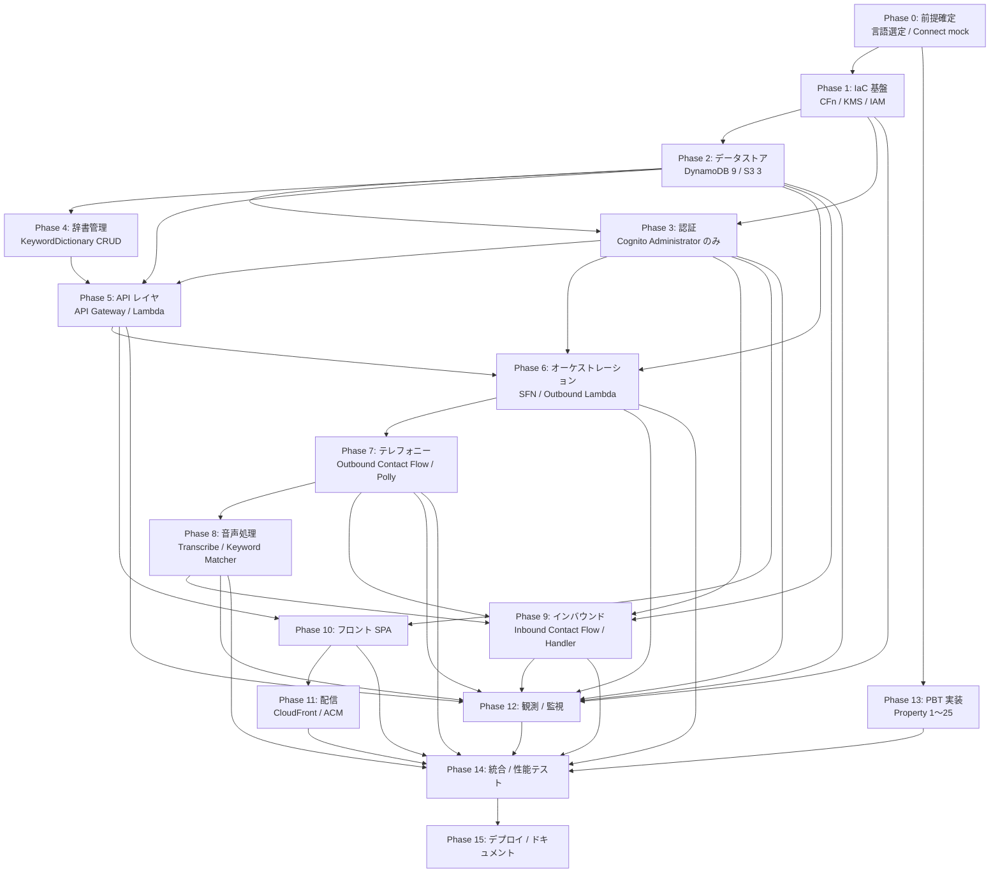

# Implementation Plan

## Overview

本ドキュメントは、`requirements.md`（2026-06-12 改訂版）と `design.md`（2026-06-12 改訂版）で確定したスコープを実装するためのタスク一覧である。Phase 0〜13 の依存順で実装を進めることを想定する。各タスクには `_Requirements_`（要件参照）、`_Design_`（設計参照）、`_Done When_`（観測可能な完了条件）を付与する。

スコープ外（マルチリージョン展開、SMS / Email / Push、メール起動、DTMF 応答、SSO、自動トリガー、高度監査ログ、一般社員ロール、端末登録、LLM 意図判定、声紋認証）に関するタスクは本計画に含めない。

## Task Dependency Graph



```json
{
  "waves": [
    { "wave": 1, "tasks": ["0.1", "0.2", "0.3"] },
    { "wave": 2, "tasks": ["1.1", "1.2", "1.3", "1.4", "1.5", "1.6"] },
    {
      "wave": 3,
      "tasks": [
        "2.1",
        "2.2",
        "2.3",
        "2.4",
        "2.5",
        "2.6",
        "2.7",
        "2.8",
        "2.9",
        "2.10",
        "2.11"
      ]
    },
    { "wave": 4, "tasks": ["3.1", "3.2", "3.3", "3.4", "3.5", "3.6"] },
    { "wave": 5, "tasks": ["4.1", "4.2", "4.3", "4.4"] },
    { "wave": 6, "tasks": ["5.1", "5.2", "5.3", "5.4", "5.5"] },
    {
      "wave": 7,
      "tasks": ["6.1", "6.2", "6.3", "6.4", "6.5", "6.6", "6.7", "6.8"]
    },
    { "wave": 8, "tasks": ["7.1", "7.2", "7.3", "7.4"] },
    { "wave": 9, "tasks": ["8.1", "8.2", "8.3", "8.4"] },
    { "wave": 10, "tasks": ["9.1", "9.2", "9.3", "9.4"] },
    {
      "wave": 11,
      "tasks": [
        "10.1",
        "10.2",
        "10.3",
        "10.4",
        "10.5",
        "10.6",
        "10.7",
        "10.8",
        "10.9",
        "10.10"
      ]
    },
    { "wave": 12, "tasks": ["11.1", "11.2", "11.3"] },
    {
      "wave": 13,
      "tasks": ["12.1", "12.2", "12.3", "12.4", "12.5", "12.6", "12.7"]
    },
    {
      "wave": 14,
      "tasks": [
        "13.1",
        "13.2",
        "13.3",
        "13.4",
        "13.5",
        "13.6",
        "13.7",
        "13.8",
        "13.9",
        "13.10",
        "13.11",
        "13.12",
        "13.13",
        "13.14",
        "13.15",
        "13.16",
        "13.17",
        "13.18",
        "13.19",
        "13.20",
        "13.21",
        "13.22",
        "13.23",
        "13.24",
        "13.25"
      ]
    },
    {
      "wave": 15,
      "tasks": [
        "14.1",
        "14.2",
        "14.3",
        "14.4",
        "14.5",
        "14.6",
        "14.7",
        "14.8",
        "14.9",
        "14.10",
        "14.11"
      ]
    },
    { "wave": 16, "tasks": ["15.1", "15.2", "15.3", "15.4", "15.5", "15.6"] }
  ]
}
```

上記 Mermaid グラフは Phase 単位の依存関係、JSON Wave は実行可能な並列度の単位を示す。両者は相補的に解釈される。

## Tasks

### Phase 0: 前提確定

- [x] 0.1 実装言語の選定とランタイム決定
  - Node.js 20.x（fast-check）または Python 3.12（Hypothesis）から選定する
  - 選定基準：チームの既存スタック、PBT ライブラリ親和性、AWS SDK バージョン、Connect Contact Flow Lambda の実績、Amazon Transcribe SDK の成熟度
  - 選定結果を `docs/decisions/0001-runtime-selection.md` として ADR 形式で記録する
  - _Requirements: NFR6_
  - _Design: Components and Interfaces / Lambda 関数一覧_
  - _Done When: ADR 文書が承認され、Lambda の Runtime 選定が確定している。Phase 1 以降のすべての Lambda タスクで採用言語が一意に参照可能になっている_

- [x] 0.2 リポジトリ構成と開発環境テンプレートの確定
  - design.md に従い `infrastructure/`、`backend/`、`frontend/`、`docs/` のディレクトリ構成を作成する
  - `.editorconfig`、`.gitignore`、`.gitattributes`、Lint / Formatter 設定（ESLint + Prettier または Ruff + Black）を配置する
  - CI 用の最小ワークフロー（push 時の lint + 型チェック）を作成する
  - _Requirements: NFR5_
  - _Design: CloudFormation テンプレート設計 / ファイル構成_
  - _Done When: リポジトリのクローンから 5 分以内に lint 実行が成功し、空コミットの CI が green になる_

- [ ] 0.3 Amazon Connect mock 試作
  - 開発アカウントに最小構成の Connect インスタンスを作成し、Outbound 用の Hello World Contact Flow と Inbound 用の Hello World Contact Flow を 1 つずつ手動構築する
  - Polly TTS と録音 S3 出力の動作確認、自席へ実発信して着信受信の挙動を確認する
  - 知見を `docs/decisions/0002-connect-mock-findings.md` に記録する
  - _Requirements: 5.1, 13.1_
  - _Design: Connect_Caller / Inbound_Handler_
  - _Done When: 開発者の自席電話に Outbound 発信が届き、自席から Inbound 着信できることを 1 度確認、知見ドキュメントが作成されている_
  - **※ ステータス：保留（Connect インスタンス購入の課金合意待ち。`docs/decisions/0002-handoff-notes-2026-06-19.md` 参照。本タスクが未完了でも Phase 1〜2 系列の実装は先行可能）**

### Phase 1: IaC 基盤

- [x] 1.1 CloudFormation テンプレート `infrastructure/template.yaml` のスケルトン作成
  - `AWSTemplateFormatVersion`、`Description`、空の `Parameters` `Mappings` `Conditions` `Resources` `Outputs` `Rules` セクションを定義する
  - `aws cloudformation validate-template` 通過を確認する
  - _Requirements: 17.1_
  - _Design: CloudFormation テンプレート設計 / スタック構成_
  - _Done When: 空テンプレートが `validate-template` を通過し、`cfn-lint` でエラー 0_

- [x] 1.2 Parameters セクションの実装
  - `EnvironmentName`、`ConnectInstanceId`、`ConnectInstanceArn`、`ConnectOutboundPhoneNumberArn`、`ConnectInboundPhoneNumberArn`、`OutboundContactFlowId`、`InboundContactFlowId`、`DefaultRetryCount`（0〜5、既定 3）、`DefaultRetryIntervalMinutes`（1〜60、既定 5）、`OutboundGuidanceText`、`InboundGuidanceText`、`LogRetentionDays`、`OperatorEmail`、`RecordingsRetentionDays`、`TranscriptsRetentionDays`、`InboundReceptionWindowDays`（1〜90、既定 30）、`DomainName`、`AcmCertificateArn`、`MaxConcurrentCalls`、`TranscribeLanguageCode` を定義する
  - _Requirements: 17.2, 17.3, 17.5, 13.5, 16.5, 9.6, 6.2_
  - _Design: CloudFormation テンプレート設計 / Parameters_
  - _Done When: 全 Parameters が定義され、AllowedValues / Min / Max が要件と一致。`validate-template` 通過_

- [x] 1.3 Mappings セクション（環境別差分）の実装
  - `EnvMap` を定義し dev/stg/prod の `LogLevel`、`DynamoBillingMode`、`ApiThrottleRate`、`ApiThrottleBurst` を設定する
  - _Requirements: 17.3_
  - _Design: CloudFormation テンプレート設計 / Mappings_
  - _Done When: 3 環境ぶんのマッピングが定義され、`!FindInMap` 経由で参照可能_

- [x] 1.4 Conditions の実装
  - `IsProd`、`HasCustomDomain`、`UseCustomCert` の Conditions を定義する
  - _Requirements: -（要件 17.6 はスコープ外、deploy script による region 固定は Phase 15 で実装）_
  - _Design: CloudFormation テンプレート設計 / Conditions_
  - _Done When: 3 個の Conditions が定義され、`validate-template` 通過、`cfn-lint` でリージョン関連エラー 0_

- [ ] 1.5 KMS CMK と Alias の実装
  - `KmsCmk`（Symmetric、ENCRYPT_DECRYPT、自動キーローテーション ON）を定義する
  - キーポリシー：(a) ルート全権、(b) Lambda / SFN 実行ロール / Transcribe サービスロールへ `Encrypt/Decrypt/GenerateDataKey/DescribeKey`、(c) `kms:ViaService` で dynamodb / s3 を制限付き許可、(d) 上記以外は Deny
  - `KmsCmkAlias` を `alias/${EnvironmentName}-safety-confirmation` で定義する
  - _Requirements: 6.4, 10.3, 15.1, NFR3_
  - _Design: KMS CMK 設計_
  - _Done When: スタックデプロイで CMK が作成され、Alias がコンソールで確認できる_

- [ ] 1.6 共通 IAM ロール雛形の整備
  - 全 Lambda 共通の信頼ポリシー（`lambda.amazonaws.com`）と CloudWatch Logs 書込権限の最小ポリシーを ManagedPolicy として定義する
  - 関数別ロールが継承する基底とする
  - _Requirements: 15.2, 16.1, NFR3_
  - _Design: ネットワーク・セキュリティ境界_
  - _Done When: 基底ロールが定義され、後段の Lambda タスクから AttachManagedPolicy で再利用可能_

### Phase 2: データストア

- [ ] 2.1 EmployeeTable（D1）の実装
  - PK `employeeId`（S）、GSI `PhoneNumberIndex`（PK `phoneNumber`、Inbound 一致判定用）
  - SSE-KMS で `KmsCmk` を指定、PITR ON、PAY_PER_REQUEST
  - _Requirements: D1, 13.2, 15.1_
  - _Design: Data Models / D1 Employee_Master_
  - _Done When: テーブルが作成され、SSE-KMS 有効、`PhoneNumberIndex` でクエリ可能_

- [ ] 2.2 CycleTable（D2）の実装
  - PK `cycleId`、GSI `StatusStartedAtIndex`（PK `status`、SK `startedAt`）、SSE-KMS、PAY_PER_REQUEST
  - 属性に `mode`（ALL/UNREACHABLE_ONLY）、`referencedCycleId`、`dictionaryVersion` を含む
  - _Requirements: D2, 4.4, 8.5_
  - _Design: Data Models / D2 Cycle_
  - _Done When: テーブル + GSI 作成完了。`status=RUNNING` Query で実行中サイクル抽出可能_

- [ ] 2.3 ResponseTable（D3）の実装
  - PK `cycleId`、SK `employeeId`、SSE-KMS、PAY_PER_REQUEST
  - 属性に `voiceStatus`、`transcriptExcerpt`、`matchedKeywords`、`dictionaryVersion` を含む
  - _Requirements: D3_
  - _Design: Data Models / D3 Response_
  - _Done When: PK 単独 Query で 1 サイクル分の Response 一括取得が可能_

- [ ] 2.4 RecordingMetaTable（D4）の実装
  - PK `cycleId` または `INBOUND#{contactId}`、SK `employeeIdSeq`、SSE-KMS
  - _Requirements: D4, 10.5_
  - _Design: Data Models / D4 Recording_Metadata_
  - _Done When: アウトバウンド・インバウンド両方のキー命名でレコード書込み可能_

- [ ] 2.5 TranscriptMetaTable（D6 メタ部）の実装
  - PK `cycleId` または `INBOUND#{contactId}`、SK `employeeIdSeq`、SSE-KMS
  - 属性に `transcribeJobId`、`transcriptS3Key`、`transcriptExcerpt`、`confidence` を含む
  - _Requirements: D6, 6.3_
  - _Design: Data Models / D6 TranscriptMetadata_
  - _Done When: テーブルが作成され、Transcribe ジョブ ID と S3 キーが保存可能_

- [ ] 2.6 KeywordDictionaryTable（D7）の実装
  - PK `category`（SAFE/INJURED/UNAVAILABLE/META）、SK `keyword`
  - META レコードに `currentVersion`、ConditionExpression による原子的バージョンインクリメント
  - SSE-KMS
  - _Requirements: D7, 8.2, 8.3_
  - _Design: Data Models / D7 KeywordDictionary_
  - _Done When: テーブル作成、META レコードでバージョン管理が動作_

- [ ] 2.7 KeywordDictionaryHistoryTable（D7 履歴）の実装
  - PK `version`（N）、SK `categoryKeyword`、SSE-KMS
  - 辞書 CRUD 時の全件スナップショット保管用
  - _Requirements: D7, 8.5, 19_
  - _Design: Data Models / KeywordDictionaryHistory テーブル_
  - _Done When: スナップショット書込みが動作し、`version` で過去バージョン全体を取得可能_

- [ ] 2.8 InboundContactTable（D8）の実装
  - PK `contactId`（UUID）、GSI `EmployeeReceivedAtIndex`（PK `employeeId`、SK `receivedAt`）、SSE-KMS
  - 属性に `callerNumber`（KMS 暗号化）、`callerNumberMasked`、`flow`、`voiceStatus` を含む
  - _Requirements: D8, 13.7_
  - _Design: Data Models / D8 Inbound_Contact_
  - _Done When: テーブル作成、社員別の着信履歴が GSI で取得可能_

- [ ] 2.9 LockoutTable（認証失敗履歴）の実装
  - PK `userIdentifier`、TTL 属性 `expireAt`（Unix秒）を有効化、SSE-KMS
  - _Requirements: 1.6_
  - _Design: Auth_Service / Lambda Triggers_
  - _Done When: TTL が有効化され、テスト書込から指定時間後に削除される_

- [ ] 2.10 RecordingsBucket（D5）の実装
  - バケット名 `safety-confirmation-recordings-${EnvironmentName}-${AWS::AccountId}-${AWS::Region}`
  - SSE-KMS、`PublicAccessBlockConfiguration` 全 true、Versioning OFF、ライフサイクル 90 日
  - EventBridge Notification を有効化
  - _Requirements: 10.2〜10.4, 10.6_
  - _Design: Data Models / D5 Recording_File_
  - _Done When: バケット作成、暗号化 SSE-KMS、BPA 全 true、ライフサイクル 90 日が確認できる_

- [ ] 2.11 TranscriptsBucket（D6 本体）と SpaBucket の実装
  - TranscriptsBucket：バケット名 `safety-confirmation-transcripts-${env}-${account}-${region}`、SSE-KMS、ライフサイクル 90 日、EventBridge Notification 有効
  - SpaBucket：バケット名 `safety-confirmation-spa-${env}-${account}-${region}`、SSE-S3、Versioning ON、OAC 経由 CloudFront のみ
  - 両バケットのバケットポリシーで Lambda Role 以外を Deny（Recordings と同様）
  - _Requirements: 6.4, 6.5, NFR3_
  - _Design: Data Models / D6 Transcript / SPA 配信用 S3 / バケットポリシー_
  - _Done When: 両バケットが作成され、認可外プリンシパルからの GetObject が AccessDenied になる_

### Phase 3: 認証

- [ ] 3.1 CognitoUserPool の実装
  - User Pool 名 `safety-confirmation-${EnvironmentName}`、サインイン属性 `email`、自己サインアップ無効
  - パスワードポリシー：最小 12 文字、大小英数字記号必須
  - 属性 `email`、`name` を必須に
  - トークン有効期限：ID 1h / Access 1h / Refresh 30 日
  - MFA OFF（初期構築）
  - _Requirements: 1.1, 1.2_
  - _Design: Cognito ユーザープール設計_
  - _Done When: User Pool が作成され、属性 / パスワードポリシー / トークン有効期限が設計通り_

- [ ] 3.2 CognitoUserPoolClient（App Client）の実装
  - SPA 用クライアント 1 個、`USER_SRP_AUTH` 有効、Client Secret 無し
  - `IdTokenValidity=1h, AccessTokenValidity=1h, RefreshTokenValidity=30d`
  - _Requirements: 1.2_
  - _Design: Cognito ユーザープール設計 / App Client_
  - _Done When: App Client ID が Outputs に出力され、SPA から SRP_AUTH で認証可能_

- [ ] 3.3 Cognito UserPoolGroup `Administrator` の実装（Employee グループは作成しない）
  - `Administrator` グループのみを作成、説明と Precedence を設定
  - 一般社員ロールは本システムでは存在しないため、`Employee` グループは作成しない（Requirement 1.9）
  - _Requirements: 1.3, 1.9_
  - _Design: Cognito ユーザープール設計 / グループ_
  - _Done When: `Administrator` のみが作成されており、Employee グループが存在しないことを `aws cognito-idp list-groups` で確認_

- [ ] 3.4 AuthPreAuthFn Lambda（PreAuthentication Trigger）の実装
  - LockoutTable を参照し、過去 30 分以内に 5 回以上失敗があれば認証拒否
  - 失敗時は LockoutTable に失敗時刻を追記し、`expireAt = now + 30min` で TTL 設定
  - タイムアウト 5 秒、メモリ 512MB、ARM64
  - _Requirements: 1.6, Property 8_
  - _Design: Auth_Service / Lambda Triggers / Property 8_
  - _Done When: 5 回連続失敗で 6 回目がブロックされ、30 分後に再試行可能になる_

- [ ] 3.5 AuthPostAuthFn Lambda（PostAuthentication Trigger）の実装
  - 認証イベント（プリンシパル ID、送信元 IP、タイムスタンプ）を AuditLogGroup に書込
  - LockoutTable の失敗履歴を成功時にクリア
  - _Requirements: 1.5, 1.8, 16.3, Property 21_
  - _Design: Auth_Service / Property 21_
  - _Done When: ログイン成功 / 失敗の両方が AuditLogGroup に記録される_

- [ ] 3.6 Cognito Trigger の関連付け
  - User Pool に PreAuth / PostAuth Trigger Lambda を関連付ける
  - PreSignUp Trigger は管理者作成のみ許可する関数として最小実装する
  - _Requirements: 1.6, 1.9_
  - _Design: Auth_Service / Lambda Triggers_
  - _Done When: コンソールで Lambda Trigger が User Pool に表示され、認証フローで起動が CloudWatch Logs に記録される_

### Phase 4: 辞書管理

- [ ] 4.1 DictionaryApi Lambda の実装
  - `GET /keyword-dictionary`、`POST /keyword-dictionary`、`DELETE /keyword-dictionary/{category}/{keyword}`、`PATCH /keyword-dictionary/{category}/{keyword}`、`GET /keyword-dictionary/version` をルーティング
  - キーワード追加・更新・削除時に `KeywordDictionaryHistoryTable` にスナップショットを書込
  - META レコードの `currentVersion` を `ConditionExpression` で原子的にインクリメント
  - 監査ログを AuditLogGroup に出力
  - _Requirements: 8.1〜8.7_
  - _Design: Dictionary_Manager / インタフェース_
  - _Done When: 辞書 CRUD が API テストで成功、CRUD 後にバージョンがインクリメントされ履歴テーブルに反映_

- [ ] 4.2 辞書スナップショット参照ヘルパの実装
  - `getDictionarySnapshot(version)` 関数：KeywordDictionaryHistoryTable から指定バージョンの全キーワードを返す純関数寄りの実装
  - Cycle 起動時 / KeywordMatcher から呼出
  - _Requirements: 8.5, Property 19_
  - _Design: Keyword_Matcher / マッチング判定の擬似コード_
  - _Done When: 任意のバージョン番号で辞書全体を再現でき、PBT P19 が green_

- [ ] 4.3 楽観ロック整合性ハンドリングの実装
  - 辞書 CRUD 時、META レコードの `currentVersion` 条件付き更新が失敗（並行更新）した場合は 409 Conflict を返す
  - クライアントは最新バージョンを再取得して再試行する
  - _Requirements: 8.3, 8.4_
  - _Design: Error Handling / 辞書 CRUD 楽観ロック失敗_
  - _Done When: 並行更新シミュレーションで 1 件のみ成功、他は 409 となる_

- [ ] 4.4 辞書空チェックの実装
  - Cycle 起動時に有効なキーワードが 1 件以上存在するか確認、なければ起動拒否（CycleApi 側で実装）
  - _Requirements: 8.6_
  - _Design: Cycle_Manager_
  - _Done When: 辞書未設定状態で Cycle 起動を試みると 400 が返り、Cycle レコードが作成されない_

### Phase 5: API レイヤ

- [ ] 5.1 RestApi（API Gateway）と CognitoAuthorizer の実装
  - REST API、エンドポイント REGIONAL、Cognito User Pool Authorizer を定義
  - スロットリング `${ApiThrottleRate} req/sec, ${ApiThrottleBurst} burst`
  - アクセスログ + 実行ログ INFO を有効化
  - _Requirements: 1.1, 11.1, NFR3_
  - _Design: API Gateway 設計_
  - _Done When: 全エンドポイントが Authorizer を要求し、トークン無しで 401 が返る_

- [ ] 5.2 EmployeeApi Lambda の実装（社員 CRUD ＋ CSV インポート）
  - `POST /employees`、`GET /employees`、`GET/PUT/DELETE /employees/{id}`、`POST /employees/import` をルーティング
  - 入力バリデーション（氏名・E.164 電話番号のみ）
  - 「Cognito 先 → DynamoDB 後」順序で書込（Administrator 作成時のみ Cognito 連動）
  - 重複電話番号検知（論理削除済を含む）で 409 返却
  - CSV インポートは UTF-8 / 300 行以下 / 1 MiB 以下を検証、`TransactWriteItems` で 25 件分割の All-or-Nothing
  - 削除時は論理削除フラグ + 電話番号 NULL 化を 5 秒以内に実施
  - 監査ログ（追加 / 更新 / 削除）を AuditLogGroup に出力、電話番号は maskPhone
  - _Requirements: 2.1〜2.7, 3.1〜3.7, 15.3, 15.5_
  - _Design: Lambda 関数一覧 / EmployeeApi_
  - _Done When: API テストで CRUD 全件成功、不正 E.164 が 400、重複電話番号が 409_

- [ ] 5.3 CycleApi Lambda の実装
  - `POST /cycles`、`GET /cycles`、`GET /cycles/{id}`、`GET /cycles/{id}/status` をルーティング
  - `Idempotency-Key` ヘッダで重複起動抑止
  - 既存 RUNNING サイクル存在チェック
  - mode=`ALL` / `UNREACHABLE_ONLY` の入力バリデーション、`UNREACHABLE_ONLY` 時は直近完了 Cycle の Voice_Status `UNREACHABLE`/`OTHER` を抽出
  - Retry_Count [0,5] / Retry_Interval [1,60] の検証
  - 起動時の辞書バージョンを Cycle に書込
  - Cycle レコードを RUNNING で作成 → Step Functions `StartExecution`、失敗時は `START_FAILED`
  - GET `/status` で `summary` / `items` / `degraded` を返却
  - _Requirements: 4.1〜4.11, 8.5, 11.1〜11.6_
  - _Design: Cycle_Manager / インタフェース_
  - _Done When: mode=ALL / UNREACHABLE_ONLY 両方で起動成功、対象者が要件通りに抽出される_

- [ ] 5.4 ResponseApi Lambda の実装
  - 過去 Cycle 一覧、Cycle 詳細 / Response 一覧（ページング 50 件、降順）
  - Transcript 抜粋を含めて返却
  - Cognito ロール照合：Administrator のみ
  - _Requirements: 12.1, Property 1_
  - _Design: Lambda 関数一覧 / ResponseApi_
  - _Done When: 管理者で Cycle 一覧と詳細が降順 50 件で取得できる_

- [ ] 5.5 RecordingApi Lambda の実装
  - `GET /cycles/{id}/recordings/{employeeId}/{seq}`、`GET /cycles/{id}/transcripts/{employeeId}/{seq}`、`GET /inbound/{contactId}/recording`、`GET /inbound/{contactId}/transcript` を実装
  - 90 日経過判定（`now - cycle.startedAt > 90日` または `now - inbound.receivedAt > 90日` で 410 Gone）
  - 署名付き URL の有効期限 15 分
  - 管理者ロールのみ許可
  - _Requirements: 10.7, 12.2, 12.3, 13.7, Property 23_
  - _Design: Recording_Store / インタフェース / Property 23_
  - _Done When: 90 日内は 200 + 署名付き URL、90 日超過は 410、未認可は 403_

### Phase 6: オーケストレーション

- [ ] 6.1 LoadTargets Lambda の実装
  - 入力 `{cycleId, mode, referencedCycleId}` を受け取る
  - mode=`ALL`：論理削除されておらず電話番号が NULL でない全社員を抽出
  - mode=`UNREACHABLE_ONLY`：referencedCycleId の Response から voiceStatus が `UNREACHABLE` または `OTHER` の社員のみ抽出
  - 0 名の場合は SFN を異常分岐させるエラーを返す
  - _Requirements: 4.3, 4.4, 4.5, 13.5, Property 2_
  - _Design: Lambda 関数一覧 / LoadTargets_
  - _Done When: 両モードで対象抽出が動作し、論理削除済を含まない_

- [ ] 6.2 ConnectDispatcher Lambda の実装
  - 入力 `{cycleId, employeeId, phoneNumber, attempt, taskToken}`
  - Connect の `StartOutboundVoiceContact` を呼び、Outbound Contact Flow に Attribute を渡す
  - `ThrottlingException` / `LimitExceededException` を指数バックオフ + ジッタで最大 3 回再試行
  - 最終失敗で `callResultCode=ERROR` を Response に書込、SFN へ `SendTaskSuccess` で `{retry: true}` 相当を返す
  - _Requirements: 5.1, 5.2, 9.6_
  - _Design: Connect_Caller / ConnectDispatcher_
  - _Done When: 発信成功で ContactID が記録され、API エラーで 3 回再試行後に ERROR コードが書込まれる_

- [ ] 6.3 CallEndHandler Lambda の実装
  - 入力（Outbound Contact Flow より）：`{contactId, cycleId, employeeId, attempt, callResultCode, taskToken}`
  - Response テーブルへ通話結果コードと累積発信回数を `ConditionExpression` 付きで書込（二重書込防止）
  - SFN `SendTaskSuccess` で TaskToken を返す
  - _Requirements: 5.4, 5.5_
  - _Design: Connect_Caller / CallEndHandler、Idempotency_
  - _Done When: 通話終了で Response に `RECORDED` または該当コードが書込まれ、TaskToken が返却される_

- [ ] 6.4 TranscribeStarter Lambda の実装
  - S3 Recordings の `ObjectCreated` EventBridge イベントから起動
  - Transcribe ジョブを `language-code=ja-JP`、`media-format=wav`、`output-bucket=<TranscriptsBucket>`、`output-key=transcripts/{cycleId}/{employeeId}/{seq}.json`（インバウンドは `inbound/{yyyymm}/{employeeId}/{contactId}.json`）で起動
  - 失敗時は最大 3 回再試行、最終失敗で `callResultCode=TRANSCRIBE_FAILED` を Response に書込
  - _Requirements: 6.1, 6.2, 6.6, Property 24_
  - _Design: Voice_Transcriber / 構成_
  - _Done When: 録音アップロード後 30 秒以内に Transcribe ジョブが起動し、ジョブ ID が TranscriptMetaTable に記録される_

- [ ] 6.5 RetryEvaluator Lambda の実装
  - 入力：Response の最新 voiceStatus / callResultCode、累積発信回数、Retry_Count、Retry_Interval
  - 出力：`{retry: bool, retryWaitSeconds: number, finalStatus: string}`
  - Property 12（shouldRetry）と Property 13（computeNextDispatchAt）を実装
  - voiceStatus ∈ {SAFE, INJURED, UNAVAILABLE} で `retry=false`、それ以外かつ累積回数 < Retry_Count で `retry=true`、上限到達で `finalStatus=UNREACHABLE`
  - _Requirements: 9.1, 9.3, 9.4, 9.5, Property 12, Property 13_
  - _Design: Lambda 関数一覧 / RetryEvaluator_
  - _Done When: PBT P12 / P13 が green、再発信判定が voiceStatus 全パターンで正しい_

- [ ] 6.6 CycleFinalizer Lambda の実装
  - 入力：SFN（Map 完了時）または EventBridge（30/60 分ルール）
  - Map 完了時：全 Response が確定済か検証し、Cycle ステータスを `COMPLETED` に更新
  - 60 分経過時：SFN `StopExecution` 発行 → 未確定 Response を `UNREACHABLE` に強制更新 → Cycle を `TIMEOUT` → SNS 通知
  - 30 分経過時：初回発信完了未達なら `slaWarning30min=true` + CloudWatch メトリクス + SNS 通知
  - EventBridge ルール `cycle-30min-{cycleId}` / `cycle-60min-{cycleId}` を Cycle 完了時に削除
  - _Requirements: 11.4, 14.4, 14.5, 14.6, Property 17_
  - _Design: Cycle_Manager / 構成 / Property 17_
  - _Done When: 60 分超過で SFN 停止 + UNREACHABLE 確定 + SNS 通知が動作、30 分超過で警告フラグが立つ_

- [ ] 6.7 RecordingMetadataWriter Lambda の実装
  - S3 Recordings PutObject イベント（EventBridge）から起動
  - RecordingMetaTable に S3 オブジェクトキー / Cycle ID（または `INBOUND#{contactId}`）/ 社員 ID / 録音時刻 / 通話時間を書込
  - 最大 3 回再試行、最終失敗で SQS DLQ 送付
  - _Requirements: 10.5, 10.8, 10.9, Property 24_
  - _Design: Recording_Store / 構成_
  - _Done When: 録音アップロードから 10 秒以内に RecordingMetaTable に書込まれ、3 回失敗で DLQ にメッセージが送られる_

- [ ] 6.8 Step Functions ステートマシンの実装
  - Standard ワークフロー、状態：`LoadTargets → StartTimers → CallMap → Aggregate → Finalize`
  - `CallMap` は Map ステート、`MaxConcurrency=${MaxConcurrentCalls}`（既定 10）
  - 各 Map イテレーション：`InitAttempt → Dispatch（waitForTaskToken, timeout 90s）→ WaitForTranscribe（最大 60 秒）→ EvaluateRetry → (WaitInterval → Dispatch | FinalizeOne)`
  - Logging Level=ALL、IncludeExecutionData=true
  - `Catch` ブロックで Dispatch / Transcribe 失敗時に該当コードを書込し次状態へ
  - _Requirements: 4.1, 5.1, 9.1〜9.6, 14.1〜14.3, 16.2_
  - _Design: Cycle_Manager / Step Functions ステートマシン構造_
  - _Done When: 1 サイクル分の SFN 実行が成功し、Map 並列度が 10 を超えないことを CloudWatch メトリクスで確認_

### Phase 7: テレフォニー（アウトバウンド）

- [ ] 7.1 Outbound Contact Flow `SafetyConfirmationOutboundFlow-${env}` の作成
  - Outbound 用、Voice 設定（Polly `ja-JP` Mizuki / Takumi）
  - Polly TTS で `OutboundGuidanceText` Parameter の本文を再生
  - Set Recording Behavior: ON で通話全体を録音
  - 短い無音検知または最大録音時間で Disconnect
  - 終了時に CallEndHandler Lambda を Invoke
  - JSON ファイル `infrastructure/contact-flows/outbound.json` として版管理
  - _Requirements: 5.1〜5.4, 5.6, 10.1, 10.2_
  - _Design: Connect_Caller / Outbound Contact Flow 設計_
  - _Done When: テスト発信で TTS ガイダンスが流れ、応答音声が録音され、CallEndHandler が呼ばれる_

- [ ] 7.2 Connect 録音設定の有効化
  - 該当 Contact Flow に「Set recording and analytics behavior」ブロックを配置、録音 ON
  - 録音先 S3 バケットを `RecordingsBucket` に設定
  - S3 オブジェクトキーを `recordings/{cycleId}/{employeeId}/{seq}.wav` 命名にマッピング（Connect 標準命名と異なる場合は CallEndHandler または別 Lambda で Rename + 元削除）
  - _Requirements: 10.1, 10.2, D5_
  - _Design: Recording_Store / S3 オブジェクトキー命名_
  - _Done When: テスト通話の録音ファイルが指定命名で S3 に保存される_

- [ ] 7.3 ConnectDispatcher と Outbound Contact Flow の結合
  - Contact Flow Attribute（cycleId / employeeId / attempt / taskToken）が ConnectDispatcher の `StartOutboundVoiceContact` 呼出時に正しく渡されることを確認
  - CallEndHandler が Contact Flow 終端から Lambda Invoke ブロックで呼ばれることを確認
  - _Requirements: 5.1〜5.4_
  - _Design: Connect_Caller / インタフェース_
  - _Done When: テスト発信で Contact Flow ログに Attribute 値が記録され、CallEndHandler 呼出が CloudWatch Logs に現れる_

- [ ] 7.4 通話結果コード分類ロジックの実装（classifyCallResult）
  - Connect の `DisconnectReason` と Transcribe ジョブ状態から `RECORDED` / `NO_ANSWER` / `BUSY` / `VOICEMAIL` / `ERROR` / `TRANSCRIBE_FAILED` を判定する純関数
  - CallEndHandler および TranscribeStarter で呼出
  - _Requirements: 5.5, 6.6, Property 14_
  - _Design: Connect_Caller / 通話結果コード、Property 14_
  - _Done When: PBT P14 が green、各コードが Disconnect Reason から正しく分類される_

### Phase 8: 音声処理（Transcribe + Keyword Matcher）

- [ ] 8.1 KeywordMatcher Lambda の実装
  - S3 Transcripts の `ObjectCreated` EventBridge イベントから起動
  - Transcript JSON からテキスト本文と平均信頼度を抽出
  - Cycle.dictionaryVersion を取得し、`getDictionarySnapshot(version)` で当該バージョンのキーワード集合を取得
  - 部分文字列一致で `INJURED > UNAVAILABLE > SAFE > OTHER` の優先順位でマッチング
  - Response テーブルに `voiceStatus` / `matchedKeywords` / `transcriptExcerpt`（先頭 100 文字）/ `dictionaryVersion` を書込
  - TranscriptMetaTable に Transcript メタを書込
  - _Requirements: 7.1〜7.8, Property 10_
  - _Design: Keyword_Matcher / 構成_
  - _Done When: PBT P10 が green、テスト Transcript で 4 区分の判定が正しい_

- [ ] 8.2 Transcribe ジョブ完了 → KeywordMatcher 連動の確認
  - Transcribe ジョブの完了通知が S3 Transcripts への JSON 配置で行われることを確認
  - S3 Transcripts の EventBridge 通知が KeywordMatcher を起動することを確認
  - 失敗時のリトライと CloudWatch アラーム連動を確認
  - _Requirements: 6.3, 6.6_
  - _Design: Voice_Transcriber / Keyword_Matcher 連携_
  - _Done When: 録音 → Transcribe → KeywordMatcher → Response 更新の経路が dev 環境で End-to-End に動作_

- [ ] 8.3 Transcript の S3 保管とライフサイクル設定
  - TranscriptsBucket のライフサイクルポリシー（90 日後自動削除）を設定
  - Transcript の SSE-KMS 暗号化を確認
  - _Requirements: 6.4, 6.5_
  - _Design: Recording_Store / S3 オブジェクトキー命名_
  - _Done When: テスト Transcript が SSE-KMS で暗号化保存され、LCM が確認できる_

- [ ] 8.4 KeywordMatcher 失敗時のフォールバック挙動の実装
  - Lambda 内で最大 3 回再試行
  - 最終失敗で Response の `voiceStatus` を `OTHER` に確定し、CloudWatch Logs に記録
  - `OTHER` 確定で再発信判定（Phase 6.5）に委ねる
  - _Requirements: 9.4_
  - _Design: Error Handling / KeywordMatcher 失敗_
  - _Done When: 失敗注入テストで OTHER 確定動作と再発信トリガが動作_

### Phase 9: インバウンド（折り返し電話）

- [ ] 9.1 Inbound Contact Flow `SafetyConfirmationInboundFlow-${env}` の作成
  - 着信用、Polly `ja-JP` Voice 設定
  - 着信直後に InboundHandler Lambda（step=identify）を Invoke
  - 戻り値の `flow` Attribute（`ACTIVE_CYCLE` / `NO_CYCLE` / `NOT_REGISTERED` / `CYCLE_TERMINATED`）に応じてフロー分岐
  - `ACTIVE_CYCLE` の場合：TTS ガイダンス（`InboundGuidanceText`）→ 録音 → Disconnect → InboundHandler（step=finalize）Invoke
  - `NO_CYCLE` / `NOT_REGISTERED` / `CYCLE_TERMINATED` の場合：該当ガイダンス再生 → 切断
  - JSON ファイル `infrastructure/contact-flows/inbound.json` として版管理
  - _Requirements: 13.1〜13.8, Property 11_
  - _Design: Inbound_Handler / Inbound Contact Flow 設計_
  - _Done When: 4 種類の flow 分岐が正しく動作することを実機テストで確認_

- [ ] 9.2 InboundHandler Lambda の実装
  - step=identify：Caller ID を E.164 で取得し、Employee_Master の `PhoneNumberIndex` GSI で完全一致検索
  - 一致なし → `flow=NOT_REGISTERED`、Inbound_Contact レコード仮書込
  - 一致あり → 直近対象 Cycle 検索（Phase 9.3 のロジックを使用）→ `flow` を返す
  - step=finalize：S3 録音 → TranscribeStarter → KeywordMatcher 結果が確定したら、ACTIVE_CYCLE であれば該当 Cycle の Response を更新（callAttempts 据え置き、callResultCodes に `INBOUND` 追記）
  - Inbound_Contact レコードを最終確定（voiceStatus、Transcript 参照、録音参照含む）
  - _Requirements: 13.2〜13.8_
  - _Design: Inbound_Handler / 構成_
  - _Done When: 4 シナリオ（ACTIVE_CYCLE / NO_CYCLE / NOT_REGISTERED / CYCLE_TERMINATED）が動作確認できる_

- [ ] 9.3 Cycle 選定ロジックの実装（identify ステップの内部関数）
  - Cycle テーブル GSI `StatusStartedAtIndex` で `status=RUNNING` を Query → 最新 1 件
  - なければ `status=COMPLETED` を Query し `completedAt + 30日 ≥ now` のうち最新 1 件
  - なければ `flow=NO_CYCLE`
  - 採用 Cycle が `TIMEOUT` または `START_FAILED` なら `flow=CYCLE_TERMINATED`
  - 純関数として切り出し、PBT P11 の対象とする
  - _Requirements: 13.5, 13.6, 13.8, Property 11_
  - _Design: Inbound_Handler / Cycle 選定ロジック_
  - _Done When: PBT P11 が green、各分岐パターンが網羅的にテストできる_

- [ ] 9.4 Inbound Contact Flow の Connect インスタンスへの登録
  - Connect コンソールまたは CLI で Inbound 用電話番号を本 Contact Flow に紐付け
  - CFn は Parameters で番号 ARN と Contact Flow ID を受領するのみ（CFn 管理外）
  - _Requirements: 13.1, 17.5_
  - _Design: CloudFormation テンプレート設計 / Parameters_
  - _Done When: 実機の Inbound 番号への発信が Inbound Contact Flow を経由する_

### Phase 10: フロント SPA

- [ ] 10.1 SPA プロジェクトの初期化
  - React + TypeScript + Vite（または同等）でプロジェクト作成
  - `frontend/` 以下に配置、ESLint / Prettier / TypeScript strict
  - 環境変数で API ベース URL / Cognito User Pool ID / Client ID を受け取る
  - _Requirements: NFR3_
  - _Design: Status_Viewer / 構成_
  - _Done When: `npm run build` で SPA が静的アセットとして出力される_

- [ ] 10.2 Cognito 認証フロー（SRP）の実装
  - amazon-cognito-identity-js または Amplify Auth で SRP_AUTH 認証
  - ID トークンを Authorization ヘッダに付与する HTTP インターセプタ
  - リフレッシュトークンによる自動更新、期限切れ時は再ログインへ誘導
  - 一般社員向け画面の導線は実装しない
  - _Requirements: 1.1, 1.2, 1.9_
  - _Design: Auth_Service / 認証エンドポイント_
  - _Done When: ログイン → API 呼出 → トークン期限切れ → 自動リフレッシュが動作_

- [ ] 10.3 管理者ロール限定のルーティング
  - JWT 内 `cognito:groups` に `Administrator` を含む場合のみ管理画面、含まない場合は 403 表示
  - _Requirements: 1.3, 1.4, 1.9, Property 1_
  - _Design: Auth_Service / ロール判定_
  - _Done When: Administrator グループ所属ユーザーのみ画面が表示される_

- [ ] 10.4 管理者画面：社員マスタ管理 UI
  - 社員一覧 / 追加 / 編集 / 削除フォーム、CSV インポート画面
  - 入力項目は **氏名と電話番号のみ**（Requirement 2.1）
  - E.164 入力バリデーション（クライアント側）
  - 削除時の確認ダイアログ
  - _Requirements: 2.1〜2.7, 3.1〜3.7_
  - _Design: API 一覧 / `/employees`_
  - _Done When: 全 CRUD が UI から動作、CSV インポート結果が画面表示される_

- [ ] 10.5 管理者画面：サイクル起動 UI（チェックボックス対応）
  - 画面の左側に **「全員」チェックボックス** を 1 個配置（Requirement 4.2）
  - チェック有 → mode=`ALL`、チェック無 → mode=`UNREACHABLE_ONLY`
  - Retry_Count（0〜5）、Retry_Interval（1〜60）の入力フォーム
  - `Idempotency-Key`（UUID）の自動付与
  - 起動結果と Cycle ID の表示
  - _Requirements: 4.1〜4.4, 4.6, 4.7_
  - _Design: API 一覧 / `POST /cycles`_
  - _Done When: チェックボックスの ON/OFF で mode が切り替わり、起動成功で Cycle ID が表示される_

- [ ] 10.6 管理者画面：ステータス見える化（ポーリング）
  - 10 秒間隔（±1 秒）の `setInterval` ポーリング、`AbortController` で重複呼出抑止
  - `summary`（targetTotal / dispatched / responded / unreachable / byStatus）と個別社員一覧を表示
  - 個別行に Voice_Status と Transcript 抜粋を表示
  - Cycle が COMPLETED / TIMEOUT になったらポーリング停止
  - 取得失敗時はエラーバナー + 直前値保持
  - 縮退情報を警告バナー表示
  - _Requirements: 11.1〜11.6, 18.4, Property 18, Property 25_
  - _Design: Status_Viewer / 構成、Property 18 / 25_
  - _Done When: 進行中サイクルで 10 秒毎に画面が更新され、完了時に停止、API 失敗時にエラーバナー表示_

- [ ] 10.7 管理者画面：履歴閲覧と録音 / Transcript 再生
  - 過去 Cycle 一覧（Cycle 起動時刻降順、50 件ページング）
  - Cycle 詳細で社員別 Response 一覧と Transcript 抜粋
  - 90 日内録音は再生ボタン → RecordingApi で署名付き URL 取得 → ブラウザで再生
  - 90 日内 Transcript は全文表示画面へリンク
  - 90 日超過は再生ボタンを無効化 / メッセージ表示
  - _Requirements: 12.1〜12.3_
  - _Design: API 一覧 / `/cycles` `/recordings` `/transcripts`_
  - _Done When: 50 件ページングで降順表示、再生・全文表示が機能、90 日超過は無効化される_

- [ ] 10.8 管理者画面：インバウンド着信履歴
  - `/inbound` GET で着信一覧取得（着信時刻降順、50 件ページング）
  - 各行に発信者番号（マスキング済）、Cycle ID、社員名、flow、Voice_Status、Transcript 抜粋を表示
  - 録音 / Transcript 再生リンク（90 日以内のみ）
  - _Requirements: 13.7_
  - _Design: API 一覧 / `/inbound`_
  - _Done When: 着信履歴が降順 50 件で表示され、各行から録音 / Transcript にアクセスできる_

- [ ] 10.9 管理者画面：キーワード辞書管理 UI
  - 3 カテゴリ（SAFE / INJURED / UNAVAILABLE）ごとにキーワード一覧表示
  - 追加 / 編集 / 削除（無効化）フォーム
  - 現在の辞書バージョンを画面表示
  - 並行更新エラー（409）時は最新を取得して再試行する旨をメッセージ表示
  - _Requirements: 8.1〜8.4, 8.7_
  - _Design: Dictionary_Manager / インタフェース_
  - _Done When: 辞書 CRUD が UI から動作、バージョン番号が更新ごとに増える_

- [ ] 10.10 一般社員向け画面の非提供確認
  - 旧仕様の `/me` 系画面が SPA に含まれていないことを確認
  - ルーティング・ナビゲーションに一般社員向け導線が存在しないことを確認
  - _Requirements: 1.9, Out of Scope #8_
  - _Design: スコープ外_
  - _Done When: コードベースに `/me` 関連の React コンポーネント / ルートが存在しない_

### Phase 11: 配信

- [ ] 11.1 ACM 証明書の準備（CloudFront 用）
  - `DomainName` Parameter が指定された場合、us-east-1 リージョンの ACM 証明書 ARN を `AcmCertificateArn` Parameter で受領
  - 検証は本タスク外（事前準備）
  - _Requirements: NFR3_
  - _Design: Architecture / Edge_
  - _Done When: ACM 証明書 ARN が Parameter で受領可能で、CloudFront から参照される_

- [ ] 11.2 CloudFrontDistribution の実装
  - Origin：`SpaBucket`（OAC 経由）
  - 既定動作：S3 Origin、HTTPS リダイレクト、Min TLSv1.2_2021、SPA 用にエラー応答 403/404 を `index.html` 200 へリダイレクト
  - `HasCustomDomain` / `UseCustomCert` 条件で Aliases / ACM を関連付け
  - _Requirements: 1.1, NFR3_
  - _Design: Architecture / Edge / リソース_
  - _Done When: CloudFront ディストリビューションがデプロイされ、SPA が配信される_

- [ ] 11.3 Route 53 ホストゾーンへの ALIAS レコード設定（オプション）
  - `HasCustomDomain=true` の場合、CloudFront ディストリビューション宛の ALIAS レコードを設定
  - _Requirements: NFR6（Route 53 利用）_
  - _Design: Architecture / Edge_
  - _Done When: カスタムドメインへの DNS クエリで CloudFront に解決される_

### Phase 12: 観測 / 監視

- [ ] 12.1 Lambda 関数別 LogGroup の実装
  - 全 16 個の Lambda に対し `/aws/lambda/${functionName}-${env}` を CFn で明示作成、`RetentionInDays=${LogRetentionDays}`
  - _Requirements: 16.1, 16.5_
  - _Design: CloudWatch Logs_
  - _Done When: 16 個のロググループが作成され、保持期間が Parameter 値と一致_

- [ ] 12.2 Step Functions LogGroup の実装
  - `/aws/states/${stateMachineName}-${env}`、`Logging Level=ALL`、`IncludeExecutionData=true`
  - _Requirements: 16.2_
  - _Design: CloudWatch Logs_
  - _Done When: SFN 実行履歴が CloudWatch Logs に記録される_

- [ ] 12.3 AuditLogGroup の実装
  - `/aws/safety-confirmation/audit-${env}`、`RetentionInDays=${LogRetentionDays}`
  - 認証 / 社員マスタ更新 / Cycle 起動 / 電話番号更新 / 辞書更新 / Inbound_Contact の監査ログを集約
  - _Requirements: 16.3_
  - _Design: CloudWatch Logs_
  - _Done When: 監査対象イベントが必須フィールドで記録される_

- [ ] 12.4 OperatorTopic（SNS）と Subscription の実装
  - `OperatorTopic`、`OperatorEmail` Parameter で Subscription 作成
  - メール確認後に SLA 警告 / タイムアウト通知が届くこと
  - _Requirements: 14.5, 14.6_
  - _Design: 想定リスクと対策 / SNS_
  - _Done When: テスト Publish でメールが受信される_

- [ ] 12.5 RecordingMetadataWriterDLQ（SQS）の実装
  - RecordingMetadataWriter のデッドレターキュー、保持期間 14 日
  - _Requirements: 10.9_
  - _Design: 想定リスクと対策 / SQS DLQ_
  - _Done When: RecordingMetadataWriter が 3 回失敗するとメッセージが入る_

- [ ] 12.6 CloudWatch アラームの実装
  - `SLAWarning30MinAlarm`、`CycleTimeoutAlarm`、`LambdaErrorsAlarm`、`RecordingUploadFailureAlarm`、`TranscribeFailedAlarm`、`InboundUnauthorizedAlarm` を定義し OperatorTopic を通知先に設定
  - _Requirements: 14.5, 14.6, 10.9, 6.6_
  - _Design: CloudWatch アラーム_
  - _Done When: テストでメトリクス発行 → アラーム発火 → メール通知が確認できる_

- [ ] 12.7 電話番号マスキング関数と監査ログ統合
  - `maskPhone(s)` を共通モジュールで実装（先頭 `+` と末尾 4 桁以外を `*` に置換）
  - 監査ログ書込時に必ず `maskPhone` を経由
  - _Requirements: 16.4, Property 22_
  - _Design: NFR4 / Property 22_
  - _Done When: PBT P22 が green、AuditLogGroup の電話番号がマスキング表記になっている_

### Phase 13: PBT 実装（Property 1〜25）

PBT ライブラリは Phase 0 で確定する言語に応じて選定（TypeScript なら `fast-check`、Python なら `Hypothesis`）。各テストは最低 100 イテレーション。

- [ ] 13.1 Property 1：管理者ロール認可
  - `auth.isAuthorized(claims, requiredGroup)` を実装し PBT
  - _Validates Requirements 1.3, 1.4, 1.9_
  - _Done When: 100 ランダムケースで Administrator 含む場合のみ true、それ以外で false_

- [ ] 13.2 Property 2：削除済社員データの参照拒否
  - `employee.isVisible(employee)` を実装し PBT
  - _Validates Requirements 13.5, 15.4_
  - _Done When: deleted=true または phoneNumber=null で常に false_

- [ ] 13.3 Property 3：E.164 電話番号バリデータ
  - `validation.isValidE164(s)` を実装し PBT
  - _Validates Requirements 2.7, 3.4_
  - _Done When: + 1〜15 桁のみ true、その他全て false_

- [x] 13.4 Property 4：数値範囲 / 列挙値バリデータ
  - `validation.inRange / inEnum` を実装し PBT
  - _Validates Requirements 4.6, 4.7, 4.10, 17.2, 17.4_
  - _Done When: Retry_Count [0,5]、Retry_Interval [1,60]、env / mode / Voice_Status の境界判定が正しい_

- [ ] 13.5 Property 5：重複電話番号検知
  - `employee.findDuplicatePhone(existingPhones, newPhone)` を実装し PBT
  - _Validates Requirements 2.3, 3.4_
  - _Done When: 論理削除済を含む既存集合との重複検知が常に正しい_

- [ ] 13.6 Property 6：CSV ファイル制約バリデータ
  - `csv.acceptCsvFile(buffer)` を実装し PBT
  - _Validates Requirements 3.1, 3.5_
  - _Done When: UTF-8 / ヘッダ / 300 行以下 / 1 MiB 以下の AND 条件で動作_

- [x] 13.7 Property 7：CSV インポートのトランザクション特性
  - `csv.importCsv(rows)` を DynamoDB クライアントモックで PBT
  - _Validates Requirements 3.3, 3.4, 3.6_
  - _Done When: 不正行 1 件以上で書込件数 0、正常時に全件書込、`成功 + 失敗 = 試行` が常に成立_

- [ ] 13.8 Property 8：アカウントロックアウト判定
  - `auth.isLocked(failureHistory, now)` を実装し PBT
  - _Validates Requirements 1.6_
  - _Done When: 末尾 5 件が `now-30分` 以内で true、それ以外で false_

- [ ] 13.9 Property 9：実行中サイクルの単一性（排他）
  - `cycle.canStartCycle(cycles)` を実装し PBT
  - _Validates Requirements 4.8_
  - _Done When: RUNNING 0 件のときのみ true、1 件以上で false_

- [ ] 13.10 Property 10：キーワードマッチング判定優先順位
  - `keyword.classifyVoiceStatus(text, dictionary)` を実装し PBT
  - _Validates Requirements 7.3, 7.4, 7.5, 7.6, 7.8_
  - _Done When: INJURED > UNAVAILABLE > SAFE > OTHER の優先順位が任意の入力で成立_

- [ ] 13.11 Property 11：Inbound 発信者番号一致判定と Cycle 選定
  - `inbound.identifyInbound(caller, employees, cycles, now)` を実装し PBT
  - _Validates Requirements 13.2, 13.3, 13.5, 13.6, 13.8_
  - _Done When: NOT_REGISTERED / NO_CYCLE / CYCLE_TERMINATED / ACTIVE_CYCLE の 4 分岐が網羅的に正しい_

- [ ] 13.12 Property 12：再発信判定関数
  - `retry.shouldRetry(voiceStatus, callResultCode, attempts, retryCount)` を実装し PBT
  - _Validates Requirements 9.1, 9.3, 9.4, 9.5_
  - _Done When: SAFE/INJURED/UNAVAILABLE で false、それ以外かつ attempts < retryCount で true_

- [ ] 13.13 Property 13：再発信間隔保証
  - `retry.computeNextDispatchAt(prevEndAt, intervalMin)` を実装し PBT
  - _Validates Requirements 9.2_
  - _Done When: 任意の prev / interval で次回開始時刻が `prev + interval×60` 以上_

- [ ] 13.14 Property 14：通話結果コード分類
  - `connect.classifyCallResult(reason, transcribeStatus, recorded)` を実装し PBT
  - _Validates Requirements 5.5, 6.6_
  - _Done When: RECORDED/NO_ANSWER/BUSY/VOICEMAIL/ERROR/TRANSCRIBE_FAILED の全マッピングが正しい_

- [ ] 13.15 Property 15：集計関数の整合性
  - `cycle.aggregate(responses)` を実装し PBT
  - _Validates Requirements 11.2, 11.3_
  - _Done When: targetTotal、dispatched、responded、unreachable の関係式が任意 Response 集合で成立_

- [ ] 13.16 Property 16：完了判定
  - `cycle.isCycleCompleted(responses)` を実装し PBT
  - _Validates Requirements 11.4_
  - _Done When: 全 Response の voiceStatus が PENDING でないとき true、1 件でも PENDING で false_

- [ ] 13.17 Property 17：タイムアウト処理
  - `cycle.applyTimeout(cycle, responses)` を SFN クライアントモックで PBT
  - _Validates Requirements 14.4, 14.5_
  - _Done When: 確定済 voiceStatus 不変、PENDING を UNREACHABLE に更新、Cycle TIMEOUT、StopExecution 呼出_

- [ ] 13.18 Property 18：ポーリング状態機械
  - `statusViewer.reducer(state, event)` を実装し PBT
  - _Validates Requirements 11.1, 11.5, 11.6_
  - _Done When: COMPLETED/TIMEOUT 以降のポーリング 0、Failure 時に直前値保持_

- [ ] 13.19 Property 19：辞書バージョンスナップショットの不変性
  - `dictionary.getSnapshot(version)` を DynamoDB モックで PBT
  - _Validates Requirements 8.5_
  - _Done When: 任意のバージョン番号で常に同じキーワード集合を返す（時刻に依存しない）_

- [ ] 13.20 Property 20：削除時の電話番号無効化と対象者除外
  - `employee.deleteEmployee(employee)` を DynamoDB モックで PBT
  - _Validates Requirements 15.3, 15.4_
  - _Done When: 削除後の loadTargets / findEmployeeByPhone のいずれもが当該レコードを返さない、5 秒以内タイムバジェット成立_

- [ ] 13.21 Property 21：監査ログ必須フィールド
  - `audit.formatLogEntry(event)` を実装し PBT
  - _Validates Requirements 1.5, 1.8, 2.2, 2.4, 2.5, 8.7, 15.5, 16.3, 16.4_
  - _Done When: 全イベント種別で必須 5 フィールドが含まれ、電話番号は maskPhone 適用後のみ_

- [ ] 13.22 Property 22：電話番号マスキング
  - `audit.maskPhone(s)` を実装し PBT
  - _Validates Requirements 16.4_
  - _Done When: 任意 E.164 入力で先頭 + と末尾 4 桁が保たれ、中間が `*` 置換、出力長 = 入力長_

- [x] 13.23 Property 23：録音 / Transcript 90 日内署名付き URL 発行
  - `recording.canIssueRecordingUrl / canIssueTranscriptUrl / computeExpiry` を実装し PBT
  - _Validates Requirements 10.7, 12.2, 12.3_
  - _Done When: 90 日境界で正しく true/false、URL 有効期限が常に 15 分以内_

- [ ] 13.24 Property 24：録音保存・Transcribe・メタ書込の再試行回数上限
  - `recording.uploadRecordingWithRetry / startTranscribeWithRetry / writeMetadataWithRetry` を S3 / Transcribe / DynamoDB モックで PBT
  - _Validates Requirements 6.6, 10.8, 10.9_
  - _Done When: f≤2 で成功、f≥3 で失敗、再試行 ≤3、保存失敗時のメタ書込スキップ、Transcribe 失敗で TRANSCRIBE_FAILED が Response に書込_

- [ ] 13.25 Property 25：縮退表示
  - `statusViewer.renderDegraded(degraded)` を実装し PBT
  - _Validates Requirements 18.4_
  - _Done When: 配列内の全 component 名が出力、空配列で出力にもコンポーネント名が出ない_

### Phase 14: 統合 / スモーク / 性能テスト

- [ ] 14.1 統合テスト：mode=ALL でサイクル起動 → 発信 → 録音 → Transcribe → KeywordMatcher → 完了
  - dev 環境にダミー社員 5〜10 名を投入
  - 全員に発信 → TTS ガイダンス → 音声応答 → Transcribe → Voice_Status 確定 → SFN 完了 → Cycle COMPLETED
  - _Requirements: 4, 5, 6, 7, 11.4_
  - _Design: Testing Strategy / 統合テスト_
  - _Done When: dev 環境で End-to-End シナリオが green、CloudWatch Logs に各ステップが記録される_

- [ ] 14.2 統合テスト：mode=UNREACHABLE_ONLY でサイクル起動
  - 直前 Cycle で UNREACHABLE / OTHER だった社員のみが対象に含まれる
  - _Requirements: 4.4, 4.5_
  - _Done When: 対象社員数が想定通りで、ALL モードでは含まれていた他社員が対象外になっている_

- [ ] 14.3 統合テスト：無応答 → 再発信 → 応答取得
  - 1 名がわざと出ない → リトライ間隔後に再発信 → 2 回目で応答取得
  - _Requirements: 5.5, 9.1, 9.2, 9.3_
  - _Done When: Response の callAttempts が 2、最終 voiceStatus が応答取得（SAFE/INJURED/UNAVAILABLE）_

- [ ] 14.4 統合テスト：OTHER 判定での再発信
  - 音声不明瞭 → OTHER → Retry_Count 未満 → 再発信、3 回 OTHER 連続で UNREACHABLE 確定
  - _Requirements: 9.4, 9.5_
  - _Done When: OTHER → 再発信 → 上限 → UNREACHABLE 確定の流れが動作_

- [ ] 14.5 統合テスト：60 分タイムアウト
  - SFN 実行を意図的に遅延させ、60 分超過で TIMEOUT 確定
  - 未確定 Response が UNREACHABLE に強制更新、SNS 通知メール受信
  - _Requirements: 14.4, 14.5_
  - _Done When: TIMEOUT シナリオが完走し、メール通知が届く_

- [ ] 14.6 統合テスト：録音 → S3 → Transcribe → メタ書込 → 署名付き URL
  - 録音 60 秒以内、Transcribe 30 秒以内、メタ 10 秒以内、URL 15 分有効
  - _Requirements: 6.3, 10.2, 10.5, 10.7_
  - _Done When: 各タイミング測定で要件を満たし、再生で音声・テキストが取得できる_

- [ ] 14.7 統合テスト：録音 / Transcript 90 日 LCM
  - テスト用に LCM を 1 日に短縮して 24 時間後の自動削除を確認
  - 90 日超過時の RecordingApi / TranscriptApi 410 Gone 応答
  - _Requirements: 6.5, 10.4, 12.3_
  - _Done When: 短縮 LCM で削除確認、API が 410 を返す_

- [ ] 14.8 統合テスト：インバウンド 4 シナリオ
  - 登録番号 + 進行中 Cycle → ACTIVE_CYCLE → Response 更新
  - 登録番号 + Cycle 完了 30 日以内 → ACTIVE_CYCLE
  - 未登録番号 → NOT_REGISTERED ガイダンス + 切断
  - 登録番号 + Cycle 完了 30 日超過 → NO_CYCLE ガイダンス + 切断
  - _Requirements: 13.2〜13.8_
  - _Done When: 4 シナリオが dev 環境で動作確認できる_

- [ ] 14.9 統合テスト：キーワード辞書追加 → 新規 Cycle 起動 → スナップショット辞書バージョン使用
  - 辞書を更新後、新規 Cycle 起動 → 当該 Cycle の判定が新辞書バージョンに固定
  - 進行中 Cycle が辞書更新の影響を受けない
  - _Requirements: 8.5_
  - _Done When: Cycle 起動時にスナップショットが取得され、判定が一貫する_

- [ ] 14.10 スモークテスト：CFn 構成検査
  - `aws cloudformation validate-template` 通過
  - `cfn-lint` で警告 0、`cfn-nag` で major issue 0
  - DynamoDB 全テーブルの SSE-KMS、S3 録音 / Transcripts バケットの BPA + LCM 90 日、CloudWatch Logs 保持期間、Cognito Administrator グループのみ存在を検証
  - 環境別 3 通り（dev/stg/prod）の Mappings 切替を `cfn synth` 相当でスナップショット比較
  - _Requirements: 17.1, 17.3_
  - _Design: Testing Strategy / スモークテスト_
  - _Done When: 3 環境ぶんのスナップショットが green、構成項目チェックスクリプトが pass_

- [ ] 14.11 性能テスト：300 名 60 分 SLA
  - ダミー社員 300 名 + ダミー Connect インスタンス（または mock Contact Flow）+ Transcribe スタブでサイクル起動
  - 60 分以内に COMPLETED 到達、同時アクティブコール 10 を超えない
  - 30 分時点で発信完了率 100% 確認
  - _Requirements: 14.1〜14.3_
  - _Design: SLA 達成の根拠 / 性能テスト_
  - _Done When: 性能テストが 60 分以内に完走、同時 10 を超えない、30 分時点で全員に初回発信完了_

### Phase 15: デプロイ / ドキュメント

- [ ] 15.1 デプロイスクリプトの整備
  - `infrastructure/scripts/validate.sh`：`aws cloudformation validate-template` + `cfn-lint`
  - `infrastructure/scripts/deploy.sh`：環境名引数で `aws cloudformation deploy` を実行
  - `parameters/dev.json` / `parameters/stg.json` / `parameters/prod.json` を準備（Connect インスタンス ID、電話番号 ARN、Contact Flow ID 等を含む）
  - _Requirements: 17.1, 17.2_
  - _Design: CloudFormation テンプレート設計 / ファイル構成_
  - _Done When: `./deploy.sh dev` で dev 環境にスタックがデプロイされる_

- [ ] 15.2 dev 環境への初回デプロイと動作確認
  - `validate.sh` 通過 → `deploy.sh dev` → CREATE_COMPLETE
  - SPA を SpaBucket にアップロード、CloudFront 経由で表示確認
  - 管理者ユーザーを Cognito に手動作成し、Administrator グループに追加
  - キーワード辞書の初期データを管理画面から登録（SAFE: ["無事","大丈夫"]、INJURED: ["怪我","痛い"]、UNAVAILABLE: ["動けない","出社不可"] など）
  - _Requirements: 17.1, 18.1, 18.2_
  - _Done When: dev 環境にログインしてサイクル起動 UI を表示でき、辞書初期データが投入されている_

- [ ] 15.3 stg / prod へのデプロイ手順書
  - `docs/operations/deploy.md`：パラメータ準備、デプロイコマンド、ロールバック手順
  - Connect インスタンス / アウトバウンド電話番号 / インバウンド電話番号 / Outbound Contact Flow / Inbound Contact Flow の事前準備手順を記載
  - _Requirements: 17.5_
  - _Design: CloudFormation テンプレート設計 / Parameters_
  - _Done When: 第三者が手順書のみで stg / prod にデプロイ可能_

- [ ] 15.4 運用ドキュメントの整備
  - `docs/operations/runbook.md`：サイクル起動 / 中断 / タイムアウト時の対処、SNS 通知の対応手順
  - `docs/operations/incident-response.md`：DLQ メッセージ調査、録音 / Transcript 欠落の復旧、SLA 違反時のエスカレーション、辞書誤更新の戻し方
  - `docs/operations/monitoring.md`：CloudWatch アラームの一覧と推奨対応
  - _Requirements: 14.5, 14.6, 10.9, 6.6, NFR2_
  - _Design: 想定リスクと対策_
  - _Done When: 3 つの運用ドキュメントが配置され、想定インシデント 5 件以上の手順が記述されている_

- [ ] 15.5 個人情報取扱の運用整備
  - `docs/operations/privacy.md`：電話番号・録音・Transcript の取扱範囲、削除依頼への対応、監査ログ閲覧手順
  - 録音 / Transcript 保管 90 日ポリシーの社内周知
  - インバウンド発信者番号の取扱（KMS 暗号化保管 + マスキング表示）
  - _Requirements: 15.1〜15.6, NFR3_
  - _Design: NFR3 セキュリティ_
  - _Done When: ドキュメントが法務 / 情報セキュリティ部門のレビューを通過_

- [ ] 15.6 受入テストの実施
  - requirements.md の Acceptance Criteria を E2E シナリオとして dev または stg で実行
  - 全 Requirement 1〜18、Property 1〜25 を 1 回以上踏破
  - _Requirements: 全件_
  - _Design: Testing Strategy / 受入テスト_
  - _Done When: 受入テストレポートが作成され、全件 PASS（不合格項目は別チケットで管理）_

## Notes

### スコープ外（タスクに含めない事項）

`requirements.md`（2026-06-12 改訂版）の Out of Scope に記載のとおり、以下は本実装計画に含まれない：

- 別 AWS アカウントまたは東京リージョン以外への展開（マルチリージョン DR）
- SMS / 電子メール / モバイルプッシュ通知、メール通知による起動
- DTMF（プッシュボタン）による応答取得
- 既存 Active Directory または Microsoft Entra ID との SSO 連携
- 自動トリガー起動（地震速報連携、EventBridge Scheduler 等）
- 高度な監査ログ（CloudTrail データイベント、Athena 分析、S3 Object Lock 等）
- 一般社員ロールおよび一般社員向けセルフサービス画面（自身の連絡先のセルフ更新、自身の履歴閲覧）
- 端末登録（モバイルアプリ等を介した受信端末の事前登録）
- LLM（Bedrock 等）による応答内容の意図判定
- 着信時の音声本人認証（声紋）等、発信者番号一致以外の身元確認手段

### 並列実行と依存関係の解釈

- **Mermaid グラフ**：Phase 単位の依存関係を視覚化（読みやすさ重視）
- **JSON Wave 配列**：Wave 単位での並列実行可能性を機械可読に定義
  - 同一 Wave 内のタスクは依存関係が無く並列実行可能
  - 後続 Wave は前 Wave の全タスク完了を前提とする
  - PBT 実装（Phase 13）は Phase 6〜9 完了後の Wave 14 で 25 タスクを並列に進められる

### トレーサビリティ

- 各タスクには `_Requirements:_`、`_Design:_`、`_Done When:_` を記載
- Property 1〜25 の PBT 実装タスク（Phase 13）は対応する Property 番号と要件を `_Validates Requirements_` で明記
- すべての Requirement（1〜18、D1〜D8、NFR1〜NFR6）は本実装計画の少なくとも 1 つのタスクから参照される

### 言語選定の影響範囲

Phase 0 で実装言語が確定するまで、以下のタスクは「言語選定後に詳細化」状態となる：

- Phase 5〜9 の Lambda 関数実装タスク：採用言語に応じて SDK / フレームワーク / Lint 設定が決まる
- Phase 10 の SPA：本計画では React + TypeScript を前提に記述
- Phase 13 の PBT：TypeScript なら `fast-check`、Python なら `Hypothesis` を採用

### Connect / 電話番号の事前準備

CloudFormation 管理外の以下は、Phase 15.2（dev 初回デプロイ）の前提として事前手作業で準備する：

- Amazon Connect インスタンスの作成
- アウトバウンド発信用電話番号の取得（東京リージョン）
- インバウンド代表電話番号の取得（東京リージョン）
- Outbound Contact Flow の取込（Phase 7.1 で作成した JSON ファイル）
- Inbound Contact Flow の取込（Phase 9.1 で作成した JSON ファイル）
- これらの ID / ARN を CloudFormation Parameter として渡す

### 個人情報取扱の運用整備

- Phase 15.5 でドキュメントが法務 / 情報セキュリティ部門のレビューを通過してから本番デプロイに進む
- 録音 / Transcript 保管期間 90 日、電話番号マスキング、KMS 暗号化、IAM 最小権限の運用ポリシーを社内で周知
- インバウンド発信者番号の取扱：KMS 暗号化保管、マスキング表示、原本は IAM 制限で管理者のみ参照

### 仕様変更履歴

- 2026-06-12 改訂：DTMF 応答 → 音声認識（Amazon Transcribe）+ キーワードマッチング、一般社員ロール廃止、社員マスタ入力項目を「氏名と電話番号のみ」に縮小、インバウンド（折り返し電話）受付を新規追加、キーワード辞書の動的編集機能を新規追加
- 旧仕様の tasks.md / design.md / requirements.md は `*.20260612.bak` として保管

### 受入完了の定義

Phase 15.6 受入テストで以下が成立した段階を「実装完了」とする：

- requirements.md の全 Acceptance Criteria が PASS
- design.md の全 Property 1〜25 に対応する PBT が green（最低 100 イテレーション）
- 統合テスト（Phase 14.1〜14.9）全件 PASS
- 性能テスト（Phase 14.11）で 60 分 SLA 達成
- 受入テストレポートが作成され、不合格項目は別チケットで管理されている
